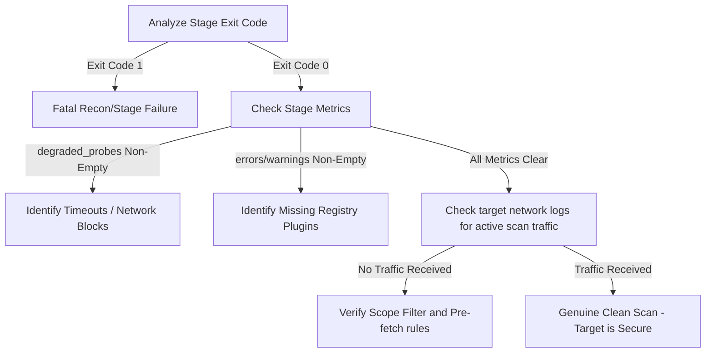

# Failure Modes & Diagnostics Handbook (Singularity-Zero)

This document provides system operators, engineers, and analysts with a comprehensive guide to understanding and diagnosing pipeline execution states. It details how to differentiate between a **clean target scan** (genuine "Zero findings") and a **degraded/silent failure state** (where errors, timeouts, or missing modules masked security vulnerabilities).

---

## 🌌 The Core Paradigm: Findings vs. Silent Gaps

In any automated security scanner, **silence is ambiguous**. Does "Zero findings" mean the target is secure, or does it mean a critical probe crashed, timed out, or had its outputs discarded?

Singularity-Zero enforces absolute state visibility using:
1. **The NeuralState CRDT layer**: All findings from recon, active probes, and validator engines are merged via conflict-free sets.
2. **Explicit Stage Contracts**: Every stage reports `StageOutput` including a robust `metrics` dictionary and a formal `state_delta`.
3. **Structured Errors & Warnings**: Any runtime degradation is bubbled up to the stage metrics and log layers rather than passing silently.

---

## 🚨 Differentiating Success from Degradation

Use the following lookup table to quickly determine if a "Zero findings" report is genuine or degraded:

| Stage Status | Findings Count | Exit Code | Degraded Probes / Errors | Status Classification |
| :--- | :--- | :--- | :--- | :--- |
| **COMPLETED** | `0` | `0` | Empty | **Genuine Clean Run**: No vulnerabilities found on target. |
| **FAILED** | `0` | `1` | N/A | **Fatal Failure**: Stop condition met. The scan was aborted. |
| **COMPLETED** | `0` | `0` | Non-Empty (`degraded_probes` present) | **Degraded Run**: Probes failed or timed out. Scan is incomplete. |
| **PARTIAL** | `0` | `0` / `1` | `errors` or `warnings` present | **Validator Degradation**: Validator plugins failed to resolve. |

---

## 🔍 Detail of Common Failure Modes

### 1. Dead Recon Output (No Actionable URLs)
If the reconnaissance stages (subdomain enumeration, httpx, etc.) fail to discover any URLs, the active scan and validation stages would normally run blind, successfully executing 0 probes and returning "Zero findings".

> [!WARNING]
> Proceeding to active scan without URLs is a critical failure. The pipeline now validates that recon produced actionable outputs before continuing.

*   **Symptoms**: 
    *   Exit code `1`
    *   Stage `"recon_validation"` status is set to `FAILED`
    *   Log entry: `Recon validation failed: no discoverable URLs found.`
*   **Root Causes**:
    *   Target is completely offline or blocks all probes.
    *   DNS resolution failure.
    *   Wrong scope config / scope file is empty.
*   **Remediation**:
    *   Validate the target input scope file.
    *   Run `ping` or `curl` on the target to verify networking.

---

### 2. Silent Validator Plugin Registry Failures
When validator engines (such as IDOR, CSRF, XSS, or API key candidate validators) are enabled but their underlying plugins are missing from the registry, the system previously caught `KeyError` and passed silently, creating false-positives of a secure application.

> [!IMPORTANT]
> A missing validator plugin is now treated as a stage degradation. The error is appended to the stage's `errors` list and the status is demoted to `partial` or `error`.

*   **Symptoms**:
    *   Stage metrics contain items in the `errors` list: `Validator plugin 'idor_candidates' could not be resolved from registry.`
    *   Stage metric status is `"partial"`.
    *   Warnings in the log layer matching: `Validator plugin '...' could not be resolved...`
*   **Root Causes**:
    *   Plugin provider was not decorated with `@register_plugin(category, name)`.
    *   A refactoring renamed the plugin, but the validator orchestrator still imports the legacy key.
    *   Platform-specific wheel loading errors (e.g. `orjson` or `wasmtime` mismatch).
*   **Remediation**:
    *   Check plugin registry imports in `src/execution/validators/runtime.py`.
    *   Validate your Python interpreter version (`3.14` mandated) to ensure no silent library loading issues.

---

### 3. Active Scan Probe Timeouts & WAF Blockage
Active scanning runs dozens of parallel security probes. If one of these probes (such as SQL Injection fuzzer or Command Injection) hangs due to database latency or WAF-induced packet dropping, it could easily time out.

> [!TIP]
> Timeout and networking errors are now captured in the `metrics["degraded_probes"]` array in the stage output.

*   **Symptoms**:
    *   Metrics dictionary contains a list of `"degraded_probes"`.
    *   Log warning: `Probe 'csrf' timed out after 180.0s`.
    *   A specific probe was skipped or returned empty findings while others completed.
*   **Root Causes**:
    *   Target utilizes a behavioral Web Application Firewall (WAF) that silently drops sockets when injection payloads are detected.
    *   Database connection pool exhaustion on the target, causing 10s+ response times.
*   **Remediation**:
    *   Review `degraded_probes` inside the dashboard UI to identify WAF signatures.
    *   Enable the polymorphic chameleon (`chameleon.py`) to rotate evasive headers.
    *   Adjust `active_probe_timeout_seconds` in `pyproject.toml` or the pipeline configuration.

---

### 4. Write-Ahead Logging (WAL) & Local AOF Failures (ENOSPC / Disk Full)
The pipeline operates a dynamic **dual-commit** logging strategy. State mutations are appended concurrently to both Redis Streams and a local Append-Only File (AOF). If a node runs out of physical disk space (`ENOSPC`) or experiences an `OSError` on local disk writes:

> [!CAUTION]
> A disk write failure could corrupt local files or cause the system to freeze. Singularity-Zero bypasses this failure by degrading gracefully to memory/Redis-only operations.

*   **Symptoms**:
    *   System warning logs matching: `Local AOF write failed: [Errno 28] No space left on device.`
    *   Active scanning continues, and findings are successfully written to Redis Streams.
    *   The `FrontierWAL` continues executing stream pushes (`xadd`) without interrupting the pipeline.
*   **Root Causes**:
    *   Host system disk pool exhaustion (`100%` disk utilization).
    *   Filesystem permission revocation or read-only mount lockouts.
*   **Remediation**:
    *   Free up disk space on the partition hosting local WAL files (`local_wal_{run_id}.aof`).
    *   The system will automatically resume local AOF appends upon disk space restoration.

---

### 5. Redis Primary Link Outage & Circuit Breaker Trip
During scanning, the coordinator and active nodes communicate state changes through a primary Redis cluster. If the primary Redis link goes down or experiences server latency:

> [!WARNING]
> While a Redis outage normally blocks distributed queues, the **Circuit Breaker** wrapping the `RedisClient` automatically intercepts connection drops, trips to `OPEN`, and initiates zero-latency local fallback mode.

*   **Symptoms**:
    *   Warning logs: `CircuitBreaker RedisClient: state transitioned from CLOSED to OPEN. Diverting to local SQLite fallback.`
    *   Scanning and state updates continue smoothly with zero thread blockages or connection timeouts.
    *   The `FrontierWAL` logs deltas strictly to the local AOF (`local_wal_{run_id}.aof`).
    *   Upon Redis re-connection, the Circuit Breaker transitions to `HALF_OPEN` to test health, then returns to `CLOSED` and reconciles all missed deltas automatically.
*   **Root Causes**:
    *   Redis master node crash or automated sentinel failover delay.
    *   Transient networking packet drops between scanning node and the Redis host.
*   **Remediation**:
    *   Inspect Redis service status (`docker ps` or systemctl).
    *   Ensure network routing policies permit traffic on port `6379`. The Circuit Breaker will heal itself automatically without requiring a process restart.

---

### 6. Ghost-Actor Node Crash Mid-Migration
If a Ghost-Actor coordinator node crashes suddenly or is terminated mid-way through an active scan or during actor migration:

> [!IMPORTANT]
> The mesh ensures no task is lost. Registry isolations and LWW-Set causality protect states from dual-registration or orphaned memory.

*   **Symptoms**:
    *   Coordinator logs display node timeout or ping silent warnings.
    *   Destined nodes cleanly resume execution from the last synchronized checkpoint in the `GhostMeshRegistry`.
    *   Duplicate actors are prevented at the registry boundary; half-migrated actor envelopes are safely discarded.
*   **Root Causes**:
    *   Out-of-memory (OOM) killer terminating a custom asyncio actor thread or background python process.
    *   Hardware node power failure.
*   **Remediation**:
    *   No manual intervention is needed. The `GhostMeshCoordinator` automatically elects a new leader via gossip and triggers failover migration.

---

### 8. Actor Thread Join Failures
If an actor attempts to stop itself from within its own message execution thread (e.g., during mid-migration handoffs), it may attempt to join its own thread, resulting in a thread hang or runtime crash.

> [!CAUTION]
> Attempting to join the current thread raises a `RuntimeError: cannot join current thread` in Python's threading library.

*   **Symptoms**:
    *   Exceptions: `RuntimeError: cannot join current thread` bubbled from `ScanActor.stop()`.
    *   The actor thread hangs or refuses to terminate cleanly during migrations.
*   **Root Causes**:
    *   The `stop()` routine is called from within an event handler (e.g., `migrate`) running on the actor's own background execution loop, which then tries to join its own `self._thread`.
*   **Remediation**:
    *   The framework protects against this by asserting `threading.current_thread() != self._thread` before calling `join()`. If they match, the loop stops, and the thread is allowed to exit naturally without an explicit block.

---

### 9. Distributed Causality Desynchronization (Clock Drift)
In active-active multi-region scanning environments, local wall clocks can drift or fall behind, causing set updates to be improperly discarded or causally misordered during convergence.

> [!TIP]
> Hybrid Logical Clocks (HLC) bound physical clock drift to Logical Counters, ensuring absolute causality with constant size.

*   **Symptoms**:
    *   Divergent findings or states across regions that fail to reconcile even after network heals.
    *   Log warnings: `HLC physical time drift exceeded max threshold (500ms)`.
*   **Root Causes**:
    *   Host system NTP synchronization failures causing severe physical clock offsets (>500ms).
*   **Remediation**:
    *   Ensure the host operating system has `ntpd` or `chronyd` active and synchronized.
    *   HLC elements will automatically self-stabilize and enforce tie-breaking order once physical time alignment is restored.

---

### 10. Pydantic Strict Mode Validation Errors
The boundary interfaces and schema configurations enforce strict v2 typing. Feeding unvalidated objects or invalid type values into feature vectors or REST endpoints raises immediate schema exceptions.

*   **Symptoms**:
    *   Crashes: `pydantic_core._core.ValidationError: 1 validation error for ...`
    *   Log entry: `Extra inputs are not permitted` or `Input should be a valid string`.
*   **Root Causes**:
    *   Missing fields or extra fields passed into strict schemas (e.g. `extra="forbid"` configurations on ML vectors or FastAPI models).
*   **Remediation**:
    *   Verify the data contract structure against the schemas in `src/dashboard/fastapi/schemas.py` or `src/intelligence/ml/feature_vector.py`.
    *   Strict mode prevents silent data corruption at runtime, helping to fail-fast during integration.

---

### 7. Network Split Brain (Mesh Partitions)
If a network partition splits the mesh cluster into isolated sections, nodes on both sides may continue scanning targets independently.

*   **Symptoms**:
    *   Active nodes cannot discover each other; gossip pings fail.
    *   Both partitions commit divergent findings and states to their local stores.
    *   Upon network split resolution, states reconcile cleanly with zero finding loss, achieving 100% convergence.
*   **Root Causes**:
    *   VLAN or routing table splits in the virtual network infrastructure.
    *   Temporary high traffic spikes congesting the gossip heartbeat ports.
*   **Remediation**:
    *   Ensure all cluster nodes have direct bi-directional routing.
    *   Once healed, conflict-free replicated data types (CRDTs) automatically resolve all differences deterministically.

---

## 🛠️ Step-by-Step Diagnostic Routine

If you receive a "Zero findings" scan but suspect degradation, execute this standard debug flow:



### Step 1: Check Stage Exit Codes
Run the pipeline. If the exit code is `1` or `130`, a fatal failure occurred. Look at `"recon_validation"` to see if it halted the execution due to lack of targets.

### Step 2: Query Dashboard Telemetry
Open the cache/metrics panel on the dashboard. Inspect the JSON metrics payload for `active_scan`. Check the following fields:
*   `probes_executed` vs. `probes_succeeded`
*   `degraded_probes`

### Step 3: Inspect Logger Output
Filter logs using standard tools:
```bash
# Find any plugin KeyError resolutions
grep -i "could not be resolved" pipeline.log

# Find any probe timeouts
grep -i "timed out" pipeline.log
```
