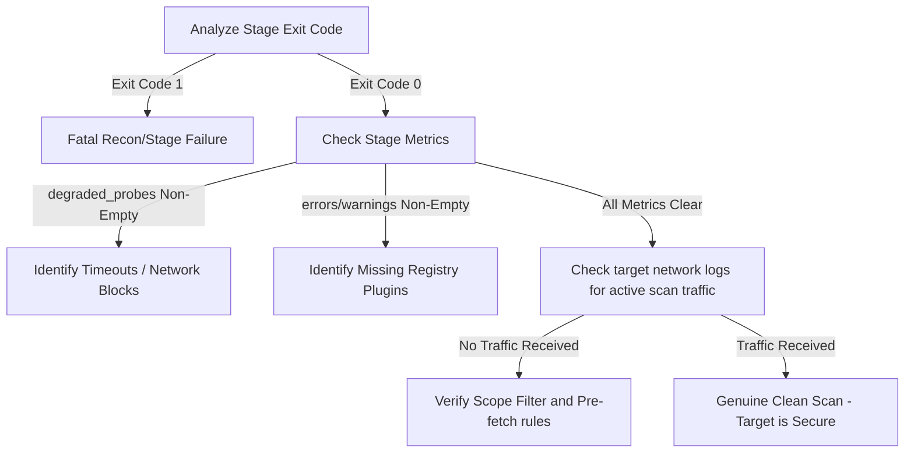

# Failure Modes & Diagnostics Handbook (Singularity-Zero)

This document provides system operators, engineers, and analysts with a comprehensive guide to understanding and diagnosing pipeline execution states. It details how to differentiate between a **clean target scan** (genuine "Zero findings") and a **degraded/silent failure state** (where errors, timeouts, or missing modules masked security vulnerabilities).

---

## 🌌 The Core Paradigm: Findings vs. Silent Gaps

In any automated security scanner, **silence is ambiguous**. Does "Zero findings" mean the target is secure, or does it mean a critical probe crashed, timed out, or had its outputs discarded?

Singularity-Zero enforces absolute state visibility using:
1. **The NeuralState CRDT layer**: All findings from recon, active probes, and validator engines are merged via conflict-free sets.
2. **Explicit Stage Contracts**: Every stage reports `StageOutput` including a robust `metrics` dictionary and a formal `state_delta`.
3. **Structured Errors & Warnings**: Any runtime degradation is bubbled up to the stage metrics and log layers rather than passing silently.

---

## 🚨 Differentiating Success from Degradation

Use the following lookup table to quickly determine if a "Zero findings" report is genuine or degraded:

| Stage Status | Findings Count | Exit Code | Degraded Probes / Errors | Status Classification |
| :--- | :--- | :--- | :--- | :--- |
| **COMPLETED** | `0` | `0` | Empty | **Genuine Clean Run**: No vulnerabilities found on target. |
| **FAILED** | `0` | `1` | N/A | **Fatal Failure**: Stop condition met. The scan was aborted. |
| **COMPLETED** | `0` | `0` | Non-Empty (`degraded_probes` present) | **Degraded Run**: Probes failed or timed out. Scan is incomplete. |
| **PARTIAL** | `0` | `0` / `1` | `errors` or `warnings` present | **Validator Degradation**: Validator plugins failed to resolve. |

---

## 🔍 Detail of Common Failure Modes

### 1. Dead Recon Output (No Actionable URLs)
If the reconnaissance stages (subdomain enumeration, httpx, etc.) fail to discover any URLs, the active scan and validation stages would normally run blind, successfully executing 0 probes and returning "Zero findings".

> [!WARNING]
> Proceeding to active scan without URLs is a critical failure. The pipeline now validates that recon produced actionable outputs before continuing.

*   **Symptoms**: 
    *   Exit code `1`
    *   Stage `"recon_validation"` status is set to `FAILED`
    *   Log entry: `Recon validation failed: no discoverable URLs found.`
*   **Root Causes**:
    *   Target is completely offline or blocks all probes.
    *   DNS resolution failure.
    *   Wrong scope config / scope file is empty.
*   **Remediation**:
    *   Validate the target input scope file.
    *   Run `ping` or `curl` on the target to verify networking.

---

### 2. Silent Validator Plugin Registry Failures
When validator engines (such as IDOR, CSRF, XSS, or API key candidate validators) are enabled but their underlying plugins are missing from the registry, the system previously caught `KeyError` and passed silently, creating false-positives of a secure application.

> [!IMPORTANT]
> A missing validator plugin is now treated as a stage degradation. The error is appended to the stage's `errors` list and the status is demoted to `partial` or `error`.

*   **Symptoms**:
    *   Stage metrics contain items in the `errors` list: `Validator plugin 'idor_candidates' could not be resolved from registry.`
    *   Stage metric status is `"partial"`.
    *   Warnings in the log layer matching: `Validator plugin '...' could not be resolved...`
*   **Root Causes**:
    *   Plugin provider was not decorated with `@register_plugin(category, name)`.
    *   A refactoring renamed the plugin, but the validator orchestrator still imports the legacy key.
    *   Platform-specific wheel loading errors (e.g. `orjson` or `wasmtime` mismatch).
*   **Remediation**:
    *   Check plugin registry imports in `src/execution/validators/runtime.py`.
    *   Validate your Python interpreter version (`3.12` mandated) to ensure no silent library loading issues.

---

### 3. Active Scan Probe Timeouts & WAF Blockage
Active scanning runs dozens of parallel security probes. If one of these probes (such as SQL Injection fuzzer or Command Injection) hangs due to database latency or WAF-induced packet dropping, it could easily time out.

> [!TIP]
> Timeout and networking errors are now captured in the `metrics["degraded_probes"]` array in the stage output.

*   **Symptoms**:
    *   Metrics dictionary contains a list of `"degraded_probes"`.
    *   Log warning: `Probe 'csrf' timed out after 180.0s`.
    *   A specific probe was skipped or returned empty findings while others completed.
*   **Root Causes**:
    *   Target utilizes a behavioral Web Application Firewall (WAF) that silently drops sockets when injection payloads are detected.
    *   Database connection pool exhaustion on the target, causing 10s+ response times.
*   **Remediation**:
    *   Review `degraded_probes` inside the dashboard UI to identify WAF signatures.
    *   Enable the polymorphic chameleon (`chameleon.py`) to rotate evasive headers.
    *   Adjust `active_probe_timeout_seconds` in `pyproject.toml` or the pipeline configuration.

---

## 🛠️ Step-by-Step Diagnostic Routine

If you receive a "Zero findings" scan but suspect degradation, execute this standard debug flow:



### Step 1: Check Stage Exit Codes
Run the pipeline. If the exit code is `1` or `130`, a fatal failure occurred. Look at `"recon_validation"` to see if it halted the execution due to lack of targets.

### Step 2: Query Dashboard Telemetry
Open the cache/metrics panel on the dashboard. Inspect the JSON metrics payload for `active_scan`. Check the following fields:
*   `probes_executed` vs. `probes_succeeded`
*   `degraded_probes`

### Step 3: Inspect Logger Output
Filter logs using standard tools:
```bash
# Find any plugin KeyError resolutions
grep -i "could not be resolved" pipeline.log

# Find any probe timeouts
grep -i "timed out" pipeline.log
```
