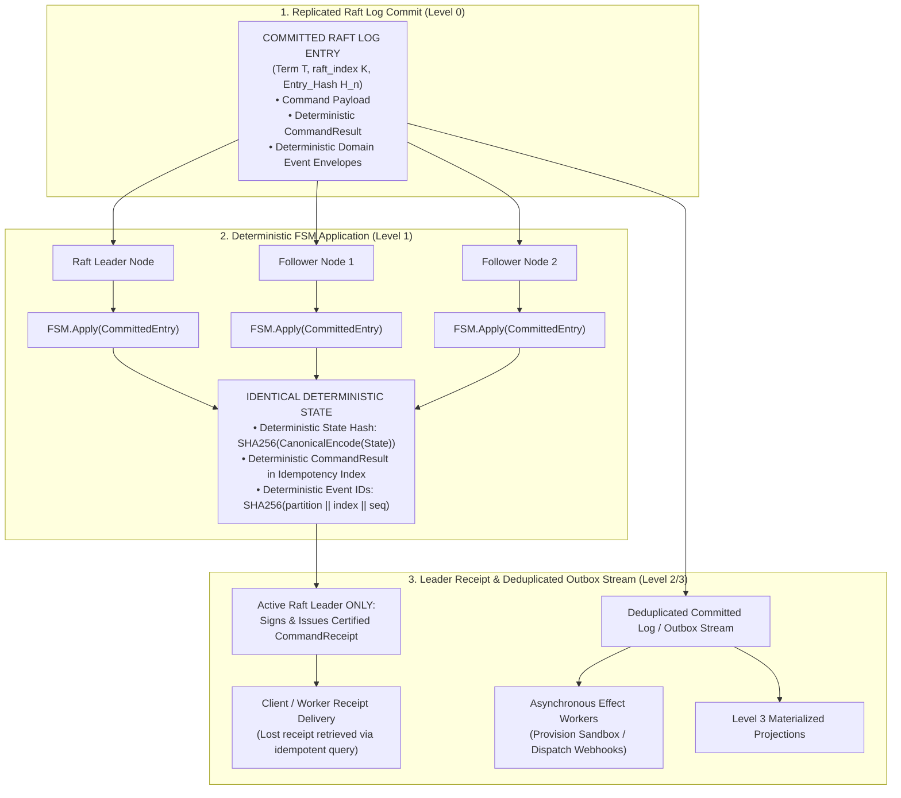
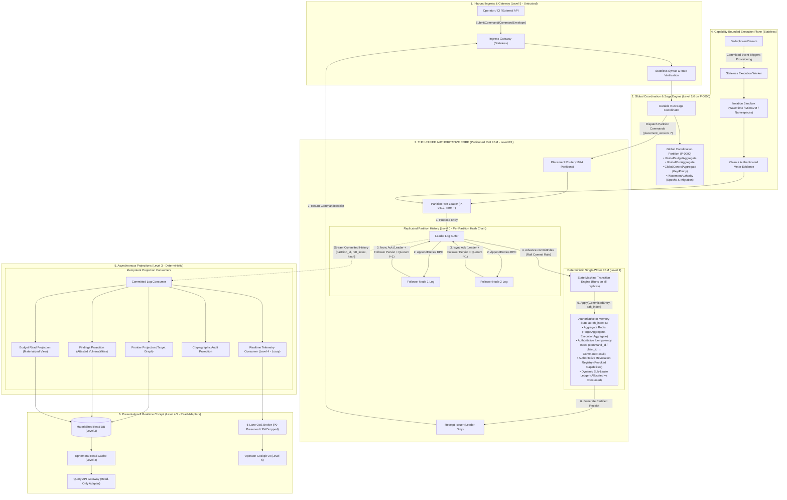
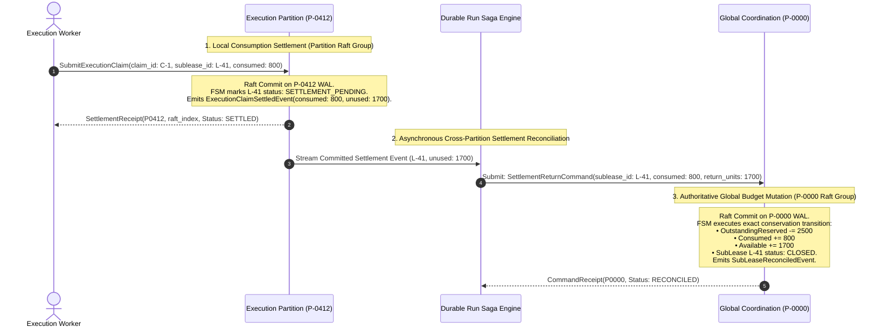
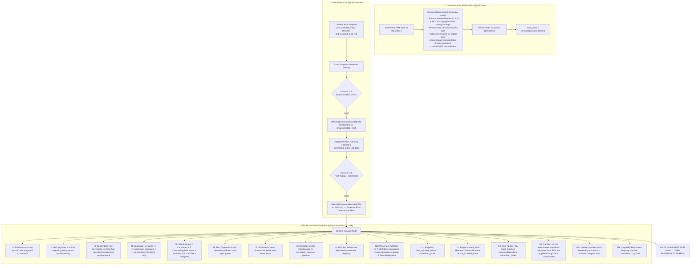

# Target System Architecture Specification & Formal Engineering Contract

## 1. The 10 Non-Negotiable System Axioms

This document defines the **Authoritative Target Architecture and Formal Engineering Contract** for the Cyber Security Test Pipeline. Every subsystem, background worker, consensus node, and database projection is strictly bound by these ten foundational axioms:

> **Axiom 1: The 6-Level Authority Hierarchy**
> - **Level 0 — Replicated Raft Log** (Quorum-committed, hash-chained, persistent history).
> - **Level 1 — Deterministic FSM State & Aggregates** (Single-writer in-memory state applying committed entries identically across all replicas).
> - **Level 2 — Committed Domain Events** (Deterministic facts emitted as a direct consequence of FSM execution and persisted within committed log entries).
> - **Level 3 — Materialized Projections & Read Models** (Asynchronous, deterministic, fully reconstructible read views).
> - **Level 4 — Ephemeral Caches & Lossy Telemetry** (Throwaway caches, 5-lane QoS broker; explicitly non-reconstructible).
> - **Level 5 — UI & Presentation Layer** (Three.js 3D Attack Cockpit, React 19 operator console; read-only adapters).
> 
> *Core Invariant: Nothing at Level $N+1$ may ever serve as an authoritative source of truth for Level $N$. No lower-authority layer may depend on mutable state from a higher layer to determine correctness.*

> **Axiom 2: Commit Before Mutation & All-Replica Determinism**
> *No authoritative state mutation occurs except through deterministic `FSM.Apply(CommittedEntry)`. Every replica of a partition applies committed entries identically and deterministically. Every command reaching the FSM produces a deterministic `CommandResult` in the local idempotency index (with outcomes: `SUCCESS`, `REJECTED`, `NO_OP`, or `DUPLICATE`). Only the active Raft leader constructs and signs the cryptographic `CommandReceipt`. Receipt delivery is not part of the transaction; lost receipts are retrieved via idempotent lookup without re-executing state transitions.*

> **Axiom 3: Pure Determinism, Zero External Side Effects & Outbox Stream**
> *For a given `(pre_state, committed_entry)`, `FSM.Apply()` MUST produce exactly one deterministic `(post_state, domain_events, result)`. The authoritative committed log entry contains the proposed command, transition result, and deterministic event envelopes ($\text{event\_id} = \text{SHA256}(\text{partition\_id} \mathbin{\Vert} \text{raft\_index} \mathbin{\Vert} \text{event\_sequence})$), allowing reconstruction of events without re-executing business logic. Furthermore, `FSM.Apply()` MUST NOT perform external I/O or irreversible side effects; external effects and Level 3 projections MUST be fed strictly through a single deduplicated committed-log/outbox stream. Replica-local event emission MUST NOT directly trigger external effects.*

> **Axiom 4: Universal Budget Conservation & Multi-Partition Accounting**
> *At all times and across all operations, $\text{TotalBudget} = \text{Consumed} + \text{OutstandingReserved} + \text{Available}$, where all components $\ge 0$ and use exact integer units (floating-point representations are strictly prohibited). A partition ($P_x$) authoritatively settles its local consumption and marks its sub-lease `SETTLEMENT_PENDING`; returning unconsumed units to global `Available` occurs strictly via an asynchronous, idempotent `SettlementReturnCommand` committed on `P-0000`.*

> **Axiom 5: Complete Reconstructibility of Authoritative State**
> *All Level 1 FSM states, Level 1 Saga aggregates, and Level 3 materialized read projections MUST be 100% reconstructible from certified snapshots and cold replay of committed log segments. Level 4 ephemeral caches and Level 4 lossy telemetry are explicitly non-reconstructible.*

> **Axiom 6: Universal Scoped Idempotency & Unique Identifiers**
> *No identifier may correspond to more than one distinct command payload or result. Repeated delivery of the same `command_id` (globally unique), `claim_id` (globally unique), or `saga_step_id` (unique within `saga_id`) is idempotent and returns the original result with zero additional state mutations.*

> **Axiom 7: Singular Partition Ownership & Fenced Atomic Migration**
> *Every aggregate root belongs to exactly one authoritative partition at a given `placement_version`. When `placement_version` increments, aggregate ownership transfers atomically under the authority of `P-0000` via a fenced 5-stage protocol: $\text{P-0000 TransferIntentCommitted} \rightarrow \text{P\_old FenceCommitted} \rightarrow \text{P\_new SnapshotInstalled} \rightarrow \text{P-0000 OwnershipActivated} \rightarrow \text{P\_new ActiveOwner}$. During transfer, `P_old` serves reads but rejects mutations past the fence index; `P_new` rejects mutations prior to `P-0000 OwnershipActivated`.*

> **Axiom 8: Explicit Cross-Partition Sagas**
> *Cross-partition workflows MUST use durable, reconstructible Sagas on `P-0000` with explicit compensation paths; implicit distributed transactions are strictly prohibited.*

> **Axiom 9: Temporal Determinism**
> *Wall-clock timestamps (`observed_at`) are external inputs committed into the log via explicit timer commands; historical replay evaluates historical temporal contexts without reading current machine clocks.*

> **Axiom 10: Fail-Closed Boundary**
> *Any cryptographic mismatch, invalid proof, stale term, unverified lease, or state ambiguity causes immediate rejection and quarantine with zero side effects.*

---

## 1A. Formal Definitions and Notation

| Concept | Formal Type / Notation | Definition & Authority Boundary |
|---|---|---|
| **Command** | `CommandEnvelope` | An untrusted request to change state, containing globally unique `command_id`, `aggregate_id`, `expected_aggregate_version`, and payload. Not authoritative. |
| **Committed Entry** | `CommittedEntry` | A command or timer tick committed into the Raft log at `(partition_id, raft_term, raft_index)` containing `command`, `transition_result`, and `emitted_events`. Authoritative input. |
| **Aggregate Root** | `AggregateRoot` | A stateful entity (`TargetAggregate`, `ExecutionAggregate`, `RunAggregate`, `GlobalBudgetAggregate`, `PlacementAuthority`) owned entirely inside Level 1 FSM. |
| **Aggregate Version** | `aggregate_version` | Monotonically increasing counter incremented by exactly 1 on every mutating state transition. Commands resulting in `REJECTED`, `NO_OP`, or `DUPLICATE` DO NOT increment it. |
| **Domain Event** | `DomainEvent` | An immutable fact emitted as a deterministic side effect of `FSM.Apply(CommittedEntry)` with deterministic ID $\text{SHA256}(\text{partition\_id} \mathbin{\Vert} \text{raft\_index} \mathbin{\Vert} \text{seq})$. Reconstructible. |
| **Command Result** | `CommandResult` | Deterministic outcome (`SUCCESS`, `REJECTED`, `NO_OP`, `DUPLICATE`) recorded in Level 1 FSM idempotency index across all replicas. |
| **Command Receipt** | `CommandReceipt` | Cryptographically signed proof of state transition constructed by the active leader using `CommandResult`, `previous_state_hash`, `entry_hash`, and `resulting_state_hash`. |
| **Projection** | `ProjectionView` | A Level 3 materialized read model with an offset vector `(partition_id, raft_term, last_applied_index, event_hash)`. Strictly non-authoritative. |
| **Authorization Tuple** | `ExecutionAuthorizationTuple` | Necessary & sufficient execution capability: `(capability_id, execution_id, worker_id, worker_epoch, target_policy_id, dns_snapshot_id, sublease_id, policy_version, key_id, expires_at)`. |
| **Saga Aggregate** | `SagaAggregate` | Durable workflow state tracking multi-partition Run lifecycle, expected partitions, compensations, and sub-lease allocations on `P-0000`. |

---

## 2. Multi-Replica Deterministic FSM & Deduplicated Outbox Architecture



---

## 3. High-Level Architecture Topology



---

## 4. Cross-Partition Sagas & Two-Phase Budget Return Protocol



---

## 5. Fenced Atomic Aggregate Ownership Migration Protocol

```mermaid
sequenceDiagram
    autonumber
    actor Admin as Topology Coordinator
    participant P0000 as Placement Authority (P-0000)
    participant P_old as Source Partition (P-0412)
    participant P_new as Target Partition (P-0782)

    Admin->>P0000: InitiateTransferCommand(aggregate_id: A-99, from: P0412, to: P0782, new_epoch: 8)
    
    Note over P0000: 1. Commit TransferIntentCommitted on P-0000 WAL.<br/>PlacementAuthority marks A-99 status: TRANSFER_PREPARED.

    P0000->>P_old: Dispatch FenceCommand(aggregate_id: A-99, new_epoch: 8)
    Note over P_old: 2. P_old commits FenceCommitted at fence_index.<br/>P_old serves historical reads; REJECTS new mutations.<br/>P_old exports canonical snapshot at fence_index.

    P_old->>P_new: InstallSnapshotRPC(aggregate_id: A-99, snapshot_bytes, fence_index)
    Note over P_new: 3. P_new commits SnapshotInstalled in local Raft log.<br/>P_new remains in standby (MUTATIONS BLOCKED).

    P_new->>P0000: AcknowledgeSnapshotInstalled(aggregate_id: A-99, target: P0782)
    Note over P0000: 4. P-0000 commits OwnershipActivated(A-99, owner: P0782, epoch: 8).<br/>Placement version and ownership epoch incremented globally.

    P0000->>P_new: Dispatch ActivateOwnershipCommand(aggregate_id: A-99, epoch: 8)
    Note over P_new: 5. P_new transitions A-99 to ACTIVE.<br/>P_new accepts mutations at ownership epoch 8.
```

---

## 6. Formal FSM State Transition Table

| Current State | Command / Ingress Event | Preconditions (Evaluated inside FSM.Apply) | Emitted Committed Event | Resulting State | Authoritative Side-Effects |
|---|---|---|---|---|---|
| `IDLE` | `AuthorizeExecutionCommand` | Scope match, DNS snapshot valid, `sublease_balance >= requested`, `key_epoch` valid, `expected_version == current` | `ExecutionAuthorizedEvent` | `RUNNING` | Reserve budget sub-lease; mint `ExecutionCapability`; `version(n+1) = version(n) + 1`. |
| `RUNNING` | `SubmitExecutionClaim` | Valid capability, meter proof verified, epoch valid, `expected_version == current` | `ExecutionClaimSettledEvent` | `SETTLED` | Debit verified consumed units; mark sub-lease `SETTLEMENT_PENDING`; emit return payload for `P-0000`; store `CommandResult` in Idempotency Index; `version(n+1) = version(n) + 1`. |
| `RUNNING` | `CancelExecutionCommand` | Authorized cancellation token, `expected_version == current` | `ExecutionCancelledEvent` | `CANCELLED` | Add capability ID to Revocation Registry; mark sub-lease `CANCELLED`; emit full return payload for `P-0000`; `version(n+1) = version(n) + 1`. |
| `RUNNING` | `LeaseTimeoutCommand` | `observed_at >= expires_at + max_skew`, `expected_version == current` | `LeaseExpiredEvent` | `EXPIRED` | Execute Pessimistic Reconciliation (consume = 100%, return = 0 to `P-0000`); increment worker epoch; `version(n+1) = version(n) + 1`. |
| `CANCELLED` | `SubmitExecutionClaim` | Any claim presenting cancelled capability | `ExecutionClaimRejectedEvent` | `CANCELLED` | Store `CommandResult(REJECTED)`; 0 state mutations; 0 budget consumption; `version` unchanged. |
| `SETTLED` | `CancelExecutionCommand` | Valid cancellation command received after settlement | `CancelAfterSettlementEvent` | `SETTLED` | Store `CommandResult(NO_OP)`; no-op on findings; `version` unchanged. |
| `ANY` | `Duplicate(command_id / claim_id / saga_step_id)` | ID found in Authoritative Idempotency Index | *(None)* | `UNCHANGED` | Return existing cached `CommandResult`; 0 state mutations; `version` unchanged. |

---

## 7. Canonical State Serialization & 16 Formal System Invariants



---

## 8. Projection Vector Watermarks, Gap Detection & Cold Rebuild

```mermaid
graph TD
    subgraph Checkpoint_Vector_Structure ["1. Projection Watermark & Checkpoint Vector"]
        CheckVector["ProjectionCheckpointVector<br/>────────────────────────────────────────────<br/>• projection_id: FindingProjection<br/>• schema_version: 2.1.0<br/>• placement_version: 7<br/>• raft_configuration_version: 3<br/>• partition_offsets: [<br/>    { partition_id: P-0000, term: 42, last_applied_index: 10840, last_event_hash: h0 },<br/>    { partition_id: P-0001, term: 42, last_applied_index: 9412, last_event_hash: h1 },<br/>    ...,<br/>    { partition_id: P-1023, term: 42, last_applied_index: 12051, last_event_hash: hn }<br/>  ]<br/>• state_hash: SHA256(CanonicalEncode(MaterializedViewState))"]
    end

    subgraph At_Least_Once_Stream ["2. Committed Log Consumer (Gap & Corruption Detection)"]
        PartitionLog["Committed Replicated Log P-0412"] -->|"Stream Entry (raft_index: K, hash: h)"| DeliveryQueue["Delivery Pipeline"]
        DeliveryQueue --> Consumer["Projection Worker Node"]
        
        Consumer --> IndexCheck{"Evaluate incoming index K vs last_applied"}
        
        IndexCheck -->|K < last_applied| OldDup["Verify hash matches historical record → Acknowledge/No-Op"]
        IndexCheck -->|K == last_applied| SameDup["Verify hash == last_event_hash → Acknowledge/No-Op"]
        IndexCheck -->|K > last_applied + 1| GapDetected["GAP_DETECTED: Halt stream and request missing entries K_last+1..K"]
        IndexCheck -->|K == last_applied + 1| HashCheck{"Does entry.prev_hash == last_event_hash?"}
        
        HashCheck -->|Mismatch| HaltCorrupt["HALT PROJECTION: CORRUPTED LOG DETECTED"]
        HashCheck -->|Match| ApplyView["Apply Event to Materialized Read DB Table"]
        
        ApplyView --> SaveCheckpoint["Atomic Transaction: Persist Materialized View + Advance Vector Index"]
    end

    subgraph Cold_Rebuild_Protocol ["3. Deterministic Projection Rebuild Protocol"]
        CorruptDB["Corrupted Materialized Read DB"] --> TruncateView["Truncate Materialized Tables & Reset Checkpoint Vector to Zero"]
        TruncateView --> StreamAll["Parallel Stream from All 1024 Committed Partition Logs from Offset 0"]
        StreamAll --> ReApplyAll["Replay & Re-apply Events Idempotently"]
        ReApplyAll --> VerifiedHash["Verify Resulting state_hash == Expected Deterministic Hash"]
        VerifiedHash --> OnlineView["Restore Projection to Active Read Pool"]
    end
```



---

## 9. Certified Command Receipt Specification

Every committed mutation or evaluated command produces a retrievable `CommandReceipt` with the following structure:

```json
{
  "receipt_id": "rcpt-018f-a92c",
  "command_id": "cmd-submit-claim-810a",
  "partition_id": "P-0412",
  "raft_term": 42,
  "raft_index": 10842,
  "entry_hash": "3f82a1...94b2",
  "aggregate_id": "exec-9941",
  "resulting_aggregate_version": 15,
  "result_code": "CLAIM_SETTLED_SUCCESS",
  "result_payload_hash": "7d8f92a1...4e1a",
  "emitted_event_ids": ["evt-018f-a92d"],
  "previous_state_hash": "SHA256(CanonicalEncode(FSM_PreState))",
  "state_hash_at_commit": "SHA256(CanonicalEncode(FSM_PostState))",
  "signer_key_id": "K-2026-A",
  "cryptographic_signature": "Ed25519(CanonicalEncode(ReceiptPayload))"
}
```

---

## 10. Architectural Enforcement & Freeze Declaration

This document represents the frozen target contract. Any future pull request, agent implementation, or system refactor is verified against these rules:
1. **Multi-Replica Invariant**: Only committed Raft entries may be passed to `FSM.Apply()`. Every replica applies committed entries identically; only the active leader issues client receipts.
2. **Zero FSM Impurities & Side Effects**: Transition logic must be purely deterministic and replay-identical without executing external network calls or irreversible side effects.
3. **Pessimistic Conservation**: Global budget and partition sub-leases adhere strictly to the budget conservation equation without optimistic assumptions.
4. **Reconstructibility Invariant**: All Level 3 materialized views and Level 1 in-memory FSM states must remain 100% reconstructible via cold replay from certified snapshots and committed logs across all 1024 virtual partitions.
