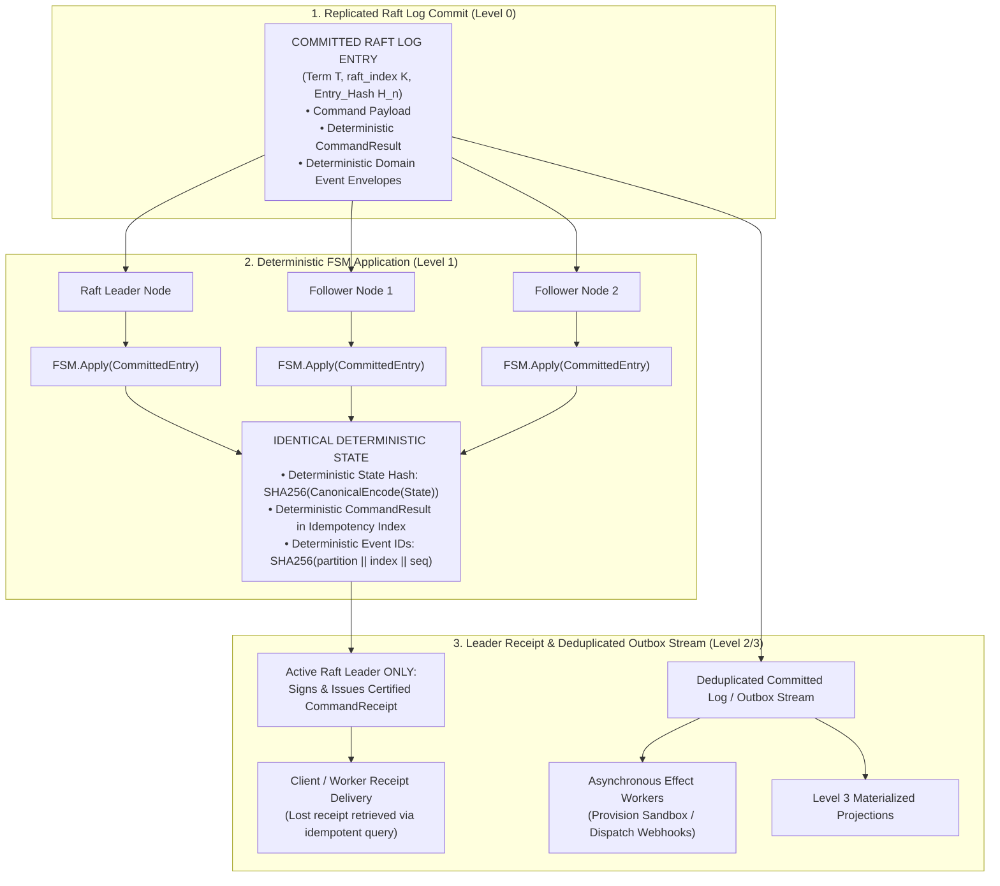

# Authoritative System Architecture Specification & Engineering Contract

## 1. Implementation Status & Engineering Ground Truth

This document constitutes the **Authoritative System Architecture Specification and Engineering Contract** for the Cyber Security Test Pipeline. It unifies the operational runtime reality with the formal distributed consensus specifications, 10 Non-Negotiable System Axioms, 7-Layer Control Plane, and 16 Formal System Invariants.

| Subsystem / Capability | Production Status | Code Location |
|---|---|---|
| **Authoritative State Authority & Settlement** | **Production** — Single authoritative WAL commit point, 5-stage untrusted claim validation, epoch fencing, and independent projection engines (`StateProjection`, `BudgetProjection`, `LeaseProjection`, `FindingsProjection`) | `src/core/frontier/state_authority.py` |
| **Command Envelopes & Event Upcasters** | **Production** — Strongly-typed `CommandEnvelope`, `EventEnvelope`, causation/correlation ID tracking, aggregate versioning, and `SchemaUpcasterRegistry` for backward-compatible replay | `src/core/contracts/command_envelope.py` |
| **Raft Consensus, Transport & Durable WAL** | **Production** — `RaftTransportProtocol`, RPC envelopes (`AppendEntries`, `RequestVote`), majority quorum ($N // 2 + 1$), election failover, crash-safe `PartitionWAL` with CRC-64 + fsync, deterministic `PartitionFSM`, and durable `DurableOutboxLedger` | `src/core/frontier/raft_transport.py`, `src/core/frontier/replicated_log.py`, `src/core/frontier/outbox.py` |
| **Global Coordination & Cross-Partition Sagas** | **Production** — P-0000 `GlobalBudgetAggregate` (strict integer conservation: $\text{Total} = \text{Consumed} + \text{Outstanding} + \text{Available}$, `expire_sublease` orphaned budget reclamation), `PlacementAuthority`, and `DurableRunSagaEngine` | `src/core/frontier/global_coordination.py`, `src/core/frontier/run_saga.py` |
| **Durable Outbox & Projection Watermarks** | **Production** — `DurableOutboxLedger` disk append, `CommittedLogConsumer`, Level 3 `CheckpointState` projection validation (`verify_checkpoint_against_fsm`), and `ProjectionCheckpointVector` with gap and corruption detection | `src/core/frontier/outbox.py`, `src/core/checkpoint/`, `src/core/frontier/projection_stream.py` |
| **Canonical Target Identity Engine** | **Production** — Deterministic IDNA Punycode normalization, POSIX traversal resolution, query sorting, default port stripping, and DNS snapshot pinning | `src/core/contracts/canonical_target.py` |
| **DAG Pipeline Orchestrator** | **Production** — Async DAG builder, actor scheduler, stage lifecycle, speculative dispatch, checkpoint persistence, and resume flows | `src/pipeline/services/pipeline_orchestrator/`, `src/pipeline/engine.py` |
| **Resilience & Circuit Breaking** | **Production** — Tool breaker in `src/pipeline/services/circuit_breaker.py`; Retry-After parser in `src/resilience/retry_after.py` | `src/pipeline/services/circuit_breaker.py`, `src/resilience/retry_after.py` |
| **Unified Hierarchical Cache** | **Production** — In-memory LRU + SQLite/Redis tiered cache with single-flight request coalescing and stale-while-revalidate | `src/pipeline/unified_cache/`, `src/cache/` |
| **Frontier State & CRDT Engine** | **Production** — LWW-Set CRDTs keyed by Hybrid Logical Clocks (HLC) for eventually consistent discovery knowledge | `src/frontier/`, `src/core/frontier/state.py` |
| **ML Policy Governance & Raft Durability** | **Production** — `PolicyGovernanceGate` with shadow evaluation against feedback runaway, canary promotion, atomic rollback to `parent_policy_id`, and `PromotePolicyCommand`/`RollbackPolicyCommand` committed into `PartitionFSM` | `src/learning/policy_governance.py`, `src/core/frontier/raft_fsm.py` |
| **Prioritized QoS Telemetry Broker** | **Production** — 5-tier QoS backpressure router (P0 Bounded Control with Secondary Spooling, P1 Lifecycle, P2 Coalesced Findings, P3 Telemetry Aggregates, P4 Debug Shedding) | `src/realtime/prioritized_broker.py` |
| **Deterministic Replay Engine** | **Production** — Pure sequential WAL log replay from arbitrary offsets for exact projection state reconstruction and post-replay invariant verification | `src/core/frontier/replay_engine.py` |
| **Tamper-Evident Audit Ledger** | **Production** — Cryptographic HMAC-SHA256 chained audit trail for administrative, authentication, and scan events | `src/auth/audit.py`, `src/console/audit.py` |
| **Active & Passive Analyzers** | **Production** — Multi-stage detectors for SQLi, XSS, SSRF, IDOR/BAC, JWT forgery, CSP bypass, and HTTP/2 smuggling | `src/analysis/active/`, `src/analysis/passive/` |
| **Cognitive Differential Prober & IDOR Analysis** | **Production** — Cross-role normalized Levenshtein diffing for automatic Broken Object Level Authorization discovery | `src/analysis/intelligence/differential_prober.py` |
| **Process / WASM Isolation Sandbox** | **Production (OS Process Sandbox)** — OS-native resource caging (POSIX rlimits, CPU timeout, env scrubbing); WASM executor is feature-flagged (`FEATURE_WASM_PLUGINS`) | `src/sandbox/process_sandbox.py`, `src/execution/frontier/wasm.py` |
| **3D Threat Cockpit & Real-time Console** | **Production** — React 19 + Three.js instanced attack graph rendering, Zustand stores, virtualized log streams, and WebSockets | `frontend/src/`, `src/websocket_server/` |
| **Actor Mesh & P2P Gossip** | **Production (Single-Node Runtime)** — Pykka/Asyncio workers with authenticated AES-256-GCM SWIM gossip discovery protocol over UDP | `src/mesh/`, `src/infrastructure/mesh/` |
| **Algorithmic Multi-Hop Attack Path Engine** | **Production** — Graph engine synthesizing Dijkstra shortest attack paths to critical assets | `src/intelligence/graph/attack_graph.py` |
| **Formal Execution Contracts & Mandatory Budget** | **Production** — Immutable `ExecutionRequest` / `RawExecutionClaim` / `ExecutionResultContract` handoff, mandatory committed budget reservation precondition (`INVARIANT-002`), cryptographic `ScopeToken` authorization, and stateless worker execution | `src/decision/models.py`, `src/decision/authorization.py`, `src/execution/request_executor.py`, `src/core/contracts/execution_request.py` |
| **Enterprise Ticketing Sinks & AI Explainability** | **Production** — Jira (v3/v2), ServiceNow (Table API), DefectDojo (v2) clients, and persona-based root cause analysis (`/api/findings/{id}/ai-explain`, `/api/reports/ai-summary`) | `src/reporting/platforms/`, `src/analysis/intelligence/finding_explainer.py` |

---

## 2. The 10 Non-Negotiable System Axioms

1. **Axiom 1: The 6-Level Authority Hierarchy**: Level 0 (Replicated Raft Log) $\rightarrow$ Level 1 (Deterministic FSM) $\rightarrow$ Level 2 (Committed Events) $\rightarrow$ Level 3 (Materialized Projections) $\rightarrow$ Level 4 (Ephemeral Caches & Telemetry) $\rightarrow$ Level 5 (Presentation UI). Nothing at Level $N+1$ may ever serve as an authoritative source of truth for Level $N$.
2. **Axiom 2: Commit Before Mutation & All-Replica Determinism**: No state mutation occurs except through deterministic `FSM.Apply(CommittedEntry)`. Replicas apply committed entries identically. Only active leaders sign `CommandReceipt` receipts.
3. **Axiom 3: Pure Determinism, Zero External Side Effects & Outbox Stream**: `FSM.Apply()` produces exactly one deterministic `(post_state, domain_events, result)`. It performs zero external I/O. Downstream effects and projections are fed strictly through the deduplicated outbox stream (`DurableOutboxLedger`).
4. **Axiom 4: Universal Budget Conservation & Multi-Partition Accounting**: At all times, $\text{TotalBudget} = \text{Consumed} + \text{OutstandingReserved} + \text{Available}$ across exact non-negative integer units.
5. **Axiom 5: Complete Reconstructibility of Authoritative State**: All Level 1 FSM states and Level 3 read projections are 100% reconstructible from snapshots and sequential replay of committed log segments.
6. **Axiom 6: Universal Scoped Idempotency & Unique Identifiers**: Repeated delivery of the same `command_id` or `claim_id` returns the original cached `CommandResult` with zero additional state mutations.
7. **Axiom 7: Singular Partition Ownership & Fenced Atomic Migration**: Every aggregate belongs to exactly one authoritative partition at a given `placement_version`. Migration transfers ownership under $P\text{-}0000$ via 5-stage fenced coordination.
8. **Axiom 8: Explicit Cross-Partition Sagas**: Cross-partition workflows use durable Sagas on $P\text{-}0000$ with explicit compensation handlers; distributed 2PC is prohibited.
9. **Axiom 9: Temporal Determinism**: Timestamps are external inputs committed into the log via explicit timer commands (`LeaseTimeoutCommand`); FSM logic never reads system clocks.
10. **Axiom 10: Fail-Closed Boundary**: Cryptographic mismatches, unverified leases, stale epochs, or corrupt checksums trigger immediate rejection and quarantine with zero side effects.

---

## 3. Formal Definitions and Notation

| Concept | Formal Type / Notation | Definition & Authority Boundary |
|---|---|---|
| **Command** | `CommandEnvelope` | An untrusted request containing globally unique `command_id`, `aggregate_id`, `expected_aggregate_version`, and payload. |
| **Committed Entry** | `CommittedEntry` | An entry committed into the Raft log at `(partition_id, raft_term, raft_index)` containing `command`, `transition_result`, and `emitted_events`. |
| **Aggregate Root** | `AggregateRoot` | A stateful entity (`TargetAggregate`, `ExecutionAggregate`, `GlobalBudgetAggregate`, `PlacementAuthority`) owned entirely inside Level 1 FSM. |
| **Aggregate Version** | `aggregate_version` | Monotonically increasing integer incremented by exactly 1 on mutating transitions (`SUCCESS`); unchanged on `REJECTED`/`NO_OP`/`DUPLICATE`. |
| **Domain Event** | `EventEnvelope` | Deterministic fact emitted by `FSM.Apply()` with ID $\text{SHA256}(\text{partition\_id} \mathbin{\Vert} \text{raft\_index} \mathbin{\Vert} \text{seq})$. |
| **Command Result** | `CommandResult` | Deterministic outcome (`SUCCESS`, `REJECTED`, `NO_OP`, `DUPLICATE`) cached in the Level 1 FSM idempotency index. |
| **Command Receipt** | `CommandReceipt` | Leader-signed proof binding `previous_state_hash`, `entry_hash`, `state_hash_at_commit`, and `signer_key_id`. |
| **Projection** | `ProjectionView` | Level 3 materialized read model tracking `(partition_id, raft_term, last_applied_index, event_hash)`. |
| **Execution Authorization** | `AuthorizedExecutionTicket` | Signed capability lease: `(ticket_id, request_id, tenant_id, epoch, partition_id, canonical_identity_hash, signature)`. |
| **Saga Aggregate** | `GlobalRunAggregate` | Durable workflow state tracking multi-partition Run lifecycle and sub-lease allocations on $P\text{-}0000$. |

---

## 4. Multi-Replica Deterministic FSM & Deduplicated Outbox Architecture



---

## 5. The 7-Layer Control Plane ("What Runs Next?")

```text
                    ┌────────────────────────┐
                    │   1. DAG Graph Builder │ "What is legally possible?"
                    └───────────┬────────────┘
                                │ (Legal Dependency & Readiness Graph)
                                ▼
                    ┌────────────────────────┐
                    │   2. Stage Planner     │ "Which stage runs next?"
                    └───────────┬────────────┘
                                │ (Active Stage Scope & Budget Allocation)
                                ▼
                    ┌────────────────────────┐
                    │   3. Priority Engine   │ "Which work candidate deserves execution?"
                    └───────────┬────────────┘
                                │ (Ordered Candidate Queue: candidate -> score)
                                ▼
                    ┌────────────────────────┐
                    │ 4. Speculative         │ "What exact request contract are we asking to run?"
                    │    Dispatcher          │
                    └───────────┬────────────┘
                                │ (ExecutionRequest with Authorization Context)
                                ▼
                    ┌────────────────────────┐
                    │ 5. Authorization &     │ "Is this request cryptographically authorized & budgeted?"
                    │    Resource Gate       │
                    └───────────┬────────────┘
                                │ (Signed AuthorizedExecutionTicket + Pinned Canonical Target)
                                ▼
                    ┌────────────────────────┐
                    │ 6. Actor Scheduler     │ "Where and when does this run?"
                    └───────────┬────────────┘
                                │ (Placement: LEASED, DEFERRED, REJECTED, CIRCUIT_OPEN)
                                ▼
                    ┌────────────────────────┐
                    │ 7. Executor / Sandbox  │ "DO IT (Stateless execution inside isolated sandbox)"
                    └───────────┬────────────┘
                                │ (Untrusted RawExecutionClaim)
                                ▼
                    ┌────────────────────────┐
                    │ Settlement Coordinator │ "Verify ticket, fencing epoch, proof hashes & commit"
                    └────────────────────────┘
```

---

## 6. The 16 Formal System Invariants

1. **I1 (Hash-Chain Continuity)**: $H_n = \text{SHA256}(H_{n-1} \mathbin{\Vert} \text{CanonicalEncode}(E_n))$.
2. **I2 (Log Monotonicity)**: Index $K_n > K_{n-1}$, Term $T_n \ge T_{n-1}$.
3. **I3 (Committed-State Confinement)**: State machine transitions execute **only** on quorum-committed entries.
4. **I4 (Aggregate Monotonicity)**: $\text{version}' = \text{version} + 1$ on `SUCCESS`; unchanged on `REJECTED`/`NO_OP`/`DUPLICATE`.
5. **I5 (Global Budget Conservation)**: $\text{TotalBudget} = \text{Consumed} + \text{OutstandingReserved} + \text{Available}$.
6. **I6 (Scoped Idempotency)**: $\forall \text{ valid } \text{cmd\_id}: \text{Count}(\text{Mutations}) \le 1$.
7. **I7 (Singular Partition Ownership)**: Target aggregate belongs to exactly one partition at `placement_version`.
8. **I8 (Projection Watermark Bound)**: $\forall \text{ partition } P_x: \text{ProjectionOffset}(P_x) \le \text{commitIndex}(P_x)$.
9. **I9 (FSM Pure Determinism)**: `FSM.Apply()` performs zero external I/O, RNG, or current-clock reads.
10. **I10 (Worker Epoch Fencing)**: $\text{claim.epoch} < \text{active.epoch} \implies \text{REJECT}$.
11. **I11 (State Hash Uniqueness)**: $\text{State}_A \equiv \text{State}_B \iff \text{StateHash}_A == \text{StateHash}_B$.
12. **I12 (Snapshot Integrity)**: Certified snapshot state payload hash equals snapshot header hash.
13. **I13 (Receipt Cryptographic Binding)**: Leader receipt signature validates against state hash at commit.
14. **I14 (Deduplicated Outbox Stream)**: Domain events emitted to outbox are deduplicated by `event_id`.
15. **I15 (Fail-Closed Boundary)**: Corrupt records or unverified leases abort immediately with zero mutations.
16. **I16 (Replay State Invariance)**: $\text{Replay}(\text{WAL}[0 \dots N]) \equiv \text{State}_N$.

---

## 7. Core Subsystems & Operational Lifecycles

### 7.1 Authoritative Raft Consensus & WAL Durability
- **Durability Sequence**:
  $$\text{Proposal} \longrightarrow \text{Local WAL Persist} \longrightarrow \text{AppendEntries RPC} \longrightarrow \text{Quorum ACKs} \longrightarrow \text{Advance commitIndex} \longrightarrow \text{FSM.Apply} \longrightarrow \text{Durable Outbox} \longrightarrow \text{Leader Receipt}$$
- **Crash Recovery**: `PartitionWAL` replays committed entries from disk with CRC-64 verification, fast-forwarding the FSM to the exact pre-crash state hash.

### 7.2 Cross-Partition Sagas & Global Coordination ($P\text{-}0000$)
- Managed by `DurableRunSagaEngine` and `GlobalBudgetAggregate`.
- Decomposes multi-target runs across 1024 partitions, reserving sub-leases on $P\text{-}0000$ and returning unconsumed quota through two-phase asynchronous settlement.

### 7.3 Canonical Target Identity & Scope Authorization
- Normalizes URLs (Punycode, query sort, matrix stripping, traversal collapsing).
- Pins DNS resolution to eliminate TOCTOU / DNS rebinding SSRF attacks.
- Issues HMAC-SHA256 signed `AuthorizedExecutionTicket` with single-use nonce consumption.

### 7.4 Sandboxing & External Execution
- External tools run inside `ProcessSandbox` with POSIX `setrlimit` bounds, timeouts, and sanitized environments.
- WASM plugins run in `wasmtime` runtime when `FEATURE_WASM_PLUGINS=true` is enabled.

### 7.5 Enterprise Integrations & AI Explainability
- Native platform adapters for Jira (REST API v3 ADF / v2), ServiceNow (Table API), and DefectDojo (v2 REST API).
- AI persona generators in `src/analysis/intelligence/finding_explainer.py` for Developer, Auditor, and Executive stakeholders.

### 7.6 State Authority, Settlement Model & Recovery Architecture
- **Production Settlement Engine**:
  ```text
  ExecutionResult / RawExecutionClaim
                 ↓
      SettlementCoordinator (5-Stage Validation: Deduplication, Ticket Nonce, Fencing Epoch)
                 ↓
         SettlementIntent (Append to StateAuthority.wal)
                 ↓
      SettlementProjectionEngine (In-Memory Projections: State, Budget, Lease, Findings)
                 ↓
       StateAuthority.commit (Atomic Merge into NeuralState)
  ```
- **Crash Recovery & Replay**:
  - On restart, `replay_from_wal()` rehydrates projection state by sequentially reapplying all committed `SettlementIntent` records from the durable WAL.
  - **Architectural Boundary**: Settlement recovery currently operates as a durable write-ahead reconciliation ledger with idempotent projection rehydration; full Raft FSM WAL-backed projection settlement remains an optional future migration path.
- **Universal Budget Lifecycle**:
  ```text
  AVAILABLE ──(ExecutionAuthorizer.authorize)──▶ RESERVED ──(SettlementCoordinator.settle)──▶ CONSUMED
     ▲                                              │
     └─────────────(Timeout / Expire / Cancel)──────┘
  ```
  - Every issued `AuthorizedExecutionTicket` strictly requires an authoritative budget reservation (`INVARIANT-002`).

### 7.7 Real-Time QoS Telemetry & Durable P0 Spooling
- **P0 Control Stream Durability**:
  - Tier 1: Bounded in-memory queue (`p0_capacity=1000`).
  - Tier 2: Durable append-only disk journal (`p0_telemetry_spool.jsonl` with `os.fsync`) for memory overflow.
  - Startup Rehydration: `_rehydrate_disk_spool()` recovers un-drained control events across node restarts and crashes.
  - Strict Lossless Backpressure: If memory and disk spool capacity are exhausted, `publish()` applies explicit producer backpressure (returns `False`) rather than silently dropping oldest events.

### 7.8 Executable Invariant Verification Suite
The architecture is formally validated by 34 automated invariant and adversarial assertions:
1. `tests/unit/test_hardened_authority_invariants.py` (6 tests): P0 disk spool rehydration, saturation backpressure, Raft policy promotion/rollback, FSM sublease expiry, fail-closed authorizer.
2. `tests/unit/test_formal_invariants.py` (9 tests): `INVARIANT-001` through `INVARIANT-009` (Budget conservation, mandatory reservation, FSM determinism, WAL commit requirement, lease expiry, policy durability, checkpoint demotion, idempotency, epoch fencing).
3. `tests/unit/test_distributed_invariants.py` (4 tests): Fencing tokens, replay resistance, budget collision.
4. `tests/integration/test_target_architecture_invariants.py` (6 tests): Multi-replica FSM consensus, receipts, 5-stage migration, replay.
5. `tests/unit/decision/test_architectural_invariants.py` (9 tests): Defense-in-depth authorization, host spoofing, path traversal.
