# Codebase Consolidation & Subsystem Authority Architecture

Comprehensive architectural specification documenting the canonical structure, authority boundaries, package consolidation rules, and facade contracts across the 32 top-level packages in `src/`.

---

## 1. Problem & Motivation

As the Cyber Security Test Pipeline evolved from a single-node scanner into an enterprise-grade, multi-stage distributed platform, several auxiliary and parallel implementations emerged across the codebase:
- **Resilience**: `src/resilience/` vs unreferenced `src/infrastructure/resilience/`.
- **State & Frontier**: `src/core/frontier/` (Raft/WAL/CRDT) vs `src/frontier/` (`MemoryJournal`).
- **Caching**: `src/infrastructure/cache/` (SQLite/LRU) vs `src/pipeline/unified_cache/` (single-flight) vs `src/cache/` (facade).
- **Checkpoints**: `src/core/checkpoint/` vs `src/checkpoint/` (facade).
- **Intelligence**: `src/intel/` (threat feeds) vs `src/intelligence/` (attack chains & CVSS modeling).
- **Execution**: `src/pipeline/` (orchestrator DAG) vs `src/execution/` (ActiveManifestRegistry).
- **Telemetry**: `src/dashboard/fastapi/` (SSE & WS) vs `src/websocket_server/` (broadcaster) vs `src/realtime/` (QoS).

This document establishes the **single source of truth**, authoritative boundaries, and consolidation contracts across all modules.

---

## 2. Canonical Package Authority Matrix

The 32 top-level packages are categorized into five distinct architectural planes:

```mermaid
flowchart TD
    subgraph Plane1["1. Authoritative State Plane (L0–L3 Raft, WAL & FSM)"]
        CoreFrontier["src/core/frontier/ (StateAuthority, PartitionWAL, CRDT, Leases)"]:::impl
        CoreContracts["src/core/contracts/ (SchemaUpcaster, FindingLifecycle)"]:::impl
        DecisionAuth["src/decision/ (HuntBudget, AuthorizedExecutionTicket I30)"]:::impl
    end

    subgraph Plane2["2. Execution & Analysis Engine Plane"]
        Recon["src/recon/ (OSINT, Cloud, JS AST)"]:::impl
        Analysis["src/analysis/ (433 Active/Passive Check Modules)"]:::impl
        Exploit["src/exploitation/ (Autonomous Exploitation & SSRF)"]:::impl
        Fuzz["src/fuzzing/ (AST Mutators, ForkServer)"]:::impl
        Detect["src/detection/ (Detector Bundles, Browser DOM XSS)"]:::impl
        ApiTests["src/api_tests/ (BOLA/BFLA Access Control)"]:::impl
        Execution["src/execution/ (ActiveManifestRegistry, ScenarioEngine)"]:::impl
        Intel["src/intel/ (Feed Aggregator)"]:::impl
        Intelligence["src/intelligence/ (Attack Chains & Risk Scoring)"]:::impl
    end

    subgraph Plane3["3. Orchestration, Scheduling & Resilience Plane"]
        Pipeline["src/pipeline/ (GraphBuilder, ActorScheduler, StageAdmit)"]:::impl
        Resilience["src/resilience/ (ToolCircuitBreaker, ConcurrencyState)"]:::impl
        Realtime["src/realtime/ (QoS Admission Shedding)"]:::impl
        Sandbox["src/sandbox/ (ProcessSandbox, EgressContext)"]:::impl
    end

    subgraph Plane4["4. Non-Authoritative Storage & Auxiliary Plane"]
        InfraCache["src/infrastructure/cache/ (SQLite cache_layer.db, LRU)"]:::impl
        UnifiedCache["src/pipeline/unified_cache/ (Coalescing SWR Wrapper)"]:::impl
        Learning["src/learning/ (ML Baselines, FP Feedback, Triage)"]:::impl
        Reporting["src/reporting/ (GRC Compliance Attestation, PDF)"]:::impl
        Notifications["src/notifications/ (Alert Routing, Webhooks, Slack)"]:::impl
        WS_Server["src/websocket_server/ (High-Throughput Broadcaster)"]:::impl
        Dashboard["src/dashboard/ (FastAPI REST, SSE, Forensics)"]:::impl
    end

    subgraph Plane5["5. Stable Import Facade Layer (Thin Wrappers)"]
        CacheFacade["src/cache/ → src/pipeline/unified_cache/"]:::library
        CkptFacade["src/checkpoint/ → src/core/checkpoint/"]:::library
        MeshFacade["src/mesh/ → src/infrastructure/health/bloom_mesh.py"]:::library
        FrontierFacade["src/frontier/ → Test-only MemoryJournal (Non-Authoritative)"]:::library
    end

    Plane1 ==> Plane3
    Plane3 ==> Plane2
    Plane2 ==> Plane4
    Plane5 -.->|re-exports| Plane4
    Plane5 -.->|re-exports| Plane1
```



| Package Path | File Count | Architectural Domain | Authority Classification | Primary Public API / Exported Classes |
|---|---|---|---|---|
| **`src/core/`** | 202 | Consensus, WAL, Invariants | **Authoritative State Plane** | `StateAuthority`, `ReplicatedPartitionLog`, `Invariants`, `HLC` |
| **`src/decision/`** | 11 | Global Budget & Ticket Minting | **Authoritative Budget Plane** | `HuntBudget`, `AuthorizedExecutionTicket`, `ExecutionAuthorizer` |
| **`src/pipeline/`** | 129 | DAG Scheduling & Admission | **Authoritative Scheduling** | `ActorScheduler`, `StageNode`, `Graph`, `stage_admit` |
| **`src/sandbox/`** | 4 | Continuous Egress Guard | **Authoritative Sandbox** | `ProcessSandbox`, `egress_context`, `NetworkEgressFilter` |
| **`src/resilience/`** | 7 | Breakers & Host Concurrency | **Authoritative Resilience** | `ToolCircuitBreaker`, `HostConcurrencyState`, `AdaptiveRateLimiter` |
| **`src/analysis/`** | 433 | Active/Passive Check Suite | **Domain Engine** | `AcceleratedMatcher`, `PluginRegistration`, `ActiveCheck` |
| **`src/recon/`** | 116 | Multi-Source Asset Discovery | **Domain Engine** | `APISchemaReconstructor`, `CloudBucketScanner`, `AlienURL` |
| **`src/exploitation/`**| 82 | Weaponized Verification | **Domain Engine** | `ExploitationCampaign`, `SafeExploiter`, `SSRFEngine` |
| **`src/fuzzing/`** | 23 | AST Grammar & Frame Fuzzing | **Domain Engine** | `BaseASTMutator`, `ForkServer`, `FramingFuzzer` |
| **`src/detection/`** | 39 | Detector Bundles & DOM XSS | **Domain Engine** | `DetectorBundle`, `DetectionRuntime`, `WAFDetection` |
| **`src/api_tests/`** | 25 | REST & GraphQL Access Testing| **Domain Engine** | `APITester`, `AuthMatrixTester` |
| **`src/execution/`** | 73 | Check Manifests & Scenarios | **Domain Engine** | `ActiveManifestRegistry`, `IsolatedResponseCacheFactory` |
| **`src/intel/`** | 11 | Threat Feed Ingestion | **Domain Engine** | `FeedAggregator`, `Watchlist`, `Indicator` |
| **`src/intelligence/`**| 41 | Attack Chains & Risk Scoring | **Domain Engine** | `ThreatIntelCorrelator`, `AttackChain`, `CalibratedSeverityModel` |
| **`src/learning/`** | 45 | ML Anomaly & Triage Feedback | **Non-Authoritative Sinks** | `BaselineTracker`, `FeedbackLoop`, `FindingDeduplicator` |
| **`src/reporting/`** | 47 | GRC Compliance & Submissions | **Non-Authoritative Sinks** | `ComplianceAttestation`, `SLATracker`, `AppleClient` |
| **`src/notifications/`**| 12 | Alert Routing & Escalation | **Non-Authoritative Sinks** | `NotificationBridge`, `Digest`, `SnoozeBook` |
| **`src/dashboard/`** | 144 | FastAPI REST, SSE & UI | **Read Projections (L4–L5)** | `FastAPI`, `useJobMonitor`, `ForensicStore` |
| **`src/websocket_server/`**| 15 | Standalone WS Broadcaster | **Read Projections (L4–L5)** | `Broadcaster`, `ConnectionManager`, `HeartbeatMonitor` |
| **`src/realtime/`** | 3 | Priority Broker & QoS Admit | **Auxiliary Traffic Manager**| `qos_admit`, `PrioritizedRealtimeBroker` |
| **`src/infrastructure/`**| 164 | SQLite DB, TaskPool, Locks | **Infrastructure Layer** | `CacheManager`, `RunLock`, `SimpleTaskPool`, `BloomMesh` |
| **`src/jobs/`** | 28 | Job CAS & Exit Lattice | **Runtime Governance** | `JobStatus`, `RunOutcome`, `derive_job_and_exit` |
| **`src/cli/`** & **`console/`**| 26 | CLI Launcher, Setup, Doctor | **Presentation & CLI Surface**| `cstp CLI`, `Launcher`, `SystemDoctor` |
| **`src/cache/`** | 1 | Facade → `pipeline.unified_cache` | **Non-Authoritative Facade** | `get_cache()` |
| **`src/checkpoint/`** | 1 | Facade → `core.checkpoint` | **Non-Authoritative Facade** | `CheckpointManager`, `attempt_recovery()` |
| **`src/mesh/`** | 1 | Facade → `infrastructure.health` | **Non-Authoritative Facade** | `bloom_synchronizer_cls()`, `mesh_status()` |
| **`src/frontier/`** | 5 | Test-only `MemoryJournal` | **Test Fixture Facade** | `MemoryJournal` (Never attached on production scan path) |
| **`src/bootstrap/`** | 2 | Startup Composition Root | **Composition Root** | `startup_registration.py` |

---

## 3. Disambiguation Rules for Dual Implementations

### A. Resilience & Concurrency Control
- **Canonical Package**: `src/resilience/` (`ToolCircuitBreaker`, `HostConcurrencyState`, `AdaptiveRateLimiter`).
- **Disambiguation**: The directory `src/infrastructure/resilience/` is unreferenced legacy namespace. All orchestrator stages, probes, and breakers import exclusively from `src/resilience/`.
- **Telemetry Boundary**: `src/realtime/qos_admit.py` handles high-watermark RAM/Disk telemetry shedding (P0–P4 priorities), while `src/resilience/` handles per-host/tool circuit tripping.

### B. State Persistence, WAL & Frontier
- **Authoritative State Plane**: `src/core/frontier/` (`StateAuthority`, `replicated_log.py`, `wal.py`, `receipt_crypto.py`).
- **Disambiguation with `src/frontier/`**: `src/frontier/` contains thin backward-compatibility stubs and a test-only `MemoryJournal`. `MemoryJournal` is strictly prohibited on production scan paths and cannot author Raft L0 PartitionWAL records.

### C. Multi-Tier Cache Layer
- **Canonical Hierarchy**:
  1. **L1 (In-Memory)**: LRU memory cache with single-flight request coalescing (`src/pipeline/unified_cache/coalescing.py`).
  2. **L2 (Local Persistence)**: SQLite `cache_layer.db` with busy-retry timeouts (`src/infrastructure/cache/`).
  3. **L3 (Storage Tiering)**: Hot NVMe (`output/run_id/`) $\rightarrow$ Gzip cold archive (`src/pipeline/maintenance.py`).
- **Facade**: `src/cache/__init__.py` provides the canonical top-level facade `get_cache()`.

### D. Checkpoints & Recovery Protocol
- **Canonical Recovery**: `src/core/checkpoint/` and `src/core/frontier/recovery_protocol.py` (I35).
- **Facade**: `src/checkpoint/__init__.py` redirects callers to `src/core/checkpoint/manager.CheckpointManager`.

### E. Threat Intelligence vs Attack Chains
- **`src/intel/`**: Ingests, normalizes, and aggregates external threat feeds and indicators (IOCs).
- **`src/intelligence/`**: Performs cross-vulnerability correlation, builds multi-hop attack chains (`AttackChain`), and executes calibrated CVSS risk models (`CalibratedSeverityModel`).
- Both domain modules attach cleanly to the `intelligence` DAG stage in `F-004`.

### F. Execution Engine & Scenario Playbooks
- **`src/pipeline/services/pipeline_orchestrator/`**: Authoritative DAG dependency resolution (`StageNode.needs`), readiness loop, and Kahn topological ordering.
- **`src/execution/`**: Check manifest metadata catalog (`ActiveManifestRegistry`), isolated response caching, and scenario execution playbooks.

---

## 4. Hardening & Invariant Contracts (I1–I37)

### 1. I29 Continuous Egress Sandbox Enforcement
```python
# Canonical egress flow (APIs that exist today)
from src.sandbox.egress_context import install_filter_from_scope, assert_url_egress_allowed
from src.core.utils.shared_sessions import get_async_client

# stage_admit: install ContextVar filter from ScopeToken / scope_entries
filt = install_filter_from_scope(scope_token=scope_token, scope_entries=scope_entries)

# In-process HTTP must use shared clients (event_hooks enforce the filter)
client = get_async_client(verify_ssl=True, follow_redirects=True)
response = await client.get(target_url)

# Engines that open sockets without the shared client must assert explicitly:
assert_url_egress_allowed(target_url)
```

**Boundary:** `ensure_process_http_egress_hooks()` (called from `stage_admit` / `install_filter_from_scope` / `get_async_client`) patches raw `httpx.Client`/`AsyncClient` and `requests.Session.request` so library call sites inherit the ContextVar filter. Prefer `get_async_client` for pooling. Subprocess tools still use `ProcessSandbox.check_egress`. Non-HTTP transports (raw sockets, CDP) need explicit asserts.

### 2. I28 / I30 Budget Quartet & Settle Accounting
```text
TotalBudget ≡ Consumed + Outstanding (Reserved + Active) + Available
```
- **Admission**: Stage dispatches only after `HuntBudget.reserve` issues an `AuthorizedExecutionTicket` (I30) binding `(ScopeToken, BudgetReservation, AuthorityRevision, CommandID)`.
- **Settlement**: Budget is committed (`RESERVED` $\rightarrow$ `CONSUMED`) **only** when a valid `SettlementIntent` is durably committed to the PartitionWAL with a monotonic `wal_id` (I31).
- **Compensation**: Cancelled, failed, or zero-finding stages release reservations back to `Available`.

### 3. I8 / I9 Pure Zero-I/O State Machine
- `FSM.Apply` executes synchronously in memory without network or disk I/O.
- Side effects are emitted as pure `OutboxIntent` records, appended to `DurableOutboxLedger` (L2) outside the consensus lock.

---

## 5. Architectural Invariant & Layering Rules

1. **Strict Upward Layering**:
   $$\text{core} \longrightarrow \text{infrastructure} \longrightarrow \text{domain engines} \longrightarrow \text{pipeline} \longrightarrow \text{dashboard / cli}$$
   Modules in lower layers MUST NOT import from upper layers.
2. **Composition Root Isolation**:
   `src/bootstrap/` is the single application composition root, permitted to register cross-layer protocol bindings at startup.
3. **Facade Immutability**:
   Facade packages (`src/cache/`, `src/checkpoint/`, `src/mesh/`) MUST NOT maintain local state or introduce competing write paths.

---
