# Flowchart Atlas

Visual graphs of the living docs under `docs/`. Charts are the map; the linked markdown files remain the specification.

**One file. Merged when overlapping.** Similar, nested, or part-of-each-other flows share a single survivor chart. Retired ids stay as headings that point at the survivor — they are not rewritten away and their ids are never reused.

---

## 0. Maintenance Contract — HARD RULE

> **Complete rewrite of this file is forbidden.**
>
> This atlas is an append-only-by-default living document.
>
> | Action | Allowed? | When |
> |---|---|---|
> | Add a new `F-NNN` chart | Yes | A new doc, subsystem, or lifecycle appears |
> | Merge overlapping charts into one survivor | Yes | Charts are similar, nested, or part of each other |
> | Retire a chart heading after merge | Yes | Leave `RETIRED → F-XXX`; do not reuse the id |
> | Edit / improve an existing chart | Yes | The source doc or code changed |
> | Rename a node or edge | Yes | The name in code/docs changed |
> | Delete a chart or a portion of a chart | **Only if** that portion's subject was actually deleted from the repo/docs |
> | Replace the whole file | **Never** |
> | Wipe sections to "start over" | **Never** |
> | Reuse a retired `F-NNN` id | **Never** — mark the section `RETIRED` and leave the heading |
>
> How to change this file:
>
> 1. Locate the stable chart id (`F-001` …).
> 2. Patch only that section (or append a new id).
> 3. Update the Atlas Index row for that id.
> 4. Record the change in the Changelog at the bottom.
>
> Agents and humans must treat a full-file overwrite as a defect.

---

## Atlas Index

Live survivors first. `RETIRED` rows stay so ids are never reused.

| Id | Status | Chart | Absorbed / source |
|---|---|---|---|
| F-001 | live | Documentation portal map | [index.md](index.md) |
| F-002 | live | System topology and regions | [architecture-overview.md](architecture-overview.md), [multi-region.md](multi-region.md) — absorbed F-021 |
| F-003 | live | Authority plane (L0–L5, Raft, commands, policy) | [architecture.md](architecture.md), [FORMAL_COMMAND_SPECIFICATION.md](FORMAL_COMMAND_SPECIFICATION.md) — absorbed F-012, F-014, F-016 |
| F-004 | live | Live scan: CLI, recover, DAG, authorize, I29, settle | [architecture.md](architecture.md), [codebase.md](codebase.md), [commands.md](commands.md), [architecture/execution-request-contract.md](architecture/execution-request-contract.md) — absorbed F-005, F-010, F-013, F-015, F-017, F-029 |
| F-005 | RETIRED | → F-004 settlement subgraph | was settlement / FINDING_CREATED |
| F-006 | live | Leases and global budget | [FORMAL_COMMAND_SPECIFICATION.md](FORMAL_COMMAND_SPECIFICATION.md) — absorbed F-011 |
| F-007 | live | Application state machines (job, stage, finding) | `src/jobs/status.py`, `stage_status.py`, `finding_lifecycle.py` — absorbed F-008, F-027 |
| F-008 | RETIRED | → F-007 stage CAS | was stage status |
| F-009 | live | Resilience: breaker, QoS, PID | [architecture.md](architecture.md), [performance.md](performance.md) — absorbed F-024, F-030 |
| F-010 | RETIRED | → F-004 authorize / I29 | was execution authorization |
| F-011 | RETIRED | → F-006 budget | was global budget |
| F-012 | RETIRED | → F-003 policy | was policy governance |
| F-013 | RETIRED | → F-004 I29 | was sandbox egress |
| F-014 | RETIRED | → F-003 Raft | was Raft commit |
| F-015 | RETIRED | → F-004 recovery | was recovery / replay |
| F-016 | RETIRED | → F-003 commands | was formal command path |
| F-017 | RETIRED | → F-004 CLI | was CLI entrypoints |
| F-018 | live | Failure-mode decision tree | [FAILURE_MODES.md](FAILURE_MODES.md) |
| F-019 | live | Operator surface: UI, API gate, EventBus, metrics | [frontend.md](frontend.md), [api-reference.md](api-reference.md), [OBSERVABILITY_CATALOG.md](OBSERVABILITY_CATALOG.md) — absorbed F-023, F-026, F-031 |
| F-020 | live | Tests and CI shards | [testing.md](testing.md) |
| F-021 | RETIRED | → F-002 regions | was multi-region |
| F-022 | live | Gap-analysis status | [GAP_ANALYSIS.md](GAP_ANALYSIS.md) |
| F-023 | RETIRED | → F-019 EventBus | was unused vs live bus |
| F-024 | RETIRED | → F-009 QoS | was QoS lanes |
| F-025 | live | Non-authoritative planes: cache, config, storage | [architecture/cache-unification.md](architecture/cache-unification.md), [environment-variables.md](environment-variables.md) — absorbed F-028, F-032 |
| F-026 | RETIRED | → F-019 observability | was observability stack |
| F-027 | RETIRED | → F-007 finding SM | was finding lifecycle |
| F-028 | RETIRED | → F-025 config trees | was three config trees |
| F-029 | RETIRED | → F-004 stage DAG | was pipeline DAG |
| F-030 | RETIRED | → F-009 performance | was performance / backpressure |
| F-031 | RETIRED | → F-019 API gate | was API security |
| F-032 | RETIRED | → F-025 storage | was storage tiering |

---

## F-001 — Documentation portal map

Source: [index.md](index.md)

```mermaid
flowchart TD
    Index["docs/index.md"] --> Arch["architecture.md"]
    Index --> Overview["architecture-overview.md"]
    Index --> Formal["FORMAL_COMMAND_SPECIFICATION.md"]
    Index --> Gaps["GAP_ANALYSIS.md"]
    Index --> Atlas["flowchart.md THIS FILE"]
    Index --> Code["codebase.md"]
    Index --> Cmds["commands.md"]
    Index --> Env["environment-variables.md"]
    Index --> Fail["FAILURE_MODES.md"]
    Index --> Obs["OBSERVABILITY_CATALOG.md"]
    Index --> Test["testing.md"]
    Index --> Front["frontend.md"]
    Index --> Multi["multi-region.md"]
    Index --> Perf["performance.md"]
    Index --> Gloss["glossary.md"]
    Index --> ApiDoc["api-reference.md"]
    Arch --> ExecReq["architecture/execution-request-contract.md"]
    Arch --> CacheDoc["architecture/cache-unification.md"]
```

---

## F-002 — System topology and regions

Source: [architecture-overview.md](architecture-overview.md), [multi-region.md](multi-region.md). Absorbed F-021.

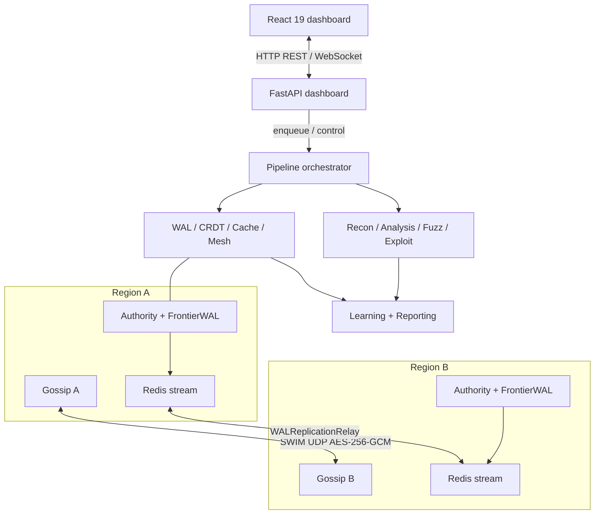

## F-003 — Authority plane

Source: [architecture.md](architecture.md), [FORMAL_COMMAND_SPECIFICATION.md](FORMAL_COMMAND_SPECIFICATION.md). Absorbed F-012, F-014, F-016.

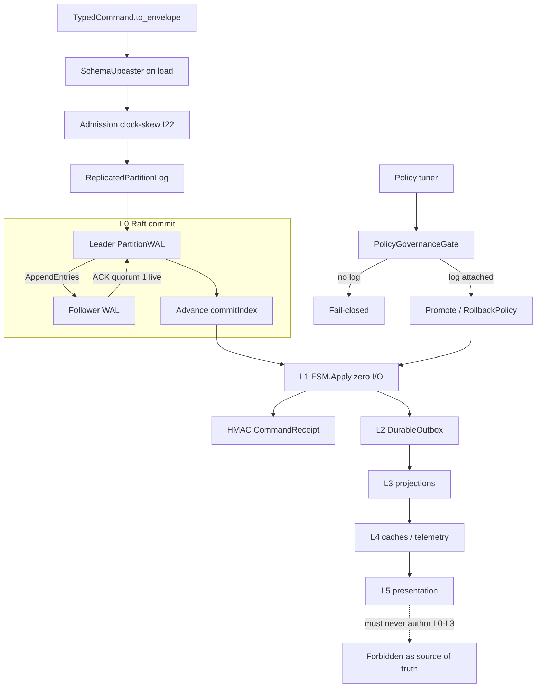

Live CLI is single-node quorum-1. `NetworkRaftTransport` stays LIBRARY.

## F-004 — Live scan path

Source: [architecture.md](architecture.md), [codebase.md](codebase.md), [commands.md](commands.md), [architecture/execution-request-contract.md](architecture/execution-request-contract.md). Absorbed F-005, F-010, F-013, F-015, F-017, F-029.

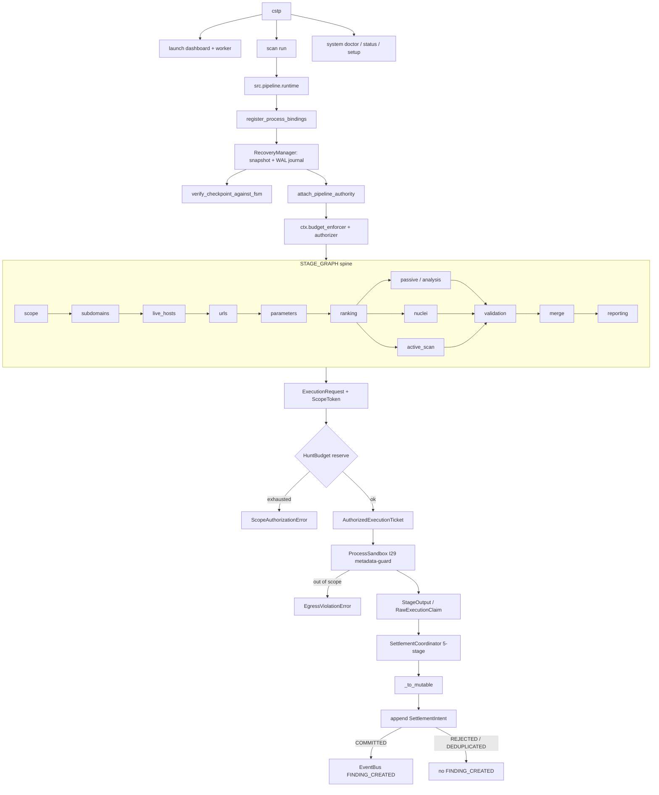

## F-005 — RETIRED — Settlement and FINDING_CREATED

**RETIRED.** Overlapped / nested under [F-004](#f-004). Id kept; do not reuse.

See the survivor chart **F-004**.

## F-006 — Leases and global budget

Source: [architecture.md](architecture.md) I19/I28, [FORMAL_COMMAND_SPECIFICATION.md](FORMAL_COMMAND_SPECIFICATION.md). Absorbed F-011.

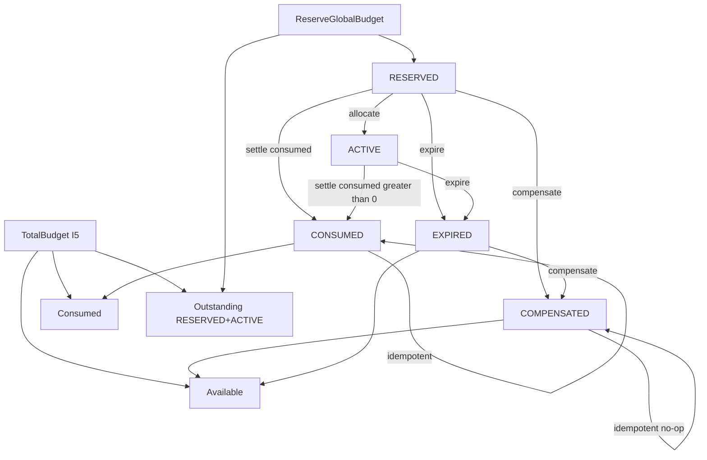

`Total = Consumed + Outstanding + Available`. Slabs add `SlabReserved` (I26). COMPENSATED only from RESERVED or EXPIRED.

## F-007 — Application state machines

Source: `src/jobs/status.py`, `src/core/models/stage_status.py`, `src/core/contracts/finding_lifecycle.py`. Absorbed F-008, F-027.

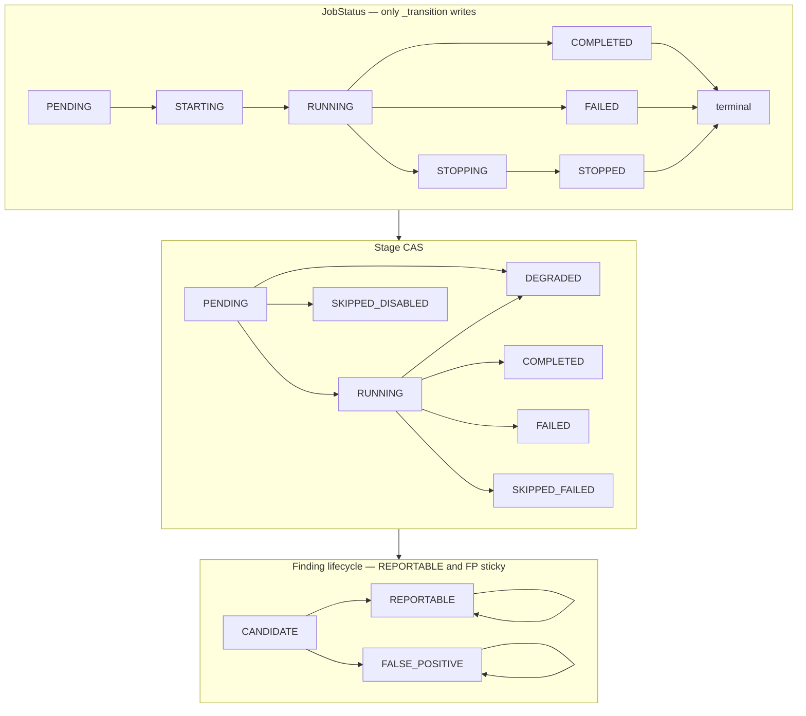

Illegal stage: COMPLETED→FAILED, COMPLETED→SKIPPED*, FAILED→COMPLETED, SKIPPED*→COMPLETED.

## F-008 — RETIRED — Stage status CAS

**RETIRED.** Overlapped / nested under [F-007](#f-007). Id kept; do not reuse.

See the survivor chart **F-007**.

## F-009 — Resilience: breaker, QoS, PID

Source: [architecture.md](architecture.md), [performance.md](performance.md). Absorbed F-024, F-030.

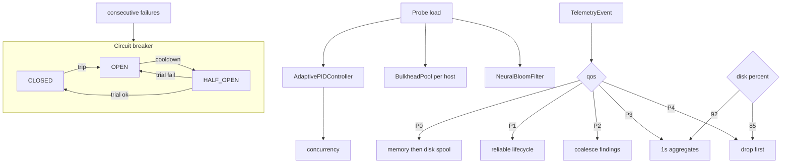

One async HALF_OPEN probe; `_trial_generation` increments on enter HALF_OPEN.

## F-010 — RETIRED — Execution authorization

**RETIRED.** Overlapped / nested under [F-004](#f-004). Id kept; do not reuse.

See the survivor chart **F-004**.

## F-011 — RETIRED — Global budget conservation

**RETIRED.** Overlapped / nested under [F-006](#f-006). Id kept; do not reuse.

See the survivor chart **F-006**.

## F-012 — RETIRED — Policy governance

**RETIRED.** Overlapped / nested under [F-003](#f-003). Id kept; do not reuse.

See the survivor chart **F-003**.

## F-013 — RETIRED — I29 sandbox egress

**RETIRED.** Overlapped / nested under [F-004](#f-004). Id kept; do not reuse.

See the survivor chart **F-004**.

## F-014 — RETIRED — Raft commit and apply

**RETIRED.** Overlapped / nested under [F-003](#f-003). Id kept; do not reuse.

See the survivor chart **F-003**.

## F-015 — RETIRED — Recovery and replay

**RETIRED.** Overlapped / nested under [F-004](#f-004). Id kept; do not reuse.

See the survivor chart **F-004**.

## F-016 — RETIRED — Formal command path

**RETIRED.** Overlapped / nested under [F-003](#f-003). Id kept; do not reuse.

See the survivor chart **F-003**.

## F-017 — RETIRED — CLI and runtime entrypoints

**RETIRED.** Overlapped / nested under [F-004](#f-004). Id kept; do not reuse.

See the survivor chart **F-004**.

## F-018 — Failure-mode decision tree

Source: [FAILURE_MODES.md](FAILURE_MODES.md)

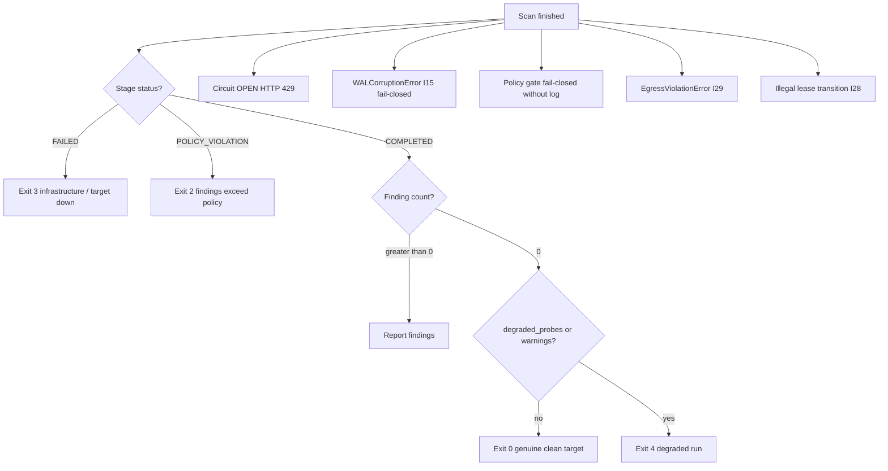

---

## F-019 — Operator surface

Source: [frontend.md](frontend.md), [api-reference.md](api-reference.md), [OBSERVABILITY_CATALOG.md](OBSERVABILITY_CATALOG.md). Absorbed F-023, F-026, F-031.

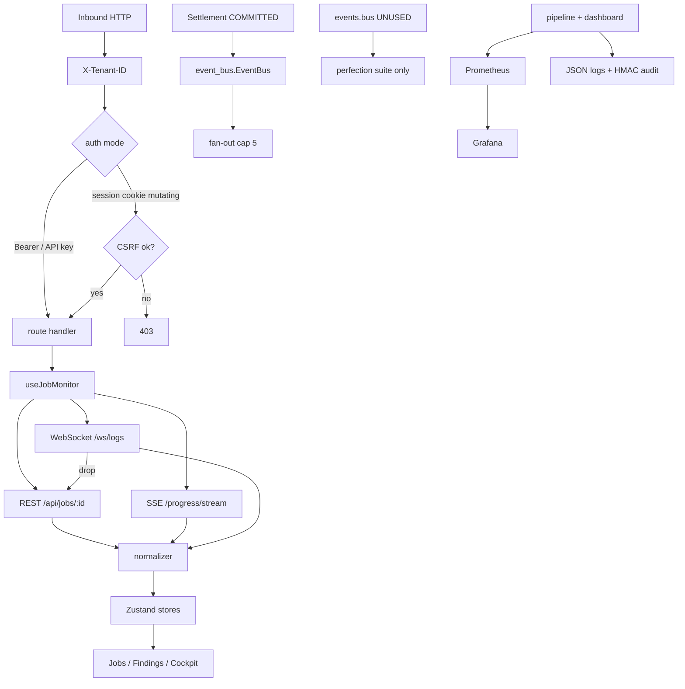

## F-020 — Tests and CI shards

Source: [testing.md](testing.md)

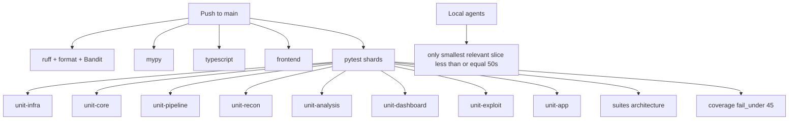

---

## F-021 — RETIRED — Multi-region replication

**RETIRED.** Overlapped / nested under [F-002](#f-002). Id kept; do not reuse.

See the survivor chart **F-002**.

## F-022 — Gap-analysis status

Source: [GAP_ANALYSIS.md](GAP_ANALYSIS.md)

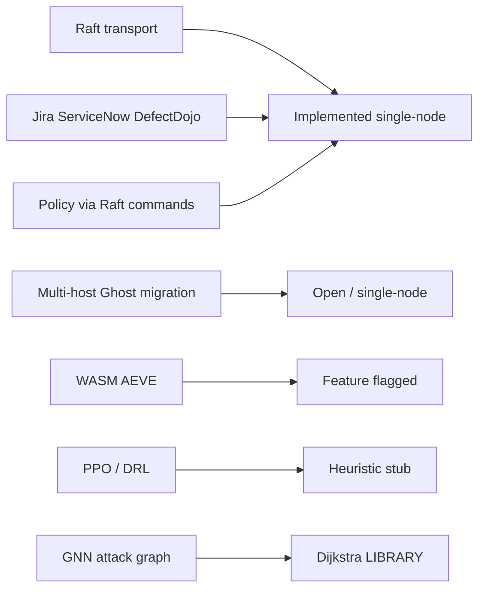

---

## F-023 — RETIRED — Live EventBus vs unused bus

**RETIRED.** Overlapped / nested under [F-019](#f-019). Id kept; do not reuse.

See the survivor chart **F-019**.

## F-024 — RETIRED — QoS broker lanes

**RETIRED.** Overlapped / nested under [F-009](#f-009). Id kept; do not reuse.

See the survivor chart **F-009**.

## F-025 — Non-authoritative planes

Source: [architecture/cache-unification.md](architecture/cache-unification.md), [environment-variables.md](environment-variables.md), [architecture.md](architecture.md) §7.17. Absorbed F-028, F-032.

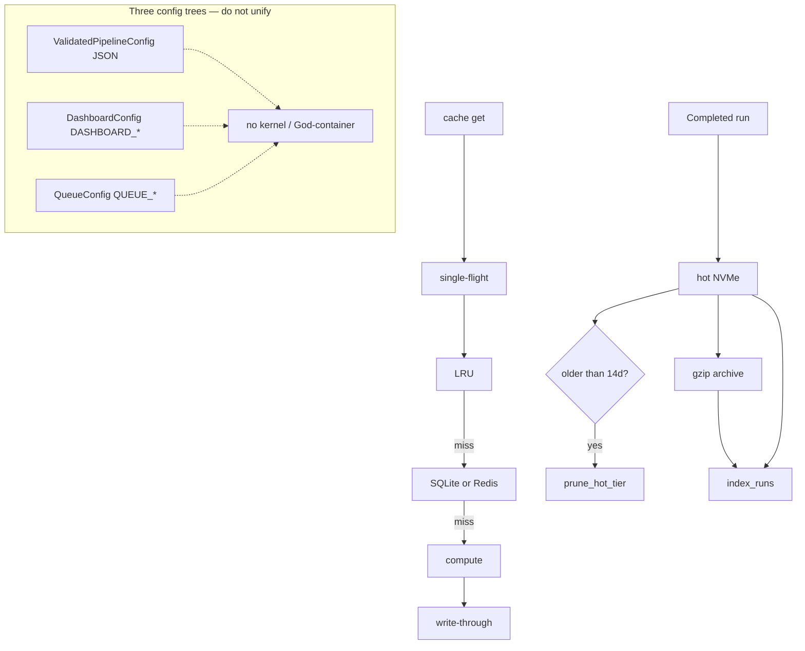

## F-026 — RETIRED — Observability stack

**RETIRED.** Overlapped / nested under [F-019](#f-019). Id kept; do not reuse.

See the survivor chart **F-019**.

## F-027 — RETIRED — Finding lifecycle

**RETIRED.** Overlapped / nested under [F-007](#f-007). Id kept; do not reuse.

See the survivor chart **F-007**.

## F-028 — RETIRED — Three config trees (kept separate)

**RETIRED.** Overlapped / nested under [F-025](#f-025). Id kept; do not reuse.

See the survivor chart **F-025**.

## F-029 — RETIRED — Pipeline stage DAG

**RETIRED.** Overlapped / nested under [F-004](#f-004). Id kept; do not reuse.

See the survivor chart **F-004**.

## F-030 — RETIRED — Performance and backpressure

**RETIRED.** Overlapped / nested under [F-009](#f-009). Id kept; do not reuse.

See the survivor chart **F-009**.

## F-031 — RETIRED — API security & request gate

**RETIRED.** Overlapped / nested under [F-019](#f-019). Id kept; do not reuse.

See the survivor chart **F-019**.

## F-032 — RETIRED — Storage tiering & archival lifecycle

**RETIRED.** Overlapped / nested under [F-025](#f-025). Id kept; do not reuse.

See the survivor chart **F-025**.

## Changelog

| Date | Change | Kind |
|---|---|---|
| 2026-08-25 | Initial atlas F-001–F-030 created. Maintenance contract recorded. | add |
| 2026-08-25 | Added api-reference.md to F-001; added DEGRADED terminal status to F-008; added F-031 (API security gate) and F-032 (storage tiering & archival). | edit |
| 2026-08-25 | Merged overlapping per-doc charts into 11 survivors (F-002/003/004/006/007/009/019/025). Retired F-005, F-008, F-010–F-017, F-021, F-023–F-024, F-026–F-032 as headings only. Still one file. | edit |

Do not delete this changelog. Append a row for every later edit.
