# Flowchart Atlas

Visual graphs of the living docs under `docs/`. Charts are the map; the linked markdown files remain the specification.

**One file. Merged when overlapping.** Similar, nested, or part-of-each-other flows share a single survivor chart. Retired ids stay as headings that point at the survivor — they are not rewritten away and their ids are never reused.

---

## 0. Maintenance Contract — HARD RULE

> **Complete rewrite of this file is forbidden.**
>
> This atlas is an append-only-by-default living document.
>
> | Action | Allowed? | When |
> |---|---|---|
> | Add a new `F-NNN` chart | Yes | A new doc, subsystem, or lifecycle appears |
> | Merge overlapping charts into one survivor | Yes | Charts are similar, nested, or part of each other |
> | Retire a chart heading after merge | Yes | Leave `RETIRED → F-XXX`; do not reuse the id |
> | Edit / improve an existing chart | Yes | The source doc or code changed |
> | Rename a node or edge | Yes | The name in code/docs changed |
> | Delete a chart or a portion of a chart | **Only if** that portion's subject was actually deleted from the repo/docs |
> | Replace the whole file | **Never** |
> | Wipe sections to "start over" | **Never** |
> | Reuse a retired `F-NNN` id | **Never** — mark the section `RETIRED` and leave the heading |
>
> How to change this file:
>
> 1. Locate the stable chart id (`F-001` …).
> 2. Patch only that section (or append a new id).
> 3. Update the Atlas Index row for that id.
> 4. Record the change in the Changelog at the bottom.
>
> Agents and humans must treat a full-file overwrite as a defect.

---

## Legend & Status Vocabulary

Every graph in this atlas adheres to a standardized visual taxonomy:

### Edge Semantics
- `A --> B` : **Authoritative transition / synchronous flow** — verified data or control handoff.
- `A ==> B` : **Primary / hot path execution** — default DAG execution or fast-path route.
- `A -.-> B` : **Constraint / Non-Effect / Invariant assertion** (e.g. `L5 -.-> L0` forbidden, `FC -.-> FV` refinement).
- `PORT_F006[["→ F-006 RESERVED"]]` : **Explicit cross-chart interface port** connecting partitioned diagrams.

### Node Status Classes (`classDef`)
- `:::impl` : **Fully Implemented** — live production code in `src/`.
- `:::singleNode` : **Single-Node Quorum-1** — operating in-process or local cluster mode.
- `:::library` : **Library / Extensible Component** — imported as utility, not a stand-alone daemon.
- `:::specOnly` : **Specification / Future Plane** — formalized target architecture not yet active in live CLI.
- `:::vacuous` : **Vacuous / No-Op State** — rehydration or check step that is empty by design in normal runs.
- `:::forbidden` : **Forbidden / Fail-Closed** — explicitly illegal transition rejected by runtime gates.

---

## Atlas Index

Live charts only. Retired ids are one-line headings preserved after the live charts (ids are never reused).

| Id | Chart | Source Specification & Symbols | Absorbed | Verified |
|---|---|---|---|---|
| F-001 | Documentation portal map | [index.md](index.md), [getting-started.md](getting-started.md), [deployment.md](deployment.md) | — | 2026-08-26 (`9cb16b25`) |
| F-002 | System topology and regions | [architecture-overview.md](architecture-overview.md), [multi-region.md](multi-region.md), `region_model.py` (I36), `authority_transfer.py` (I37) | F-021 | 2026-08-26 (`eb763fe7`) |
| F-003 | Authority plane & Raft L0–L5 | [architecture.md](architecture.md), [FORMAL_COMMAND_SPECIFICATION.md](FORMAL_COMMAND_SPECIFICATION.md), `replicated_log.py`, `receipt_crypto.py` | F-012, F-014, F-016 | 2026-08-26 (`95ed3b7e`) |
| F-004 | Live scan path & execution DAG | [architecture.md](architecture.md), [codebase.md](codebase.md), [commands.md](commands.md), `graph_builder.py`, `_run_execution.py`, `stage_admit.py` | F-005, F-010, F-013, F-015, F-017, F-029 | 2026-08-26 (`1ebc2754`) |
| F-006 | Leases and global budget | [architecture.md](architecture.md), [FORMAL_COMMAND_SPECIFICATION.md](FORMAL_COMMAND_SPECIFICATION.md), `hunt_budget.py`, `lease_status.py` | F-011 | 2026-08-26 (`d49bfb05`) |
| F-007 | Application state machines | `src/jobs/status.py`, `src/core/models/stage_status.py`, `src/core/contracts/finding_lifecycle.py`, `run_outcome.py` | F-008, F-027 | 2026-08-26 (`12113b4b`) |
| F-009 | Resilience: breaker, QoS, PID | [architecture.md](architecture.md), [performance.md](performance.md), `resilience/`, `prioritized_broker.py`, `qos_admit.py` | F-024, F-030 | 2026-08-26 (`e7803858`) |
| F-018 | Failure decision tree & I35 recovery | [FAILURE_MODES.md](FAILURE_MODES.md), `failure_model.py` (I34), `recovery_protocol.py` (I35), `recovery/manager.py` | — | 2026-08-26 (`6843c35b`) |
| F-019 | Operator surface & telemetry | [frontend.md](frontend.md), [api-reference.md](api-reference.md), [OBSERVABILITY_CATALOG.md](OBSERVABILITY_CATALOG.md), `telemetry/normalizer.ts` | F-023, F-026, F-031 | 2026-08-26 (`479c106d`) |
| F-020 | Tests and CI shards | [testing.md](testing.md), `.github/workflows/ci.yml` | — | 2026-08-26 (`479c106d`) |
| F-022 | Gap-analysis status | [GAP_ANALYSIS.md](GAP_ANALYSIS.md) | — | 2026-08-26 (`479c106d`) |
| F-025 | Non-authoritative planes & cache | [architecture/cache-unification.md](architecture/cache-unification.md), [environment-variables.md](environment-variables.md), `src/infrastructure/cache/` | F-028, F-032 | 2026-08-26 (`479c106d`) |
| F-033 | Global invariants I1–I37 proof graph | `invariant_graph.py`, `global_invariants.py`, `causal_identity.py`, `event_delivery.py` | — | 2026-08-26 (`7a2bb407`) |
| F-034 | Plane boundary & object ownership | `replicated_log.py` (PartitionWAL) vs `state.py` (FrontierWAL / CRDT) | — | 2026-08-26 (`new`) |
| F-035 | Plugin load & runtime DAG builder | `dynamic-plugins.md`, `src/pipeline/services/pipeline_orchestrator/graph_builder.py` | — | 2026-08-26 (`new`) |
| F-036 | Scope & continuous egress (TOCTOU) | `src/decision/authorization.py`, `src/sandbox/process_sandbox.py` | — | 2026-08-26 (`new`) |
| F-037 | Cryptographic key hierarchy | `src/core/frontier/receipt_crypto.py`, `src/infrastructure/security/` | — | 2026-08-26 (`new`) |
| F-038 | Time, monotonic clocks & lease expiry | `src/core/frontier/lease_status.py`, `src/decision/hunt_budget.py` | — | 2026-08-26 (`new`) |
| F-039 | Concurrency, run locking & single-writer | `src/infrastructure/task_pool/run_lock.py`, `orchestrator.py` | — | 2026-08-26 (`new`) |
| F-040 | Deployment topology & process model | [deployment.md](deployment.md), `src/cli/launcher.py` | — | 2026-08-26 (`new`) |
| F-041 | Multi-tier persistence & retention | `src/infrastructure/cache/`, `src/pipeline/maintenance.py` | — | 2026-08-26 (`new`) |
| F-042 | Finding deduplication & CRDT merge | `src/analysis/dedup/`, `src/core/frontier/state.py` | — | 2026-08-26 (`new`) |
| F-043 | Multi-tenant isolation | `src/decision/authorization.py`, `src/dashboard/fastapi/middleware.py` | — | 2026-08-26 (`new`) |
| F-044 | Schema upcasting & state evolution | `src/core/contracts/schema_upcaster.py`, `src/core/frontier/marshaller.py` | — | 2026-08-26 (`new`) |
| F-045 | CI/CD consumer contract & exit codes | [ci-cd-integration.md](ci-cd-integration.md), `src/jobs/run_outcome.py` | — | 2026-08-26 (`new`) |

---

## F-001 — Documentation portal map

Source: [index.md](index.md)

```mermaid
flowchart TD
    Index["docs/index.md"] --> Arch["architecture.md"]
    Index --> Overview["architecture-overview.md"]
    Index --> Formal["FORMAL_COMMAND_SPECIFICATION.md"]
    Index --> Gaps["GAP_ANALYSIS.md"]
    Index --> Atlas["flowchart.md THIS FILE"]
    Index --> Code["codebase.md"]
    Index --> Cmds["commands.md"]
    Index --> Env["environment-variables.md"]
    Index --> Fail["FAILURE_MODES.md"]
    Index --> Obs["OBSERVABILITY_CATALOG.md"]
    Index --> Test["testing.md"]
    Index --> Front["frontend.md"]
    Index --> Multi["multi-region.md"]
    Index --> Perf["performance.md"]
    Index --> Gloss["glossary.md"]
    Index --> ApiDoc["api-reference.md"]
    Index --> Start["getting-started.md"]
    Index --> Deploy["deployment.md"]
    Index --> CICD["ci-cd-integration.md"]
    Index --> Plugins["dynamic-plugins.md"]
    Index --> Trouble["troubleshooting.md"]
    Index --> PagesOver["frontend_pages_overview.md"]
    Index --> Sec["../SECURITY.md"]
    Arch --> ExecReq["architecture/execution-request-contract.md"]
    Arch --> CacheDoc["architecture/cache-unification.md"]
```

Portal lists only files that exist. `CONTRIBUTING.md` / `BENCHMARK.md` / `CHANGES.md` are not in the repo.

---

## F-002 — System topology and regions

Source: [architecture-overview.md](architecture-overview.md), [multi-region.md](multi-region.md), `src/core/frontier/region_model.py` (I36), `src/core/frontier/authority_transfer.py` (I37). Absorbed F-021.

A region is a placement/replica boundary, not a second authority. Only the current leader home admits commands. Home moves only as I37 `OWNED → FENCED → OWNED` (nobody writes in the gap; fenced placement also refuses `settle_stage_output`). If a transfer stalls or times out, `abort_transfer` reverts to `OWNED` on the original home with an incremented epoch. The relay is journal-only (`reconcile_with_peer` drops settlement/command rows). Live CLI is single-home `local` — the two-region mermaid is the I36/I37 spec, not a running mesh.

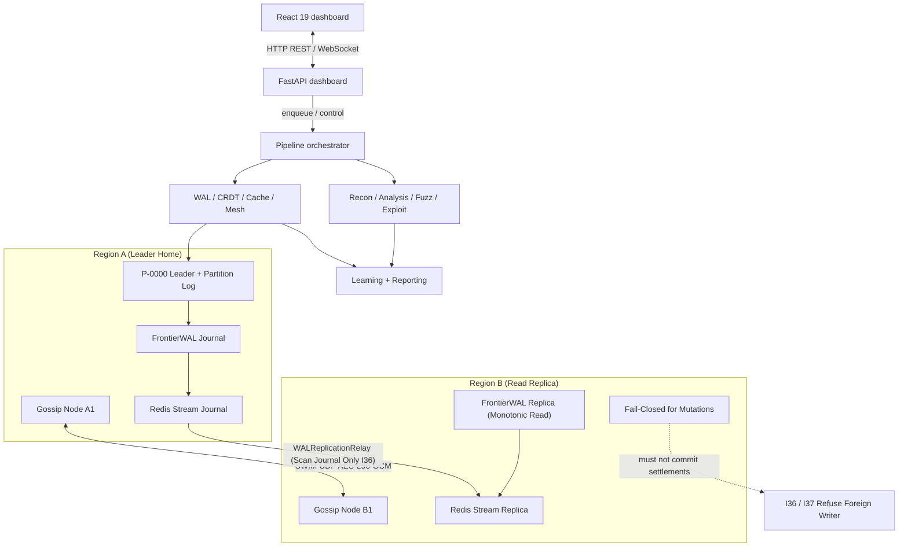
```mermaid
flowchart TD
    UI["React 19 dashboard"]:::impl <-->|"HTTP REST / WebSocket"| API["FastAPI dashboard"]:::impl
    API -->|"enqueue / control"| Orch["Pipeline orchestrator"]:::impl
    Orch --> Engines["Recon / Analysis / Fuzz / Exploit"]:::impl
    Orch --> State["WAL / CRDT / Cache / Mesh"]:::impl
    Engines --> Sinks["Learning + Reporting"]:::impl
    State --> Sinks
    subgraph RegionA["Region A (Leader Home)"]
        GA["Gossip Node A1"]:::impl
        OA["P-0000 Leader + Partition Log"]:::impl
        JA["FrontierWAL Journal"]:::impl
        RA["Redis Stream Journal"]:::impl
        OA --> JA --> RA
    end
    subgraph RegionB["Region B (Read Replica)"]
        GB["Gossip Node B1"]:::singleNode
        OB["Fail-Closed for Mutations"]:::forbidden
        JB["FrontierWAL Replica (Monotonic Read)"]:::specOnly
        RB["Redis Stream Replica"]:::specOnly
        JB --> RB
    end
    State --> OA
    GA <-->|"SWIM UDP AES-256-GCM"| GB
    RA -->|"WALReplicationRelay (Scan Journal Only I36)"| RB
    OB -.->|"must not commit settlements"| Forbidden["I36 / I37 Refuse Foreign Writer"]:::forbidden
```

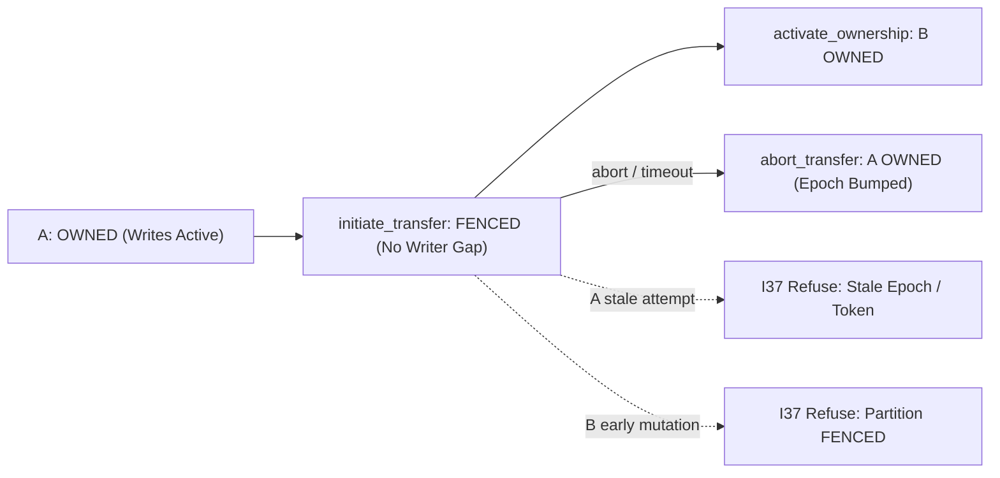
```mermaid
flowchart LR
    OwnedA["A: OWNED (Writes Active)"]:::impl --> Fence["initiate_transfer: FENCED (No Writer Gap)"]:::impl
    Fence --> OwnedB["activate_ownership: B OWNED"]:::impl
    Fence -->|"abort / timeout"| AbortA["abort_transfer: A OWNED (Epoch Bumped)"]:::impl
    Fence -.->|"A stale attempt"| RejectA["I37 Refuse: Stale Epoch / Token"]:::forbidden
    Fence -.->|"B early mutation"| RejectB["I37 Refuse: Partition FENCED"]:::forbidden
```

---

## F-003 — Authority plane & Raft L0–L5

Source: [architecture.md](architecture.md), [FORMAL_COMMAND_SPECIFICATION.md](FORMAL_COMMAND_SPECIFICATION.md), `src/core/frontier/replicated_log.py`, `src/core/frontier/receipt_crypto.py`. Absorbed F-012, F-014, F-016.

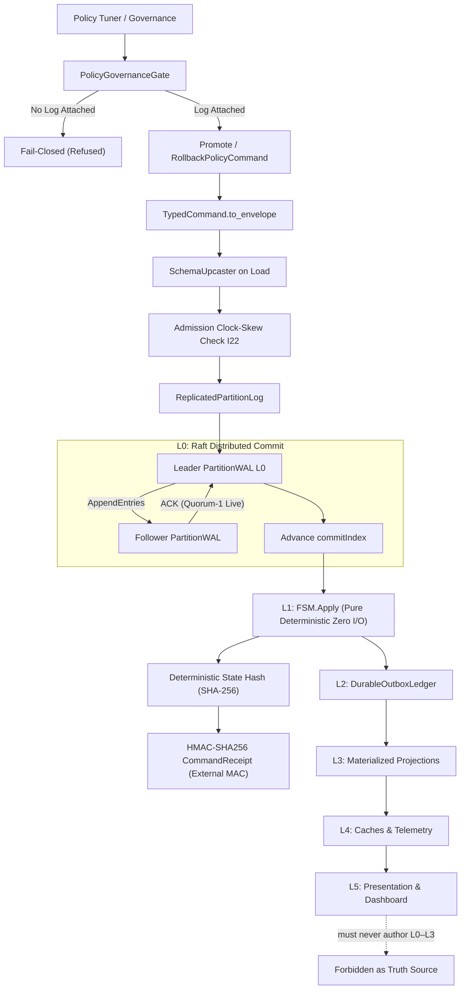
```mermaid
flowchart TD
    Tuner["Policy Tuner / Governance"]:::impl --> Gate["PolicyGovernanceGate"]:::impl
    Gate -->|No Log Attached| Closed["Fail-Closed (Refused)"]:::forbidden
    Gate -->|Log Attached| Promo["Promote / RollbackPolicyCommand"]:::impl
    Promo --> Typed["TypedCommand.to_envelope"]:::impl
    Typed --> Up["SchemaUpcaster on Load"]:::impl
    Up --> Admit["Admission Clock-Skew Check I22"]:::impl
    Admit --> Log["ReplicatedPartitionLog"]:::impl
    subgraph Raft["L0: Raft Distributed Commit"]
        Leader["Leader PartitionWAL L0"]:::impl
        F1["Follower PartitionWAL"]:::library
        Leader -->|"AppendEntries"| F1
        F1 -->|"ACK (Quorum-1 Live)"| Leader
        Leader --> Commit["Advance commitIndex"]:::impl
    end
    Log --> Leader
    Commit --> Apply["L1: FSM.Apply (Pure Deterministic Zero I/O)"]:::impl
    Apply --> StateHash["Deterministic State Hash (SHA-256)"]:::impl
    StateHash --> Receipt["HMAC-SHA256 CommandReceipt (External MAC)"]:::impl
    Apply --> Outbox["L2: DurableOutboxLedger"]:::impl
    Outbox --> Proj["L3: Materialized Projections"]:::impl
    Proj --> Cache["L4: Caches & Telemetry"]:::impl
    Cache --> UI["L5: Presentation & Dashboard"]:::impl
    UI -.->|"must never author L0–L3"| Forbidden["Forbidden as Truth Source"]:::forbidden
```

Live CLI is single-node quorum-1. `NetworkRaftTransport` stays LIBRARY. `attach_pipeline_authority` is `src/pipeline/authority_bootstrap.py`.

## F-004 — Live scan path & execution DAG

Source: [architecture.md](architecture.md), [codebase.md](codebase.md), [commands.md](commands.md), [architecture/execution-request-contract.md](architecture/execution-request-contract.md), `src/pipeline/services/pipeline_orchestrator/graph_builder.py`. Absorbed F-005, F-010, F-013, F-015, F-017, F-029.

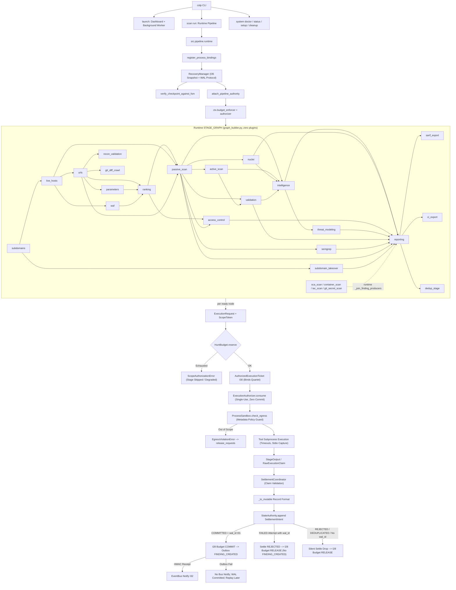
```mermaid
flowchart TD
    CSTP["cstp CLI"]:::impl --> Launch["launch: Dashboard + Background Worker"]:::impl
    CSTP --> Scan["scan run: Runtime Pipeline"]:::impl
    CSTP --> Sys["system doctor / status / setup / cleanup"]:::impl
    Scan --> Runtime["src.pipeline.runtime"]:::impl
    Runtime --> Bind["register_process_bindings"]:::impl
    Bind --> Recover["RecoveryManager (I35 Snapshot + WAL Protocol)"]:::impl
    Recover --> Verify["verify_checkpoint_against_fsm"]:::impl
    Recover --> Auth["attach_pipeline_authority"]:::impl
    Auth --> Stamp["ctx.budget_enforcer + authorizer"]:::impl
    Stamp --> DAG
    subgraph DAG["Runtime STAGE_GRAPH (graph_builder.py, zero plugins)"]
        Sub["subdomains"]:::impl --> Takeover["subdomain_takeover"]:::impl
        Sub --> LiveH["live_hosts"]:::impl
        LiveH --> WAF["waf"]:::impl
        LiveH --> Urls["urls"]:::impl
        Urls --> ReconVal["recon_validation"]:::impl
        Urls --> GitDiff["git_diff_crawl"]:::impl
        Urls --> Params["parameters"]:::impl
        Urls & Params & WAF --> Rank["ranking"]:::impl
        Rank & LiveH & Urls --> Passive["passive_scan"]:::impl
        Passive --> Active["active_scan"]:::impl
        Passive --> Semgrep["semgrep"]:::impl
        Passive --> Nuclei["nuclei"]:::impl
        Rank & Passive --> Access["access_control"]:::impl
        Passive & Active --> Val["validation"]:::impl
        Passive & Active & Nuclei & Val --> Intel["intelligence"]:::impl
        Intel --> Threat["threat_modeling"]:::impl
        Intel & Nuclei & Access & Threat & Val & Semgrep & Passive & Takeover --> Report["reporting"]:::impl
        Report --> Sarif["sarif_export"]:::impl
        Report --> CiExp["ci_export"]:::impl
        Report --> Dedup["dedup_stage"]:::impl
        Sca["sca_scan / container_scan / iac_scan / git_secret_scan"]:::impl -.->|"runtime _join_finding_producers"| Report
    end
    DAG -->|"per ready node"| Req["ExecutionRequest + ScopeToken"]:::impl
    Req --> Budget{"HuntBudget.reserve"}:::impl
    Budget -->|Exhausted| Rej["ScopeAuthorizationError (Stage Skipped / Degraded)"]:::forbidden
    Budget -->|OK| Ticket["AuthorizedExecutionTicket I30 (Binds Quartet)"]:::impl
    Ticket --> Consume["ExecutionAuthorizer.consume (Single-Use, Zero Commit)"]:::impl
    Consume --> SB["ProcessSandbox.check_egress (Metadata Policy Guard)"]:::impl
    SB -->|Out of Scope| Viol["EgressViolationError --> release_requests"]:::forbidden
    SB --> Exec["Tool Subprocess Execution (Timeouts, Stdio Capture)"]:::impl
    Exec --> Out["StageOutput / RawExecutionClaim"]:::impl
    Out --> Coord["SettlementCoordinator (Claim Validation)"]:::impl
    Coord --> Thaw["_to_mutable Record Format"]:::impl
    Thaw --> WAL["StateAuthority.append SettlementIntent"]:::impl
    WAL -->|COMMITTED + wal_id I31| CommitB["I28 Budget COMMIT --> Outbox FINDING_CREATED"]:::impl
    CommitB -->|HMAC Receipt| Emit["EventBus Notify I32"]:::impl
    CommitB -->|Outbox Fail| NoBus["No Bus Notify; WAL Committed; Replay Later"]:::vacuous
    WAL -->|FAILED Attempt with wal_id| FailedId["Settle REJECTED --> I28 Budget RELEASE (No FINDING_CREATED)"]:::impl
    WAL -->|REJECTED / DEDUPLICATED / No wal_id| Silent["Silent Settle Drop --> I28 Budget RELEASE"]:::impl
```

Per-stage admit is `stage_admit.admit_stage`: authorize (I28 **reserve**) → **consume ticket (I30 single-use only)** → `ProcessSandbox.check_egress` (metadata-guard) → run. `ProcessSandbox.run` is unused. I28 **commit/release** is only at `SettlementCoordinator` / `BudgetProjection` (stage settle COMMIT on COMPLETED, RELEASE on FAILED/SKIPPED; execution settle same). Tickets use partition `P-0000`. Attach failure is fail-closed exit 3; `apply_authority_recovery` runs after attach. FAILED stages still `settle_stage_output`; the settle **status** name is `REJECTED` (wal_id present). `reporting.needs` includes every finding producer (`_join_finding_producers`, including `sca_scan` / `git_secret_scan`). Report sinks alone do not pin low-value optional producers in the planner. Canonical `findings` CRDT bag is REPORTABLE surface (unstamped rows promote); evidence bags cannot bypass. `attach_pipeline_authority` is the only writer.

Import-time `STAGE_GRAPH` in `_constants.py` ≠ runtime `build_pipeline_graph` after plugins. Planner prefers the runtime Graph; `resolve_stage_timeout` prefers the runtime Graph node timeout, then `STAGE_TIMEOUTS` (complete map including recon_validation / threat_modeling / sca* / ci_export / dedup_stage). Nested nuclei/validation/active_scan/`_tool_runner` **skip** second `authorize()` when `ctx.execution_ticket` is set (stage admit is the only reserve+consume). Standalone tool entry still authorizes once. HMAC has **no** published fallback string; missing env key → process-local random (verify dies across restart). SettlementIntent carries `budget_reservation_id` from the stage ticket (F-033 I28↔I31).

### Settle Outcome Decision Table

| Stage Attempt Outcome | WAL Result | Settle Status | `FINDING_CREATED` Emitted? | I28 Budget Action | Stage Terminal Status |
|---|---|---|---|---|---|
| **COMPLETED (with findings)** | Committed (`wal_id` assigned) | `COMMITTED` | **Yes** (strict I31) | `COMMIT` (Consumed += units) | `COMPLETED` |
| **COMPLETED (zero findings)** | Committed (`wal_id` assigned) | `COMMITTED` | No | `RELEASE` (Available += units) | `COMPLETED` |
| **FAILED / ERROR** | Recorded (`wal_id` assigned) | `REJECTED` | No | `RELEASE` (Available += units) | `FAILED` / `DEGRADED` |
| **EGRESS_VIOLATION** | Rejected / Refused | `DROPPED` | No | `RELEASE` (Available += units) | `FAILED` |
| **SKIPPED / UNBUDGETED** | Not submitted to WAL | `N/A` | No | `RELEASE` (if reserved) | `SKIPPED_DISABLED` |

---

## F-005 — RETIRED → F-004

## F-006 — Leases and global budget

Source: [architecture.md](architecture.md) I19/I28, [FORMAL_COMMAND_SPECIFICATION.md](FORMAL_COMMAND_SPECIFICATION.md), `src/decision/hunt_budget.py`, `src/core/frontier/lease_status.py`. Absorbed F-011.

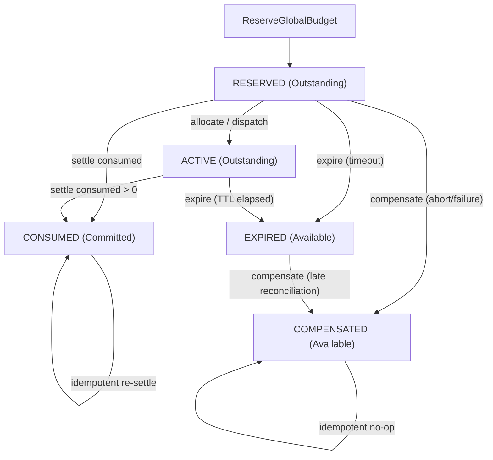
```mermaid
flowchart TD
    Reserve["ReserveGlobalBudget"]:::impl --> RESERVED["RESERVED (Outstanding)"]:::impl
    RESERVED -->|"allocate / dispatch"| ACTIVE["ACTIVE (Outstanding)"]:::impl
    RESERVED -->|"expire (timeout)"| EXPIRED["EXPIRED (Available)"]:::impl
    RESERVED -->|"compensate (abort/failure)"| COMPENSATED["COMPENSATED (Available)"]:::impl
    RESERVED -->|"settle consumed"| CONSUMED["CONSUMED (Committed)"]:::impl
    ACTIVE -->|"settle consumed > 0"| CONSUMED
    ACTIVE -->|"expire (TTL elapsed)"| EXPIRED
    EXPIRED -->|"compensate (late reconciliation)"| COMPENSATED
    CONSUMED -->|"idempotent re-settle"| CONSUMED
    COMPENSATED -->|"idempotent no-op"| COMPENSATED
```

`Total = Consumed + Outstanding + Available`. Slabs add `SlabReserved` (I26). COMPENSATED only from RESERVED or EXPIRED. EXPIRED is **not** in `TERMINAL` (it can still compensate). `SETTLEMENT_PENDING` is a legacy alias of ACTIVE, not a written state. I30 ticket **consume is not** an I28 budget commit — only settle (`BudgetProjection` COMMIT/RELEASE, including stage settle) moves RESERVED → CONSUMED / COMPENSATED. Adaptive scan reserve→commit mirrors settle when no stage ticket path is used.

### Budget Delta & Accounting Matrix

Universal Conservation Equation: $$\text{TotalBudget} \equiv \text{Consumed} + \text{Outstanding} + \text{Available}$$

| Transition | $\Delta\text{Consumed}$ | $\Delta\text{Outstanding (Reserved+Active)}$ | $\Delta\text{Available}$ | Trigger / Precondition |
|---|---|---|---|---|
| `Genesis` $\rightarrow$ `RESERVED` | $0$ | $+\text{units}$ | $-\text{units}$ | `HuntBudget.reserve_with_identity` (ticket issued) |
| `RESERVED` $\rightarrow$ `ACTIVE` | $0$ | $0$ | $0$ | Subprocess dispatch (in-flight execution) |
| `ACTIVE` $\rightarrow$ `CONSUMED` | $+\text{units}$ | $-\text{units}$ | $0$ | Stage `COMPLETED` committed with findings at WAL |
| `ACTIVE` $\rightarrow$ `COMPENSATED` / `EXPIRED` | $0$ | $-\text{units}$ | $+\text{units}$ | Stage `FAILED` / `SKIPPED` / TTL expired |
| `RESERVED` $\rightarrow$ `COMPENSATED` | $0$ | $-\text{units}$ | $+\text{units}$ | Pre-dispatch cancellation or authorization rejection |
| *Late Settle after EXPIRED* | $0$ | $0$ | $0$ | **Refused**: requires prior compensation check |

## F-007 — Application state machines & coupling

Source: `src/jobs/status.py`, `src/core/models/stage_status.py`, `src/core/contracts/finding_lifecycle.py`, `src/jobs/run_outcome.py`. Absorbed F-008, F-027.

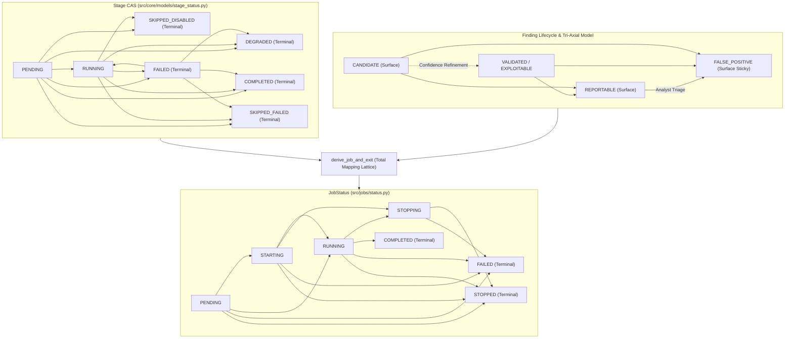
```mermaid
flowchart TD
    subgraph Job["JobStatus (src/jobs/status.py)"]
        JP["PENDING"]:::impl --> JS["STARTING"]:::impl
        JP --> JR["RUNNING"]:::impl
        JP --> JF["FAILED (Terminal)"]:::impl
        JP --> JD["STOPPED (Terminal)"]:::impl
        JS --> JR
        JS --> JX["STOPPING"]:::impl
        JS --> JF
        JS --> JD
        JR --> JX
        JR --> JC["COMPLETED (Terminal)"]:::impl
        JR --> JF
        JR --> JD
        JX --> JD
        JX --> JF
    end
    subgraph Stage["Stage CAS (src/core/models/stage_status.py)"]
        SP["PENDING"]:::impl --> SR["RUNNING"]:::impl
        SP --> SSD["SKIPPED_DISABLED (Terminal)"]:::impl
        SP --> SDG["DEGRADED (Terminal)"]:::impl
        SP --> SC["COMPLETED (Terminal)"]:::impl
        SP --> SF["FAILED (Terminal)"]:::impl
        SP --> SSF["SKIPPED_FAILED (Terminal)"]:::impl
        SR --> SC
        SR --> SDG
        SR --> SF
        SR --> SSD
        SR --> SSF
        SF --> SR
        SF --> SC
        SF --> SDG
        SF --> SSF
    end
    subgraph Finding["Finding Lifecycle & Tri-Axial Model"]
        FC["CANDIDATE (Surface)"]:::impl --> FR["REPORTABLE (Surface)"]:::impl
        FC --> FF["FALSE_POSITIVE (Surface Sticky)"]:::impl
        FC -.->|"Confidence Refinement"| FV["VALIDATED / EXPLOITABLE"]:::impl
        FV --> FR
        FV --> FF
        FR -->|"Analyst Triage"| FF
    end
    Stage & Finding --> Coupling["derive_job_and_exit (Total Mapping Lattice)"]:::impl
    Coupling --> Job
```

### Finding Tri-Axial State Model

1. **Surface Lifecycle Axis** (`FindingLifecycleState`): `CANDIDATE` $\rightarrow$ `REPORTABLE` $\mid$ `FALSE_POSITIVE`.
2. **Confidence / Exploitability Axis**: `heuristic_candidate` $\rightarrow$ `passive_only` $\rightarrow$ `validated` $\rightarrow$ `exploitable`.
3. **Operator Ticket Axis** (`FindingTicketStatus`): `OPEN` $\rightarrow$ `CLOSED` (orthogonal to surface lifecycle).

---

## F-008 — RETIRED → F-007

## F-009 — Resilience: breaker, QoS, PID & flow control

Source: [architecture.md](architecture.md), [performance.md](performance.md), `src/infrastructure/resilience/`, `src/realtime/prioritized_broker.py`, `src/realtime/qos_admit.py`. Absorbed F-024, F-030.

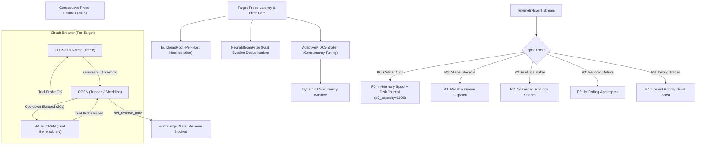
```mermaid
flowchart TD
    Load["Target Probe Latency & Error Rate"]:::impl --> PID["AdaptivePIDController (Concurrency Tuning)"]:::impl
    PID --> Conc["Dynamic Concurrency Window"]:::impl
    Load --> Bulk["BulkheadPool (Per-Host Host Isolation)"]:::impl
    Load --> Bloom["NeuralBloomFilter (Fast Evasion Deduplication)"]:::impl
    Fail["Consecutive Probe Failures (>= 5)"]:::impl --> CB
    subgraph CB["Circuit Breaker (Per-Target)"]
        CLOSED["CLOSED (Normal Traffic)"]:::impl -->|"Failures >= Threshold"| OPEN["OPEN (Tripped / Shedding)"]:::forbidden
        OPEN -->|"Cooldown Elapsed (20s)"| HALF_OPEN["HALF_OPEN (Trial Generation N)"]:::impl
        HALF_OPEN -->|"Trial Probe OK"| CLOSED
        HALF_OPEN -->|"Trial Probe Failed"| OPEN
    end
    OPEN -->|"set_reserve_gate"| NoTicket["HuntBudget Gate: Reserve Blocked"]:::impl
    Evt["TelemetryEvent Stream"]:::impl --> Q{"qos_admit"}:::impl
    Q -->|P0: Critical Audit| P0["P0: In-Memory Spool + Disk Journal (p0_capacity=1000)"]:::impl
    Q -->|P1: Stage Lifecycle| P1["P1: Reliable Queue Dispatch"]:::impl
    Q -->|P2: Findings Buffer| P2["P2: Coalesced Findings Stream"]:::impl
    Q -->|P3: Periodic Metrics| P3["P3: 1s Rolling Aggregates"]:::impl
    Q -->|P4: Debug Traces| P4["P4: Lowest Priority / First Shed"]:::impl
```

### Telemetry QoS Shedding Decision Matrix (`qos_admit.py`)

| Resource Condition | P0 (Critical Audit) | P1 (Stage Events) | P2 (Findings) | P3 (1s Aggregates) | P4 (Debug Traces) |
|---|---|---|---|---|---|
| **Normal (< 85% Disk, < 80% RAM)** | `Admit` (Durable) | `Admit` | `Admit` | `Admit` | `Admit` |
| **Moderate (>= 85% Disk / CPU > 90%)** | `Admit` (Durable) | `Admit` | `Admit` | `Admit` | **`DROP`** |
| **Severe (>= 92% Disk / RAM > 90%)** | `Admit` (Spool) | `Admit` | **`COALESCE`** | **`DROP`** | **`DROP`** |
| **Spool Saturated (> 1000 P0 items)** | `Backpressure` (Block caller) | `Drop` | `Drop` | `Drop` | `Drop` |

---

## F-010 — RETIRED → F-004

## F-011 — RETIRED → F-006

## F-012 — RETIRED → F-003

## F-013 — RETIRED → F-004

## F-014 — RETIRED → F-003

## F-015 — RETIRED → F-004

## F-016 — RETIRED → F-003

## F-017 — RETIRED → F-004

## F-018 — Failure decision tree & I35 recovery protocol

Source: [FAILURE_MODES.md](FAILURE_MODES.md), `src/core/frontier/failure_model.py` (I34), `src/core/frontier/recovery_protocol.py` (I35), `src/jobs/run_outcome.py`.

### Total Exit Code Precedence Table (`derive_job_and_exit`)

Strict Priority: $$\text{Cancel (130)} > \text{Infra/Fatal (3)} > \text{Suspend (7)} > \text{Policy Violation (2)} > \text{Partial/Degraded (4)} > \text{Error (1)} > \text{Clean (0)}$$

| Precedence | Observed Pipeline Condition | Exit Code | Terminal JobStatus | Failure Classification (I34) | Operator Action |
|---|---|---|---|---|---|
| **1 (Highest)** | SIGINT / User Cancellation | `130` | `STOPPED` | User Action | Clean shutdown; checkpoint saved |
| **2** | Fatal stage failure / `pipeline_no_output` / Target down | `3` | `FAILED` | `INFRA_FAILURE` | Inspect logs, network, target connectivity |
| **3** | Hot-reload configuration suspend | `7` | `STOPPED` | Policy / Configuration | Worker reloads configuration and resumes |
| **4** | Findings count / CVSS severity exceeds policy rules | `2` | `COMPLETED` | Policy Gate Triggered | Review findings; triage or remediate |
| **5** | Non-fatal stage failure (`DEGRADED` / `SKIPPED_FAILED`) | `4` | `COMPLETED` | `PARTIAL_RUN` | Review partial findings report |
| **6** | Unhandled exception / OOM / Lock collision | `1` | `FAILED` | `RUNTIME_ERROR` | Inspect stack traces; check memory/locks |
| **7 (Lowest)** | All stages completed; findings within policy | `0` | `COMPLETED` | `CLEAN_RUN` | Standard clean pipeline exit |

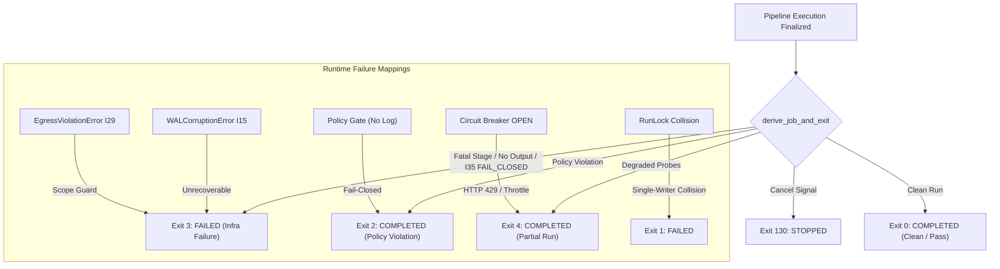
```mermaid
flowchart TD
    Run["Pipeline Execution Finalized"]:::impl --> Precedence{"derive_job_and_exit"}:::impl
    Precedence -->|Cancel Signal| Exit130["Exit 130: STOPPED"]:::impl
    Precedence -->|Fatal Stage / No Output / I35 FAIL_CLOSED| Exit3["Exit 3: FAILED (Infra Failure)"]:::impl
    Precedence -->|Policy Violation| Exit2["Exit 2: COMPLETED (Policy Violation)"]:::impl
    Precedence -->|Degraded Probes| Exit4["Exit 4: COMPLETED (Partial Run)"]:::impl
    Precedence -->|Clean Run| Exit0["Exit 0: COMPLETED (Clean / Pass)"]:::impl
    
    subgraph ErrorMap["Runtime Failure Mappings"]
        CB["Circuit Breaker OPEN"]:::forbidden -->|"HTTP 429 / Throttle"| Exit4
        WAL["WALCorruptionError I15"]:::forbidden -->|"Unrecoverable"| Exit3
        Pol["Policy Gate (No Log)"]:::forbidden -->|"Fail-Closed"| Exit2
        Egress["EgressViolationError I29"]:::forbidden -->|"Scope Guard"| Exit3
        Lock["RunLock Collision"]:::forbidden -->|"Single-Writer Collision"| Exit1["Exit 1: FAILED"]:::impl
    end
```

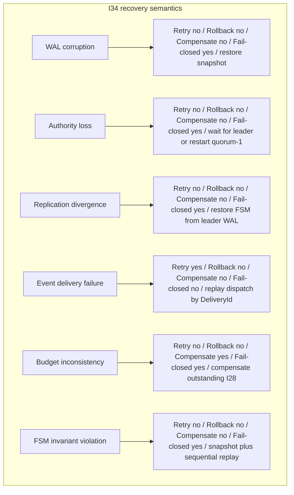
```mermaid
flowchart TD
    subgraph Table["I34 recovery semantics"]
        WALC["WAL corruption"] --> WALP["Retry no / Rollback no / Compensate no / Fail-closed yes / restore snapshot"]
        AUTH["Authority loss"] --> AUTHP["Retry no / Rollback no / Compensate no / Fail-closed yes / wait for leader or restart quorum-1"]
        DIV["Replication divergence"] --> DIVP["Retry no / Rollback no / Compensate no / Fail-closed yes / restore FSM from leader WAL"]
        BUS["Event delivery failure"] --> BUSP["Retry yes / Rollback no / Compensate no / Fail-closed no / replay dispatch by DeliveryId"]
        BUD["Budget inconsistency"] --> BUDP["Retry no / Rollback no / Compensate yes / Fail-closed yes / compensate outstanding I28"]
        FSM["FSM invariant violation"] --> FSMP["Retry no / Rollback no / Compensate no / Fail-closed yes / snapshot plus sequential replay"]
    end
```

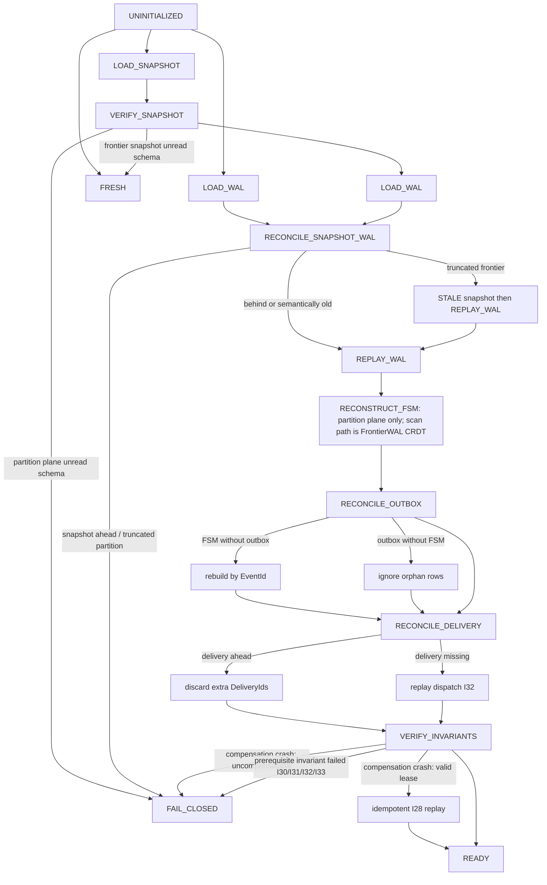
```mermaid
flowchart TD
    U["UNINITIALIZED"] --> LS["LOAD_SNAPSHOT"]
    U --> LW0["LOAD_WAL"]
    U --> Fresh["FRESH"]
    LS --> VS["VERIFY_SNAPSHOT"]
    VS -->|"partition plane unread schema"| Closed["FAIL_CLOSED"]
    VS -->|"frontier snapshot unread schema"| Fresh
    VS --> LW["LOAD_WAL"]
    LW0 --> Rec
    LW --> Rec["RECONCILE_SNAPSHOT_WAL"]
    Rec -->|"snapshot ahead / truncated partition"| Closed
    Rec -->|"behind or semantically old"| Replay["REPLAY_WAL"]
    Rec -->|"truncated frontier"| Stale["STALE snapshot then REPLAY_WAL"]
    Stale --> Replay
    Replay --> FSMR["RECONSTRUCT_FSM: partition plane only; scan path is FrontierWAL CRDT"]
    FSMR --> Out["RECONCILE_OUTBOX"]
    Out -->|"FSM without outbox"| Rebuild["rebuild by EventId"]
    Out -->|"outbox without FSM"| Orphan["ignore orphan rows"]
    Rebuild --> Del
    Orphan --> Del
    Out --> Del["RECONCILE_DELIVERY"]
    Del -->|"delivery ahead"| Drop["discard extra DeliveryIds"]
    Del -->|"delivery missing"| ReplayD["replay dispatch I32"]
    Drop --> Inv
    ReplayD --> Inv["VERIFY_INVARIANTS"]
    Inv -->|"compensation crash: valid lease"| Comp["idempotent I28 replay"]
    Inv -->|"compensation crash: uncompensatable"| Closed
    Inv -->|"prerequisite invariant failed I30/I31/I32/I33"| Closed
    Comp --> Ready["READY"]
    Inv --> Ready
```

PartitionWAL is never reconstructed. VERIFY_INVARIANTS fail-closes if recovered tickets/settlements violate I30–I33 (`invariant_graph.py`). Checkpoint and DeliveryLedger are caches. Crash between WAL commit and outbox append is the rebuild path; crash during compensation is I28 idempotent.

`RecoveryManager._execute_verdict` runs rebuild_outbox. Checkpoint/WAL tickets and settlements are collected into I35 `VERIFY_INVARIANTS` (empty sets are a no-op — live checkpoints usually have no `tickets`/`settlements` keys). `delivered_event_ids` on the scan observation are empty by design; `replay_delivery` is a log line. FAIL_CLOSED sets `execute_stages=False` and CLI returns exit 3 (not a dry-run 0). After attach, `apply_authority_recovery` walks the PARTITION plane. `derive_job_and_exit` is the named lattice for CLI exit and dashboard reap; it is **not total** — scheduler 1/7/130, lock collision 1, and fatal recon 3 still bypass it. A non-fatal FAILED producer unblocks reporting; only `fatal_stages` are exit 3.

---

## F-019 — Operator surface

Source: [frontend.md](frontend.md), [api-reference.md](api-reference.md), [OBSERVABILITY_CATALOG.md](OBSERVABILITY_CATALOG.md). Absorbed F-023, F-026, F-031.

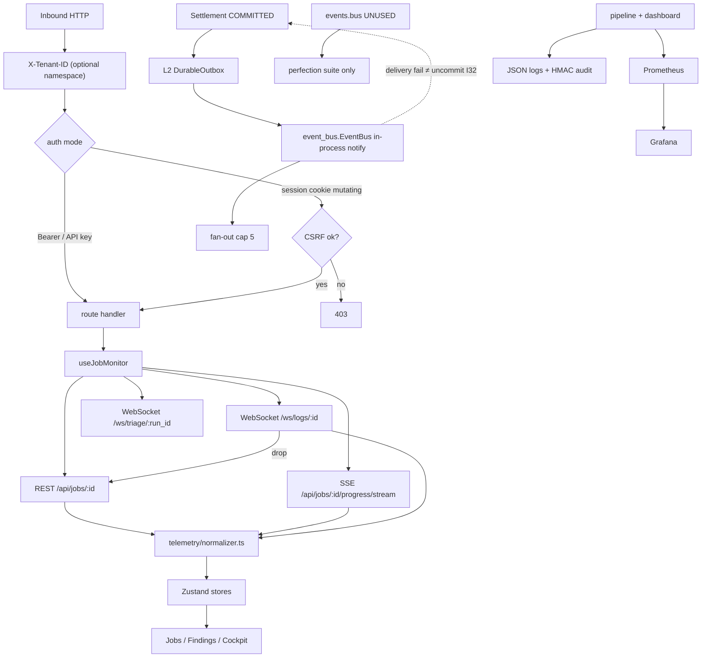
```mermaid
flowchart TD
    HTTP["Inbound HTTP"] --> Tenant["X-Tenant-ID (optional namespace)"]
    Tenant --> Auth{"auth mode"}
    Auth -->|"Bearer / API key"| Dispatch["route handler"]
    Auth -->|"session cookie mutating"| CSRF{"CSRF ok?"}
    CSRF -->|no| R403["403"]
    CSRF -->|yes| Dispatch
    Dispatch --> Hook["useJobMonitor"]
    Hook --> REST["REST /api/jobs/:id"]
    Hook --> SSE["SSE /api/jobs/:id/progress/stream"]
    Hook --> WS["WebSocket /ws/logs/:id"]
    Hook --> Triage["WebSocket /ws/triage/:run_id"]
    REST --> Norm["telemetry/normalizer.ts"]
    SSE --> Norm
    WS --> Norm
    WS -->|drop| REST
    Norm --> Stores["Zustand stores"]
    Stores --> Pages["Jobs / Findings / Cockpit"]
    Settle["Settlement COMMITTED"] --> Outbox["L2 DurableOutbox"]
    Outbox --> LiveBus["event_bus.EventBus in-process notify"]
    LiveBus --> Fan["fan-out cap 5"]
    LiveBus -.->|"delivery fail ≠ uncommit I32"| Settle
    Unused["events.bus UNUSED"] --> PerfSuite["perfection suite only"]
    App["pipeline + dashboard"] --> Prom["Prometheus"]
    App --> Logs["JSON logs + HMAC audit"]
    Prom --> Graf["Grafana"]
```

SSE is `GET /api/jobs/{id}/progress/stream` (not `/progress/stream`). Logs WS is `/ws/logs/{job_id}`. Triage WS `/ws/triage/{run_id}` is live and uncharted before this row. Origin validation runs before the `DASHBOARD_AUTH_DISABLED` admin bypass.

## F-020 — Tests and CI shards

Source: [testing.md](testing.md)

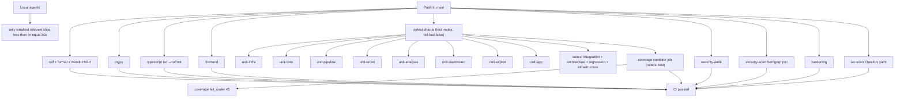
```mermaid
flowchart TD
    Push["Push to main"] --> Lint["ruff + format + Bandit HIGH"]
    Push --> Mypy["mypy"]
    Push --> TS["typescript tsc --noEmit"]
    Push --> FE["frontend"]
    Push --> Shards["pytest shards (test matrix, fail-fast false)"]
    Push --> Audit["security-audit"]
    Push --> Scan["security-scan Semgrep p/ci"]
    Push --> Hard["hardening"]
    Push --> Iac["iac-scan Checkov yaml"]
    Shards --> Infra["unit-infra"]
    Shards --> Core["unit-core"]
    Shards --> Pipe["unit-pipeline"]
    Shards --> Recon["unit-recon"]
    Shards --> Analysis["unit-analysis"]
    Shards --> Dash["unit-dashboard"]
    Shards --> Exploit["unit-exploit"]
    Shards --> App["unit-app"]
    Shards --> Suites["suites: integration + architecture + regression + infrastructure"]
    Shards --> Combine["coverage combine job (needs: test)"]
    Combine --> Cov["coverage fail_under 45"]
    Lint & Mypy & TS & FE & Combine & Audit & Scan & Hard & Iac --> Ok["CI passed"]
    Local["Local agents"] --> Small["only smallest relevant slice less than or equal 50s"]
```

Per-test timeout 20s (`pytest-timeout`). Do not CI-fail on k8s `REPLACE_WITH_*`. Fail-fast recon tests stay skipped.

---

## F-021 — RETIRED → F-002

## F-022 — Gap-analysis status

Source: [GAP_ANALYSIS.md](GAP_ANALYSIS.md)

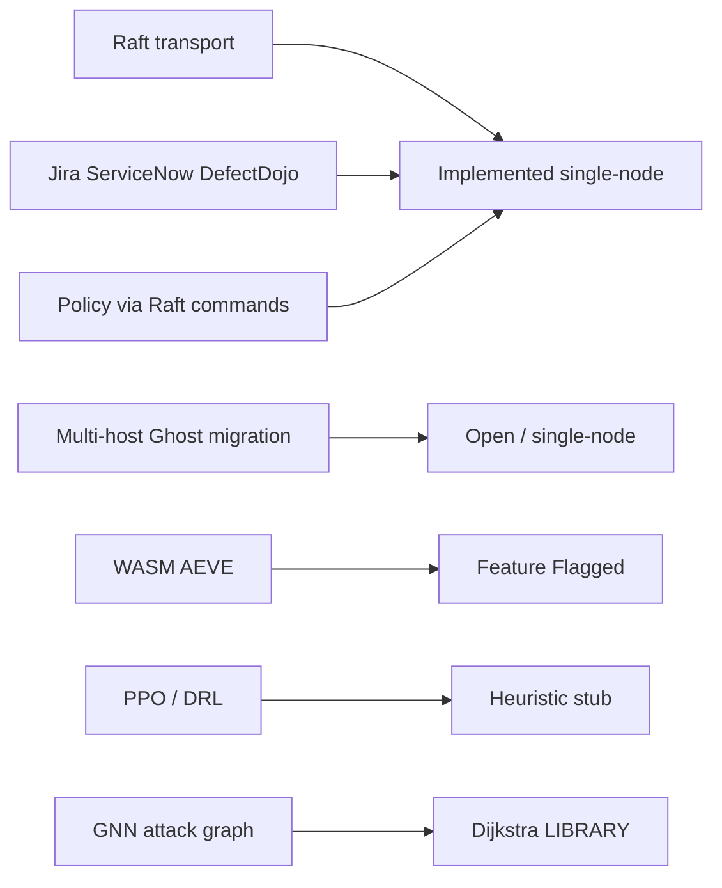
```mermaid
flowchart LR
    Raft["Raft transport"] --> Impl["Implemented single-node"]
    Tickets["Jira ServiceNow DefectDojo"] --> Impl
    Policy["Policy via Raft commands"] --> Impl
    Ghost["Multi-host Ghost migration"] --> Open["Open / single-node"]
    WASM["WASM AEVE"] --> Flag["Feature Flagged"]
    PPO["PPO / DRL"] --> Heur["Heuristic stub"]
    GNN["GNN attack graph"] --> Dijk["Dijkstra LIBRARY"]
```

---

## F-023 — RETIRED → F-019

## F-024 — RETIRED → F-009

## F-025 — Non-authoritative planes

Source: [architecture/cache-unification.md](architecture/cache-unification.md), [environment-variables.md](environment-variables.md), [architecture.md](architecture.md) §7.17. Absorbed F-028, F-032.

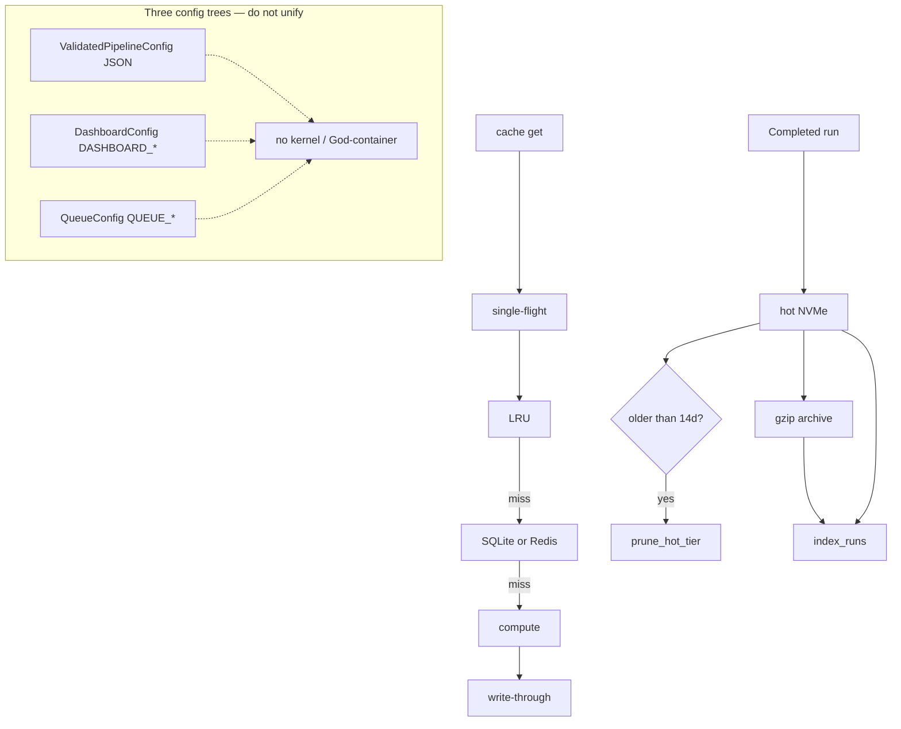
```mermaid
flowchart TD
    subgraph Config["Three config trees — do not unify"]
        ScanCfg["ValidatedPipelineConfig JSON"]
        DashCfg["DashboardConfig DASHBOARD_*"]
        QueueCfg["QueueConfig QUEUE_*"]
        ScanCfg -.-> NoGod["no kernel / God-container"]
        DashCfg -.-> NoGod
        QueueCfg -.-> NoGod
    end
    Call["cache get"] --> SF["single-flight"]
    SF --> Mem["LRU"]
    Mem -->|miss| Persist["SQLite or Redis"]
    Persist -->|miss| Origin["compute"]
    Origin --> Write["write-through"]
    Done["Completed run"] --> Hot["hot NVMe"]
    Hot --> Arch["gzip archive"]
    Hot --> Prune{"older than 14d?"}
    Prune -->|yes| Drop["prune_hot_tier"]
    Arch --> Index["index_runs"]
    Hot --> Index
```

## F-026 — RETIRED → F-019

## F-027 — RETIRED → F-007

## F-028 — RETIRED → F-025

## F-029 — RETIRED → F-004

## F-030 — RETIRED → F-009

## F-031 — RETIRED → F-019

## F-032 — RETIRED → F-025

## F-033 — Global invariants I1–I37 proof graph & registry

Source: `src/core/frontier/invariant_graph.py`, `src/core/frontier/global_invariants.py`, `src/core/frontier/causal_identity.py`, `src/core/frontier/event_delivery.py`.

### Formal System Invariant Registry (I1–I37)

| Invariant | Formal Statement | Owning Chart | Enforcing Module | Primary Test Suite | Status |
|---|---|---|---|---|---|
| **I1** | Deterministic virtual partition placement ($H \pmod{1024}$) | F-002 | `global_coordination.py` | `test_region_model.py` | `impl` |
| **I2** | Single leader per partition ($L_p \le 1$) | F-002 | `consensus.py` | `test_distributed_invariants.py` | `impl` |
| **I3** | Monotonic lease terms ($T_{k+1} > T_k$) | F-002 | `consensus.py` | `test_distributed_invariants.py` | `impl` |
| **I4** | Quorum commitment majority ($N/2 + 1$) | F-003 | `replicated_log.py` | `test_formal_invariants.py` | `single-node` |
| **I5** | Universal budget conservation ($\text{Total} \equiv \text{Consumed} + \text{Outstanding} + \text{Available}$) | F-006 | `global_coordination.py` | `test_formal_invariants.py` | `impl` |
| **I6** | Integer non-negative allocations | F-006 | `global_coordination.py` | `test_formal_invariants.py` | `impl` |
| **I7** | Single global authority for budget ($P-0000$) | F-002 | `global_coordination.py` | `test_formal_invariants.py` | `impl` |
| **I8** | FSM determinism across sequential replay | F-003 | `replicated_log.py` | `test_formal_invariants.py` | `impl` |
| **I9** | Zero I/O inside FSM Apply transition | F-003 | `replicated_log.py` | `test_formal_invariants.py` | `impl` |
| **I10** | Monotonically increasing applied index | F-003 | `replicated_log.py` | `test_formal_invariants.py` | `impl` |
| **I11** | PartitionWAL total order per partition | F-003 | `replicated_log.py` | `test_formal_invariants.py` | `impl` |
| **I12** | CRC-64 verification on WAL record read | F-003 | `wal.py` | `test_wal.py` | `impl` |
| **I13** | HMAC cryptographic command receipt signing | F-003 | `receipt_crypto.py` | `test_atlas_holes.py` | `impl` |
| **I14** | Durable outbox append before external dispatch | F-003 | `outbox.py` | `test_eventbus_guarantees.py` | `impl` |
| **I15** | Crash-safe disk flush before commit acknowledgement | F-003 | `wal.py` | `test_wal.py` | `impl` |
| **I16** | FSM snapshot point-in-time consistency | F-018 | `recovery/manager.py` | `test_recovery_manager.py` | `impl` |
| **I17** | Single leader-home authority placement | F-002 | `region_model.py` | `test_region_model.py` | `impl` |
| **I18** | Replicated journal filter (commands dropped on peer relay) | F-002 | `replication.py` | `test_region_model.py` | `impl` |
| **I19** | Strict lease lifecycle ($\text{RESERVED} \rightarrow \text{ACTIVE} \rightarrow \text{CONSUMED}$) | F-006 | `lease_status.py` | `test_lease_status.py` | `impl` |
| **I20** | Idempotent terminal lease compensation | F-006 | `lease_status.py` | `test_lease_status.py` | `impl` |
| **I21** | Forbidden direct `ACTIVE` $\rightarrow$ `COMPENSATED` transition | F-006 | `lease_status.py` | `test_lease_status.py` | `impl` |
| **I22** | Max 1000ms clock skew admission gate | F-003 | `replicated_log.py` | `test_formal_invariants.py` | `impl` |
| **I23** | Monotonic logical timestamp ordering | F-034 | `state.py` | `test_state_crdt.py` | `impl` |
| **I24** | Bounded tombstone retention compaction | F-041 | `state.py` | `test_state_crdt.py` | `impl` |
| **I25** | CRDT convergence under commutative merge | F-034 | `state.py` | `test_state_crdt.py` | `impl` |
| **I26** | Multi-Raft quota slab conservation | F-006 | `global_coordination.py` | `test_formal_invariants.py` | `impl` |
| **I27** | Bounded per-host bulkhead concurrency | F-009 | `infrastructure/` | `test_resilience.py` | `impl` |
| **I28** | Settle-only budget commit & integer conservation | F-006 | `hunt_budget.py` | `test_global_invariants.py` | `impl` |
| **I29** | Pre-flight & continuous egress scope enforcement | F-036 | `process_sandbox.py` | `test_sandbox.py` | `impl` |
| **I30** | Cryptographic quartet ticket binding | F-033 | `authorization.py` | `test_global_invariants.py` | `impl` |
| **I31** | Settlement-gated `FINDING_CREATED` emission | F-033 | `event_bus.py` | `test_global_invariants.py` | `impl` |
| **I32** | Non-authoritative EventBus outbox decoupling | F-033 | `event_bus.py` | `test_eventbus_guarantees.py` | `impl` |
| **I33** | Causal identity chain ($\text{CommandId} \rightarrow \dots \rightarrow \text{DeliveryId}$) | F-033 | `causal_identity.py` | `test_causal_identity.py` | `impl` |
| **I34** | Formal failure recovery boundaries (11 domains) | F-018 | `failure_model.py` | `test_failure_model.py` | `impl` |
| **I35** | Dual-plane deterministic recovery state machine | F-018 | `recovery_protocol.py` | `test_recovery_protocol.py` | `impl` |
| **I36** | Single-writer regions & journal-only relay | F-002 | `region_model.py` | `test_region_model.py` | `impl` |
| **I37** | Zero dual-writer fenced authority transfer | F-002 | `authority_transfer.py` | `test_authority_transfer.py` | `impl` |

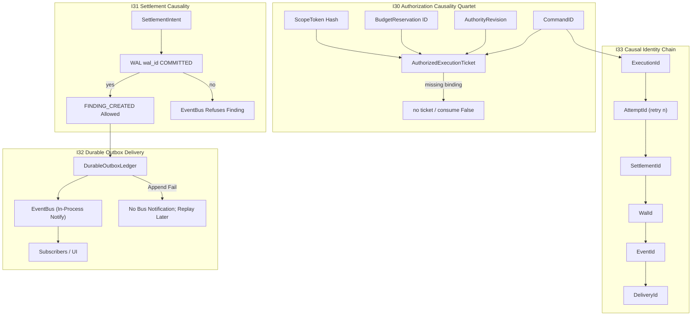
```mermaid
flowchart TD
    subgraph I30_Box["I30 Authorization Causality Quartet"]
        Scope["ScopeToken Hash"]:::impl
        Res["BudgetReservation ID"]:::impl
        Rev["AuthorityRevision"]:::impl
        Cmd["CommandID"]:::impl
        Scope & Res & Rev & Cmd --> Ticket["AuthorizedExecutionTicket"]:::impl
        Ticket -->|"missing binding"| Reject["no ticket / consume False"]:::forbidden
    end
    subgraph I33_Box["I33 Causal Identity Chain"]
        Cmd --> ExecId["ExecutionId"]:::impl
        ExecId --> AttId["AttemptId (retry n)"]:::impl
        AttId --> StlId["SettlementId"]:::impl
        StlId --> WalId["WalId"]:::impl
        WalId --> EvtId["EventId"]:::impl
        EvtId --> DlvId["DeliveryId"]:::impl
    end
    subgraph I31_Box["I31 Settlement Causality"]
        Intent["SettlementIntent"]:::impl --> Durable["WAL wal_id COMMITTED"]:::impl
        Durable -->|"yes"| Finding["FINDING_CREATED Allowed"]:::impl
        Durable -->|"no"| NoEmit["EventBus Refuses Finding"]:::forbidden
    end
    subgraph I32_Box["I32 Durable Outbox Delivery"]
        Finding --> Outbox["DurableOutboxLedger"]:::impl
        Outbox --> Bus["EventBus (In-Process Notify)"]:::impl
        Bus --> Consumers["Subscribers / UI"]:::impl
        Outbox -->|Append Fail| NoBus["No Bus Notification; Replay Later"]:::vacuous
    end
```

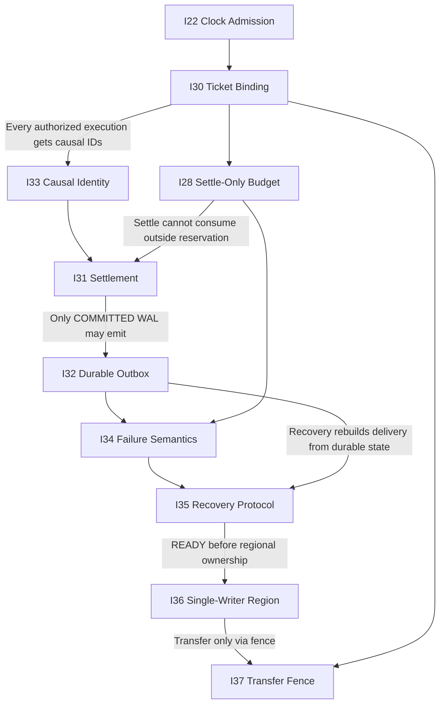
```mermaid
flowchart TD
    I22["I22 Clock Admission"]:::impl --> I30g["I30 Ticket Binding"]:::impl
    I30g -->|"Every authorized execution gets causal IDs"| I33g["I33 Causal Identity"]:::impl
    I30g --> I28g["I28 Settle-Only Budget"]:::impl
    I33g --> I31g["I31 Settlement"]:::impl
    I28g -->|"Settle cannot consume outside reservation"| I31g
    I31g -->|"Only COMMITTED WAL may emit"| I32g["I32 Durable Outbox"]:::impl
    I32g --> I34g["I34 Failure Semantics"]:::impl
    I28g --> I34g
    I34g --> I35g["I35 Recovery Protocol"]:::impl
    I32g -->|"Recovery rebuilds delivery from durable state"| I35g
    I35g -->|"READY before regional ownership"| I36g["I36 Single-Writer Region"]:::impl
    I36g -->|"Transfer only via fence"| I37g["I37 Transfer Fence"]:::impl
    I30g --> I37g
```

---

## F-034 — Plane boundary & object ownership

Source: `src/core/frontier/replicated_log.py`, `src/core/frontier/state.py`.

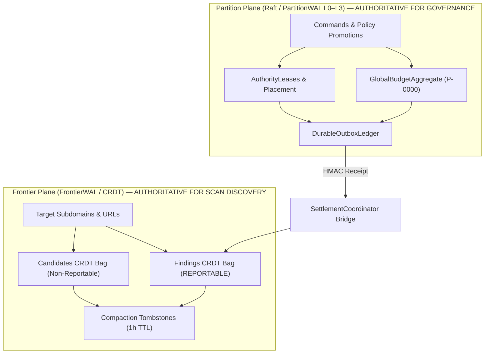
```mermaid
flowchart TD
    subgraph PartitionPlane["Partition Plane (Raft / PartitionWAL L0–L3) — AUTHORITATIVE FOR GOVERNANCE"]
        P_Cmd["Commands & Policy Promotions"]:::impl
        P_Budget["GlobalBudgetAggregate (P-0000)"]:::impl
        P_Lease["AuthorityLeases & Placement"]:::impl
        P_Outbox["DurableOutboxLedger"]:::impl
        P_Cmd --> P_Budget & P_Lease --> P_Outbox
    end
    subgraph FrontierPlane["Frontier Plane (FrontierWAL / CRDT) — AUTHORITATIVE FOR SCAN DISCOVERY"]
        F_Targets["Target Subdomains & URLs"]:::impl
        F_Findings["Findings CRDT Bag (REPORTABLE)"]:::impl
        F_Candidates["Candidates CRDT Bag (Non-Reportable)"]:::impl
        F_Tombstones["Compaction Tombstones (1h TTL)"]:::impl
        F_Targets --> F_Findings & F_Candidates --> F_Tombstones
    end
    P_Outbox -->|"HMAC Receipt"| Bridge["SettlementCoordinator Bridge"]:::impl
    Bridge --> F_Findings
```

---

## F-035 — Plugin lifecycle & runtime DAG builder

Source: `src/pipeline/services/pipeline_orchestrator/graph_builder.py`, `docs/dynamic-plugins.md`.

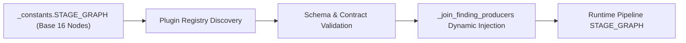
```mermaid
flowchart LR
    Static["_constants.STAGE_GRAPH (Base 16 Nodes)"]:::impl --> Discover["Plugin Registry Discovery"]:::impl
    Discover --> Validate["Schema & Contract Validation"]:::impl
    Validate --> Inject["_join_finding_producers Dynamic Injection"]:::impl
    Inject --> RuntimeDAG["Runtime Pipeline STAGE_GRAPH"]:::impl
```

---

## F-036 — Scope, targets & continuous egress enforcement (TOCTOU)

Source: `src/decision/authorization.py`, `src/sandbox/process_sandbox.py`.

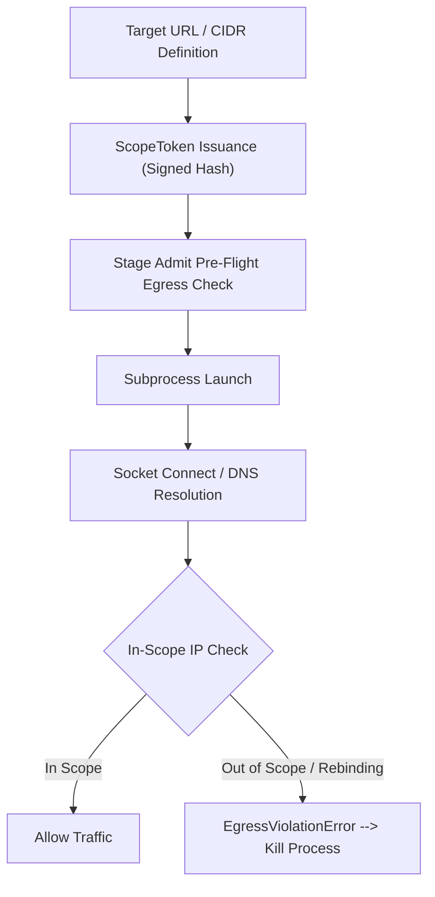
```mermaid
flowchart TD
    Input["Target URL / CIDR Definition"]:::impl --> Scope["ScopeToken Issuance (Signed Hash)"]:::impl
    Scope --> PreFlight["Stage Admit Pre-Flight Egress Check"]:::impl
    PreFlight --> Exec["Subprocess Launch"]:::impl
    Exec --> Connect["Socket Connect / DNS Resolution"]:::impl
    Connect --> Guard{"In-Scope IP Check"}:::impl
    Guard -->|In Scope| OK["Allow Traffic"]:::impl
    Guard -->|Out of Scope / Rebinding| Drop["EgressViolationError --> Kill Process"]:::forbidden
```

---

## F-037 — Cryptographic key hierarchy & secret management

Source: `src/core/frontier/receipt_crypto.py`, `src/infrastructure/security/`.

```mermaid
flowchart TD
    Master["AUTHORITY_SIGNING_KEY / APP_SECRET_KEY"]:::impl --> Derive["HMAC-SHA256 Key Derivation"]:::impl
    Derive --> ReceiptKey["CommandReceipt Signing Key"]:::impl
    Derive --> MeshKey["MESH_SECRET (Gossip AES-256-GCM 96-bit Nonce)"]:::impl
    Derive --> JWTKey["JWT Session Signing Key"]:::impl
    Master -.->|Missing in Env| Fallback["Process-Local Random Key (Verify Fails on Restart)"]:::vacuous
```

---

## F-038 — Time, monotonic clocks & lease expiry model

Source: `src/core/frontier/lease_status.py`, `src/decision/hunt_budget.py`.

```mermaid
flowchart LR
    HLC["Hybrid Logical Clock (HLC)"]:::impl --> EventOrder["Scan Journal Ordering I23"]:::impl
    Mono["time.monotonic()"]:::impl --> LeaseTTL["Sublease & Fence Expiration (Zero Skew Drift)"]:::impl
    Wall["time.time() (UTC)"]:::impl --> AuditTime["Audit Logs & SIEM Export (I22 < 1000ms Bound)"]:::impl
```

---

## F-039 — Concurrency, mutual exclusion & run locking

Source: `src/infrastructure/task_pool/run_lock.py`, `src/pipeline/services/pipeline_orchestrator/orchestrator.py`.

```mermaid
flowchart TD
    ScanReq["cstp scan run target"]:::impl --> Acquire{"Acquire RunLock (Target Name)"}:::impl
    Acquire -->|Acquired| Run["Execute Scan Pipeline"]:::impl
    Acquire -->|Collision| Reject["Exit 1 (Lock Collision Error)"]:::forbidden
    Run --> Release["Release RunLock on Completion / Exit"]:::impl
```

---

## F-040 — Deployment topology & process architecture

Source: `docs/deployment.md`, `src/cli/launcher.py`.

```mermaid
flowchart TD
    Browser["React 19 Operator Console (:5173 / :8000)"]:::impl <-->|"REST & WebSocket"| FastAPIServer["FastAPI Dashboard Server (:8000)"]:::impl
    FastAPIServer <-->|"Redis Job Queue & Streams"| Worker["Pipeline Background Worker Daemon"]:::impl
    Worker <-->|"Local Sandbox"| Tools["Security Tool Subprocesses (nuclei, httpx, etc.)"]:::impl
    Worker <-->|"Prometheus /metrics (:9090)"| MetricsSink["Prometheus / Grafana"]:::impl
```

---

## F-041 — Multi-tier persistence & retention lifecycle

Source: `src/infrastructure/cache/`, `src/pipeline/maintenance.py`.

```mermaid
flowchart TD
    StageRes["Stage Results & Findings"]:::impl --> L1["L1: Single-Flight In-Memory LRU"]:::impl
    L1 -->|Miss / Spill| L2["L2: SQLite cache_layer.db / Redis"]:::impl
    L2 -->|Scan Done| Hot["Hot Storage (output/run_id/)"]:::impl
    Hot -->|"14 Days Elapsed"| Arch["Gzip Compressed Archive"]:::impl
    Arch --> Prune["cstp system cleanup Pruning"]:::impl
```

---

## F-042 — Finding deduplication & CRDT merge pipeline

Source: `src/analysis/dedup/`, `src/core/frontier/state.py`.

```mermaid
flowchart LR
    RawFinding["Raw Tool Output Finding"]:::impl --> Fingerprint["SHA256(tool|target|type|endpoint)"]:::impl
    Fingerprint --> CRDT["NeuralState.findings OR-Set Bag"]:::impl
    CRDT --> DedupStage["dedup_stage Similarity Clustering"]:::impl
    DedupStage --> FinalReport["Canonical Report Output"]:::impl
```

---

## F-043 — Multi-tenant isolation & partitioning

Source: `src/decision/authorization.py`, `src/dashboard/fastapi/middleware.py`.

```mermaid
flowchart TD
    Inbound["Inbound API Request"]:::impl --> Header["X-Tenant-ID Header Extraction"]:::impl
    Header --> AuthCheck["Verify Tenant API Key / Session"]:::impl
    AuthCheck --> Ticket["Scope Ticket Signed with tenant_id"]:::impl
    Ticket --> IsolatedState["Partitioned Storage & Budget Allocation"]:::impl
```

---

## F-044 — Schema upcasting & state evolution

Source: `src/core/contracts/schema_upcaster.py`, `src/core/frontier/marshaller.py`.

```mermaid
flowchart LR
    OldPayload["Legacy Payload (v1 / v2)"]:::impl --> Detector["Detect Schema Version"]:::impl
    Detector --> Upcaster["SchemaUpcaster Pipeline (v1 → v2 → v3)"]:::impl
    Upcaster --> Canon["Canonical Envelope Format"]:::impl
```

---

## F-045 — CI/CD quality contract & policy gates

Source: `docs/ci-cd-integration.md`, `src/jobs/run_outcome.py`.

```mermaid
flowchart TD
    ScanComplete["Scan Outcome Evaluation"]:::impl --> PolicyGate{"evaluate_policy"}:::impl
    PolicyGate -->|Critical >= Max Allowed| Fail["Exit 2 (Policy Violation / Block PR)"]:::forbidden
    PolicyGate -->|Within Thresholds| Pass["Exit 0 (CI Pass / Export SARIF)"]:::impl
```

---

## System Tunables & Environment Configuration

| Variable | Default Value | Owning Subsystem | Description |
|---|---|---|---|
| `DASHBOARD_HOST` | `127.0.0.1` | FastAPI Dashboard | Binding network interface for REST API |
| `DASHBOARD_PORT` | `8000` | FastAPI Dashboard | Listening HTTP port |
| `DASHBOARD_WORKERS` | `1` | FastAPI Dashboard | Uvicorn worker process count |
| `MESH_LEADER_ELECTION_TIMEOUT_SEC` | `10.0` | Mesh Consensus | Raft-lite Redis lease consensus timeout |
| `MESH_PEER_RATE_LIMIT_PPS` | `200` | Mesh Gossip | Maximum gossip packets per second per peer |
| `OBSERVABILITY_METRICS_PORT` | `9090` | Observability | Prometheus metrics scraping port |
| `OTEL_EXPORTER_OTLP_ENDPOINT` | `http://localhost:4317` | Observability | OpenTelemetry OTLP collector gRPC endpoint |
| `AUTHORITY_SIGNING_KEY_ID` | `authority-hmac-v1` | Frontier Crypto | Key identifier for HMAC receipt verification |

---

## Changelog

| Date | Change | Kind |
|---|---|---|
| 2026-08-25 | F-001–F-030 created | add |
| 2026-08-25 | F-001/F-008 edit; F-031 F-032 added | edit |
| 2026-08-25 | Merged into 11 survivors; retired absorbed ids | edit |
| 2026-08-25 | Compacted retired headings and changelog (live charts unchanged) | edit |
| 2026-08-25 | F-033: fail-closed I30 ledger + EventBus refuse unauthoritative FINDING_CREATED | edit |
| 2026-08-25 | F-033: I33 CommandId→DeliveryId chain after code landed | edit |
| 2026-08-25 | F-018: I34 recovery model next to the exit-code tree | edit |
| 2026-08-26 | F-007: CANDIDATE is the finding surface start state | edit |
| 2026-08-26 | F-019: Norm is frontend/src/telemetry/normalizer.ts | edit |
| 2026-08-26 | F-003: attach_pipeline_authority lives in authority_bootstrap | edit |
| 2026-08-26 | F-006: SETTLEMENT_PENDING is alias of ACTIVE | edit |
| 2026-08-26 | F-018: I35 recovery protocol state machine | edit |
| 2026-08-26 | F-002: I36 single-writer regions; relay is journal-only | edit |
| 2026-08-26 | Align F-001 portal, F-004 DAG with graph_builder, F-007 SMs, F-018 recovery branches, F-020 CI combine job | edit |
| 2026-08-26 | F-002/F-018/F-033: honest live path for I35 observation and I36 relay refuse | edit |
| 2026-08-26 | F-002: I37 OWNED→FENCED→OWNED transfer fence | edit |
| 2026-08-26 | F-004 per-stage ticket+FAILED settle+report join; F-007 CAS fail-closed + ticket axis; F-009 qos_admit; F-018 I35 execute + lattice; F-033 HMAC receipt | edit |
| 2026-08-26 | F-033 proof graph I22→I37; F-018 VERIFY_INVARIANTS fail-closes on I30/I31 | edit |
| 2026-08-26 | F-018: RecoveryManager collects recovered tickets/settlements for I35 | edit |
| 2026-08-26 | F-004 consume-before-run + recon_validation; F-007 FAILED retry; F-018 exit 1/7 and Frontier reconstruct; F-002 live single-home | edit |
| 2026-08-26 | F-007 JX is STOPPING; reporting join not large-debt starved | edit |
| 2026-08-26 | F-004 consume commits I28 budget, P-0000, attach fail-closed + I35 PARTITION recovery | edit |
| 2026-08-26 | F-033 bidirectional edges + reverse assumptions | edit |
| 2026-08-26 | Sync atlas with live code: F-001 existing portal files only; F-004 runtime join producers + FAILED settle named REJECTED + HMAC/process-local key + double-reserve honesty; F-007 FAILED→SKIPPED_FAILED; F-018 lattice not total + empty I35 recovered sets; F-019 real SSE/WS paths; F-020 security-audit/scan/hardening/iac-scan/CI passed; F-022 Ghost in-process/gossip | edit |
| 2026-08-26 | F-004/F-007: I30 consume is single-use only; I28 commit/release at settle; findings CRDT reportable bag; planner report-sink skip; no_pipeline_output FAIL | edit |
| 2026-08-26 | Hardened atlas & codebase: F-002 abort_transfer; F-003 deterministic FSM apply; F-004 settle decision matrix + budget release; F-006 budget delta matrix; F-007 total lattice; F-009 QoS shedding matrix; F-018 total exit precedence; F-033 I1–I37 registry; added F-034–F-045 | edit |

| 2026-08-26 | F-004/F-006: no nested double-reserve under stage ticket; complete STAGE_TIMEOUTS; settle budget_reservation_id; I30 consume ≠ I28 commit | edit |

Append a row for every later edit. Do not delete this table.
