# Flowchart Atlas

Visual graphs of the living docs under `docs/`. Charts are the map; the linked markdown files remain the specification.

**One file. Merged when overlapping.** Similar, nested, or part-of-each-other flows share a single survivor chart. Retired ids stay as headings that point at the survivor — they are not rewritten away and their ids are never reused.

---

## 0. Maintenance Contract & Snapshot Semantics

> **The Flowchart Atlas is the living snapshot of canonical architectural truth at revision N.**
>
> | Principle | Policy & Rule |
> |---|---|
> | **Canonical IDs** | `F-001` … `F-045` are stable architectural identifiers (13 active survivor charts, 32 retired pointers). |
> | **Retired Pointer Preservation** | Retired IDs are preserved exclusively in the Retired Chart Registry to resolve external identifier references. |
> | **Graph as Knowledge** | All relationships, authority levels, operational predicates, and negative constraints are encoded directly as graph edges and node attributes. |
> | **Explicit Edge Topology Law** | **Never assume "inside the same subgraph" means connected. Never assume "close together" means connected. Never use a subgraph as an architectural endpoint. Every important relationship gets its own explicit edge.** The layout engine is allowed to rearrange nodes, but it is not allowed to invent edges. |
> | **Render Engine & Parser Law** | **1. Single-Level Subgraphs Only**: Never nest subgraphs (`subgraph` inside `subgraph`). Dagre compound cluster collisions cause edge detachment and scattered layout.<br/>**2. ASCII Label Safety**: Avoid multi-byte unicode arrows (`↔`, `→`) in node labels or edge text; use ASCII `<->`, `->` to prevent parser failures.<br/>**3. KaTeX Underscore Escaping**: In math formulas, always escape literal underscores (`\_`) in `\text{...}` to prevent subscript `EOF` syntax errors.<br/>**4. Closed Code Fences**: Every diagram must start with ```` ```mermaid 
```` followed by `flowchart TD/LR` and terminate with ```` ``` ````. |
> | **History in Git** | Historical evolution, audit logs, and document diffs belong to the Git database, not inside the AI knowledge graph. |
>
> How to modify this atlas:
> 1. Locate the active chart ID (`F-001` …).
> 2. Patch the relevant graph, decision matrix, or registry directly.
> 3. Update the Atlas Index entry.

---

## Legend & Status Vocabulary

Every graph in this atlas adheres to a standardized, machine-verifiable visual taxonomy. Node colors and border strokes are not decorative—they encode the runtime maturity, deployment reality, and safety boundaries of every component.

### Color Architecture & Meaning

```
  ┌────────────────────────────────────────────────────────────────────────┐
  │ 🟢 Emerald Green (#10b981) │ Live, fully implemented production code  │
  ├─────────────────────────────┼──────────────────────────────────────────┤
  │ 🔵 Cyan / Blue (#0ea5e9)   │ Single-node / in-process mode (Quorum-1) │
  ├─────────────────────────────┼──────────────────────────────────────────┤
  │ ⚪ Slate Gray (#64748b)    │ Imported utility / library / test mock   │
  ├─────────────────────────────┼──────────────────────────────────────────┤
  │ 🟣 Indigo (#818cf8)         │ Formal specification plane / target arch │
  ├─────────────────────────────┼──────────────────────────────────────────┤
  │ 🔘 Zinc Muted (#71717a)     │ Vacuous / rehydration pass (empty run)   │
  ├─────────────────────────────┼──────────────────────────────────────────┤
  │ 🔴 Crimson Red (#ef4444)    │ Fail-closed boundary / forbidden action  │
  └─────────────────────────────┴──────────────────────────────────────────┘
```

* **Live Execution Plane (🟢 Emerald / `:::impl`)**: Indicates active runtime modules in `src/`. These components are covered by unit/integration tests and run in active CLI scans and daemon workers.
* **In-Process Quorum-1 Plane (🔵 Cyan / `:::singleNode`)**: Denotes distributed protocols (such as Raft consensus and mesh state) currently running in local single-node mode without active cross-host clustering.
* **Utility & Shared Layer (⚪ Slate / `:::library`)**: Represents pure functions, algorithms, in-memory test mocks (`MemoryJournal`), or imported helper packages rather than long-running daemons.
* **Specification Target Plane (🟣 Indigo / `:::specOnly`)**: Represents formal multi-node distributed designs (e.g. cross-region replication relays, multi-host ghost migrations) defined in contracts but not yet instantiated as active daemons.
* **Vacuous Pass Plane (🔘 Zinc / `:::vacuous`)**: Identifies intermediate state recovery checks or replay steps that are structurally required by the FSM but evaluate to zero mutations during normal clean runs.
* **Safety & Security Boundary (🔴 Crimson / `:::forbidden`)**: Explicitly marks illegal state transitions, network egress violations, and fail-closed gates that trigger aborts or budget compensation.

---

### Node Status Classes (`classDef`)

| ClassDef | Name | Color | Border Stroke | Definition & Runtime Scope |
|---|---|---|---|---|
| `:::impl` | **Fully Implemented** | Dark Slate (`#1f2937`) | **Emerald Green** (`#10b981`, 2px solid) | Live production code in `src/` |
| `:::singleNode` | **Single-Node Quorum-1** | Dark Blue (`#1e293b`) | **Sky Blue** (`#0ea5e9`, 1px dashed) | Operating in-process or local cluster mode |
| `:::library` | **Library Component** | Slate (`#334155`) | **Slate Gray** (`#64748b`, 1px solid) | Imported as utility or test mock |
| `:::specOnly` | **Specification Plane** | Indigo Dark (`#1e1b4b`) | **Indigo Accent** (`#818cf8`, 1px dashed) | Formal target architecture |
| `:::vacuous` | **Vacuous State** | Zinc Dark (`#27272a`) | **Zinc Gray** (`#71717a`, 1px solid) | Normal empty check / rehydration pass |
| `:::forbidden` | **Forbidden / Fail-Closed** | Crimson Dark (`#450a0a`) | **Bright Red** (`#ef4444`, 2px solid) | Explicitly illegal flow rejected by gates |

### Edge Semantics & Grammar

| Syntax | Category | Semantic Meaning & Runtime Role |
|---|---|---|
| `A --> B` | **Structural / Reference** | Documentation link, static hierarchy, CI prerequisite, downstream consumer |
| `A ==> B` | **Hot Path / Execution** | Synchronous control flow, DAG scheduling dispatch, hot worker execution |
| `A -->|data| B` | **Dataflow & Ingestion** | Findings, URLs, payloads, context artifact ingestion |
| `A -->|replicate| B` | **Replication** | Network journal sync, cross-region peer relay |
| `A -->|state| B` | **State Transition** | Deterministic CAS lifecycle progression (e.g. `PENDING` $\rightarrow$ `RUNNING`) |
| `A <--> B` | **Bidirectional** | Represents two directed relationships; permitted only when both directions share the same semantic label. |
| `A -.->|label| B` | **Soft / Conditional** | Gossip, refuse-guard, or best-effort notification (not a hot-path `==>` ) |
| `A -->|durable| B` | **Durable Side Effect** | Synchronous WAL commit, Outbox append, fsync flush |
| `A -.->|when: cond| B` | **Scheduling Gate** | Runtime predicate evaluation (e.g. `OutputNonEmpty`) |
| `A -.->|refuse/guard| B` | **Invariant Refusal** | Fail-closed security boundary, egress guard, illegal flow rejection |
| `PORT_FNNN[["..."]]` | **Interface Port** | Typed boundary connector between partitioned charts |

### Typed Authority Taxonomy

The term "authority" is strictly typed across this specification to avoid semantic overloading. All catalogued invariants (I1–I39) are exhaustively governed:

| Typed Authority | Scope & Plane | Authoritative Entity | Governed Invariants |
|---|---|---|---|
| **`GovernanceAuthority`** | Partition Plane (Raft L0–L1, `P-0000`) | `ReplicatedPartitionLog`, `PolicyGovernanceGate`, `RaftFSM` | I1, I2, I3, I4, I8, I9, I10, I11 (Joint Prerequisite), I13, I18, I20, I22, I25 |
| **`PlacementAuthority`** | Partition assignment / singular ownership (F-002) | `global_coordination.py` PlacementAuthority | I7 |
| **`BudgetAuthority`** | Partition Plane (`P-0000` L1 FSM / L3 Reconstructible View) | `GlobalBudgetAggregate`, `HuntBudget` | I5, I6, I19, I21, I23, I26, I28, I39 |
| **`DiscoveryAuthority`** | Frontier Scan Plane (CRDT view over journaled discovery) | `NeuralState` OR-Sets (`subdomains`, `urls`, `candidates`) | — |
| **`MeshAuthority`** | Gossip / region membership (F-002) | SWIM gossip evidence-only (never grants partition authority); `MeshConsensus` | I24 |
| **`ExecutionAuthority`** | Runtime Control & Scope Sandbox | `ExecutionAuthorizer`, `ProcessSandbox`, `tenant_isolation.py` (HTTP may mirror I38; Presentation must not mutate L0–L3) | I27, I29, I30, I33, I38 |
| **`PersistenceAuthority`** | Storage & Durability Engine (L0/L2) | `PartitionWAL` (CRC-64 fsync), `DurableOutboxLedger` | I11 (Joint Prerequisite), I12, I14, I15, I16, I31, I32 |
| **`RecoveryAuthority`** | Recovery & Regional Consensus Plane | `RecoveryManager`, `RecoveryProtocol`, `RegionModel`, `AuthorityTransfer` | I17, I34, I35, I36, I37 |
| **`PresentationAuthority`** | Ephemeral & Read Projections (L4–L5) | FastAPI, Zustand Stores, Telemetry Normalizer | — |

---

## Atlas Index

Only active, non-merged charts appear here. Merged IDs are listed in the Retired Chart Registry with their survivor.

| Id | Chart | Source Specification & Symbols | Absorbed | Status |
|---|---|---|---|---|
| F-001 | Documentation portal map | [index.md](index.md), [getting-started.md](getting-started.md), [deployment.md](deployment.md) | — | Active |
| F-002 | System topology, regions & deployment | [architecture-overview.md](architecture-overview.md), [multi-region.md](multi-region.md), [deployment.md](deployment.md), `region_model.py` (I36), `authority_transfer.py` (I37), `src/cli/launcher.py` | F-021, F-040 | Active |
| F-003 | Authority plane, Raft L0–L5 & security keys | [architecture.md](architecture.md), [FORMAL_COMMAND_SPECIFICATION.md](FORMAL_COMMAND_SPECIFICATION.md), `replicated_log.py`, `receipt_crypto.py`, `command_envelope.py` / `schema_upcaster.py`, `state.py` | F-012, F-014, F-016, F-034, F-037, F-044 | Active |
| F-004 | Live scan path, execution DAG & egress sandbox | [architecture.md](architecture.md), [codebase.md](codebase.md), [commands.md](commands.md), `graph_builder.py`, `actor_scheduler.py`, `mvr.py`, `stage_admit.py`, `process_sandbox.py`, `findings/spill.py`, `frontier_only.py`, `reporting/partial.py` | F-005, F-010, F-013, F-015, F-017, F-029, F-035, F-036, F-042 | Active |
| F-006 | Leases, time & global budget | [architecture.md](architecture.md), [FORMAL_COMMAND_SPECIFICATION.md](FORMAL_COMMAND_SPECIFICATION.md), `hunt_budget.py`, `lease_status.py`, `compensation_log.py`, `lease_reaper.py`, `budget_phoenix.py`, `quota_slab.py` | F-011, F-038 | Active |
| F-007 | Application state machines & lifecycle coupling | `src/jobs/status.py`, `src/core/models/stage_status.py`, `src/core/contracts/finding_lifecycle.py`, `run_outcome.py`, `mvr.py` | F-008, F-027 | Active |
| F-009 | Resilience: breaker, QoS, PID & bulkhead | [architecture.md](architecture.md), [performance.md](performance.md), `src/resilience/`, `src/realtime/prioritized_broker.py`, `src/realtime/qos_admit.py`, `src/core/runtime/resource_guard.py` | F-024, F-030 | Active |
| F-018 | Failure decision tree, concurrency & I35 recovery | [FAILURE_MODES.md](FAILURE_MODES.md), `failure_model.py` (I34), `recovery_protocol.py` (I35), `recovery/manager.py`, `recovery/survival.py`, `frontier_only.py`, `dag_checkpoint.py`, `resource_guard.py`, `outbox/replay_agent.py` | F-039 | Active |
| F-019 | Operator surface, multi-tenancy & telemetry | [frontend.md](frontend.md), [api-reference.md](api-reference.md), [OBSERVABILITY_CATALOG.md](OBSERVABILITY_CATALOG.md), `telemetry/normalizer.ts`, `middleware.py`, `src/api/health.py` | F-023, F-026, F-031, F-043 | Active |
| F-020 | Tests, CI shards & quality policy gates | [testing.md](testing.md), [ci-cd-integration.md](ci-cd-integration.md), `.github/workflows/ci.yml`, `run_outcome.py` | F-045 | Active |
| F-022 | Gap-analysis status | [GAP_ANALYSIS.md](GAP_ANALYSIS.md) | — | Active |
| F-025 | Non-authoritative planes, caches & multi-tier storage | [architecture/cache-unification.md](architecture/cache-unification.md), [environment-variables.md](environment-variables.md), `src/infrastructure/cache/`, `src/pipeline/unified_cache/`, facades `src/cache/`, `src/checkpoint/`, `src/frontier/` | F-028, F-032, F-041 | Active |
| F-033 | Global invariants I1–I39 enforcement & dependency graph | `invariant_graph.py`, `global_invariants.py`, `causal_identity.py`, `event_delivery.py`, `bootstrap/enforcement_check.py`, `invariant_registry.py` | — | Active |


---

## F-001 — Documentation portal map

```mermaid
flowchart TD
    Index["docs/index.md"] --> Arch["architecture.md"]
    Index --> Overview["architecture-overview.md"]
    Index --> Formal["FORMAL_COMMAND_SPECIFICATION.md"]
    Index --> Gaps["GAP_ANALYSIS.md"]
    Index --> Atlas["flowchart.md THIS FILE"]
    Index --> Code["codebase.md"]
    Index --> Cmds["commands.md"]
    Index --> Env["environment-variables.md"]
    Index --> Fail["FAILURE_MODES.md"]
    Index --> Obs["OBSERVABILITY_CATALOG.md"]
    Index --> Test["testing.md"]
    Index --> Front["frontend.md"]
    Index --> Multi["multi-region.md"]
    Index --> Perf["performance.md"]
    Index --> Gloss["glossary.md"]
    Index --> ApiDoc["api-reference.md"]
    Index --> Start["getting-started.md"]
    Index --> Deploy["deployment.md"]
    Index --> CICD["ci-cd-integration.md"]
    Index --> Plugins["dynamic-plugins.md"]
    Index --> Trouble["troubleshooting.md"]
    Index --> PagesOver["frontend_pages_overview.md"]
    Index --> Sec["../SECURITY.md"]
    Arch --> ExecReq["architecture/execution-request-contract.md"]
    Arch --> CacheDoc["architecture/cache-unification.md"]
    Arch --> Consolidation["architecture/code-consolidation.md"]
```

---

## F-002 — System topology, regions & deployment

```mermaid
flowchart TD
    classDef impl fill:#1f2937,stroke:#10b981,stroke-width:2px,color:#fff;
    classDef singleNode fill:#1e293b,stroke:#0ea5e9,stroke-width:1px,stroke-dasharray:3 3,color:#fff;
    classDef library fill:#334155,stroke:#64748b,stroke-width:1px,color:#fff;
    classDef specOnly fill:#1e1b4b,stroke:#818cf8,stroke-width:1px,stroke-dasharray:4 4,color:#fff;
    classDef vacuous fill:#27272a,stroke:#71717a,stroke-width:1px,color:#a1a1aa;
    classDef forbidden fill:#450a0a,stroke:#ef4444,stroke-width:2px,color:#fca5a5;

    subgraph Topology["Spatial Deployment & Multi-Region Topology (cli/launcher.py, multi-region.md; default single-home)"]
        Browser["React 19 Dashboard (Vite :5000 / API :8000)"]:::impl -->|"REST / WebSocket"| API["FastAPI Dashboard Server (:8000)"]:::impl
        API -->|"REST / WebSocket"| Browser
        API -->|"Redis Job Queue & Streams<br/>(Circuit Breaker + Local SQLite Spool Fallback)"| Worker["Pipeline Background Worker Daemon"]:::impl
        Worker -->|"job status / lease heartbeat"| API
        Worker ==>|"subproc spawn"| Tools["Security Tool Subprocesses (nuclei, httpx, etc.)"]:::impl
        Worker -->|"metrics push"| PromSink["Prometheus metrics (:9090; Grafana optional separate)"]:::impl
        
        Worker ==> Orch["Pipeline Orchestrator"]:::impl
        Orch ==> Engines["Recon / Analysis / Fuzz / Exploit"]:::impl
        Orch -->|data| State["WAL / CRDT / Cache / Mesh"]:::impl
        Engines -->|data| Sinks["Learning + Reporting"]:::impl
        State -->|data| Sinks
    end

    subgraph MultiRegionAuthority["Multi-Region Single-Writer & I37 Authority Transfer (I36, I37)"]
        A["Region A<br/>OWNED (Active Writer)"]:::impl -->|"initiate_transfer(Epoch E)"| F["FENCED<br/>(Zero-Writer; Linearizable Log CAS)"]:::impl
        F -->|"activate_ownership(Epoch E+1) only if PartitionWAL replicate caught_up (stub today; journal relay is non-authority I36)"| B["Region B<br/>OWNED (Active Writer)"]:::impl
        F -->|"abort_transfer / timeout (epoch bump)"| A
        
        F -.->|"refuse: stale epoch/token (WAL boundary)"| Rej1["Refuse: Stale Epoch / Token"]:::forbidden
        F -.->|"refuse: mutation while fenced"| Rej2["Refuse: Partition FENCED"]:::forbidden
        
        A -.->|"delayed activate rejected: stale fence / epoch (activation token)"| RejDelayed["Refuse: Stale Activation Token"]:::forbidden
        F -.->|"refuse: replica_applied < fence_commit_index"| RejLag["Refuse: Replica Not Caught Up"]:::forbidden
        
        A ==>|"authoritative write"| OA["P-0000 Leader PartitionWAL (Commands & Budget)"]:::impl
        A ==>|"authoritative write"| JA["FrontierWAL Journal (Scan Discovery)"]:::impl
        JA -->|"WALReplicationRelay (Journal Only I36)"| JB["Region B FrontierWAL Replica (Monotonic Read)"]:::impl
        F -->|"capture fence_commit_index (= source_committed)"| OB["Region B PartitionWAL Replica"]:::singleNode
        B -.->|"refuse: foreign mutation rejected"| RejB["I36/I37 Refuse Foreign Writer"]:::forbidden
        
        GA["Gossip Node A1"]:::impl -.->|"gossip SWIM UDP (AES-256-GCM Nonce 96-bit I24)"| GB["Gossip Node B1 (mesh not live; see F-022 Region-B SWIM)"]:::specOnly
        Consensus["MeshConsensus (Adaptive RTT Timeout 10x + Pre-Vote Guard)"]:::impl --> GA & GB
    end
```

---

## F-003 — Authority plane, Raft L0–L5 & security keys

### Bidirectional Schema Evolution & Key Hierarchy

```mermaid
flowchart TD
    classDef impl fill:#1f2937,stroke:#10b981,stroke-width:2px,color:#fff;
    classDef library fill:#334155,stroke:#64748b,stroke-width:1px,color:#fff;
    classDef forbidden fill:#450a0a,stroke:#ef4444,stroke-width:2px,color:#fca5a5;

    OldPayload["Legacy Command / Payload (v1 / v2)"]:::impl -->|upcast (forward-compat)| Registry["SchemaMigrationRegistry (v1 <-> v2 <-> v3)"]:::impl
    NewPayload["Future / v3+ Payload"]:::impl -->|reverse-translate (reverse-compat)| Registry
    Registry -->|target new| Envelope["Output: Canonical Envelope (v3)"]:::impl
    Registry -->|target legacy / rolling upgrade| DowngradedEnvelope["Output: Downgraded Envelope + _unknown_fields bag"]:::impl
    MasterKey["AUTHORITY_SIGNING_KEY / APP_SECRET_KEY"]:::impl --> KeyRing["AuthorityKeyRing (Multi-Generation Overlap)"]:::impl
    KeyRing -->|"active (Gen N)"| Derive["HMAC Key Derivation"]:::impl
    KeyRing -->|"overlap (Gen N-1)"| OverlapVerify["Historical Verification Window (Zero Downtime)"]:::impl
    RotateCmd["RotateAuthorityKeyCommand (commands.py -> KeyRing.rotate_key)"]:::impl -->|"ceremony"| KeyRing
    Derive --> ReceiptKey["CommandReceipt Key (key_generation bound)"]:::impl
    Derive --> MeshKey["mesh_secret_key HKDF (AES-256-GCM material)"]:::impl
    Derive --> JWTKey["jwt_session_key HKDF"]:::impl
    MasterKey -.->|"Missing in Env (Pre-Raft Bootstrap Guard)"| Fallback["Refuse: Missing Master Secret FAILS_CLOSED"]:::forbidden
```

### Partition Plane, Raft Consensus & Non-Authoritative Strata (L0–L5)

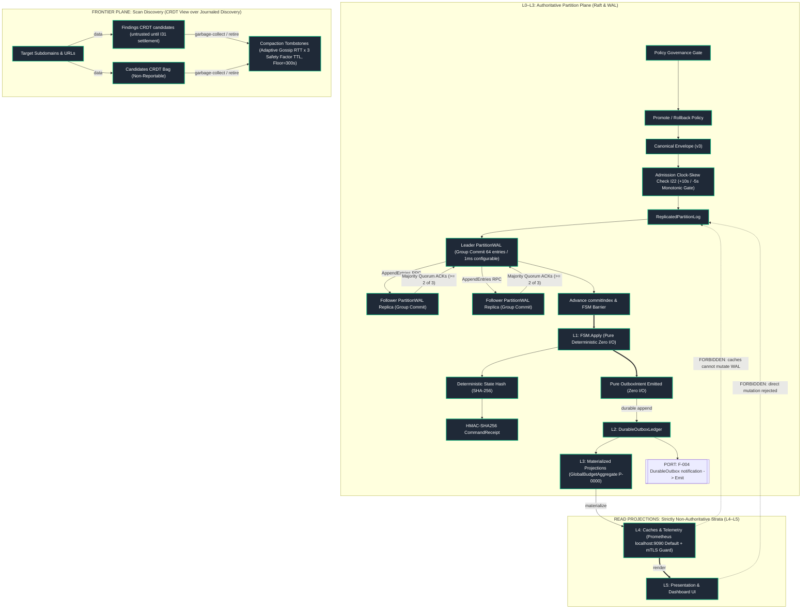

---

## F-004 — Live scan path, execution DAG & egress sandbox

```mermaid
flowchart TD

    classDef impl fill:#1f2937,stroke:#10b981,stroke-width:2px,color:#fff;
    classDef singleNode fill:#1e293b,stroke:#0ea5e9,stroke-width:1px,stroke-dasharray:3 3,color:#fff;
    classDef library fill:#334155,stroke:#64748b,stroke-width:1px,color:#fff;
    classDef specOnly fill:#1e1b4b,stroke:#818cf8,stroke-width:1px,stroke-dasharray:4 4,color:#fff;
    classDef vacuous fill:#27272a,stroke:#71717a,stroke-width:1px,color:#a1a1aa;
    classDef forbidden fill:#450a0a,stroke:#ef4444,stroke-width:2px,color:#fca5a5;

    subgraph GraphBuilderPipeline["Dynamic Plugin & DAG Lifecycle"]

        BaseNodes["1. _BASE_NODES (19 Static Built-in Nodes)"]:::impl

        MergePlugins["2. COMPOSE: Deterministic Merge Plugins from StageRegistry"]:::impl

        ProfileOverride["3. Capability Profile (Tool Availability Probes)"]:::impl

        PruneTools["4. Prune Unavailable Tools (nuclei/semgrep binary check)"]:::impl

        DynamicJoin["5. _join_finding_producers (Bind finding producers to reporting)"]:::impl

        CycleCheck["6. VERIFY: Acyclic & Safety Check (I-GRAPH-01..08)"]:::impl

        DeclaredGraph["DeclaredGraph snapshot (pre-prune; not live)"]:::library
        Freeze["7. FREEZE fingerprints onto FrozenGraph"]:::impl

        FrozenGraph["Frozen Runtime Graph (Immutable Node / Dependency Set)"]:::impl

        GraphGenID["GraphGenID (declared, pre-prune)"]:::library
        CapFP["capability_gen_id (post-prune, post-join, post-CycleCheck)"]:::library

        BaseNodes --> MergePlugins
        MergePlugins --> ProfileOverride
        ProfileOverride --> PruneTools
        PruneTools --> DynamicJoin
        DynamicJoin --> CycleCheck
        ProfileOverride -->|"declared snapshot (pre-prune)"| DeclaredGraph
        DeclaredGraph -->|"GraphGenID hash input"| GraphGenID
        CycleCheck -->|"joined+validated executable set"| ExecutableGraph["ExecutableGraph (post-prune, post-join, post-CycleCheck)"]:::impl
        ExecutableGraph -->|"capability fingerprint"| CapFP
        GraphGenID --> Freeze
        CapFP --> Freeze
        ExecutableGraph --> Freeze

        Freeze --> FrozenGraph
    end

    subgraph Init["Process Bootstrap & Authority Attachment"]

        CSTP["cstp CLI"]:::impl

        Launch["launch: Dashboard + Background Worker"]:::impl

        Scan["scan run: Runtime Pipeline"]:::impl

        Sys["system doctor / status / setup / cleanup"]:::impl

        Runtime["src.pipeline.runtime"]:::impl

        Bind["register_process_bindings"]:::impl

        Recover["RecoveryManager (I35 Snapshot + WAL Protocol)"]:::impl

        Verify["verify_checkpoint_against_fsm"]:::impl

        Auth["attach_pipeline_authority"]:::impl

        Stamp["ctx.budget_enforcer + authorizer"]:::impl

        CSTP --> Launch
        CSTP --> Scan
        CSTP --> Sys

        Launch --> Bind
        Scan -->|"--frontier-only / resume --run-id"| Runtime
        Runtime --> Bind

        Bind --> Recover

        Recover -->|"verify state"| Verify
        Recover -->|"HMAC outbox replay"| ReplayFO["replay_finding_dispatch"]:::impl
        Recover -->|"AUTO_FINALIZE_CRASHED (pipeline/mvr)"| FinalizeCrash["mvr.report_partial / emit_partial_report for CRASHED_IN_PROGRESS"]:::impl
        Recover -->|"attach authority"| Auth
        Recover -->|"apply_authority_recovery after attach"| Stamp

        Verify --> Auth

        Auth -->|"inject context"| Stamp
        Auth -.->|"attach failure"| AuthFail["Exit 3 FAIL_CLOSED"]:::forbidden
        Auth -.->|"AUTO_FRONTIER_ONLY_ON_AUTH_LOSS"| FO["FRONTIER_ONLY discovery continues"]:::impl
        Bind -->|"enforcement_check.verify"| Auth
    end

    StageGraphRoot["RUNTIME STAGE_GRAPH (Frozen Executable Dependency Graph)"]:::impl

    GraphGenGate["GraphGenID Validation Gate"]:::library

    FrozenGraph -->|"frozen graph consumed at runtime"| StageGraphRoot
    FrozenGraph -->|"declared + capability fingerprints"| GraphGenGate
    GraphGenGate -->|"resume checks both"| Scheduler
    GraphGenGate --> Req

    Stamp -->|"runtime authorizer binding"| Req

    Stamp --> Sub

    Scheduler["ActorScheduler Greedy Readiness Loop (MVR degrade-not-abort)"]:::impl

    ReadinessRoot["READINESS / STAGE STATUS CONTROL MODEL"]:::impl

    ReadinessEvaluation["Readiness Evaluation (needs + when gates)"]:::library

    StageGraphRoot -->|"evaluate graph dependencies"| ReadinessEvaluation

    ReadinessEvaluation -->|"readiness result"| Scheduler

    Scheduler -->|"control state / lifecycle evaluation"| ReadinessRoot

    subgraph DAG["Runtime Executable STAGE_GRAPH (ActorScheduler Readiness & Gates)"]

        Sub["subdomains"]:::impl

        Takeover["subdomain_takeover"]:::impl

        LiveH["live_hosts [critical=true, must_succeed=true]"]:::impl

        WAF["waf"]:::impl

        Urls["urls"]:::impl

        ReconVal["recon_validation"]:::impl

        GitDiff["git_diff_crawl"]:::impl

        Params["parameters"]:::impl

        Rank["ranking"]:::impl

        Passive["passive_scan"]:::impl

        Active["active_scan"]:::impl

        Semgrep["semgrep"]:::impl

        Nuclei["nuclei"]:::impl

        Access["access_control"]:::impl

        Val["validation"]:::impl

        Intel["intelligence"]:::impl

        Threat["threat_modeling"]:::impl

        Report["reporting [JOIN_SINK]"]:::impl

        DynProducers["Dynamic Producers (sca_scan, container_scan, iac_scan, git_secret_scan)"]:::impl

        Sarif["sarif_export"]:::impl

        CiExp["ci_export"]:::impl

        Dedup["dedup_stage (Structural Parameterized Fingerprinting)"]:::impl

        StageGraphRoot --> Sub

        Sub --> Takeover
        Sub --> LiveH

        LiveH --> WAF
        LiveH --> Urls

        Urls --> ReconVal
        Urls --> GitDiff
        Urls --> Params

        WAF --> Rank
        Params --> Rank
        Urls --> Rank

        Rank --> Passive
        LiveH --> Passive
        Urls --> Passive

        Passive --> Active
        Passive --> Semgrep
        Passive --> Nuclei

        Rank --> Access
        Passive --> Access

        LiveH -.->|"when: OutputNonEmpty('live_hosts')"| Active
        LiveH -.->|"when: OutputNonEmpty('live_hosts')"| Semgrep
        LiveH -.->|"when: OutputNonEmpty('live_hosts') and FlagSet('nuclei_available')"| Nuclei
        LiveH -.->|"when: OutputNonEmpty('live_hosts')"| Access

        Passive --> Val
        Active --> Val

        Passive --> Intel
        Active --> Intel
        Nuclei --> Intel
        Val --> Intel

        Intel --> Threat

        Intel -->|"wait: ALL producers terminal, FAILED included"| Report
        Nuclei -->|"wait: ALL producers terminal, FAILED included"| Report
        Access -->|"wait: ALL producers terminal, FAILED included"| Report
        Threat -->|"wait: ALL producers terminal, FAILED included"| Report
        Val -->|"wait: ALL producers terminal, FAILED included"| Report
        Semgrep -->|"wait: ALL producers terminal, FAILED included"| Report
        Passive -->|"wait: ALL producers terminal, FAILED included"| Report
        Takeover -->|"wait: ALL producers terminal, FAILED included"| Report

        DynProducers -->|"composition: _join_finding_producers (wait: ALL producers terminal, FAILED included)"| Report

        Report --> Sarif
        Report --> CiExp
        Report --> Dedup
    end

    subgraph ReadinessFSM["Scheduler Readiness vs Persisted StageStatus"]
        P_PEND["PENDING<br/>(persisted)"]:::impl
        P_CAND["READY candidate<br/>(scheduler-local; not persisted)"]:::impl
        P_DISP["DISPATCH actor<br/>(scheduler-local; not persisted)"]:::impl
        P_RUN["RUNNING<br/>(persisted)"]:::impl
        P_COMP["COMPLETED<br/>(persisted terminal)"]:::impl
        P_DEG["DEGRADED<br/>(persisted terminal)"]:::impl
        P_FAIL["FAILED<br/>(persisted terminal)"]:::impl
        P_DEF["DEFERRED<br/>(scheduler-local control state; not persisted)"]:::vacuous
        P_SKIP["SKIPPED_DISABLED<br/>(persisted terminal)"]:::impl
        P_SKIP_FAIL["SKIPPED_FAILED<br/>(persisted terminal)"]:::impl
        DownstreamRun["downstream execution continues (non-critical)"]:::impl

        ReadinessRoot --> P_PEND
        P_PEND -->|"_need_met: deps COMPLETED / DEGRADED / SKIPPED_DISABLED"| P_CAND
        P_CAND -->|"when.is_satisfied == True"| P_DISP
        P_CAND -.->|"resource_pressure / admission_gen"| P_SKIP
        P_DISP -.->|"inspect_pressure CRITICAL / admission_gen"| P_SKIP
        P_DISP -->|"spawn execution"| P_RUN
        P_RUN -->|"success"| P_COMP
        P_RUN -->|"partial / degraded"| P_DEG
        P_RUN -->|"failure"| P_FAIL
        P_CAND -.->|"when == False (control state)"| P_DEF
        P_DEF -.->|"tick retry"| P_CAND
        P_DEF -->|"scan drain -> condition_never_satisfied"| P_SKIP
        P_PEND -->|"upstream_critical_failure"| P_SKIP_FAIL
        P_PEND -->|"resource_pressure / ResourceGuard CRITICAL"| P_SKIP
        P_FAIL -->|"non-critical MVR: coerce DEGRADED, continue DAG"| P_DEG
        P_FAIL -->|"non-critical -> downstream may continue"| DownstreamRun
        P_FAIL -->|"must_succeed / critical -> skip dependent"| P_SKIP_FAIL
        P_DEG -->|"join sink still emits partial report"| Report
    end

    Scheduler -->|"evaluate persisted lifecycle"| P_PEND
    Scheduler -->|"dispatch actor"| P_DISP

    Req["ExecutionRequest + ScopeToken (RunLock/ScopeGroupLock optional task_pool)"]:::impl

    P_DISP -->|"ExecutionRequest for dispatched stage"| Req

    StageGraphRoot -->|"per ready node"| Req

    subgraph Sandbox["Execution Gate & Universal Egress Enforcement (I29 / I30 / F-036)"]

        Budget["HuntBudget.reserve"]:::impl

        Rej["ScopeAuthorizationError (Skipped)"]:::forbidden
        Consume["ExecutionAuthorizer.consume (Atomic Lock & Nonce Check)"]:::impl
        Ticket["AuthorizedExecutionTicket I30 (ScopeToken + BudgetRes + Rev + CmdID + BlastRadius)"]:::impl

        InstallFilt["install_filter_from_scope -> egress_context ContextVar"]:::impl

        Guard["egress_context.py<br/>(ContextVar + Process Lock + Hardcoded Metadata Floor I29)"]:::impl

        PORT_F006_RES[["PORT: F-006 ReserveGlobalBudget"]]

        Req -->|"1. request authorization"| Budget

        Budget -->|"Exhausted"| Rej
        Budget -->|"OK"| Ticket
        Budget --> PORT_F006_RES

        Ticket -->|"2. single-use consumption"| Consume

        Consume -->|"3. scope filter install"| InstallFilt

        InstallFilt -->|"4. universal egress guard"| Guard

        HTTPX["httpx.Client (Application Hook)"]:::impl
        Requests["requests.Session (Application Hook)"]:::impl
        Shared["shared_sessions.py (Application Hook)"]:::impl
        Socket["socket.socket.connect (Socket Patch)"]:::impl
        Stream["asyncio.open_connection (Stream Patch)"]:::impl
        Browser["runtime_browser.py (Browser Guard)"]:::impl

        Guard -->|"hook"| HTTPX
        Guard -->|"hook"| Requests
        Guard -->|"hook"| Shared
        Guard -->|"patch"| Socket
        Guard -->|"patch"| Stream
        Guard -->|"guard"| Browser

        Subproc["ProcessSandbox<br/>(Kernel NetNS + Seccomp-BPF / Degraded Userspace)"]:::impl

        Guard -->|"sandbox"| Subproc

        Out["StageOutput / ExploitClaim<br/>(Bounded 64KB Deserialization Buffer CAS Merkle Root I27)"]:::impl

        HTTPX --> Out
        Requests --> Out
        Shared --> Out
        Socket --> Out
        Stream --> Out
        Browser --> Out
        Subproc --> Out

        Viol["EgressViolationError (Out-of-Scope / IMDS Deny)"]:::forbidden
        KillSubproc["Kill Process & Drop Untrusted Claim"]:::forbidden
        SettleDrop["Settle DROPPED (No Finding)"]:::forbidden
        EgressCompensate["I28 Budget RELEASE"]:::impl

        Guard -.->|"refuse IMDS / out-of-scope"| Viol
        Viol --> KillSubproc
        KillSubproc --> SettleDrop
        SettleDrop --> EgressCompensate

        Exploit["Standalone SafeExploiter.execute"]:::impl

        Exploit -->|"ScopeToken + authorize/consume (+ HuntBudget when attached)"| Ticket
    end

    subgraph SettlementPipeline["Settlement & Deduplication Pipeline (I28 / I31 / I32 / F-042)"]

        PORT_F003_OUTBOX_NOTIFY_IN[["PORT: F-003 DurableOutbox notification -> Emit"]]

        Coord["SettlementCoordinator (5-Stage Claim Validation)"]:::impl

        Fingerprint["Structural Parameterized Fingerprint (tool|path|param|type|sig)"]:::impl

        Thaw["_to_mutable Record Format"]:::impl

        WAL["StateAuthority.append SettlementIntent"]:::impl

        BudgetCommit["I28 Budget COMMIT"]:::impl

        FindingOutboxAppend["DurableOutbox Append Attempt"]:::impl

        FindingCreated["FINDING_CREATED (Authoritative Outbox Event)"]:::impl

        PORT_F006_COM[["PORT: F-006 Settle Consumed"]]

        DedupStage["dedup_stage Clustering"]:::impl

        FinalReport["Canonical Report Output"]:::impl

        Emit["EventBus Notify I32"]:::impl

        PORT_F019_BUS[["PORT: F-019 EventBus Dispatch"]]

        PoisonDLQ["Poison-Pill Quarantine (DLQ Table + Metric)"]:::forbidden

        NoBus["Outbox Append Failure; WAL Remains Authoritative"]:::vacuous

        WALAuthoritative["WAL Committed State Preserved"]:::impl

        ReplayDispatch["Replay Outbox Append & EventBus Dispatch"]:::impl

        SettleRej["Settle REJECTED"]:::impl

        SettleDedup["Settle DEDUPLICATED"]:::vacuous

        SettleNoWal["Settle DROPPED (No wal_id)"]:::forbidden

        Out --> Coord

        Coord --> Fingerprint
        Fingerprint --> Thaw
        Thaw --> WAL

        WAL -->|"COMMITTED + wal_id I31"| BudgetCommit

        BudgetCommit --> FindingOutboxAppend

        Spill["findings.spill.jsonl (append-only, pre-settle)"]:::impl
        Out -->|"candidate before settle"| Spill
        Coord -->|"candidate before WAL"| Spill
        FindingOutboxAppend -->|"append committed"| FindingCreated
        FindingOutboxAppend -.->|"append failure; spill retained"| Spill

        FindingOutboxAppend -.->|"append failure"| NoBus

        NoBus -->|"no rollback of WAL"| WALAuthoritative
        WALAuthoritative -->|"recovery replay"| ReplayDispatch

        FindingCreated --> PORT_F006_COM
        FindingCreated --> DedupStage
        DedupStage --> FinalReport

        FindingCreated -->|"HMAC Receipt Stamp"| ReceiptStamped["Receipt-stamped FINDING_CREATED"]:::impl
        ReceiptStamped -->|"authoritative durable event"| Emit
        FindingCreated -.->|"side-channel notify (not a second SoT)"| PORT_F003_OUTBOX_NOTIFY_IN
        PORT_F003_OUTBOX_NOTIFY_IN -.->|"evidence only; must not independently trigger"| Emit

        Emit --> PORT_F019_BUS

        Emit -->|"Max Delivery Retries Exceeded (5x)"| PoisonDLQ
        PoisonDLQ -->|"durable JSONL"| DurableDLQ["DurableDLQ + OutboxReplayAgent"]:::impl
        DurableDLQ -->|"READY replay"| ReplayDispatch

        WAL -->|"FAILED Attempt with wal_id"| SettleRej

        WAL -->|"DEDUPLICATED Claim"| SettleDedup

        WAL -->|"Missing / Corrupt wal_id"| SettleNoWal

        SettleRej --> EgressCompensate
        SettleDedup --> EgressCompensate
        SettleNoWal --> EgressCompensate

        EgressCompensate --> PORT_F006_REL[["PORT: F-006 Compensate / Release"]]

        SettleRej -.->|"FORBIDDEN: no FINDING_CREATED"| FindingCreated
        SettleDedup -.->|"FORBIDDEN: no FINDING_CREATED"| FindingCreated
        SettleNoWal -.->|"FORBIDDEN: no FINDING_CREATED"| FindingCreated
        SettleDrop -.->|"FORBIDDEN: no FINDING_CREATED"| FindingCreated
    end

    EgressCompensate --> PORT_F006_REL

```

### Formal Graph Invariants Table (`FREEZE` Boundary)

| Invariant | Name & Scope | Formal Verification Rule | Verification Level |
|---|---|---|---|
| **`I-GRAPH-01`** | **Topological Need-Edge Equivalence** | $\forall B \in \text{Graph.nodes}, \text{incoming\_edges}(B) \equiv B.\text{needs}$. Only `needs` create Kahn topological ordering; `when` gates are pure runtime predicates. | `PROPERTY-TESTED` (`test_formal_invariants.py`) |
| **`I-GRAPH-02`** | **Conjunctive Dependencies** | Multiple `needs` are strictly conjunctive (AND): $B \text{ unblocks} \iff \forall A \in B.\text{needs}, \text{\_need\_met}(A, B) == \text{True}$. | `MODEL-CHECKED` (`actor_scheduler.py`) |
| **`I-GRAPH-03`** | **Root & Sink Validity** | $\ge 1 \text{ root } (\text{in\_degree}=0, \text{subdomains}), \ge 1 \text{ terminal sink } (\text{out\_degree}=0, \text{sarif\_export})$. All finding producers have directed paths to `reporting`. | `PROPERTY-TESTED` (`graph_builder.py`) |
| **`I-GRAPH-04`** | **Isolated Node Prohibition** | Registered nodes lacking both `needs` and downstream consumers ($\text{in\_degree}=0 \land \text{out\_degree}=0$) fail validation unless declared root/sink. | `FAULT-INJECTED` (`test_formal_invariants.py`) |
| **`I-GRAPH-05`** | **Stage Collision Policy** | Plugins override built-in IDs (`nodes_by_name[n.name] = n`). Duplicate IDs between conflicting plugins fail validation (`ValueError`). | `TESTED` (`graph_builder.py`) |
| **`I-GRAPH-06`** | **Plugin Override Safety** | Plugin overrides MUST preserve dependency monotonicity ($S_{\text{plugin}}.\text{needs} \supseteq S_{\text{builtin}}.\text{needs}$), criticality, producer role, and egress sandbox rules. Builtin `must_succeed=True` is **inherited** when a plugin omits it (default `False` is not an explicit downgrade). | `ADVERSARIAL` (`test_formal_invariants.py`, `test_mvr_survival.py`) |
| **`I-GRAPH-07`** | **Immutable Sink Membership** | At `FREEZE`, $\text{reporting.needs} = \{ n \in \text{Nodes} \setminus \text{\_REPORT\_SINKS} \mid n \in \text{\_FINDING\_PRODUCER\_STAGES} \lor \text{\_produces\_findings}(n) \}$. Producer role is validated monotonically. | `PROPERTY-TESTED` (`graph_builder.py`) |
| **`I-GRAPH-08`** | **Deterministic GraphGenID** | $\text{GraphGenID} = \text{SHA256}(\text{sorted}(\text{CanonicalNode}(n) \text{ for } n \in \text{Nodes}))$, where $\text{CanonicalNode}(n) = (n.\text{name}, \text{tuple}(\text{sorted}(n.\text{needs})), n.\text{weight}, n.\text{critical}, n.\text{timeout}, n.\text{must\_succeed}, \text{when\_hash})$. Declared GraphGenID is hashed *before* tool prune (plugin merge + profile snapshot). A second capability fingerprint hashes the post-prune, post-join, post-`CycleCheck` executable graph and is frozen onto `FrozenGraph`. Resume checks both. Volatile fields (timestamps/paths) are excluded from both. | `PROPERTY-TESTED` (`test_formal_invariants.py`) |

---

### Operational Gating Matrix

| Upstream Status ($A$) | `OutputNonEmpty(A)` / `when` | Downstream Action ($B$) | Typical terminal / skip reason (code) |
|---|---|---|---|
| **`COMPLETED` / `DEGRADED` with output** | `when` true | Dispatch → `RUNNING` → terminal | Normal execution |
| **`COMPLETED` / `DEGRADED` empty (gate false)** | `OutputNonEmpty` false through end of scan | Skip at drain | `reason="condition_never_satisfied"` → `SKIPPED` / `SKIPPED_DISABLED` |
| **`FAILED` on `must_succeed` / critical upstream** | n/a | Skip dependents; do **not** abort independent branches or JOIN_SINKS | `reason="upstream_critical_failure"` → `SKIPPED_FAILED`; reporting still runs |
| **`FAILED` on non-`must_succeed` (MVR default)** | n/a | Coerce to `DEGRADED`, continue DAG | `_record_stage_failure` → `DEGRADED`; job exit 4 |
| **`SKIPPED_DISABLED` upstream** | n/a | Satisfies **only** `optional_needs` (hard `needs` stay unmet) | Downstream blocked unless dep listed in `optional_needs` |
| **Join sinks (`reporting`, …)** | n/a | Wait until **every** producer is terminal (incl. `FAILED` / `DEGRADED`) | Report still emits (partial allowed) |
| **ResourceGuard CRITICAL / deadline** | n/a | Stop new stages; **keep** JOIN_SINKS | `reason="resource_pressure"` / `global_deadline_exceeded`; `emit_partial_report`; exit 4 |
| **CRITICAL: PENDING producer** | n/a | SKIPPED_DISABLED | Force-terminal so join sinks unblock |
| **CRITICAL: not-yet-launched ready node** | n/a | SKIPPED_DISABLED | Admission generation + inspect_pressure at `_dispatch` |
| **CRITICAL: already RUNNING / launched** | n/a | Keep running | No kill; join waits for terminal |
| **CRITICAL: JOIN_SINK (reporting, …)** | n/a | Keep dispatchable | Never skipped by `_skip_remaining_keep_sinks` |
| **`FRONTIER_ONLY`** | discovery allowlist only | No PartitionWAL settle / no `FINDING_CREATED` | Spill JSONL + `frontier_merge_queue`; headers `X-Frontier-Only` |

---

### Settle Outcome Decision Table

**Dual-write contract:** one `SettlementIntent` WAL record carries `budget_action` (`COMMIT`/`RELEASE`/`NONE`) and `outbox_intent`. Budget projection and outbox append are derived from that record; the bus remains at-least-once with idempotent consumers. Never skip durable outbox intent after an authoritative commit (defer bus under pressure is OK).


| Stage Attempt Outcome | WAL Result | Settle Status | `FINDING_CREATED` Emitted? | I28 Budget Action | Stage Terminal Status |
|---|---|---|---|---|---|
| **COMPLETED (with findings)** | Committed (`wal_id` assigned) | `COMMITTED` | **Yes** (strict I31) | `COMMIT` (Consumed += units) | `COMPLETED` |
| **COMPLETED (zero findings)** | Committed (`wal_id` assigned) | `COMMITTED` | No | `RELEASE` (Available += units) | `COMPLETED` |
| **FAILED / ERROR** | Recorded (`wal_id` assigned) | `REJECTED` | No | `RELEASE` (Available += units) | `FAILED` / `DEGRADED` |
| **EGRESS_VIOLATION** | Rejected / Refused | `DROPPED` | No | `RELEASE` (Available += units) | `FAILED` |
| **SKIPPED / UNBUDGETED** | Not submitted to WAL | `N/A` | No | `RELEASE` (if reserved) | `SKIPPED_DISABLED` |
| **FRONTIER_ONLY (authority down)** | Not submitted to PartitionWAL | `N/A` | No | none (no reserve) | Discovery stages continue; findings in `findings.spill.jsonl` |
| **Outbox append failure after COMMITTED** | WAL unchanged | `COMMITTED` | **No** (I31 outbox-before-bus) | none | Spill retained; `OutboxReplayAgent` on READY |
| **ResourceGuard PRESSURE / SPILL_FIRST** | WAL may be committed | skip outbox/bus | No | none | Spill JSONL only; merge later |

---

### Subsystem Architecture & Domain Package Mapping

| Domain Subsystem | Active Package Path | Pipeline Attachment Stage | Primary Responsibility & Core Classes |
|---|---|---|---|
| **Asset Discovery & Recon** | `src/recon/` | `subdomains`, `live_hosts`, `urls` | OSINT ingestion, Cloud recon (AWS/Azure/GCP), JS AST parsing, API spec reconstruction, TLS/SSL configuration analysis (recon package: schema/cloud/TLS helpers — see `src/recon/`). |
| **Vulnerability Analysis** | `src/analysis/` | `passive_scan`, `active_scan`, `semgrep` | Modular active/passive checks, behavioral timing diffing, bug bounty heuristics, AST check registration, XXE detection, gRPC reflection fuzzing, OAuth security testing (analysis active/passive packages + plugin registration). |
| **Autonomous Exploitation** | `src/exploitation/` | `subdomain_takeover`, `validation` | Proof-of-concept verification, SSRF pivoting, DNS rebinding, deserialization, cloud takeover (`ExploitationCampaign`, SafeExploiter engines under `src/exploitation/`). |
| **Protocol & Payload Fuzzing**| `src/fuzzing/` | `active_scan` (Optional) | AST grammar mutators (JSON/XML/HTML/SQL), low-level fork server, HTTP/2 framing fuzzer (AST mutators + HTTP/2/framing fuzzers under `src/fuzzing/`). |
| **Dynamic Detection Runtime** | `src/detection/` | `validation`, `waf` | Multi-family detector bundles, headless browser DOM XSS execution, WAF fingerprinting & evasion (detector bundles + browser/WAF helpers under `src/detection/`). |
| **API Access & Security Tests**| `src/api_tests/` | `access_control` | REST/GraphQL specification parser, BOLA/BFLA access control testing, JWT tampering (API access-control testers under `src/api_tests/`). |
| **Execution Manifests & Scenarios**| `src/execution/` | `stage_admit.py`, `_run_execution.py` | Active check catalog, isolated execution caching, multi-step scenario models (manifests/scenarios under `src/execution/`). |
| **Threat Feed & IOC Ingestion** | `src/intel/` | `intelligence` | External threat feed aggregation, indicator extraction, and IOC watchlists (`FeedAggregator`, `Watchlist`, `Indicator`). |
| **Attack Graph & Risk Intelligence**| `src/intelligence/` | `intelligence`, `threat_modeling` | Multi-vulnerability attack chain correlation, CVSS risk modeling, campaign proposals (correlation/risk under `src/intelligence/`). |
| **Machine Learning & Triage** | `src/learning/` | Post-Scan Sinks / `F-002` | Run drift tracking, anomaly scoring, FP/TP feedback loops, analyst triage collaboration (learning baselines/triage under `src/learning/`). |
| **Enterprise GRC & Reporting** | `src/reporting/` | `reporting`, `sarif_export`, `ci_export` | PDF/HTML compliance attestation (SOC2/ISO27001/PCI-DSS), SLA tracking, bug bounty platform clients (GRC/reporting clients under `src/reporting/`). |
| **Alert Routing & Escalation** | `src/notifications/`| EventBus Consumer / `F-019` | Outbound alerts (Slack/Discord/Teams/PagerDuty/Email), snooze management, burst escalations (notification routing under `src/notifications/`). |
| **Real-Time Telemetry & Streams**| `src/realtime/`, `src/websocket_server/` | `F-009`, `F-019` | QoS admission shedding (`qos_admit`), standalone high-throughput WebSocket broadcasting (realtime/websocket broadcasters under `src/realtime/`, `src/websocket_server/`). |
| **MVR Survival & Partial Results** | `src/pipeline/mvr.py`, `src/core/findings/spill.py`, `src/core/frontier/frontier_only.py`, `src/core/checkpoint/dag_checkpoint.py`, `src/reporting/partial.py`, `src/core/runtime/resource_guard.py` | All stages + shutdown | Degrade non-`must_succeed` failures; spill findings before settle; FRONTIER_ONLY discovery; DAG checkpoint; partial SARIF/JSON on SIGINT/OOM. |

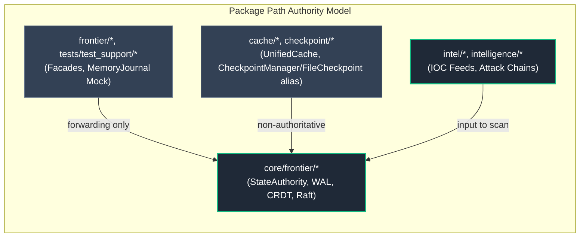

---

## F-006 — Leases, time & global budget

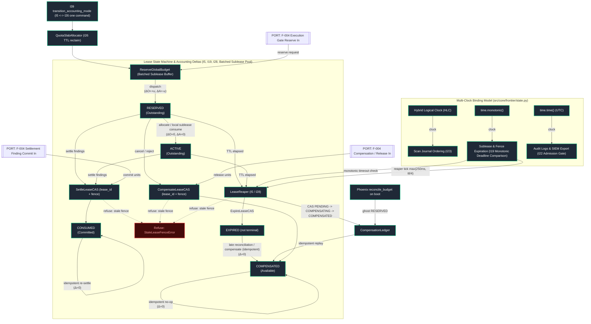

$$\text{Partition-Local Budget Conservation (I5): } \text{TotalBudget} \equiv \text{Consumed} + \text{Outstanding} + \text{Available} \quad \text{[Verified in Recovery VERIFY\_INVARIANTS]}$$
$$\text{Multi-Raft Cross-Partition Quota Slab Conservation (I26): } \text{TotalBudget} \equiv \text{Consumed} + \text{Outstanding} + \text{SlabReserved} + \text{Available} \quad (\text{SlabReserved} > 0 \text{ in Multi-Raft Mode}) \quad \text{[Verified in Recovery VERIFY\_INVARIANTS]}$$

---

## F-007 — Application state machines & lifecycle coupling

Source: `src/jobs/status.py`, `src/core/models/stage_status.py`, `src/core/contracts/finding_lifecycle.py`, `src/jobs/run_outcome.py`. Absorbed F-008, F-027. ReadinessFSM in F-004 is the scheduler-local view of the same `StageStatus` enum. Intra-stage retry lives in `retry.py` before a terminal write; the scheduler does not `FAILED` -> `RUNNING`. CAS still *permits* I33 `FAILED` -> `RUNNING`/`COMPLETED`/`DEGRADED` for a later attempt. MVR coerces non-`must_succeed` `FAILED` -> `DEGRADED`.

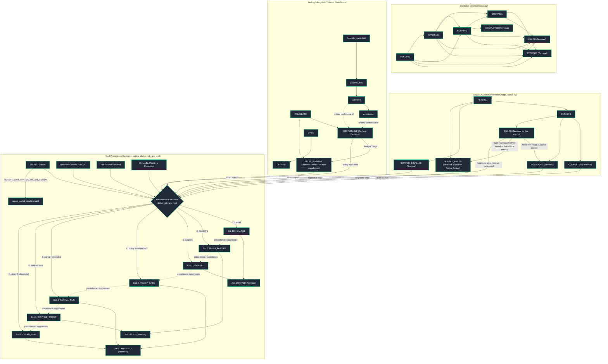

---

## F-009 — Resilience: breaker, QoS, PID & bulkhead

```mermaid
flowchart TD
    classDef impl fill:#1f2937,stroke:#10b981,stroke-width:2px,color:#fff;
    classDef singleNode fill:#1e293b,stroke:#0ea5e9,stroke-width:1px,stroke-dasharray:3 3,color:#fff;
    classDef library fill:#334155,stroke:#64748b,stroke-width:1px,color:#fff;
    classDef specOnly fill:#1e1b4b,stroke:#818cf8,stroke-width:1px,stroke-dasharray:4 4,color:#fff;
    classDef vacuous fill:#27272a,stroke:#71717a,stroke-width:1px,color:#a1a1aa;
    classDef forbidden fill:#450a0a,stroke:#ef4444,stroke-width:2px,color:#fca5a5;

    Load["Target Probe Latency & Error Stream"]:::impl --> PID["AdaptivePIDController (Anti-Windup Clamping + Back-Calculation)"]:::impl
    PID --> Conc["Dynamic Concurrency Window"]:::impl
    Load --> Bulk["BulkheadPool (Unified Endpoint Isolation (scheme,host,port))"]:::impl
    Load --> Bloom["GenerationalBloomFilter (Measured FPR Auto-Rotation at 0.005, Per-Scan Reset)"]:::impl
    Load --> RedisBreaker["RedisClient Circuit Breaker (Local SQLite/Disk Spool Fallback + Health Probe)"]:::impl
    Load --> CLOSED
    subgraph CB["Circuit Breaker (Unified Canonical Endpoint Gate)"]
        CLOSED["CLOSED (Normal Traffic)"]:::impl -->|"Failures >= Threshold (5 consecutive)"| OPEN["OPEN (Tripped / Shedding)"]:::impl
        OPEN -->|"Cooldown Elapsed (20s)"| HALF_OPEN["HALF_OPEN (Trial Generation N)"]:::impl
        HALF_OPEN -->|"Trial Probe OK"| CLOSED
        HALF_OPEN -->|"Trial Probe Failed"| OPEN
    end
    OPEN -->|"set_endpoint_reserve_gate"| NoTicket["HuntBudget Gate: BudgetReserveDenied (Per-Endpoint Breaker Open)"]:::forbidden
    Evt["TelemetryEvent Stream"]:::impl --> Q{"qos_admit"}:::impl
    Q -->|P0: Critical Audit| P0["P0: 50ms Timeout -> Emergency Ring Buffer"]:::impl
    P0 -->|"ring full or capacity 0"| P0BP["P0 backpressure return False (never silent overwrite)"]:::forbidden
    Q -->|P1: Stage Lifecycle| P1["P1: Reliable Queue Dispatch"]:::impl
    Q -->|P2: Findings Buffer| P2["P2: Coalesced Findings Stream"]:::impl
    Q -->|P3: Periodic Metrics| P3["P3: 1s Rolling Aggregates"]:::impl
    Q -->|P4: Debug Traces| P4["P4: Lowest Priority / First Shed"]:::impl
    Disk["disk/mem utilisation"]:::impl --> RG{"classify_pressure"}:::impl
    RG -->|"WARN >=85% disk"| P4
    RG -->|"PRESSURE >=92% disk"| P3
    RG -->|"CRITICAL >=95% disk"| Halt["Stop new stages; emit_partial_report; exit 4"]:::impl
```

### Telemetry QoS Shedding Decision Matrix (`qos_admit.py`)

| Resource Condition (State Volume / Data Path) | P0 (Critical Audit) | P1 (Stage Events) | P2 (Findings) | P3 (1s Aggregates) | P4 (Debug Traces) |
|---|---|---|---|---|---|
| **Normal (< 85% Disk, < 80% RAM)** | `Admit` (Durable) | `Admit` | `Admit` | `Admit` | `Admit` |
| **Moderate (>= 85% Disk / CPU > 90%)** | `Admit` (Durable) | `Admit` | `Admit` | `Admit` | **`DROP`** |
| **Severe (>= 92% Disk / RAM > 90%)** | `Admit` (Spool) | `Admit` | **`COALESCE`** | **`DROP`** | **`DROP`** |
| **Spool Saturated (> 1000 P0 items)** | `Admit to emergency ring; if ring full/disabled -> return False (no silent overwrite)` | `Drop` | `Drop` | `Drop` | `Drop` |

---

## F-018 — Failure decision tree, concurrency & I35 recovery

### Total Exit Code Precedence Table (`derive_job_and_exit`)

Strict Priority: $$\text{Cancel (130)} > \text{Infra/Fatal (3)} > \text{Suspend (7)} > \text{Policy Violation (2)} > \text{Partial/Degraded (4)} > \text{Error (1)} > \text{Clean (0)}$$

| Precedence | Observed Pipeline Condition | Exit Code | Terminal JobStatus | Failure Classification (I34) | Operator Action |
|---|---|---|---|---|---|
| **1 (Highest)** | SIGINT / User Cancellation | `130` | `STOPPED` | User Action | Write `report_partial.*`; DAG checkpoint left `CRASHED_IN_PROGRESS` unless clean exit |
| **2** | Fatal stage failure / `pipeline_no_output` / Target down | `3` | `FAILED` | `INFRA_FAILURE` | Inspect logs, network, target connectivity |
| **3** | Hot-reload configuration suspend | `7` | `STOPPED` | Policy / Configuration | Worker reloads configuration and resumes |
| **4** | Findings count / CVSS severity exceeds policy rules | `2` | `COMPLETED` | Policy Gate Triggered | Review findings; triage or remediate |
| **5** | Non-fatal / MVR-degraded / ResourceGuard CRITICAL | `4` | `COMPLETED` | `PARTIAL_RUN` | Review `report_partial.*` + spill JSONL |
| **6** | Unhandled exception / lock collision | `1` | `FAILED` | `RUNTIME_ERROR` | Inspect stack traces. (OOM/disk CRITICAL is now exit 4 via ResourceGuard, not this row.) |
| **7 (Lowest)** | All stages completed; findings within policy | `0` | `COMPLETED` | `CLEAN_RUN` | Standard clean pipeline exit |

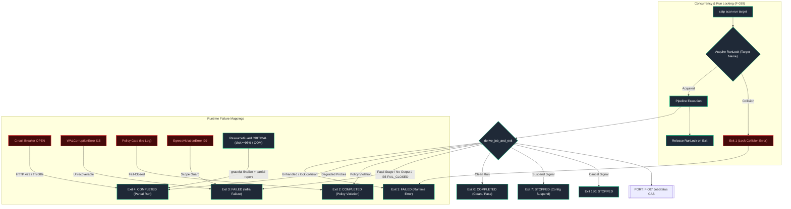

### I34 Formal Failure Recovery Semantics

> **Fail-Closed Principle:** Refuse to apply mutating transition; revert/reserve-compensate or abort with zero committed state change.

| Failure Domain | Retry | Rollback | Compensate | Fail-Closed | Authoritative Resolution |
|---|---|---|---|---|---|
| **WAL Corruption** | No | No | No | **Yes** | Restore LKG snapshot (`choose_lkg_snapshot` = max verified commitIndex, term); optional SURVIVAL_READONLY if AUTO_ENTER_SURVIVAL_ON_CORRUPT |
| **Authority Loss** | No | No | No | **Yes** | Await leader / quorum-1 restart. Optional `FRONTIER_ONLY` (default off) continues discovery without PartitionWAL settle. |
| **Replication Divergence** | No | No | No | **Yes** | Restore local FSM from leader PartitionWAL |
| **Event Delivery Failure** | **Yes** | No | No | No | Spill retained; DurableDLQ + `OutboxReplayAgent.tick` -> `replay_finding_dispatch` HMAC FINDING_CREATED on READY (I32) |
| **Budget Inconsistency** | No | No | **Yes** | **Yes** | Phoenix + CompensationLedger CAS; LeaseReaper on monotonic deadline |
| **FSM Invariant Violation** | No | No | No | **Yes** | Snapshot re-baseline plus sequential WAL replay |
| **Egress Policy Violation** | No | No | **Yes** | **Yes** | Terminate subprocess; compensate reserved requests (Security Violation → Exit 3) |
| **RunLock Collision** | No | No | No | **Yes** | Abort execution (Exit 1: Target under active scan) |

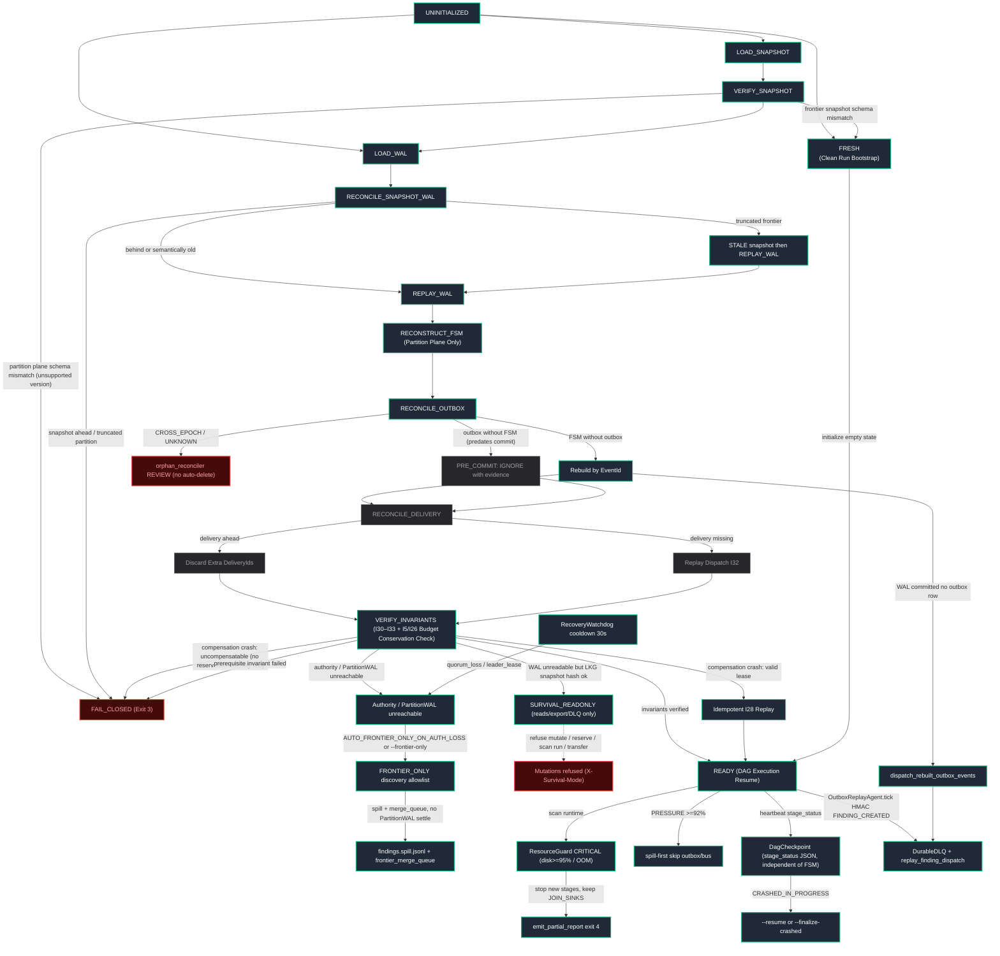

Phoenix reconciliation (`budget_phoenix.py`) runs before READY: ghost `RESERVED` rows with no matching settlement are compensated via `CompensationLedger` (PENDING->COMPENSATING->COMPENSATED CAS). `LeaseReaper` ticks on monotonic deadlines. `choose_lkg_snapshot` picks the verified snapshot with max (`commitIndex`, `term`). `recovery_report.json` is written when `RECOVERY_WRITE_REPORT=true` (default). Auto-enter survival requires `AUTO_ENTER_SURVIVAL_ON_CORRUPT=true`. `RecoveryWatchdog` proposes survival on WAL/quorum/disk faults (cooldown 30s). `orphan_reconciler` classifies outbox-without-FSM as PRE_COMMIT (ignore with evidence) vs CROSS_EPOCH/UNKNOWN (human review). Operator probes: `/_healthz`, `/_readyz`, `/_survivalz` (`src/api/health.py`). Boot: `enforcement_check.verify()` fail-closed if an I1-I39 hook is missing. MVR (`PIPELINE_CONTINUE_ON_NON_CRITICAL=true`) coerces non-`must_succeed` stage failures to `DEGRADED` so join sinks still emit; `FRONTIER_ONLY` keeps discovery running without PartitionWAL settle (spill + merge queue); `DagCheckpoint` records `CRASHED_IN_PROGRESS` independently of the FSM and round-trips `graph_gen_id`; ResourceGuard CRITICAL stops new stages, keeps JOIN_SINKS, writes `report_partial.*`, exit 4. `OutboxReplayAgent.tick()` in `RecoveryManager._finish` calls `replay_finding_dispatch` (HMAC FINDING_CREATED; EventBus still refuse-and-drops without receipt). WAL-committed-no-outbox reconstruct uses `dispatch_rebuilt_outbox_events`. Auto-finalize of crashed runs emits `report_partial` from `src/pipeline/mvr.py` (core stays free of `src.reporting`). Scheduler / lock / attach-fail / I35 FAIL_CLOSED exits use `EXIT_*` constants from `derive_job_and_exit`. Resume remaining-stage seed is the runtime Graph (plugin nodes omitted by import-time `STAGE_ORDER` still resume). Consumed I30 ticket ids persist on `DagCheckpoint` and are replayed via `ExecutionAuthorizer.remember_consumed` on attach. Production/staging refuse to attach without `AUTHORITY_SIGNING_KEY` or `APP_SECRET_KEY` (`PersistentSigningKeyRequired`).

---

## F-019 — Operator surface, multi-tenancy & telemetry

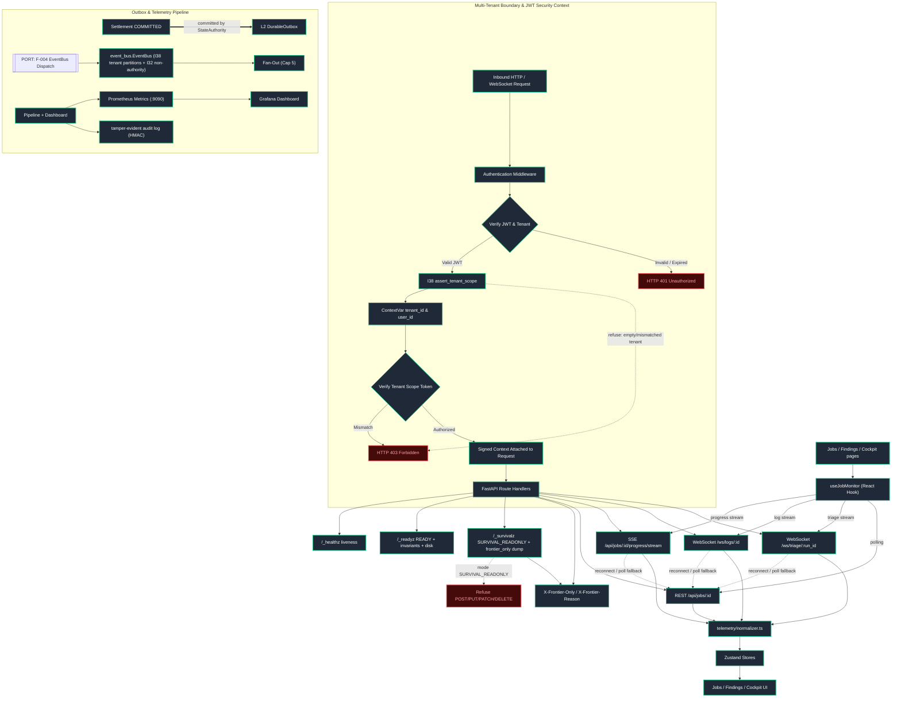

---

## F-020 — Tests, CI shards & quality policy gates

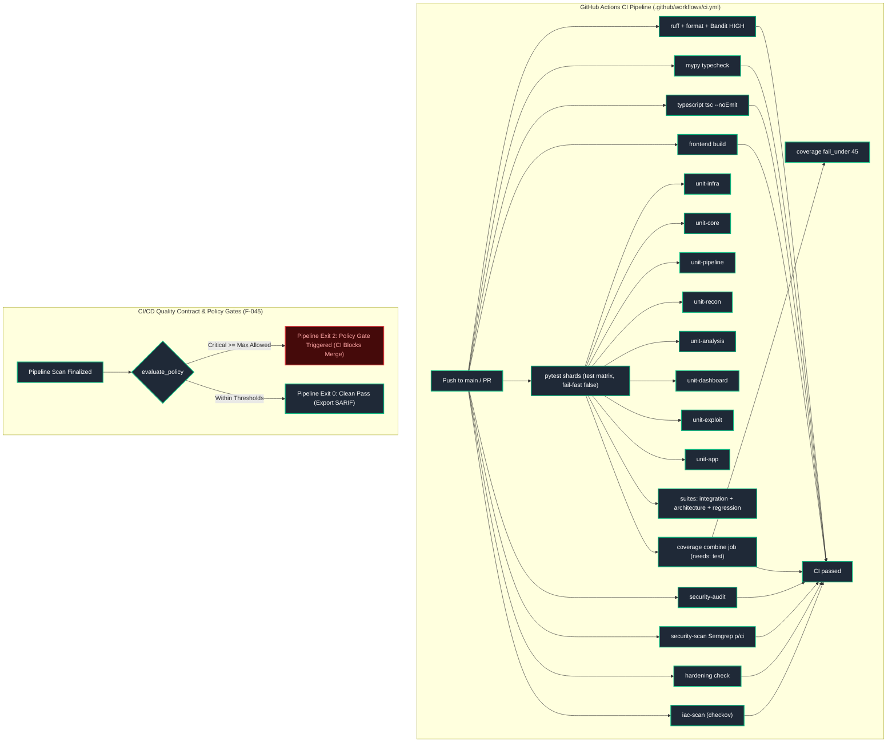

---

## F-022 — Gap-analysis status

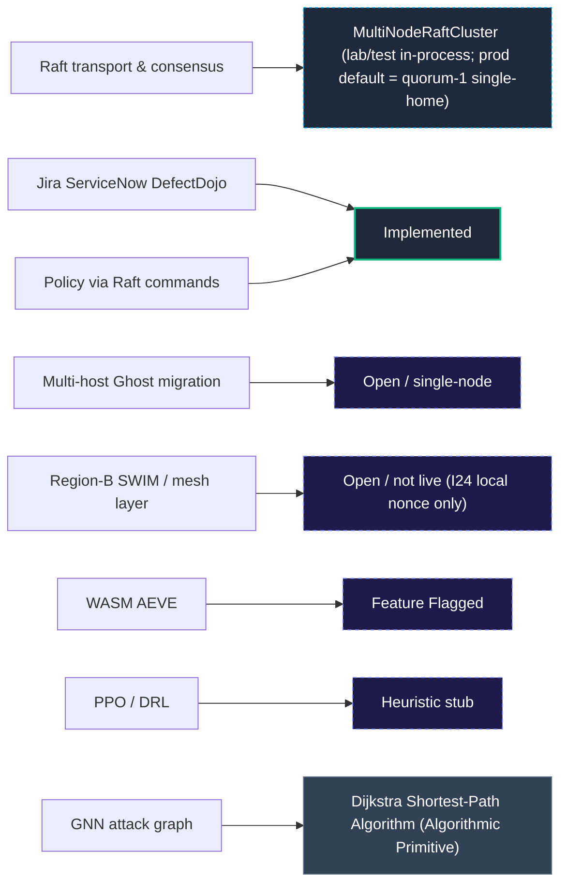

---

## F-025 — Non-authoritative planes, caches & multi-tier storage

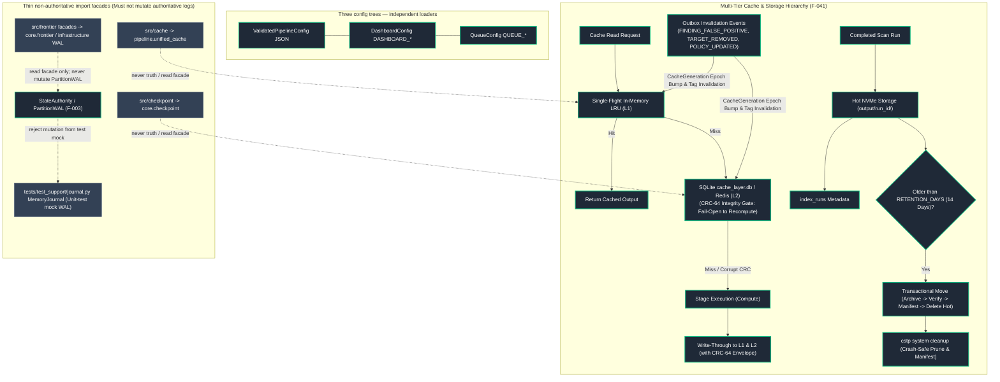

---

## F-033 — Global invariants I1–I39 enforcement & dependency graph

### Formal Invariant Dependency & Enforcement Semantics

An edge $I_A \longrightarrow I_B$ establishes that invariant $I_A$ is an **architectural / enforcement prerequisite** for $I_B$. The formal guarantees and cryptographic verifications of $I_B$ cannot be soundly admitted or enforced unless $I_A$ is satisfied.

### Formal System Invariant Registry (I1–I39)

| Invariant | Formal Statement | Owning Chart | Enforcing Module | Primary Test Suite | Verification Level |
|---|---|---|---|---|---|
| **I1** | Hash-Chain Continuity ($H_n = \text{SHA256}(H_{n-1} \mathbin{\Vert} \text{CanonicalEncode}(E_n))$) | F-003 | `replicated_log.py` | `tests/unit/core/test_global_invariants.py` | `PROPERTY-TESTED` |
| **I2** | Log Monotonicity (Index $K_n > K_{n-1}$, Term $T_n \ge T_{n-1}$) | F-003 | `replicated_log.py` | `tests/unit/core/test_global_invariants.py` | `PROPERTY-TESTED` |
| **I3** | Committed-State Confinement (Transitions on quorum-committed entries only) | F-003 | `replicated_log.py`, `raft_cluster.py` | `tests/unit/core/test_raft_cluster.py`, `tests/unit/core/test_global_invariants.py` | `MODEL-CHECKED` (multi-node quorum) |
| **I4** | Aggregate Monotonicity ($\text{version}' = \text{version} + 1$ on `SUCCESS`) | F-003 | `raft_fsm.py` | `tests/unit/core/test_global_invariants.py` | `TESTED` |
| **I5** | Global Budget Conservation ($\text{TotalBudget} \equiv \text{Consumed} + \text{Outstanding} + \text{Available}$) | F-006 | `global_coordination.py`, `hunt_budget.py` | `tests/unit/core/test_global_budget_conservation.py` | `PROPERTY-TESTED` |
| **I6** | Scoped Idempotency ($\forall \text{ valid } \text{cmd\_id}: \text{Count}(\text{Mutations}) \le 1$) | F-003 | `raft_fsm.py` | `tests/unit/core/test_global_invariants.py` | `PROPERTY-TESTED` |
| **I7** | Singular Partition Ownership (Target aggregate belongs to exactly 1 partition) | F-002 | `global_coordination.py` | `tests/unit/core/test_global_invariants.py` | `MODEL-CHECKED` |
| **I8** | Projection Watermark Bound ($\text{ProjectionOffset}(P_x) \le \text{commitIndex}(P_x)$) | F-003 | `projection_stream.py` | `tests/unit/core/test_global_invariants.py` | `PRODUCTION-OBSERVED` |
| **I9** | FSM Pure Determinism (`FSM.Apply` zero external I/O, RNG, or clock reads) | F-003 | `raft_fsm.py` | `tests/unit/core/test_global_invariants.py` | `PROPERTY-TESTED` |
| **I10** | Worker Epoch Fencing ($\text{claim.epoch} < \text{active.epoch} \implies \text{REJECT}$) | F-003 | `raft_fsm.py` | `tests/unit/core/test_lease_status.py` | `FAULT-INJECTED` |
| **I11** | Cryptographic State Commitment ($\text{State}_A \equiv \text{State}_B \iff \text{StateHash}_A == \text{StateHash}_B$) | F-003 | `raft_fsm.py` | `tests/unit/core/test_authoritative_durability_suite.py` | `PROPERTY-TESTED` |
| **I12** | Snapshot Integrity (Certified snapshot payload hash == header hash) | F-003 | `raft_fsm.py`, `recovery/manager.py` | `tests/unit/core/test_recovery_protocol.py` | `FAULT-INJECTED` |
| **I13** | Receipt Cryptographic Binding (Leader receipt HMAC validates state hash) | F-003 | `receipt_crypto.py` | `tests/unit/core/test_key_rotation.py` | `TESTED` |
| **I14** | Deduplicated Outbox Stream (Domain events deduplicated by `event_id`) | F-003 | `outbox.py` | `tests/unit/core/test_eventbus_guarantees.py` | `FAULT-INJECTED` |
| **I15** | Fail-Closed Boundary (Corrupt records or unverified leases abort with 0 mutations) | F-003 | `wal.py`, `failure_model.py` | `tests/unit/core/test_failure_model.py` | `FAULT-INJECTED` |
| **I16** | Replay State Invariance ($\text{Replay}(\text{WAL}[0 \dots N]) \equiv \text{State}_N$) | F-018 | `replay_engine.py` | `tests/unit/core/test_recovery_protocol.py` | `PROPERTY-TESTED` |
| **I17** | Authority Uniqueness (No non-authoritative subsystem mutates state) | F-002 | `region_model.py` | `tests/unit/core/test_region_model.py` | `MODEL-CHECKED` |
| **I18** | Stale Command Rejection (Outdated lease epoch / stale placement version rejected) | F-003 | `replicated_log.py` | `tests/unit/core/test_global_invariants.py` | `ADVERSARIAL` |
| **I19** | Lease Terminal Linearization (`RESERVED` -> `CONSUMED` or `COMPENSATED`; `EXPIRED` non-terminal) | F-006 | `lease_status.py` | `tests/unit/core/test_lease_status.py` | `MODEL-CHECKED` |
| **I20** | Policy Version Fencing ($\text{expected\_policy\_version} == \text{current\_policy\_version}$) | F-003 | `raft_fsm.py`, `policy_governance.py` | `tests/unit/core/test_lease_status.py` | `FAULT-INJECTED` |
| **I21** | Projection Recovery Invariance (Sequential outbox replay recovers projection) | F-003 | `outbox.py`, `projection_stream.py` | `tests/unit/infrastructure/test_cache_invalidation_protocol.py` | `FAULT-INJECTED` |
| **I22** | Temporal Invariant & Admission Skew Gate (+10s future drift, -5s backward regression at admission) | F-003 | `replicated_log.py` | `tests/unit/core/test_global_invariants.py` | `PROPERTY-TESTED` |
| **I23** | Partition Budget Isolation (Subleases isolated per partition, negative balances rejected) | F-006 | `raft_fsm.py`, `state.py` | `tests/unit/core/test_adaptive_tombstones.py` | `PROPERTY-TESTED` |
| **I24** | Persisted Mesh BootID + Monotonic Nonce Safety | F-002 | `mesh/` | `tests/unit/infrastructure/test_cross_region_consensus.py` | `FAULT-INJECTED` |
| **I25** | Partition Policy Rollback Revocation & Watermark Upper Bound | F-003 | `raft_fsm.py` | `tests/unit/core/test_global_invariants.py` | `TESTED` |
| **I26** | Multi-Raft Quota Slab Conservation ($\text{Total} \equiv \text{Consumed} + \text{Outstanding} + \text{SlabReserved} + \text{Available}$) | F-006 | `global_coordination.py`, `quota_slab.py` | `tests/unit/core/test_recovery_budget_conservation.py`, `tests/unit/core/test_survival_path.py` | `PROPERTY-TESTED` |
| **I27** | Bounded Execution Claims (64KB) & CAS Merkle Evidence | F-004 | `execution_request.py`, `CASStore` | `tests/unit/sandbox/test_i29_egress_context.py` | `PROPERTY-TESTED` |
| **I28** | Hardened Lease State Transitions (`RESERVED` -> `ACTIVE` -> `CONSUMED` / `EXPIRED` / `COMPENSATED`) | F-006 | `lease_status.py`, `hunt_budget.py`, `state_authority.py`, `compensation_log.py`, `lease_reaper.py` | `tests/unit/core/test_global_invariants.py`, `tests/unit/core/test_survival_path.py` | `MODEL-CHECKED` |
| **I29** | Scope-Derived Network Egress Enforcement (Egress strictly from `ScopeToken`; metadata denied) | F-004 | `process_sandbox.py`, `egress_context.py`, `shared_sessions.py`, `runtime_browser.py`, `stage_admit.py` | `tests/unit/sandbox/test_i29_egress_context.py`, `tests/unit/sandbox/test_process_sandbox.py` | `ADVERSARIAL` (universal network boundary) |
| **I30** | Cryptographic Quartet Ticket Binding (Binds ScopeToken, BudgetReservation, Revision, CommandId) | F-004 | `src/decision/authorization.py`, `stage_admit.py`, `safe_exploiter.py` | `tests/unit/core/test_global_invariants.py` | `MODEL-CHECKED` |
| **I31** | Settlement-Gated `FINDING_CREATED` Emission (Finding requires durably committed SettlementIntent; WAL append is independent of outbox) | F-004 | `state_authority.py`, `event_delivery.py` | `tests/unit/core/test_global_invariants.py` | `MODEL-CHECKED` |
| **I32** | Non-Authoritative EventBus Outbox Decoupling (EventBus delivery failure does not uncommit) | F-004 | `event_bus.py`, `outbox/dlq.py`, `outbox/replay_agent.py` | `tests/unit/core/test_eventbus_guarantees.py`, `tests/unit/core/test_survival_path.py` | `FAULT-INJECTED` |
| **I33** | Causal Identity Chain ($\text{CommandId} \rightarrow \dots \rightarrow \text{DeliveryId}$) | F-004 | `causal_identity.py` | `tests/unit/core/test_causal_identity.py` | `PROPERTY-TESTED` |
| **I34** | Formal Failure Recovery Boundaries (8 failure classes with declared recovery action) | F-018 | `failure_model.py` | `tests/unit/core/test_failure_model.py` | `FAULT-INJECTED` |
| **I35** | Dual-Plane Deterministic Recovery State Machine | F-018 | `recovery_protocol.py`, `recovery/manager.py`, `recovery/survival.py`, `recovery/orphan_reconciler.py` | `tests/unit/core/test_recovery_protocol.py`, `tests/unit/core/test_survival_path.py` | `MODEL-CHECKED` |
| **I36** | Single-Writer Regions & Journal-Only Relay | F-002 | `region_model.py`, `replication.py` | `tests/unit/core/test_region_model.py`, `tests/unit/infrastructure/test_wal_replication.py` | `MODEL-CHECKED` |
| **I37** | Zero Dual-Writer Fenced Authority Transfer (activate refuses unless replica_applied >= fence_commit_index) | F-002 | `authority_transfer.py`, `global_coordination.py`, `migration_handler.py` | `tests/unit/core/test_authority_transfer.py` | `MODEL-CHECKED` + `ADVERSARIAL` |
| **I38** | Tenant Isolation Enforcement (actor tenant must equal resource tenant; empty tenant fail-closed) | F-019 | `tenant_isolation.py` | `tests/unit/core/test_tenant_isolation.py` | `ADVERSARIAL` |
| **I39** | Budget Accounting Mode Transition Atomicity (I5 <-> I26 under one WAL command; no window where neither formula holds) | F-006 | `quota_slab.py` | `tests/unit/core/test_budget_mode_transition.py` | `PROPERTY-TESTED` |

```mermaid
flowchart TD
    classDef impl fill:#1f2937,stroke:#10b981,stroke-width:2px,color:#fff;
    classDef singleNode fill:#1e293b,stroke:#0ea5e9,stroke-width:1px,stroke-dasharray:3 3,color:#fff;
    classDef library fill:#334155,stroke:#64748b,stroke-width:1px,color:#fff;
    classDef specOnly fill:#1e1b4b,stroke:#818cf8,stroke-width:1px,stroke-dasharray:4 4,color:#fff;
    classDef vacuous fill:#27272a,stroke:#71717a,stroke-width:1px,color:#a1a1aa;
    classDef forbidden fill:#450a0a,stroke:#ef4444,stroke-width:2px,color:#fca5a5;

    subgraph I30_Causality["I30 PORT F-004 Authorization Ticket"]
        PORT_F004_AUTHORIZATION_TICKET[["PORT: F-004 AuthorizedExecutionTicket I30 quartet"]]
    end
    
    subgraph I33_Identity["I33 PORT F-004 Causal Chain"]
        PORT_F004_CAUSAL_CHAIN[["PORT: F-004 CommandId -> ExecutionId -> AttemptId -> SettlementId -> WalId -> EventId -> DeliveryId"]]
    end
    
    subgraph I31_Settlement["I31 PORT F-004 SettlementPipeline"]
        PORT_F004_SETTLE[["PORT: F-004 SettlementPipeline - WAL append from StageOutput; outbox is notification only"]]
    end

    PORT_F004_AUTHORIZATION_TICKET --> I30g
    PORT_F004_CAUSAL_CHAIN --> I33g
    PORT_F004_SETTLE --> I31g
    
    subgraph ProofGraph["Unified Formal Invariant Proof & Causality Graph (I1–I39)"]
        I1g["I1: Hash-Chain Continuity<br/><small>replicated_log.py [PROPERTY-TESTED]</small>"]:::impl --> I2g["I2: Log Monotonicity<br/><small>replicated_log.py [PROPERTY-TESTED]</small>"]:::impl
        I2g --> I3g["I3: Committed-State Confinement<br/><small>raft_cluster.py [MODEL-CHECKED]</small>"]:::impl
        I3g --> I7g["I7: Singular Partition Ownership<br/><small>global_coordination.py [MODEL-CHECKED]</small>"]:::impl
        I7g --> I17g["I17: Authority Uniqueness<br/><small>region_model.py [MODEL-CHECKED]</small>"]:::impl
        I17g --> I36g["I36: Single-Writer Region Relay<br/><small>region_model.py [MODEL-CHECKED]</small>"]:::impl
        I36g --> I37g["I37: Zero Dual-Writer Transfer Fence<br/><small>authority_transfer.py [MODEL-CHECKED + ADVERSARIAL]</small>"]:::impl
        I2g --> I4g["I4: Aggregate Monotonicity<br/><small>raft_fsm.py [TESTED]</small>"]:::impl
        I18g["I18: Stale Command Rejection<br/><small>replicated_log.py [ADVERSARIAL]</small>"]:::impl --> I36g

        I22g["I22: Clock Skew Admission Gate<br/><small>replicated_log.py [PROPERTY-TESTED]</small>"]:::impl --> I4g
        I4g --> I11g["I11: Cryptographic State Commitment<br/><small>raft_fsm.py [PROPERTY-TESTED]</small>"]:::impl
        I11g --> I12g["I12: Snapshot Integrity<br/><small>raft_fsm.py [FAULT-INJECTED]</small>"]:::impl
        I12g --> I15g["I15: Fail-Closed Corruption Boundary<br/><small>wal.py [FAULT-INJECTED]</small>"]:::impl
        I15g --> I9g["I9: Pure FSM Determinism<br/><small>raft_fsm.py [PROPERTY-TESTED]</small>"]:::impl
        I9g --> I10g["I10: Worker Epoch Fencing<br/><small>raft_fsm.py [FAULT-INJECTED]</small>"]:::impl
        I9g --> I13g["I13: Receipt HMAC Binding<br/><small>receipt_crypto.py [TESTED]</small>"]:::impl
        I9g --> I14g["I14: Deduplicated Outbox Stream<br/><small>outbox.py [FAULT-INJECTED]</small>"]:::impl
        I9g --> I16g["I16: Replay State Invariance<br/><small>replay_engine.py [PROPERTY-TESTED]</small>"]:::impl
        I14g --> I8g["I8: Projection Watermark Bound<br/><small>projection_stream.py [PRODUCTION-OBSERVED]</small>"]:::impl

        I26g["I26: Quota Slab Conservation<br/><small>global_coordination.py [PROPERTY-TESTED]</small>"]:::impl --> I5g["I5: Universal Budget Conservation<br/><small>global_coordination.py [PROPERTY-TESTED]</small>"]:::impl
        I26g --> I39g["I39: Budget Mode Transition Atomicity<br/><small>quota_slab.py [PROPERTY-TESTED]</small>"]:::impl
        I5g --> I39g
        I5g --> I6g["I6: Scoped Idempotency<br/><small>raft_fsm.py [PROPERTY-TESTED]</small>"]:::impl
        I6g --> I19g["I19: Lease Terminal Linearization<br/><small>lease_status.py [MODEL-CHECKED]</small>"]:::impl
        I19g --> I20g["I20: Policy Version Fencing<br/><small>policy_governance.py (learning/frontier re-export) [FAULT-INJECTED]</small>"]:::impl
        I19g --> I21g["I21: Projection Recovery Invariance<br/><small>outbox.py [FAULT-INJECTED]</small>"]:::impl
        I19g --> I28g["I28: Hardened Lease Transitions<br/><small>hunt_budget.py [MODEL-CHECKED]</small>"]:::impl

        I23g["I23: Partition Budget Isolation<br/><small>state.py [PROPERTY-TESTED]</small>"]:::impl --> I25g["I25: Policy Revocation Watermark<br/><small>raft_fsm.py [TESTED]</small>"]:::impl
        I25g --> I24g["I24: Mesh BootID Nonce Safety<br/><small>mesh/ [FAULT-INJECTED]</small>"]:::impl
        I27g["I27: Bounded Claims & CAS Merkle Evidence<br/><small>execution_request.py [PROPERTY-TESTED]</small>"]:::impl --> I29g["I29: Universal Network Egress Authority<br/><small>egress_context.py [ADVERSARIAL]</small>"]:::impl
        I29g --> I30g["I30: Authorization Causality Quartet<br/><small>authorization.py [MODEL-CHECKED]</small>"]:::impl
        I22g --> I30g
        I30g --> I33g["I33: Causal Identity Chain<br/><small>causal_identity.py [PROPERTY-TESTED]</small>"]:::impl
        I38g["I38: Tenant Isolation<br/><small>tenant_isolation.py [ADVERSARIAL]</small>"]:::impl --> I30g
        I38g --> I31g

        I30g & I28g & I33g --> I31g["I31: Settlement-Gated Finding Emission<br/><small>state_authority.py / event_delivery.py [MODEL-CHECKED]</small>"]:::impl
        I31g --> I32g["I32: Outbox Decoupling Non-Authority<br/><small>event_bus.py [FAULT-INJECTED]</small>"]:::impl
        I28g & I32g --> I34g["I34: Failure Recovery Boundaries<br/><small>failure_model.py [FAULT-INJECTED]</small>"]:::impl
        I34g & I16g --> I35g["I35: Dual-Plane Recovery Protocol<br/><small>recovery_protocol.py [MODEL-CHECKED]</small>"]:::impl
        I37g --> I35g
    end
```

---

## Retired Chart Registry

In accordance with §0 (Maintenance Contract), retired IDs are preserved as stable pointers below:

| Retired ID | Original Scope | Survivor Section |
|---|---|---|
| `F-005` | Live Scan Stage Path | → [F-004](#f-004--live-scan-path-execution-dag--egress-sandbox) |
| `F-008` | Finding Lifecycle States | → [F-007](#f-007--application-state-machines--lifecycle-coupling) |
| `F-010` | Tool Execution Subprocess | → [F-004](#f-004--live-scan-path-execution-dag--egress-sandbox) |
| `F-011` | Budget State Machine | → [F-006](#f-006--leases-time--global-budget) |
| `F-012` | Network Raft Transport | → [F-003](#f-003--authority-plane-raft-l0l5--security-keys) |
| `F-013` | Checkpoint & FSM Rebuild | → [F-004](#f-004--live-scan-path-execution-dag--egress-sandbox) |
| `F-014` | Zero I/O FSM Determinism | → [F-003](#f-003--authority-plane-raft-l0l5--security-keys) |
| `F-015` | Process Sandbox Enforcement | → [F-004](#f-004--live-scan-path-execution-dag--egress-sandbox) |
| `F-016` | Durable Outbox Delivery | → [F-003](#f-003--authority-plane-raft-l0l5--security-keys) |
| `F-017` | Event Delivery Semantics | → [F-004](#f-004--live-scan-path-execution-dag--egress-sandbox) |
| `F-021` | Multi-Region Gossip Protocol | → [F-002](#f-002--system-topology-regions--deployment) |
| `F-023` | Frontend WebSocket Feeds | → [F-019](#f-019--operator-surface-multi-tenancy--telemetry) |
| `F-024` | Circuit Breaker Shedding | → [F-009](#f-009--resilience-breaker-qos-pid--bulkhead) |
| `F-026` | Telemetry Event Normalizer | → [F-019](#f-019--operator-surface-multi-tenancy--telemetry) |
| `F-027` | Job Status CAS Machine | → [F-007](#f-007--application-state-machines--lifecycle-coupling) |
| `F-028` | Multi-Tier Cache Layer | → [F-025](#f-025--non-authoritative-planes-caches--multi-tier-storage) |
| `F-029` | Recon Validation Stage | → [F-004](#f-004--live-scan-path-execution-dag--egress-sandbox) |
| `F-030` | Priority QoS Admission | → [F-009](#f-009--resilience-breaker-qos-pid--bulkhead) |
| `F-031` | Telemetry Dispatch Normalizer | → [F-019](#f-019--operator-surface-multi-tenancy--telemetry) |
| `F-032` | Storage Tiering & Archival | → [F-025](#f-025--non-authoritative-planes-caches--multi-tier-storage) |
| `F-034` | Plane Boundary & Ownership | → [F-003](#f-003--authority-plane-raft-l0l5--security-keys) |
| `F-035` | Plugin Load & Runtime DAG | → [F-004](#f-004--live-scan-path-execution-dag--egress-sandbox) |
| `F-036` | Scope & Continuous Egress | → [F-004](#f-004--live-scan-path-execution-dag--egress-sandbox) |
| `F-037` | Cryptographic Key Hierarchy | → [F-003](#f-003--authority-plane-raft-l0l5--security-keys) |
| `F-038` | Monotonic Clocks & Leases | → [F-006](#f-006--leases-time--global-budget) |
| `F-039` | Concurrency & Run Locking | → [F-018](#f-018--failure-decision-tree-concurrency--i35-recovery) |
| `F-040` | Deployment Topology Model | → [F-002](#f-002--system-topology-regions--deployment) |
| `F-041` | Persistence Tiering & Retention | → [F-025](#f-025--non-authoritative-planes-caches--multi-tier-storage) |
| `F-042` | Finding Deduplication CRDT | → [F-004](#f-004--live-scan-path-execution-dag--egress-sandbox) |
| `F-043` | Multi-Tenant Partitioning | → [F-019](#f-019--operator-surface-multi-tenancy--telemetry) |
| `F-044` | Schema Upcasting Evolution | → [F-003](#f-003--authority-plane-raft-l0l5--security-keys) |
| `F-045` | CI/CD Quality Policy Gates | → [F-020](#f-020--tests-ci-shards--quality-policy-gates) |

---

## System Tunables & Environment Configuration

| Variable | Default Value | Owning Subsystem | Description |
|---|---|---|---|
| `DASHBOARD_HOST` | `127.0.0.1` | FastAPI Dashboard | Binding network interface for REST API |
| `DASHBOARD_PORT` | `8000` | FastAPI Dashboard | Listening HTTP port |
| `DASHBOARD_WORKERS` | `1` | FastAPI Dashboard | Uvicorn worker process count |
| `MESH_LEADER_ELECTION_TIMEOUT_SEC` | `10.0` | Mesh Consensus | Raft-lite Redis lease consensus timeout |
| `MESH_PEER_RATE_LIMIT_PPS` | `200` | Mesh Gossip | Maximum gossip packets per second per peer |
| `OBSERVABILITY_METRICS_PORT` | `9090` | Observability | Prometheus metrics scraping port |
| `PROMETHEUS_HOST` / `OBSERVABILITY_METRICS_HOST` | `127.0.0.1` | Observability | Prometheus bind address (alias pair) |
| `PROMETHEUS_REQUIRE_MTLS` / `OBSERVABILITY_METRICS_MTLS` | `false` | Observability | Require mTLS for Prometheus scrapes (alias pair) |
| `WAL_GROUP_COMMIT_BATCH_SIZE` | `64` | Partition WAL | Group commit entry batch size before fsync |
| `WAL_GROUP_COMMIT_WINDOW_MS` | `1.0` | Partition WAL | Group commit maximum window duration in ms |
| `OTEL_EXPORTER_OTLP_ENDPOINT` | `http://localhost:4317` | Observability | OpenTelemetry OTLP collector gRPC endpoint |
| `AUTHORITY_SIGNING_KEY_ID` | `authority-hmac-v1` | Frontier Crypto | Key identifier for HMAC receipt verification |
| `AUTO_ENTER_SURVIVAL_ON_CORRUPT` | `false` | Recovery | Auto-enter `SURVIVAL_READONLY` when WAL is unreadable but LKG snapshot verifies |
| `REQUIRE_KERNEL_SANDBOX` | `true` in prod/staging (else `false`) | Sandbox | Force KERNEL_ENFORCED; userspace hooks alone are not a native-tool boundary |
| `EGRESS_STRICT_CONTEXT` | `true` | Egress | Fail-closed intent; never silent allow-all |
| `EGRESS_RESOLVE_CHECK` | `true` in prod/staging | Egress | DNS A/AAAA validation of every hop (SSRF/rebind hardening) |
| `ALLOW_FRESH_ON_DURABLE_MISMATCH` | `false` | Recovery | Opt-in only; refuse silent FRESH when durable state exists |
| `RECOVERY_WRITE_REPORT` | `true` | Recovery | Write `recovery_report.json` before READY |
| `BUDGET_PHOENIX_ON_BOOT` | `true` | Recovery | Reconcile Outstanding/Consumed/Compensated from durable history |
| `ARCHIVE_VERIFY_THEN_DELETE` | `true` | Storage | Hard-enforce archive verify before deleting hot runs |
| `OUTBOX_DLQ_ENABLED` | `true` | Outbox | Enable poison-pill DLQ move after retry exhaustion; durable JSONL + replay agent |
| `MVR_ENABLED` | `true` | Pipeline | Degrade non-critical failures; emit partial reports; keep join sinks running |
| `PIPELINE_CONTINUE_ON_NON_CRITICAL` | `true` | Scheduler | Coerce non-must_succeed FAILED -> DEGRADED and continue the DAG |
| `REPORT_EMIT_PARTIAL_ON_SHUTDOWN` | `true` | Reporting | Write `output/<run_id>/partial/report_partial.{json,html,sarif}` on SIGINT/OOM |
| `AUTO_FRONTIER_ONLY_ON_AUTH_LOSS` | `false` | Recovery | Auto-enter FRONTIER_ONLY discovery mode when authority is unreachable |
| `FINDINGS_SPILL_ENABLED` | `true` | Findings | Append-only JSONL spill before settlement |
| `DAG_CHECKPOINT_ENABLED` | `true` | Checkpoint | Persist DAG stage_status independently of PartitionFSM |
| `PIPELINE_STRICT_CRITICAL` | `false` | Scheduler | Treat every `critical=True` node as must-succeed (restores fail-fast abort) |
| `FRONTIER_ONLY_ALLOWLIST` | `subdomains,live_hosts,urls,recon_validation,git_diff_crawl,parameters` | Recovery | Stages permitted while FRONTIER_ONLY is active |
| `FINDINGS_SPILL_FSYNC_EVERY` | `50` | Findings | fsync spill JSONL every N lines |
| `DAG_CHECKPOINT_HEARTBEAT_S` | `15` | Checkpoint | Heartbeat interval hint for DAG checkpoint writes |
| `AUTO_FINALIZE_CRASHED_ON_STARTUP` | `false` | Checkpoint | Auto-finalize CRASHED_IN_PROGRESS runs on boot (opt-in) |
| `DISK_PRESSURE_PCT` | `92` | ResourceGuard | PRESSURE threshold (disk utilisation %) |
| `DISK_CRITICAL_PCT` | `95` | ResourceGuard | CRITICAL threshold: stop new stages, partial report, exit 4 |
| `MEM_PRESSURE_PCT` | `85` | ResourceGuard | Memory PRESSURE threshold |
| `GRAPHGEN_STRICT` | `true` | Graph | Fail-closed when stored declared GraphGenID differs |
| `CAPABILITY_FINGERPRINT_STRICT` | follows GRAPHGEN_STRICT | Graph | Fail-closed when stored post-prune/post-join/post-CycleCheck capability fingerprint differs |
| `TICKET_CONSUME_STORE` | `$CSTP_DATA_DIR/consumed_tickets.jsonl` or `./.cstp/consumed_tickets.jsonl` | I30 | Durable consume ledger (process-local floor); DagCheckpoint mirrors ids; PartitionWAL ConsumeExecutionTicket is the multi-host target |
| `SPILL_FIRST` | `false` | Findings | Force spill-only I/O even without ResourceGuard PRESSURE |
| `RUN_DEAD_AFTER_S` | `120` | Checkpoint | Heartbeat age after which a RUNNING DAG checkpoint is worker-dead |
| `PIPELINE_MAX_DURATION_SECONDS` | (config / unset) | Scheduler | Global deadline; remaining non-sinks skip with `global_deadline_exceeded` |


## Architecture Review Residuals (2026-08-30)

P0 items addressed in code+atlas this cycle are marked **closed**. Remaining items stay open with owners.

| # | Status | Summary |
|---|---|---|
| P0-1 PartitionWAL continuous replication A→B | **stub+refuse** | `PartitionWALReplicator` stub raises; activate_ownership must not unlock on journal relay alone. |
| P0-2 Settlement dual-write | **closed (intent)** | `SettlementIntent` carries `budget_action` + `outbox_intent` on one WAL append; bus remains async/idempotent. |
| P0-3 Kernel sandbox vs universal egress | **closed (prod default)** | `REQUIRE_KERNEL_SANDBOX` defaults true on prod/staging; degraded userspace is explicit non-prod. |
| P0-4 Ticket consume durability | **closed (local floor)** | Default durable JSONL under `CSTP_DATA_DIR`/`.cstp`; multi-host still needs PartitionWAL consume command. |
| P0-5 Monotonic lease after reboot | **closed (conservative)** | `ReapableLease.boot_id` + cross-boot expire; persist wall/ttl fields for reconstruction. |
| P0-6 CRDT tombstone GC causal stability | **closed (watermark)** | TTL + `stable_gc_hlc` domination required before purge (`advance_stable_gc_watermark`). |
| P0-7 Redis→SQLite shared-queue fiction | **closed (doc+code note)** | Fallback emulator documents local-outbox-only; not a multi-host bus. |
| P0-8 SKIPPED_DISABLED satisfies hard needs | **closed** | Hard `needs` no longer met by SKIPPED_DISABLED; use `optional_needs`. |
| P0-9 Silent FRESH on schema mismatch | **closed (policy)** | Messaging + `ALLOW_FRESH_ON_DURABLE_MISMATCH` refuse silent discard. |
| P0-10 Raft single vs multi-node honesty | **closed (matrix)** | `raft_capabilities.py` matrix; prod default quorum-1; MultiNodeRaftCluster lab/test. |
| P0-11 SWIM grants authority | **closed (rule)** | MeshAuthority = evidence-only; never grants partition authority. |
| P0-12 Snapshot select unbound manifest | **closed (helper)** | `snapshot_manifest.select_snapshot` requires wal_id+digest (+ optional HMAC). |
| Atlas ports / unicode / taxonomy | **partial** | NOTIFY_IN evidence edge; FrontFacade read edge; full taxonomy rename deferred. |

