# Flowchart Atlas

Visual graphs for every living document under `docs/`. Charts are the map; the linked markdown files remain the specification.

---

## 0. Maintenance Contract — HARD RULE

> **Complete rewrite of this file is forbidden.**
>
> This atlas is an append-only-by-default living document.
>
> | Action | Allowed? | When |
> |---|---|---|
> | Add a new `F-NNN` chart | Yes | A new doc, subsystem, or lifecycle appears |
> | Edit / improve an existing chart | Yes | The source doc or code changed |
> | Rename a node or edge | Yes | The name in code/docs changed |
> | Delete a chart or a portion of a chart | **Only if** that portion's subject was actually deleted from the repo/docs |
> | Replace the whole file | **Never** |
> | Wipe sections to "start over" | **Never** |
> | Reuse a retired `F-NNN` id | **Never** — mark the section `RETIRED` and leave the heading |
>
> How to change this file:
>
> 1. Locate the stable chart id (`F-001` …).
> 2. Patch only that section (or append a new id).
> 3. Update the Atlas Index row for that id.
> 4. Record the change in the Changelog at the bottom.
>
> Agents and humans must treat a full-file overwrite as a defect.

---

## Atlas Index

| Id | Chart | Source doc |
|---|---|---|
| F-001 | Documentation portal map | [index.md](index.md) |
| F-002 | High-level system topology | [architecture-overview.md](architecture-overview.md) |
| F-003 | Six-level authority hierarchy (Axiom 1) | [architecture.md](architecture.md) |
| F-004 | Live CLI scan path | [architecture.md](architecture.md), [codebase.md](codebase.md) |
| F-005 | Settlement and FINDING_CREATED | [architecture.md](architecture.md) |
| F-006 | Lease lifecycle I28 / I19 | [architecture.md](architecture.md), [FORMAL_COMMAND_SPECIFICATION.md](FORMAL_COMMAND_SPECIFICATION.md) |
| F-007 | Dashboard job state machine | [architecture.md](architecture.md) |
| F-008 | Stage status CAS | [architecture.md](architecture.md) |
| F-009 | Circuit breaker | [architecture.md](architecture.md) |
| F-010 | Execution authorization | [architecture/execution-request-contract.md](architecture/execution-request-contract.md) |
| F-011 | Global budget conservation | [FORMAL_COMMAND_SPECIFICATION.md](FORMAL_COMMAND_SPECIFICATION.md) |
| F-012 | Policy governance | [architecture.md](architecture.md) |
| F-013 | I29 sandbox egress | [architecture.md](architecture.md), [FAILURE_MODES.md](FAILURE_MODES.md) |
| F-014 | Raft commit and apply | [architecture.md](architecture.md) |
| F-015 | Recovery and replay | [architecture.md](architecture.md), [FORMAL_COMMAND_SPECIFICATION.md](FORMAL_COMMAND_SPECIFICATION.md) |
| F-016 | Formal command path | [FORMAL_COMMAND_SPECIFICATION.md](FORMAL_COMMAND_SPECIFICATION.md) |
| F-017 | CLI and runtime entrypoints | [commands.md](commands.md) |
| F-018 | Failure-mode decision tree | [FAILURE_MODES.md](FAILURE_MODES.md) |
| F-019 | Frontend telemetry | [frontend.md](frontend.md) |
| F-020 | Tests and CI shards | [testing.md](testing.md) |
| F-021 | Multi-region replication | [multi-region.md](multi-region.md) |
| F-022 | Gap-analysis status | [GAP_ANALYSIS.md](GAP_ANALYSIS.md) |
| F-023 | Live EventBus vs unused bus | [architecture.md](architecture.md) |
| F-024 | QoS broker lanes | [architecture.md](architecture.md) |
| F-025 | Unified cache tiers | [architecture/cache-unification.md](architecture/cache-unification.md) |
| F-026 | Observability stack | [OBSERVABILITY_CATALOG.md](OBSERVABILITY_CATALOG.md) |
| F-027 | Finding lifecycle | [architecture.md](architecture.md) |
| F-028 | Three config trees (kept separate) | [environment-variables.md](environment-variables.md) |
| F-029 | Pipeline stage DAG | [codebase.md](codebase.md) |
| F-030 | Performance and backpressure | [performance.md](performance.md) |

---

## F-001 — Documentation portal map

Source: [index.md](index.md)

```mermaid
flowchart TD
    Index["docs/index.md"] --> Arch["architecture.md"]
    Index --> Overview["architecture-overview.md"]
    Index --> Formal["FORMAL_COMMAND_SPECIFICATION.md"]
    Index --> Gaps["GAP_ANALYSIS.md"]
    Index --> Atlas["flowchart.md THIS FILE"]
    Index --> Code["codebase.md"]
    Index --> Cmds["commands.md"]
    Index --> Env["environment-variables.md"]
    Index --> Fail["FAILURE_MODES.md"]
    Index --> Obs["OBSERVABILITY_CATALOG.md"]
    Index --> Test["testing.md"]
    Index --> Front["frontend.md"]
    Index --> Multi["multi-region.md"]
    Index --> Perf["performance.md"]
    Index --> Gloss["glossary.md"]
    Arch --> ExecReq["architecture/execution-request-contract.md"]
    Arch --> CacheDoc["architecture/cache-unification.md"]
```

---

## F-002 — High-level system topology

Source: [architecture-overview.md](architecture-overview.md)

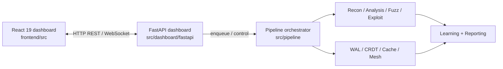

---

## F-003 — Six-level authority hierarchy (Axiom 1)

Source: [architecture.md](architecture.md) §2 Axiom 1

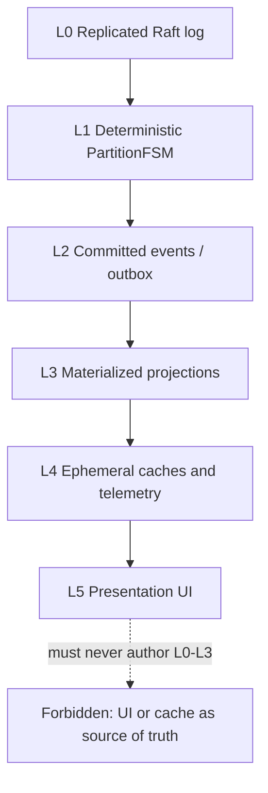

---

## F-004 — Live CLI scan path

Source: [architecture.md](architecture.md), [codebase.md](codebase.md)

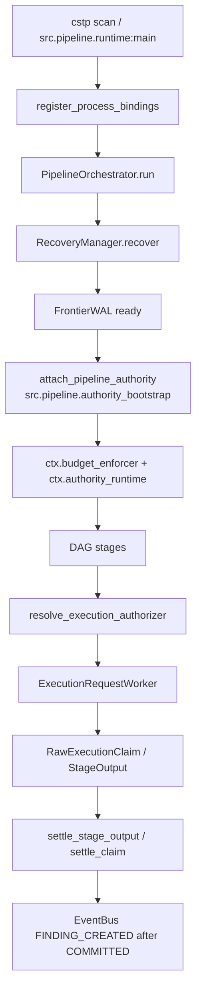

---

## F-005 — Settlement and FINDING_CREATED

Source: [architecture.md](architecture.md) §7.6

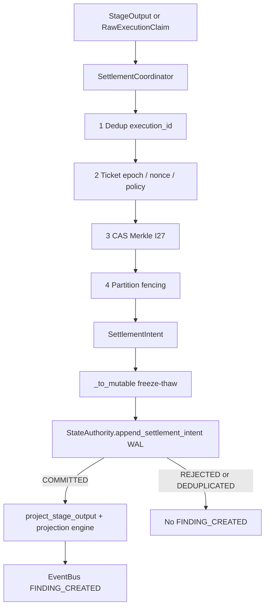

---

## F-006 — Lease lifecycle I28 / I19

Source: [architecture.md](architecture.md) I19/I28, [FORMAL_COMMAND_SPECIFICATION.md](FORMAL_COMMAND_SPECIFICATION.md) §1.11

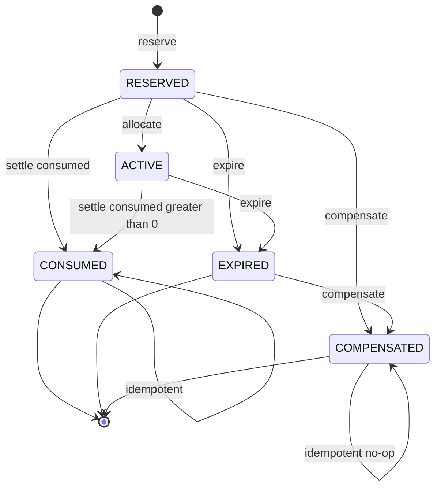

---

## F-007 — Dashboard job state machine

Source: [architecture.md](architecture.md), `src/jobs/status.py`

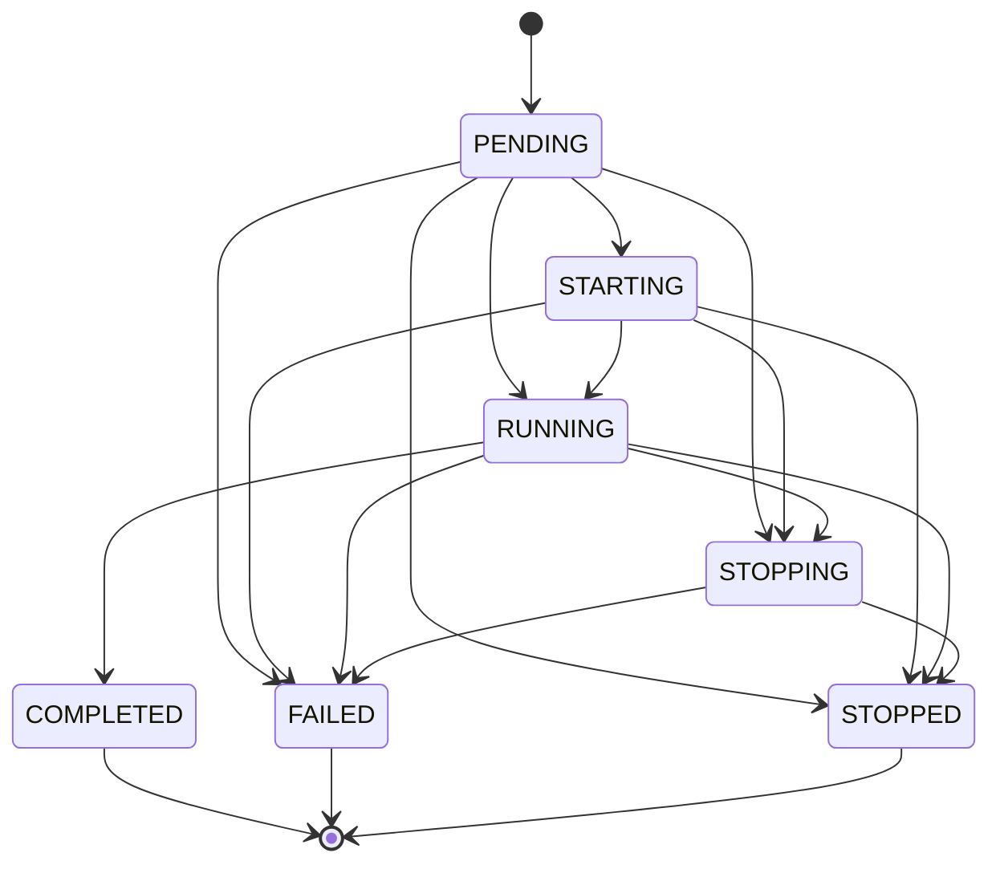

Terminal states COMPLETED / FAILED / STOPPED cannot leave. Only `_transition` writes status.

---

## F-008 — Stage status CAS

Source: [architecture.md](architecture.md), `src/core/models/stage_status.py`

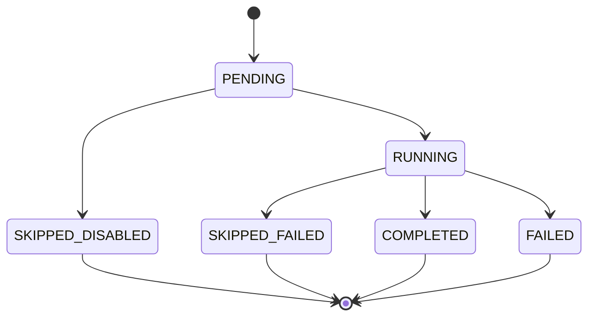

Illegal: COMPLETED to FAILED, COMPLETED to SKIPPED*, FAILED to COMPLETED, SKIPPED* to COMPLETED.

---

## F-009 — Circuit breaker

Source: [architecture.md](architecture.md)

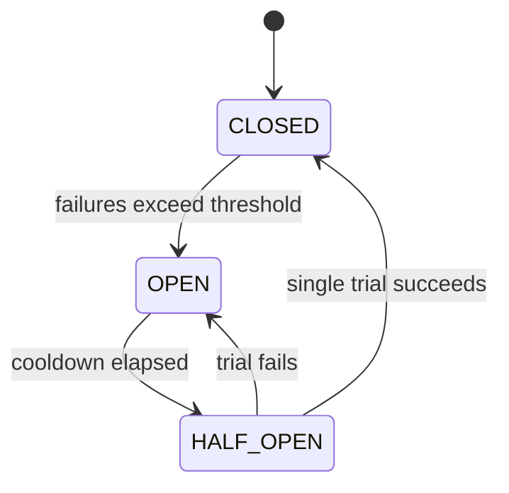

Async path: one `asyncio.Lock`, one HALF_OPEN probe, `_trial_generation` increments on enter HALF_OPEN.

---

## F-010 — Execution authorization

Source: [architecture/execution-request-contract.md](architecture/execution-request-contract.md)

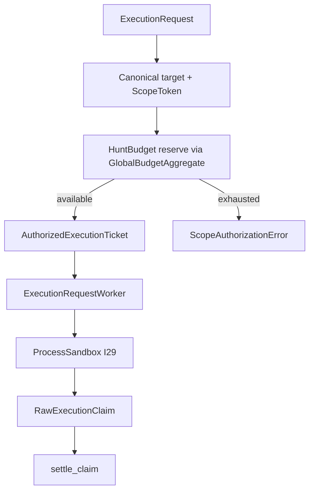

---

## F-011 — Global budget conservation

Source: [FORMAL_COMMAND_SPECIFICATION.md](FORMAL_COMMAND_SPECIFICATION.md)

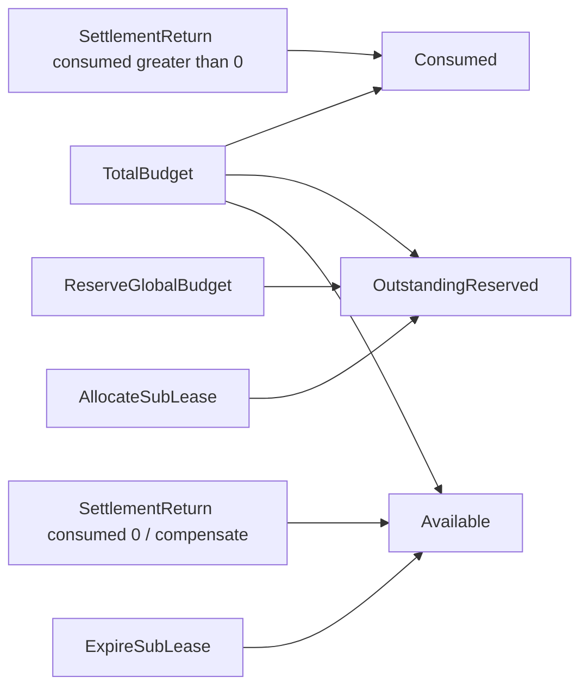

Equation: `Total = Consumed + Outstanding + Available` (I5). Slabs add `SlabReserved` (I26).

---

## F-012 — Policy governance

Source: [architecture.md](architecture.md)

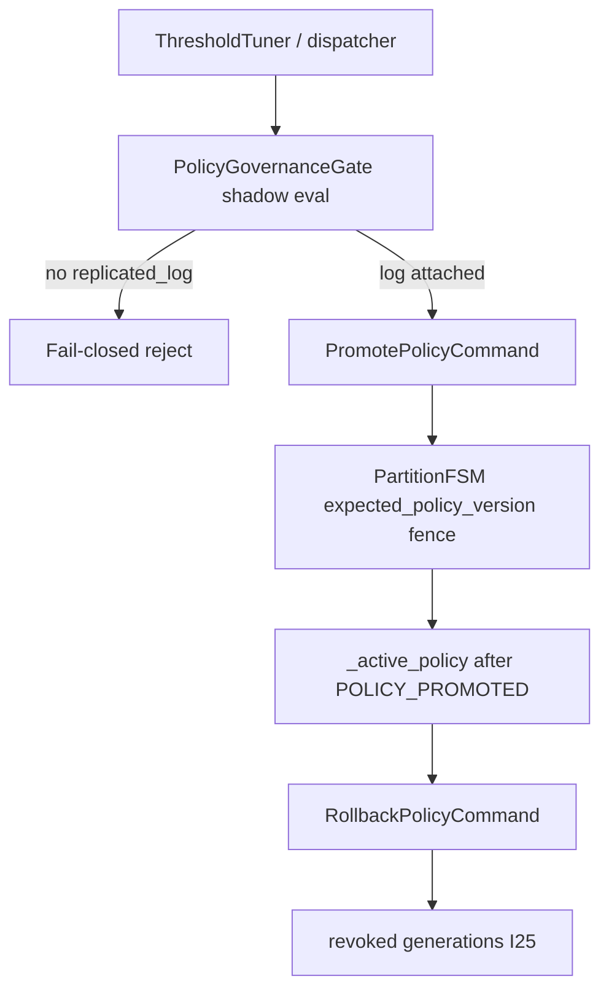

---

## F-013 — I29 sandbox egress

Source: [architecture.md](architecture.md) I29, [FAILURE_MODES.md](FAILURE_MODES.md) §7

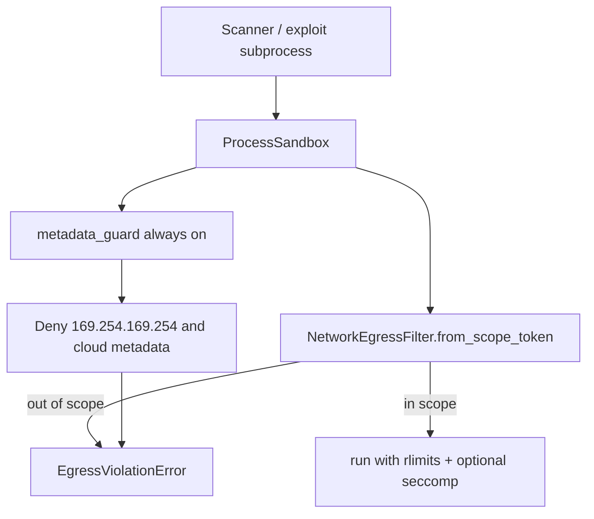

---

## F-014 — Raft commit and apply

Source: [architecture.md](architecture.md) §5. Live path is single-node quorum-1; `NetworkRaftTransport` is LIBRARY.

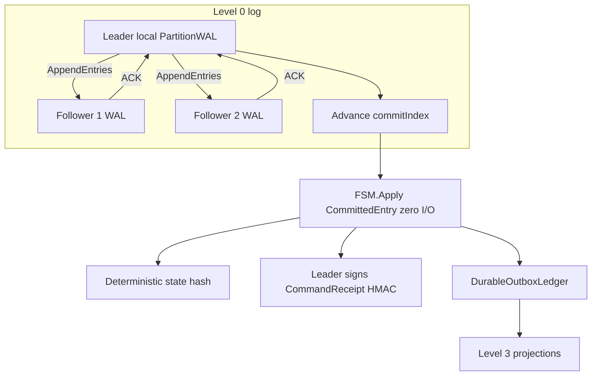

---

## F-015 — Recovery and replay

Source: [architecture.md](architecture.md), [FORMAL_COMMAND_SPECIFICATION.md](FORMAL_COMMAND_SPECIFICATION.md) §2

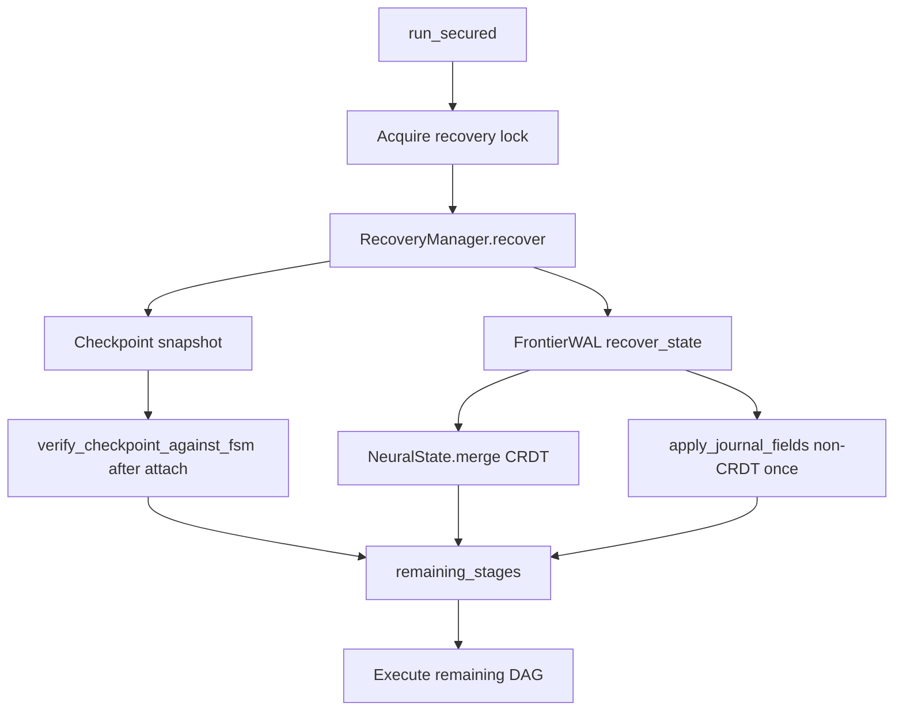

---

## F-016 — Formal command path

Source: [FORMAL_COMMAND_SPECIFICATION.md](FORMAL_COMMAND_SPECIFICATION.md)

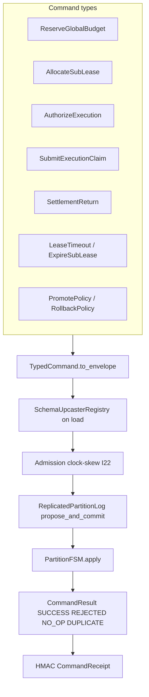

---

## F-017 — CLI and runtime entrypoints

Source: [commands.md](commands.md)

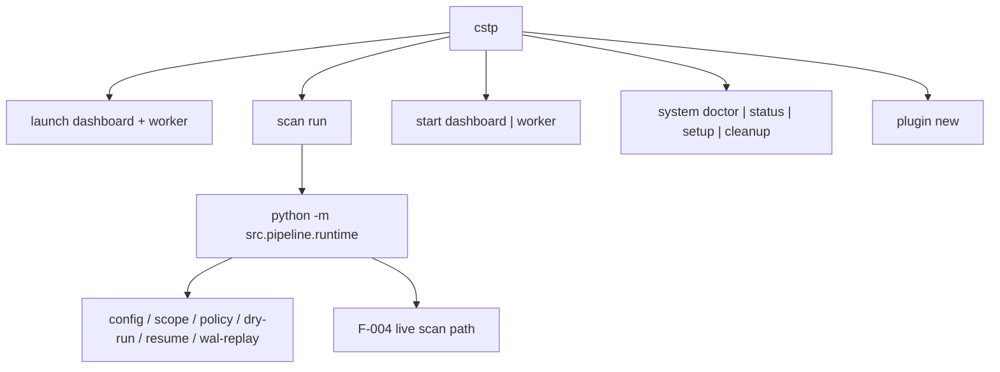

---

## F-018 — Failure-mode decision tree

Source: [FAILURE_MODES.md](FAILURE_MODES.md)

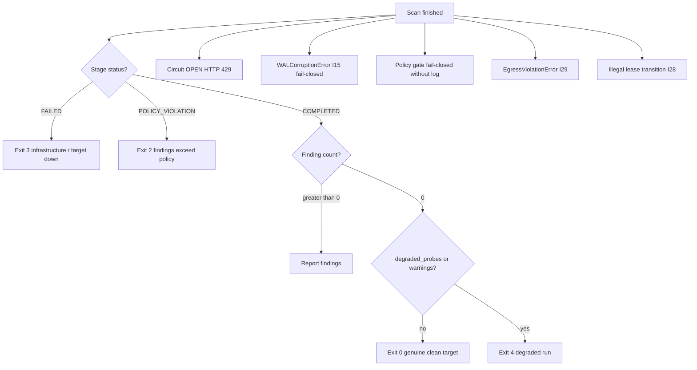

---

## F-019 — Frontend telemetry

Source: [frontend.md](frontend.md)

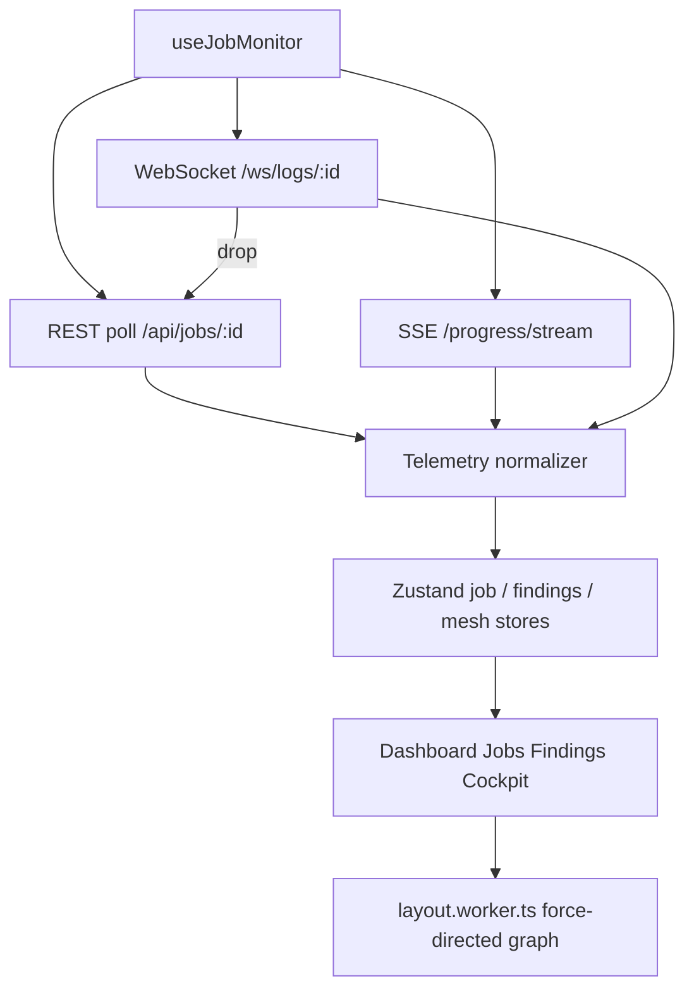

---

## F-020 — Tests and CI shards

Source: [testing.md](testing.md)

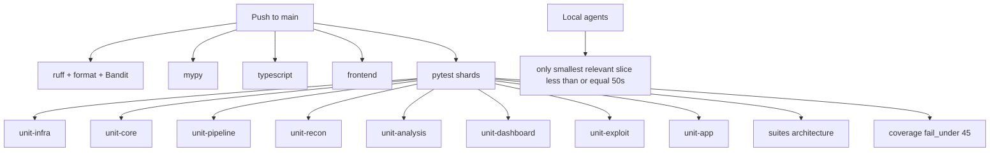

---

## F-021 — Multi-region replication

Source: [multi-region.md](multi-region.md)

```mermaid
flowchart TD
    subgraph A["Region A"]
        GA["Gossip node"]
        OA["Authority + FrontierWAL"]
        RA["Redis stream"]
        OA --> RA
    end
    subgraph B["Region B"]
        GB["Gossip node"]
        OB["Authority + FrontierWAL"]
        RB["Redis stream"]
        OB --> RB
    end
    GA <-->|"SWIM UDP AES-256-GCM"| GB
    RA <-->|"WALReplicationRelay"| RB
```

---

## F-022 — Gap-analysis status

Source: [GAP_ANALYSIS.md](GAP_ANALYSIS.md)

```mermaid
flowchart LR
    Raft["Raft transport"] --> Impl["Implemented single-node"]
    Tickets["Jira ServiceNow DefectDojo"] --> Impl
    Policy["Policy via Raft commands"] --> Impl
    Ghost["Multi-host Ghost migration"] --> Open["Open / single-node"]
    WASM["WASM AEVE"] --> Flag["Feature flagged"]
    PPO["PPO / DRL"] --> Heur["Heuristic stub"]
    GNN["GNN attack graph"] --> Dijk["Dijkstra LIBRARY"]
```

---

## F-023 — Live EventBus vs unused bus

Source: [architecture.md](architecture.md)

```mermaid
flowchart TD
    Live["src.core.events.event_bus.EventBus"] --> Export["from src.core.events import EventBus"]
    Export --> Orch["Orchestrator / dashboard / retry"]
    Unused["src.core.events.bus.EventBus UNUSED"] --> Perf["tests/unit/core/test_perfection_suite.py only"]
    Settle["SettlementResult.COMMITTED"] --> Live
    Live --> Fan["fan-out depth cap 5"]
    Live --> Crit["never drop FINDING_CREATED / PIPELINE_ERROR"]
```

---

## F-024 — QoS broker lanes

Source: [architecture.md](architecture.md) §7.7

```mermaid
flowchart TD
    Evt["TelemetryEvent"] --> Q{"qos class"}
    Q -->|P0 control| P0["bounded memory then disk spool"]
    Q -->|P1 lifecycle| P1["reliable fixed queue"]
    Q -->|P2 findings| P2["coalesce by dedup_key"]
    Q -->|P3 telemetry| P3["1s aggregates"]
    Q -->|P4 debug| P4["drop first under pressure"]
    Disk{"disk percent"} -->|85| Shed4["shed P4"]
    Disk -->|92| Shed34["shed P3/P4 compact P1-P2"]
```

---

## F-025 — Unified cache tiers

Source: [architecture/cache-unification.md](architecture/cache-unification.md)

```mermaid
flowchart TD
    Call["cache get"] --> SF["single-flight coalescer"]
    SF --> Mem["in-memory LRU"]
    Mem -->|hit| Ret["return"]
    Mem -->|miss| Persist["SQLite or Redis tier"]
    Persist -->|hit SWR| Ret
    Persist -->|miss| Origin["compute / fetch"]
    Origin --> Write["write-through both tiers"]
```

---

## F-026 — Observability stack

Source: [OBSERVABILITY_CATALOG.md](OBSERVABILITY_CATALOG.md)

```mermaid
flowchart TD
    App["Pipeline + dashboard + workers"] --> Prom["prometheus_client metrics"]
    App --> Logs["structured JSON logs"]
    App --> OTel["OpenTelemetry spans"]
    Prom --> Graf["Grafana dashboards HTTP / DB / queue / analyzer"]
    Logs --> SIEM["CEF / LEEF HMAC audit chain"]
    OTel --> Trace["traceparent on QoS envelopes"]
    Prom --> Alerts["infra / pipeline / DB / queue / HTTP / analyzer alerts"]
```

---

## F-027 — Finding lifecycle

Source: [architecture.md](architecture.md), `src/core/contracts/finding_lifecycle.py`

```mermaid
stateDiagram-v2
    [*] --> CANDIDATE
    CANDIDATE --> REPORTABLE: confirmed
    CANDIDATE --> FALSE_POSITIVE: decision FP
    REPORTABLE --> REPORTABLE: sticky
    FALSE_POSITIVE --> FALSE_POSITIVE: sticky
```

`infer_lifecycle_state` honors `decision in {false_positive, fp}` first.

---

## F-028 — Three config trees (kept separate)

Source: [environment-variables.md](environment-variables.md)

```mermaid
flowchart TD
    Scan["ValidatedPipelineConfig<br/>per-scan JSON"] --> Stages["recon nuclei analysis"]
    Dash["DashboardConfig DASHBOARD_*"] --> API["FastAPI / auth / guest"]
    Queue["QueueConfig QUEUE_*"] --> Workers["distributed workers"]
    Scan -.->|"do not unify"| NoGod["No kernel / God-container / AppSettings growth"]
    Dash -.-> NoGod
    Queue -.-> NoGod
```

---

## F-029 — Pipeline stage DAG

Source: [codebase.md](codebase.md), `GraphBuilder` / `STAGE_GRAPH`

```mermaid
flowchart TD
    Scope["scope"] --> Sub["subdomains"]
    Sub --> Live["live_hosts"]
    Live --> Urls["urls"]
    Urls --> Params["parameters"]
    Params --> Rank["ranking"]
    Rank --> Passive["passive / analysis"]
    Rank --> Nuclei["nuclei"]
    Rank --> Active["active_scan"]
    Passive --> Val["validation"]
    Nuclei --> Val
    Active --> Val
    Val --> Merge["merge"]
    Merge --> Report["reporting"]
    Merge --> Shots["screenshots"]
```

Exact edges come from `build_pipeline_graph(profile)` — this chart is the default recon-to-report spine.

---

## F-030 — Performance and backpressure

Source: [performance.md](performance.md)

```mermaid
flowchart TD
    Load["Probe load"] --> PID["AdaptivePIDController"]
    PID --> Conc["concurrency C of t"]
    Load --> Bulk["BulkheadPool per host"]
    Load --> Bloom["NeuralBloomFilter URL frontier"]
    Sat["saturation"] --> QoS["F-024 QoS shed"]
    Sat --> CB["F-009 circuit OPEN"]
```

---

## Changelog

| Date | Change | Kind |
|---|---|---|
| 2026-08-25 | Initial atlas F-001–F-030 created. Maintenance contract recorded. | add |

Do not delete this changelog. Append a row for every later edit.
