# Flowchart Atlas

Visual graphs of the living docs under `docs/`. Charts are the map; the linked markdown files remain the specification.

**One file. Merged when overlapping.** Similar, nested, or part-of-each-other flows share a single survivor chart. Retired ids stay as headings that point at the survivor — they are not rewritten away and their ids are never reused.

---

## 0. Maintenance Contract — HARD RULE

> **Complete rewrite of this file is forbidden.**
>
> This atlas is an append-only-by-default living document.
>
> | Action | Allowed? | When |
> |---|---|---|
> | Add a new `F-NNN` chart | Yes | A new doc, subsystem, or lifecycle appears |
> | Merge overlapping charts into one survivor | Yes | Charts are similar, nested, or part of each other |
> | Retire a chart heading after merge | Yes | Leave `RETIRED → F-XXX`; do not reuse the id |
> | Edit / improve an existing chart | Yes | The source doc or code changed |
> | Rename a node or edge | Yes | The name in code/docs changed |
> | Delete a chart or a portion of a chart | **Only if** that portion's subject was actually deleted from the repo/docs |
> | Replace the whole file | **Never** |
> | Wipe sections to "start over" | **Never** |
> | Reuse a retired `F-NNN` id | **Never** — mark the section `RETIRED` and leave the heading |
>
> How to change this file:
>
> 1. Locate the stable chart id (`F-001` …).
> 2. Patch only that section (or append a new id).
> 3. Update the Atlas Index row for that id.
> 4. Record the change in the Changelog at the bottom.
>
> Agents and humans must treat a full-file overwrite as a defect.

---

## Atlas Index

Live charts only. Retired ids are one-line headings after the last live chart (never reuse).

| Id | Chart | Source |
|---|---|---|
| F-001 | Documentation portal map | [index.md](index.md) |
| F-002 | System topology and regions | [architecture-overview.md](architecture-overview.md), [multi-region.md](multi-region.md) |
| F-003 | Authority plane | [architecture.md](architecture.md), [FORMAL_COMMAND_SPECIFICATION.md](FORMAL_COMMAND_SPECIFICATION.md) |
| F-004 | Live scan path | [architecture.md](architecture.md), [codebase.md](codebase.md), [commands.md](commands.md) |
| F-006 | Leases and global budget | [FORMAL_COMMAND_SPECIFICATION.md](FORMAL_COMMAND_SPECIFICATION.md) |
| F-007 | Application state machines | `src/jobs/status.py`, `stage_status.py`, `finding_lifecycle.py` |
| F-009 | Resilience: breaker, QoS, PID | [architecture.md](architecture.md), [performance.md](performance.md) |
| F-018 | Failure-mode decision tree and recovery model | [FAILURE_MODES.md](FAILURE_MODES.md), `src/core/frontier/failure_model.py` |
| F-019 | Operator surface | [frontend.md](frontend.md), [api-reference.md](api-reference.md), [OBSERVABILITY_CATALOG.md](OBSERVABILITY_CATALOG.md) |
| F-020 | Tests and CI shards | [testing.md](testing.md) |
| F-022 | Gap-analysis status | [GAP_ANALYSIS.md](GAP_ANALYSIS.md) |
| F-025 | Non-authoritative planes | [architecture/cache-unification.md](architecture/cache-unification.md), [environment-variables.md](environment-variables.md) |
| F-033 | Global invariants I30–I33 | `src/core/frontier/global_invariants.py`, `causal_identity.py`, `event_delivery.py` |

---

## F-001 — Documentation portal map

Source: [index.md](index.md)

```mermaid
flowchart TD
    Index["docs/index.md"] --> Arch["architecture.md"]
    Index --> Overview["architecture-overview.md"]
    Index --> Formal["FORMAL_COMMAND_SPECIFICATION.md"]
    Index --> Gaps["GAP_ANALYSIS.md"]
    Index --> Atlas["flowchart.md THIS FILE"]
    Index --> Code["codebase.md"]
    Index --> Cmds["commands.md"]
    Index --> Env["environment-variables.md"]
    Index --> Fail["FAILURE_MODES.md"]
    Index --> Obs["OBSERVABILITY_CATALOG.md"]
    Index --> Test["testing.md"]
    Index --> Front["frontend.md"]
    Index --> Multi["multi-region.md"]
    Index --> Perf["performance.md"]
    Index --> Gloss["glossary.md"]
    Index --> ApiDoc["api-reference.md"]
    Arch --> ExecReq["architecture/execution-request-contract.md"]
    Arch --> CacheDoc["architecture/cache-unification.md"]
```

---

## F-002 — System topology and regions

Source: [architecture-overview.md](architecture-overview.md), [multi-region.md](multi-region.md). Absorbed F-021.

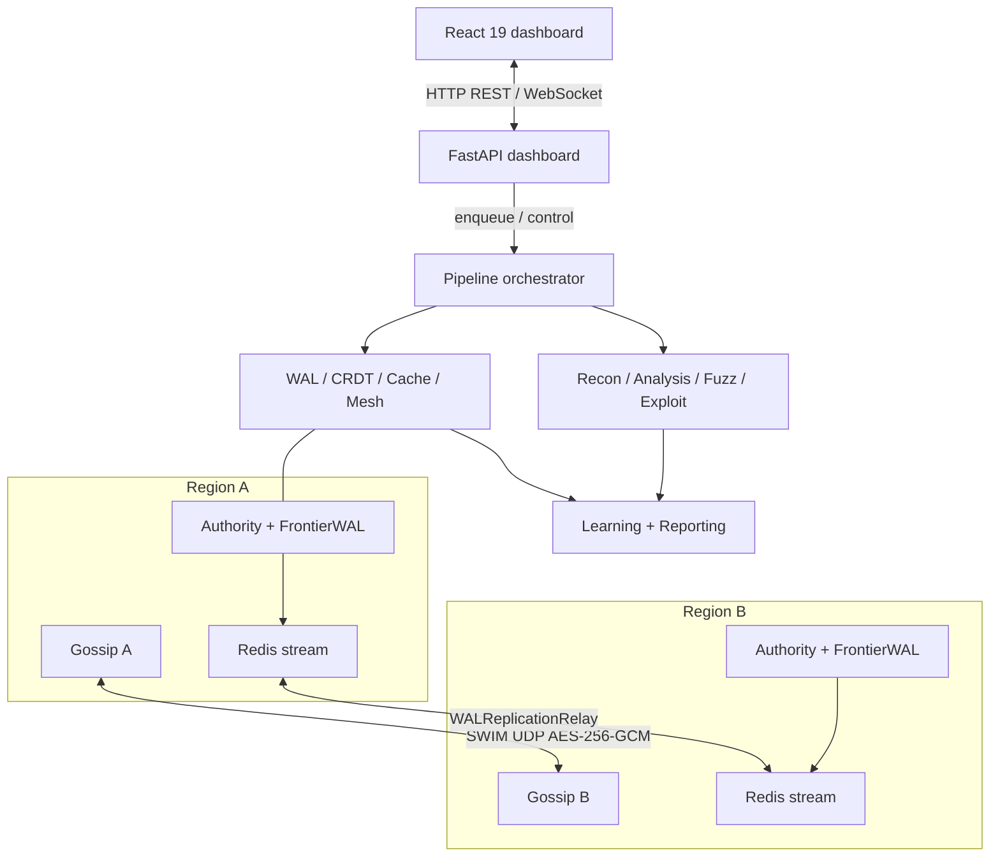

## F-003 — Authority plane

Source: [architecture.md](architecture.md), [FORMAL_COMMAND_SPECIFICATION.md](FORMAL_COMMAND_SPECIFICATION.md). Absorbed F-012, F-014, F-016.

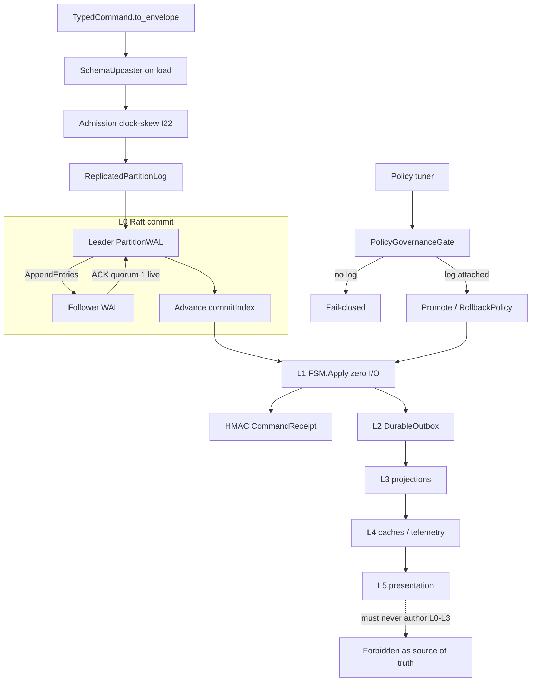

Live CLI is single-node quorum-1. `NetworkRaftTransport` stays LIBRARY.

## F-004 — Live scan path

Source: [architecture.md](architecture.md), [codebase.md](codebase.md), [commands.md](commands.md), [architecture/execution-request-contract.md](architecture/execution-request-contract.md). Absorbed F-005, F-010, F-013, F-015, F-017, F-029.

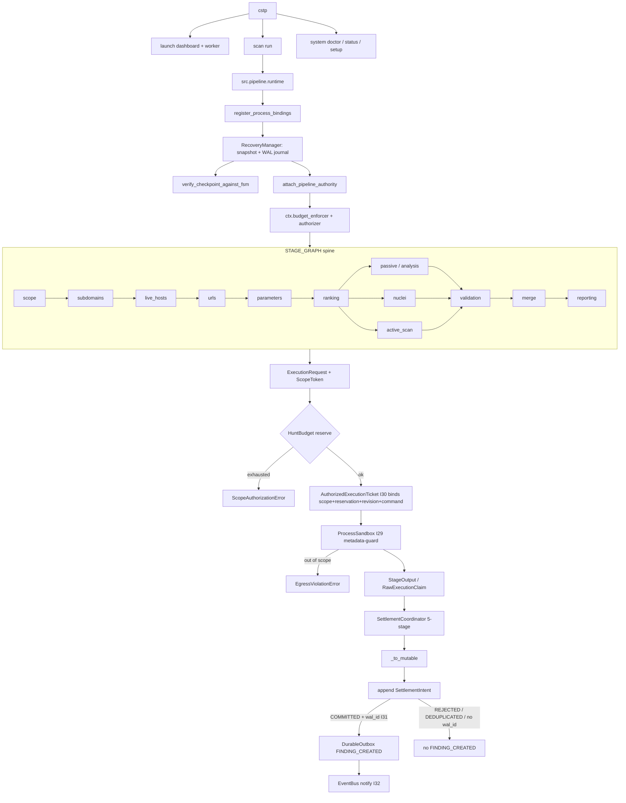

## F-005 — RETIRED → F-004

## F-006 — Leases and global budget

Source: [architecture.md](architecture.md) I19/I28, [FORMAL_COMMAND_SPECIFICATION.md](FORMAL_COMMAND_SPECIFICATION.md). Absorbed F-011.

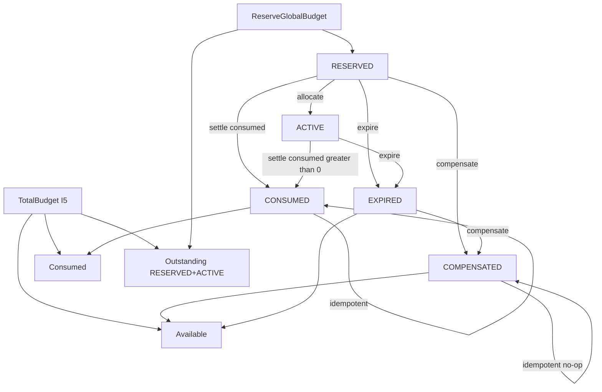

`Total = Consumed + Outstanding + Available`. Slabs add `SlabReserved` (I26). COMPENSATED only from RESERVED or EXPIRED.

## F-007 — Application state machines

Source: `src/jobs/status.py`, `src/core/models/stage_status.py`, `src/core/contracts/finding_lifecycle.py`. Absorbed F-008, F-027.

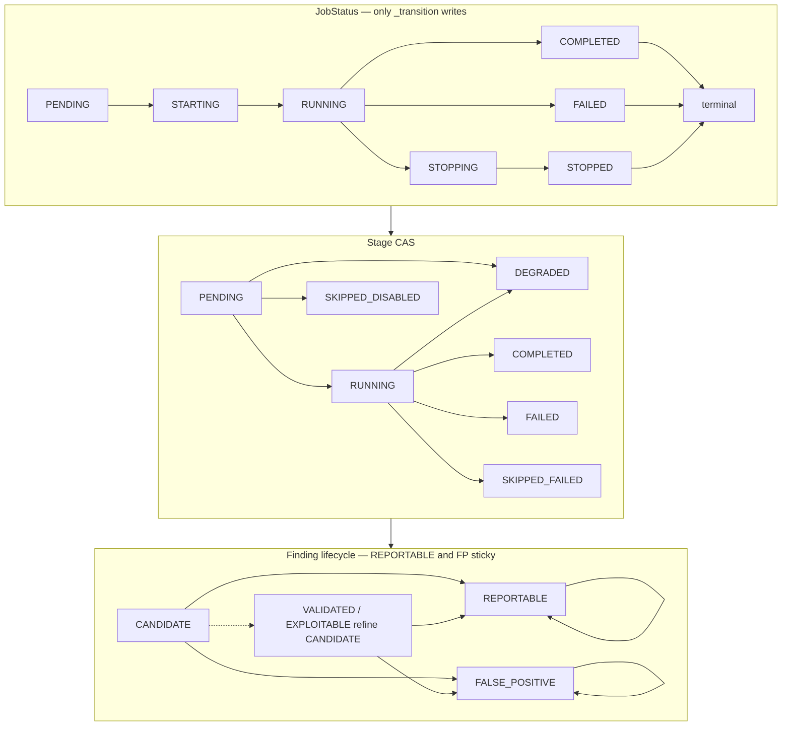

Illegal stage: COMPLETED→FAILED, COMPLETED→SKIPPED*, FAILED→COMPLETED, SKIPPED*→COMPLETED.

Finding surface is CANDIDATE | REPORTABLE | FALSE_POSITIVE. `detected` aliases CANDIDATE. Dashboard `open/closed` is a different axis (ticket status), not this SM.

## F-008 — RETIRED → F-007

## F-009 — Resilience: breaker, QoS, PID

Source: [architecture.md](architecture.md), [performance.md](performance.md). Absorbed F-024, F-030.

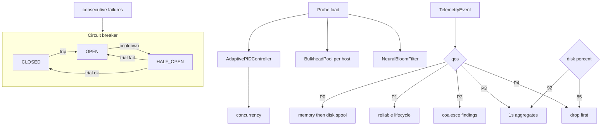

One async HALF_OPEN probe; `_trial_generation` increments on enter HALF_OPEN.

## F-010 — RETIRED → F-004

## F-011 — RETIRED → F-006

## F-012 — RETIRED → F-003

## F-013 — RETIRED → F-004

## F-014 — RETIRED → F-003

## F-015 — RETIRED → F-004

## F-016 — RETIRED → F-003

## F-017 — RETIRED → F-004

## F-018 — Failure-mode decision tree and recovery model

Source: [FAILURE_MODES.md](FAILURE_MODES.md), `src/core/frontier/failure_model.py` (I34).

Exit codes answer "what result did this scan produce?". The recovery table answers "what is the system allowed to do?" for each class. Exotic multi-node repair is not implemented; the outcome is still named.

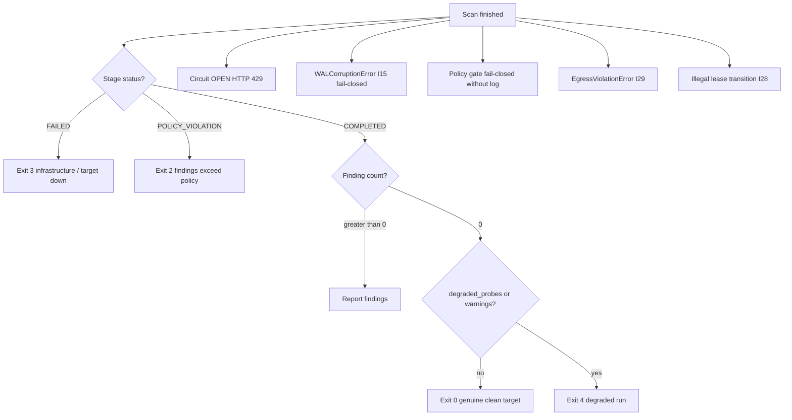

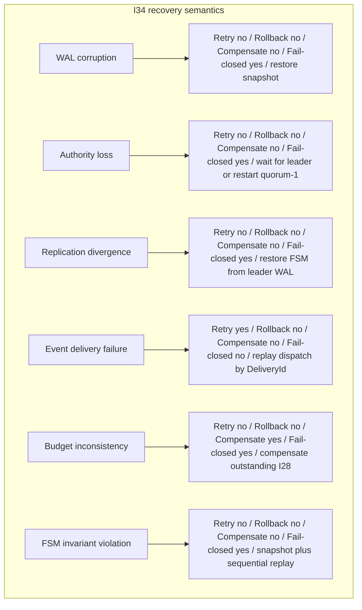

---

## F-019 — Operator surface

Source: [frontend.md](frontend.md), [api-reference.md](api-reference.md), [OBSERVABILITY_CATALOG.md](OBSERVABILITY_CATALOG.md). Absorbed F-023, F-026, F-031.

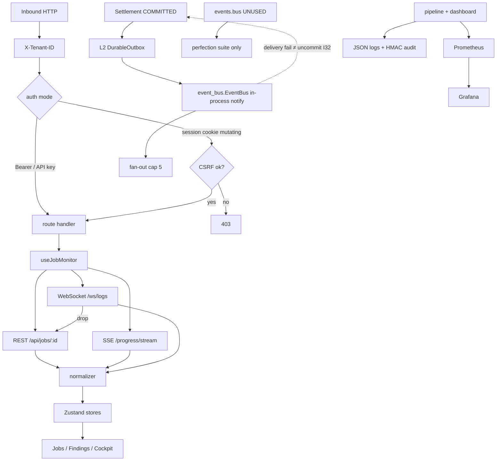

## F-020 — Tests and CI shards

Source: [testing.md](testing.md)

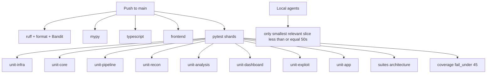

---

## F-021 — RETIRED → F-002

## F-022 — Gap-analysis status

Source: [GAP_ANALYSIS.md](GAP_ANALYSIS.md)

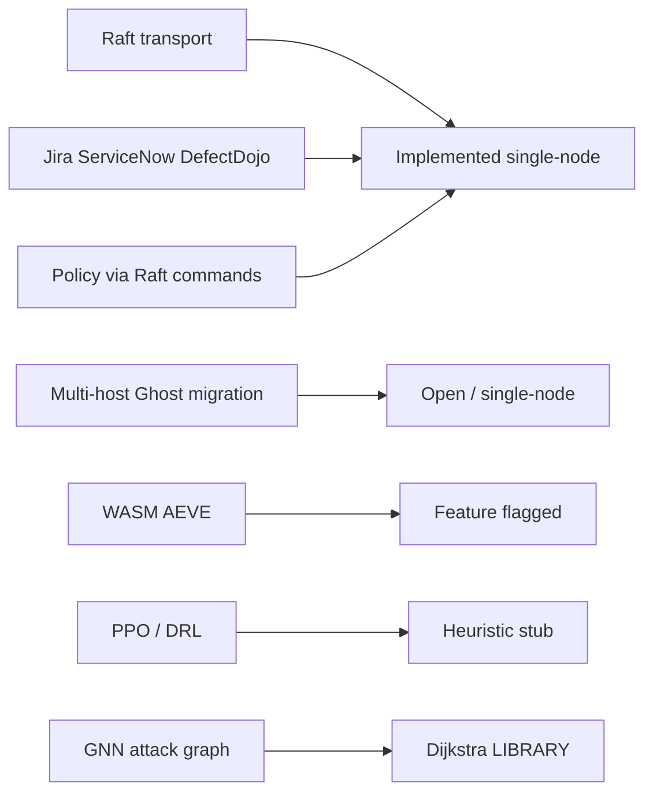

---

## F-023 — RETIRED → F-019

## F-024 — RETIRED → F-009

## F-025 — Non-authoritative planes

Source: [architecture/cache-unification.md](architecture/cache-unification.md), [environment-variables.md](environment-variables.md), [architecture.md](architecture.md) §7.17. Absorbed F-028, F-032.

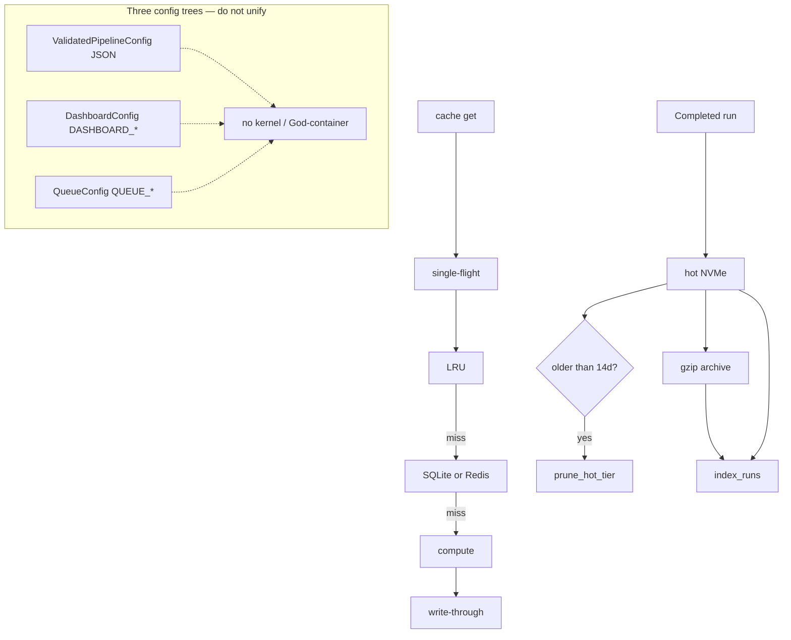

## F-026 — RETIRED → F-019

## F-027 — RETIRED → F-007

## F-028 — RETIRED → F-025

## F-029 — RETIRED → F-004

## F-030 — RETIRED → F-009

## F-031 — RETIRED → F-019

## F-032 — RETIRED → F-025

## F-033 — Global invariants I30–I33

Source: `src/core/frontier/global_invariants.py`, `src/core/frontier/causal_identity.py`, `src/core/frontier/event_delivery.py`.

EventBus is an **in-process notification dispatcher**, not a durable log and not a source of truth. Authoritative Event → Durable Outbox → Delivery Dispatcher → EventBus → consumers. `EventBus.emit(FINDING_CREATED)` without `wal_id` + `authoritative=True` is refused.

I33 makes replay/retry/dedup proveable: child ids are derived from parents; a FAILED attempt does not close the execution; EventBus DeliveryId is skipped on crash-replay.

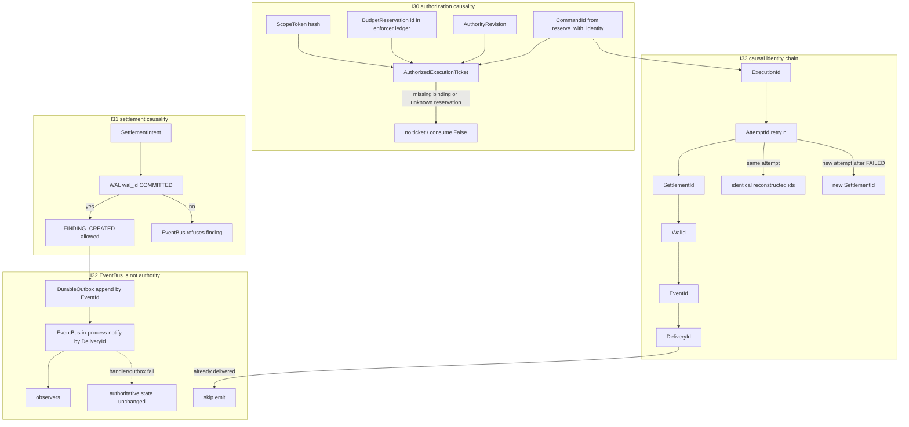

## Changelog

| Date | Change | Kind |
|---|---|---|
| 2026-08-25 | F-001–F-030 created | add |
| 2026-08-25 | F-001/F-008 edit; F-031 F-032 added | edit |
| 2026-08-25 | Merged into 11 survivors; retired absorbed ids | edit |
| 2026-08-25 | Compacted retired headings and changelog (live charts unchanged) | edit |
| 2026-08-25 | F-033: fail-closed I30 ledger + EventBus refuse unauthoritative FINDING_CREATED | edit |
| 2026-08-25 | F-033: I33 CommandId→DeliveryId chain after code landed | edit |
| 2026-08-25 | F-018: I34 recovery model next to the exit-code tree | edit |
| 2026-08-26 | F-007: CANDIDATE is the finding surface start state | edit |
| 2026-08-26 | F-019: Norm is frontend/src/telemetry/normalizer.ts | edit |

Append a row for every later edit. Do not delete this table.
