# Flowchart Atlas

Visual graphs of the living docs under `docs/`. Charts are the map; the linked markdown files remain the specification.

**One file. Merged when overlapping.** Similar, nested, or part-of-each-other flows share a single survivor chart. Retired ids stay as headings that point at the survivor — they are not rewritten away and their ids are never reused.

---

## 0. Maintenance Contract — HARD RULE

> **Complete rewrite of this file is forbidden.**
>
> This atlas is an append-only-by-default living document.
>
> | Action | Allowed? | When |
> |---|---|---|
> | Add a new `F-NNN` chart | Yes | A new doc, subsystem, or lifecycle appears |
> | Merge overlapping charts into one survivor | Yes | Charts are similar, nested, or part of each other |
> | Retire a chart heading after merge | Yes | Leave `RETIRED → F-XXX`; do not reuse the id |
> | Edit / improve an existing chart | Yes | The source doc or code changed |
> | Rename a node or edge | Yes | The name in code/docs changed |
> | Delete a chart or a portion of a chart | **Only if** that portion's subject was actually deleted from the repo/docs |
> | Replace the whole file | **Never** |
> | Wipe sections to "start over" | **Never** |
> | Reuse a retired `F-NNN` id | **Never** — mark the section `RETIRED` and leave the heading |
>
> How to change this file:
>
> 1. Locate the stable chart id (`F-001` …).
> 2. Patch only that section (or append a new id).
> 3. Update the Atlas Index row for that id.
> 4. Record the change in the Changelog at the bottom.
>
> Agents and humans must treat a full-file overwrite as a defect.

---

## Legend & Status Vocabulary

Every graph in this atlas adheres to a standardized visual taxonomy:

### Edge Semantics & Grammar

| Syntax | Category | Semantic Meaning & Runtime Role |
|---|---|---|
| `A --> B` | **Structural / Reference** | Documentation link, static hierarchy, CI prerequisite, downstream consumer |
| `A ==> B` | **Hot Path / Execution** | Synchronous control flow, DAG scheduling dispatch, hot worker execution |
| `A -->&#124;data&#124; B` | **Dataflow & Ingestion** | Findings, URLs, payloads, context artifact ingestion |
| `A -->&#124;replicate&#124; B` | **Replication** | Network journal sync, cross-region peer relay |
| `A -->&#124;state&#124; B` | **State Transition** | Deterministic CAS lifecycle progression (e.g. `PENDING` $\rightarrow$ `RUNNING`) |
| `A -->&#124;durable&#124; B` | **Durable Side Effect** | Synchronous WAL commit, Outbox append, fsync flush |
| `A -.->&#124;when: cond&#124; B` | **Scheduling Gate** | Runtime predicate evaluation (e.g. `OutputNonEmpty`) |
| `A -.->&#124;refuse/guard&#124; B` | **Invariant Refusal** | Fail-closed security boundary, egress guard, illegal flow rejection |
| `PORT_FNNN[["..."]]` | **Interface Port** | Typed boundary connector between partitioned charts |

### Node Status Classes (`classDef`)

| ClassDef | Name | Definition & Runtime Scope |
|---|---|---|
| `:::impl` | **Fully Implemented** | Live production code in `src/` |
| `:::singleNode` | **Single-Node Quorum-1** | Operating in-process or local cluster mode |
| `:::library` | **Library Component** | Imported as utility, not a stand-alone daemon |
| `:::specOnly` | **Specification Plane** | Formalized target architecture not yet active in live CLI |
| `:::vacuous` | **Vacuous State** | Rehydration or check step that is empty by design in normal runs |
| `:::forbidden` | **Forbidden / Fail-Closed** | Explicitly illegal transition rejected by runtime gates |

### Typed Authority Taxonomy

The term "authority" is strictly typed across this specification to avoid semantic overloading:

| Typed Authority | Scope & Plane | Authoritative Entity | Governed Invariants |
|---|---|---|---|
| **`GovernanceAuthority`** | Partition Plane (Raft L0–L1, `P-0000`) | `ReplicatedPartitionLog`, `PolicyGovernanceGate` | I4, I8, I9, I10, I11, I22 |
| **`BudgetAuthority`** | Partition Plane (`P-0000` L1 FSM / L3 Reconstructible View) | `GlobalBudgetAggregate`, `HuntBudget` | I5, I6, I7, I19, I20, I21, I26, I28 |
| **`DiscoveryAuthority`** | Frontier Scan Plane (CRDT / Ephemeral) | `NeuralState` OR-Sets (`subdomains`, `urls`, `findings`) | I23, I24, I25 |
| **`ExecutionAuthority`** | Runtime Control & Scope Sandbox | `ExecutionAuthorizer`, `ProcessSandbox` | I29, I30, I33 |
| **`PersistenceAuthority`** | Storage & Durability Engine (L0/L2) | `PartitionWAL` (CRC-64 fsync), `DurableOutboxLedger` | I11, I12, I14, I15, I31, I32 |
| **`PresentationAuthority`** | Ephemeral & Read Projections (L4–L5) | FastAPI, Zustand Stores, Telemetry Normalizer | *None* (Forbidden as truth source) |

---

## Atlas Index

Live charts only. Retired ids are one-line headings preserved after the live charts in the Retired Chart Registry (ids are never reused).

| Id | Chart | Source Specification & Symbols | Absorbed | Verified |
|---|---|---|---|---|
| F-001 | Documentation portal map | [index.md](index.md), [getting-started.md](getting-started.md), [deployment.md](deployment.md) | — | 2026-08-26 (`9cb16b25`) |
| F-002 | System topology, regions & deployment | [architecture-overview.md](architecture-overview.md), [multi-region.md](multi-region.md), [deployment.md](deployment.md), `region_model.py` (I36), `authority_transfer.py` (I37), `launcher.py` | F-021, F-040 | 2026-08-26 (`eb763fe7`) |
| F-003 | Authority plane, Raft L0–L5 & security keys | [architecture.md](architecture.md), [FORMAL_COMMAND_SPECIFICATION.md](FORMAL_COMMAND_SPECIFICATION.md), `replicated_log.py`, `receipt_crypto.py`, `schema_upcaster.py`, `state.py` | F-012, F-014, F-016, F-034, F-037, F-044 | 2026-08-26 (`95ed3b7e`) |
| F-004 | Live scan path, execution DAG & egress sandbox | [architecture.md](architecture.md), [codebase.md](codebase.md), [commands.md](commands.md), `graph_builder.py`, `_run_execution.py`, `stage_admit.py`, `process_sandbox.py`, `egress_context.py`, `shared_sessions.py`, `dedup/` | F-005, F-010, F-013, F-015, F-017, F-029, F-035, F-036, F-042 | 2026-08-26 (`c989d3be`) |
| F-006 | Leases, time & global budget | [architecture.md](architecture.md), [FORMAL_COMMAND_SPECIFICATION.md](FORMAL_COMMAND_SPECIFICATION.md), `hunt_budget.py`, `lease_status.py` | F-011, F-038 | 2026-08-26 (`d49bfb05`) |
| F-007 | Application state machines & lifecycle coupling | `src/jobs/status.py`, `src/core/models/stage_status.py`, `src/core/contracts/finding_lifecycle.py`, `run_outcome.py` | F-008, F-027 | 2026-08-26 (`12113b4b`) |
| F-009 | Resilience: breaker, QoS, PID & bulkhead | [architecture.md](architecture.md), [performance.md](performance.md), `src/resilience/`, `src/realtime/prioritized_broker.py`, `src/realtime/qos_admit.py` | F-024, F-030 | 2026-08-26 (`e7803858`) |
| F-018 | Failure decision tree, concurrency & I35 recovery | [FAILURE_MODES.md](FAILURE_MODES.md), `failure_model.py` (I34), `recovery_protocol.py` (I35), `recovery/manager.py`, `run_lock.py` | F-039 | 2026-08-26 (`6843c35b`) |
| F-019 | Operator surface, multi-tenancy & telemetry | [frontend.md](frontend.md), [api-reference.md](api-reference.md), [OBSERVABILITY_CATALOG.md](OBSERVABILITY_CATALOG.md), `telemetry/normalizer.ts`, `middleware.py` | F-023, F-026, F-031, F-043 | 2026-08-26 (`479c106d`) |
| F-020 | Tests, CI shards & quality policy gates | [testing.md](testing.md), [ci-cd-integration.md](ci-cd-integration.md), `.github/workflows/ci.yml`, `run_outcome.py` | F-045 | 2026-08-26 (`479c106d`) |
| F-022 | Gap-analysis status | [GAP_ANALYSIS.md](GAP_ANALYSIS.md) | — | 2026-08-26 (`479c106d`) |
| F-025 | Non-authoritative planes, caches & multi-tier storage | [architecture/cache-unification.md](architecture/cache-unification.md), [environment-variables.md](environment-variables.md), `src/infrastructure/cache/`, `src/pipeline/unified_cache/`, facades `src/cache/`, `src/checkpoint/`, `src/frontier/` | F-028, F-032, F-041 | 2026-08-26 (`ce16770b`) |
| F-033 | Global invariants I1–I37 enforcement & dependency graph | `invariant_graph.py`, `global_invariants.py`, `causal_identity.py`, `event_delivery.py` | — | 2026-08-26 (`7a2bb407`) |

---

## F-001 — Documentation portal map

Source: [index.md](index.md)

```mermaid
flowchart TD
    Index["docs/index.md"] --> Arch["architecture.md"]
    Index --> Overview["architecture-overview.md"]
    Index --> Formal["FORMAL_COMMAND_SPECIFICATION.md"]
    Index --> Gaps["GAP_ANALYSIS.md"]
    Index --> Atlas["flowchart.md THIS FILE"]
    Index --> Code["codebase.md"]
    Index --> Cmds["commands.md"]
    Index --> Env["environment-variables.md"]
    Index --> Fail["FAILURE_MODES.md"]
    Index --> Obs["OBSERVABILITY_CATALOG.md"]
    Index --> Test["testing.md"]
    Index --> Front["frontend.md"]
    Index --> Multi["multi-region.md"]
    Index --> Perf["performance.md"]
    Index --> Gloss["glossary.md"]
    Index --> ApiDoc["api-reference.md"]
    Index --> Start["getting-started.md"]
    Index --> Deploy["deployment.md"]
    Index --> CICD["ci-cd-integration.md"]
    Index --> Plugins["dynamic-plugins.md"]
    Index --> Trouble["troubleshooting.md"]
    Index --> PagesOver["frontend_pages_overview.md"]
    Index --> Sec["../SECURITY.md"]
    Arch --> ExecReq["architecture/execution-request-contract.md"]
    Arch --> CacheDoc["architecture/cache-unification.md"]
    Arch --> Consolidation["architecture/code-consolidation.md"]
```

Portal lists only files that exist. `CONTRIBUTING.md` / `BENCHMARK.md` / `CHANGES.md` are not in the repo.

---

## F-002 — System topology, regions & deployment

Source: [architecture-overview.md](architecture-overview.md), [multi-region.md](multi-region.md), [deployment.md](deployment.md), `src/core/frontier/region_model.py` (I36), `src/core/frontier/authority_transfer.py` (I37), `src/cli/launcher.py`. Absorbed F-021, F-040.

### 1. Spatial Deployment & Multi-Region Topology

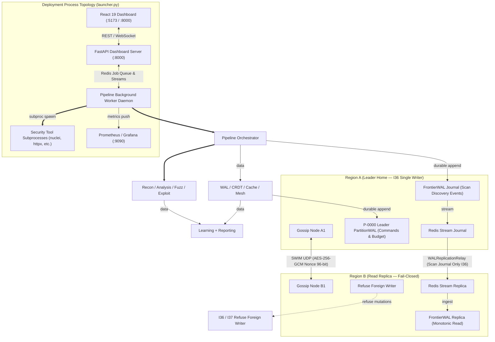

### 2. Temporal Authority Transfer State Machine (I37 Zero-Dual-Writer Fence)

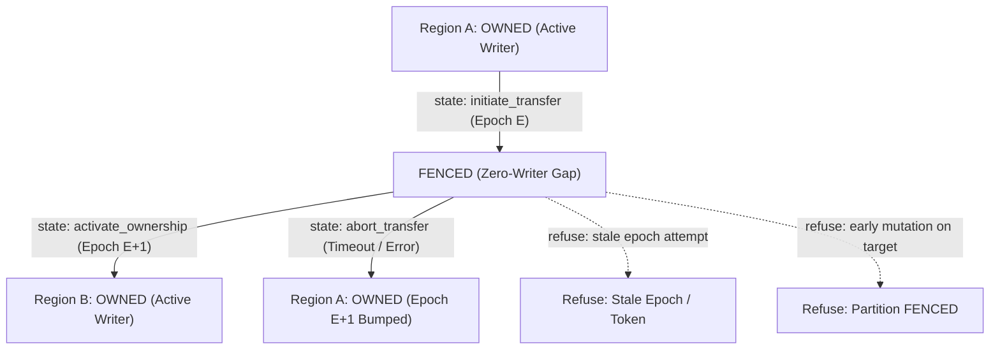

**Multi-Region Authority (I36/I37):** Single active writer home per partition (`OWNED → FENCED → OWNED`). Fenced state creates zero-writer gap; journal-only relay syncs discovery events without admitting foreign mutations.

---

## F-003 — Authority plane, Raft L0–L5 & security keys

Source: [architecture.md](architecture.md), [FORMAL_COMMAND_SPECIFICATION.md](FORMAL_COMMAND_SPECIFICATION.md), `src/core/frontier/replicated_log.py`, `src/core/frontier/receipt_crypto.py`, `src/core/contracts/schema_upcaster.py`, `src/core/frontier/state.py`. Absorbed F-012, F-014, F-016, F-034, F-037, F-044.

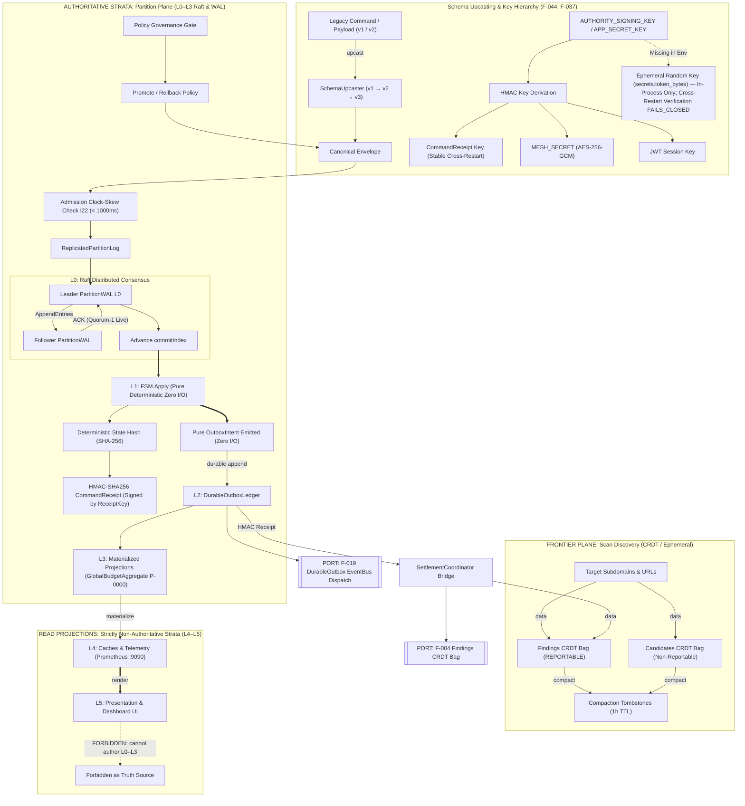

Live CLI is single-node quorum-1. `NetworkRaftTransport` stays LIBRARY. `attach_pipeline_authority` is `src/pipeline/authority_bootstrap.py`. L0–L3 constitute the authoritative state strata (durable WAL, deterministic FSM, and outbox). L4–L5 are ephemeral read projections and UI consumers that must never author state.

---

## F-004 — Live scan path, execution DAG & egress sandbox

Source: [architecture.md](architecture.md), [codebase.md](codebase.md), [commands.md](commands.md), [architecture/execution-request-contract.md](architecture/execution-request-contract.md), `src/pipeline/services/pipeline_orchestrator/graph_builder.py`, `src/pipeline/services/pipeline_orchestrator/actor_scheduler.py`, `src/pipeline/services/pipeline_orchestrator/stage_admit.py`, `src/sandbox/process_sandbox.py`, `src/sandbox/egress_context.py`, `src/core/utils/shared_sessions.py`, `src/analysis/dedup/`. Absorbed F-005, F-010, F-013, F-015, F-017, F-029, F-035, F-036, F-042.

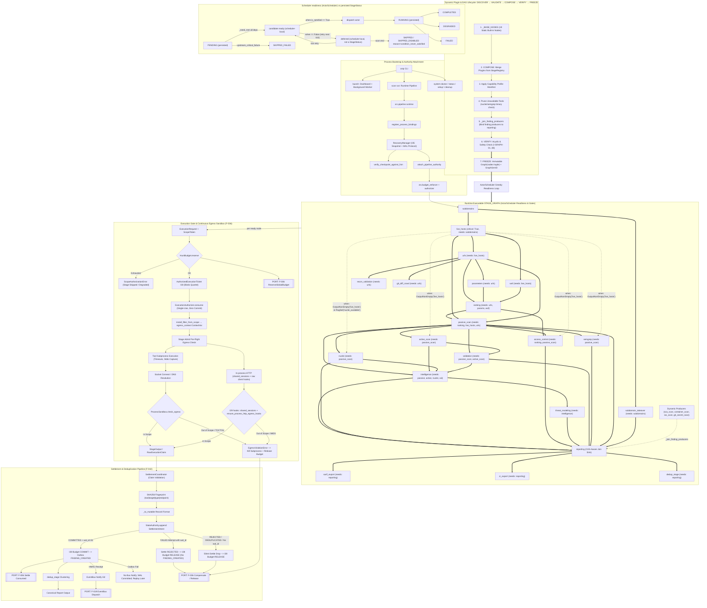

### Formal Graph Invariants Table (`FREEZE` Boundary)

| Invariant | Name & Scope | Formal Verification Rule |
|---|---|---|
| **`I-GRAPH-01`** | **Topological Need-Edge Equivalence** | $\forall B \in \text{Graph.nodes}, \text{incoming\_edges}(B) \equiv B.\text{needs}$. Only `needs` create Kahn topological ordering; `when` gates are pure runtime predicates. |
| **`I-GRAPH-02`** | **Conjunctive Dependencies** | Multiple `needs` are strictly conjunctive (AND): $B$ unblocks $\iff \forall A \in B.\text{needs}, \text{\_need\_met}(A, B) == \text{True}$. |
| **`I-GRAPH-03`** | **Root & Sink Validity** | $\ge 1$ root ($\text{in\_degree}=0$, `subdomains`), $\ge 1$ terminal sink ($\text{out\_degree}=0$, `sarif_export`). All finding producers have directed paths to `reporting`. |
| **`I-GRAPH-04`** | **Isolated Node Prohibition** | Registered nodes lacking both `needs` and downstream consumers ($\text{in\_degree}=0 \land \text{out\_degree}=0$) fail validation unless declared root/sink. |
| **`I-GRAPH-05`** | **Stage Collision Policy** | Plugins override built-in IDs (`nodes_by_name[n.name] = n`). Duplicate IDs between conflicting plugins fail validation (`ValueError`). |
| **`I-GRAPH-06`** | **Plugin Override Safety** | Plugin overrides MUST preserve dependency monotonicity ($S_{\text{plugin}}.\text{needs} \supseteq S_{\text{builtin}}.\text{needs}$), criticality, producer role, and egress sandbox rules. |
| **`I-GRAPH-07`** | **Immutable Sink Membership** | At `FREEZE`, $\text{reporting.needs} = \{ n \in \text{Nodes} \setminus \text{\_REPORT\_SINKS} \mid n \in \text{\_FINDING\_PRODUCER\_STAGES} \lor \text{\_produces\_findings}(n) \}$. Pruned tools removed prior to join. |
| **`I-GRAPH-08`** | **Deterministic GraphGenID** | $\text{GraphGenID} = \text{SHA256}(\text{sorted}(\text{CanonicalNode}(n) \text{ for } n \in \text{Nodes}))$. Canonical sorting ensures identity is independent of discovery order. |

---

### Operational Gating & Epistemic Matrix

Persisted terminals live in `StageStatus` (`PENDING`, `RUNNING`, `COMPLETED`, `DEGRADED`, `FAILED`, `SKIPPED_DISABLED`, `SKIPPED_FAILED`). Scheduler-local “ready / deferred / dispatch” are **not** enum values.

| Upstream Status ($A$) | `OutputNonEmpty(A)` / `when` | Downstream Action ($B$) | Typical terminal / skip reason (code) |
|---|---|---|---|
| **`COMPLETED` / `DEGRADED` with output** | `when` true | Dispatch → `RUNNING` → terminal | Normal execution |
| **`COMPLETED` / `DEGRADED` empty (gate false)** | `OutputNonEmpty` false through end of scan | Skip at drain | `reason="condition_never_satisfied"` → `SKIPPED` / `SKIPPED_DISABLED` |
| **`FAILED` on critical upstream** | n/a | Block / skip dependents | `reason="upstream_critical_failure"` → often `SKIPPED_FAILED` path |
| **`SKIPPED_DISABLED` upstream** | n/a | Still satisfies non-join `_need_met` | Downstream may run or skip on its own `when` |
| **Join sinks (`reporting`, …)** | n/a | Wait until **every** producer is terminal (incl. `FAILED`) | Report still emits (partial allowed) |

Other skip reasons observed in `actor_scheduler.py`: `method_not_found`, `suspend_triggered`, `cancelled`, `global_deadline_exceeded`, `speculative_dispatch` (dispatch telemetry, not a skip).

- **Dependency Fulfillment (`_need_met`)**: Non-join stages unblock on $\{ \text{COMPLETED}, \text{DEGRADED}, \text{SKIPPED\_DISABLED} \}$ (plus internal completed/skipped sets). Join sinks unblock on **any** `TERMINAL_STAGE_STATUSES` member (including `FAILED`).
- **Report Integrity**: Partial producer failure still reaches `reporting`; job exit lattice (F-018) maps partial vs fatal (`exit 4` vs `3`).
- **Concurrency & Fairness**: Ready nodes sorted by $(-\text{node.weight}, \text{declaration\_index})$. Retries mint fresh `AttemptId` (I33) and single-use tickets (I30).

---

### Settle Outcome Decision Table

| Stage Attempt Outcome | WAL Result | Settle Status | `FINDING_CREATED` Emitted? | I28 Budget Action | Stage Terminal Status |
|---|---|---|---|---|---|
| **COMPLETED (with findings)** | Committed (`wal_id` assigned) | `COMMITTED` | **Yes** (strict I31) | `COMMIT` (Consumed += units) | `COMPLETED` |
| **COMPLETED (zero findings)** | Committed (`wal_id` assigned) | `COMMITTED` | No | `RELEASE` (Available += units) | `COMPLETED` |
| **FAILED / ERROR** | Recorded (`wal_id` assigned) | `REJECTED` | No | `RELEASE` (Available += units) | `FAILED` / `DEGRADED` |
| **EGRESS_VIOLATION** | Rejected / Refused | `DROPPED` | No | `RELEASE` (Available += units) | `FAILED` |
| **SKIPPED / UNBUDGETED** | Not submitted to WAL | `N/A` | No | `RELEASE` (if reserved) | `SKIPPED_DISABLED` |

---

### Subsystem Architecture & Domain Package Mapping

| Domain Subsystem | Active Package Path | Pipeline Attachment Stage | Primary Responsibility & Core Classes |
|---|---|---|---|
| **Asset Discovery & Recon** | `src/recon/` | `subdomains`, `live_hosts`, `urls` | OSINT ingestion, Cloud recon (AWS/Azure/GCP), JS AST parsing, API spec reconstruction (`APISchemaReconstructor`, `CloudBucketScanner`, `AlienURL`). |
| **Vulnerability Analysis** | `src/analysis/` | `passive_scan`, `active_scan`, `semgrep` | Modular active/passive checks, behavioral timing diffing, bug bounty heuristics, AST check registration (`AcceleratedMatcher`, `PluginRegistration`). |
| **Autonomous Exploitation** | `src/exploitation/` | `subdomain_takeover`, `validation` | Proof-of-concept verification, SSRF pivoting, DNS rebinding, deserialization, cloud takeover (`ExploitationCampaign`, `DeserializationExploitationEngine`, `DNSRebindEngine`). |
| **Protocol & Payload Fuzzing**| `src/fuzzing/` | `active_scan` (Optional) | AST grammar mutators (JSON/XML/HTML/SQL), low-level fork server, HTTP/2 framing fuzzer (`BaseASTMutator`, `ForkServer`, `FramingFuzzer`). |
| **Dynamic Detection Runtime** | `src/detection/` | `validation`, `waf` | Multi-family detector bundles, headless browser DOM XSS execution, WAF fingerprinting & evasion (`DetectorBundle`, `DetectionRuntime`, `WAFDetection`). |
| **API Access & Security Tests**| `src/api_tests/` | `access_control` | REST/GraphQL specification parser, BOLA/BFLA access control testing, JWT tampering (`APITester`, `AuthMatrixTester`). |
| **Execution Manifests & Scenarios**| `src/execution/` | `stage_admit.py`, `_run_execution.py` | Active check catalog, isolated execution caching, multi-step scenario models (`ActiveManifestRegistry`, `IsolatedResponseCacheFactory`, `ScenarioEngine`). |
| **Threat Intelligence Feeds** | `src/intel/` | `intelligence` | External feed aggregation, indicator watchlists, threat feeds (`FeedAggregator`, `Watchlist`). |
| **Attack Chains & Risk Scoring**| `src/intelligence/` | `intelligence`, `threat_modeling` | Multi-vulnerability attack chain correlation, CVSS risk modeling, campaign proposals (`ThreatIntelCorrelator`, `AttackChain`, `CalibratedSeverityModel`). |
| **Machine Learning & Triage** | `src/learning/` | Post-Scan Sinks / `F-002` | Run drift tracking, anomaly scoring, FP/TP feedback loops, analyst triage collaboration (`BaselineTracker`, `FeedbackLoop`, `FindingDeduplicator`). |
| **Enterprise GRC & Reporting** | `src/reporting/` | `reporting`, `sarif_export`, `ci_export` | PDF/HTML compliance attestation (SOC2/ISO27001/PCI-DSS), SLA tracking, bug bounty platform clients (`ComplianceAttestation`, `SLATracker`, `AppleClient`, `AWSClient`). |
| **Alert Routing & Escalation** | `src/notifications/`| EventBus Consumer / `F-019` | Outbound alerts (Slack/Discord/Teams/PagerDuty/Email), snooze management, burst escalations (`NotificationBridge`, `Digest`, `SnoozeBook`). |
| **Real-Time Telemetry & Streams**| `src/realtime/`, `src/websocket_server/` | `F-009`, `F-019` | QoS admission shedding (`qos_admit`), standalone high-throughput WebSocket broadcasting (`Broadcaster`, `ConnectionManager`). |

**I29 In-Process Universal Egress Authority:** `stage_admit` installs `NetworkEgressFilter` into `src/sandbox/egress_context.py` (ContextVar; IMDS/metadata unconditionally denied) and calls `ensure_process_network_egress_hooks()`. That idempotent patch intercepts network dispatch across all execution primitives:
- **HTTP Clients (`httpx`, `requests`)**: Injects I29 request hooks into `httpx.Client` / `httpx.AsyncClient` and wraps `requests.Session.request`.
- **Raw Network Sockets (`socket.socket.connect`, `socket.create_connection`)**: Validates destination host/port before connect, preserving process-internal loopback IPC.
- **AsyncIO Network Streams (`asyncio.open_connection`)**: Intercepts socket stream construction for custom HTTP/2, raw WebSocket, and raw TLS transports.
- **Headless Browser Runtime (`runtime_browser.py`)**: Enforces `assert_url_egress_allowed` before Playwright `page.goto` navigation.
- **Subprocess Execution (`process_sandbox.py`)**: Enforces `ProcessSandbox.check_egress` on command line URLs/hosts.
- **Transport Registry (`get_registered_transports`)**: Requires explicit registration of all execution primitives with the I29 Egress Authority.

**I28/I30 Unified Execution Authority & Settlement:** Every execution path — whether entering through `stage_admit` or standalone `SafeExploiter.execute` — routes through `ExecutionAuthorizer`:
- Binds `ScopeToken` hash, `BudgetReservation`, live `AuthorityRevision`, and `CommandId` into an `AuthorizedExecutionTicket`.
- Requires successful atomic ticket consumption before network dispatch.
- Authoritatively settles consumed request quota to `HuntBudgetEnforcer` upon execution completion (or releases reserved quota on dispatch/pre-execution failure).

**Package Path Authority:**
| Surface | Role | Authority Model |
|---|---|---|
| `src/core/frontier/*` | Live authority (StateAuthority, WAL settle, CRDT, Raft) | **Authoritative State Plane** |
| `src/frontier/*` | Facades + test-only `MemoryJournal` | **Non-authoritative** |
| `src/cache`, `src/checkpoint` | Facades → `pipeline.unified_cache` / `core.checkpoint` | **Non-authoritative Caches** |
| `src/intel` vs `src/intelligence` | IOC feed aggregation vs attack chain / risk scoring | **Distinct Domain Modules** (both attach at `intelligence`) |

---

## F-006 — Leases, time & global budget

Source: [architecture.md](architecture.md) I19/I28, [FORMAL_COMMAND_SPECIFICATION.md](FORMAL_COMMAND_SPECIFICATION.md), `src/decision/hunt_budget.py`, `src/core/frontier/lease_status.py`. Absorbed F-011, F-038.

```mermaid
flowchart TD
    subgraph ClockModel["Multi-Clock Model (F-038)"]
        HLC["Hybrid Logical Clock (HLC)"]:::impl --> EventOrder["Scan Journal Ordering I23"]:::impl
        Mono["time.monotonic()"]:::impl --> LeaseTTL["Sublease & Fence Expiration (Zero Skew Drift)"]:::impl
        Wall["time.time() (UTC)"]:::impl --> AuditTime["Audit Logs & SIEM Export (I22 < 1000ms Bound)"]:::impl
    end

    subgraph LeaseFSM["Lease State Machine & Compensation (I19, I20, I21)"]
        Reserve["ReserveGlobalBudget"]:::impl --> RESERVED["RESERVED (Outstanding)"]:::impl
        RESERVED -->|"allocate / dispatch"| ACTIVE["ACTIVE (Outstanding)"]:::impl
        RESERVED -->|"expire (timeout via Mono)"| EXPIRED["EXPIRED (Available)"]:::impl
        RESERVED -->|"compensate (abort/failure)"| COMPENSATED["COMPENSATED (Available)"]:::impl
        RESERVED -->|"settle consumed"| CONSUMED["CONSUMED (Committed)"]:::impl
        ACTIVE -->|"settle consumed > 0"| CONSUMED
        ACTIVE -->|"expire (TTL elapsed via Mono)"| EXPIRED
        EXPIRED -->|"compensate (late reconciliation)"| COMPENSATED
        CONSUMED -->|"idempotent re-settle"| CONSUMED
        COMPENSATED -->|"idempotent no-op"| COMPENSATED
    end
```

**Budget Conservation & Settle (I5, I28):** Total budget $\equiv \text{Consumed} + \text{Outstanding (Reserved+Active)} + \text{Available}$. Only WAL settle commits budget from `RESERVED` $\rightarrow$ `CONSUMED` / `COMPENSATED`.

### Budget Delta & Accounting Matrix

Universal Conservation Equation: $$\text{TotalBudget} \equiv \text{Consumed} + \text{Outstanding} + \text{Available}$$

| Transition | $\Delta\text{Consumed}$ | $\Delta\text{Outstanding (Reserved+Active)}$ | $\Delta\text{Available}$ | Trigger / Precondition |
|---|---|---|---|---|
| `Genesis` $\rightarrow$ `RESERVED` | $0$ | $+\text{units}$ | $-\text{units}$ | `HuntBudget.reserve_with_identity` (ticket issued) |
| `RESERVED` $\rightarrow$ `ACTIVE` | $0$ | $0$ | $0$ | Subprocess dispatch (in-flight execution) |
| `RESERVED` / `ACTIVE` $\rightarrow$ `CONSUMED` | $+\text{units}$ | $-\text{units}$ | $0$ | Stage `COMPLETED` committed with findings at WAL |
| `ACTIVE` $\rightarrow$ `EXPIRED` | $0$ | $-\text{units}$ | $+\text{units}$ | Stage `FAILED` / `SKIPPED` / TTL elapsed via `ExpireSubLeaseCommand` |
| `RESERVED` $\rightarrow$ `COMPENSATED` | $0$ | $-\text{units}$ | $+\text{units}$ | Pre-dispatch cancellation or authorization rejection |
| `EXPIRED` $\rightarrow$ `COMPENSATED` | $0$ | $0$ | $0$ | Late compensation / ledger reconciliation (I28) |
| *Late Settle after EXPIRED* | $0$ | $0$ | $0$ | **Refused**: requires prior compensation check |

---

## F-007 — Application state machines & lifecycle coupling

Source: `src/jobs/status.py`, `src/core/models/stage_status.py`, `src/core/contracts/finding_lifecycle.py`, `src/jobs/run_outcome.py`. Absorbed F-008, F-027.

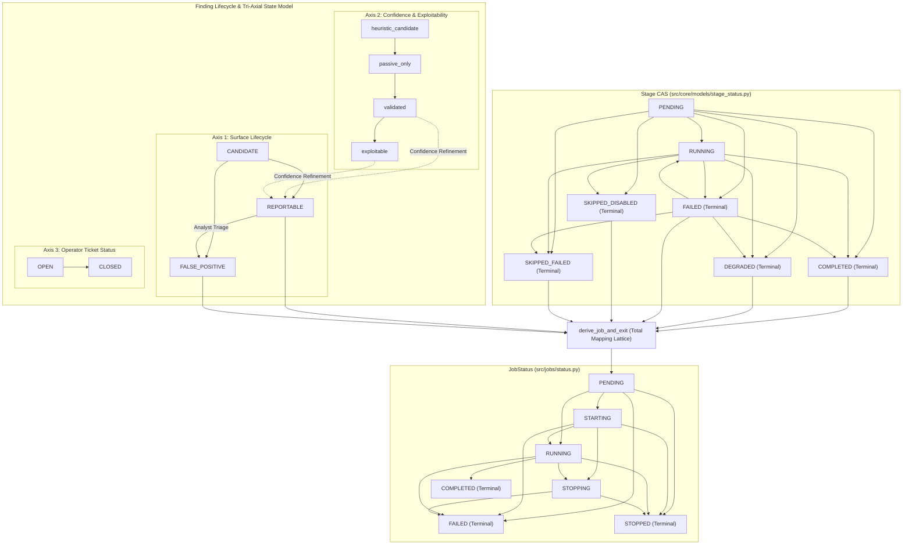

**Tri-Axial Lifecycle Coupling:** Surface state (`FindingLifecycleState`), Confidence (`heuristic` $\rightarrow$ `exploitable`), and Operator Ticket (`OPEN` $\rightarrow$ `CLOSED`) operate orthogonally. Stage and finding terminal states couple through `derive_job_and_exit` into the job exit lattice.

---

## F-009 — Resilience: breaker, QoS, PID & bulkhead

Source: [architecture.md](architecture.md), [performance.md](performance.md), `src/resilience/`, `src/realtime/prioritized_broker.py`, `src/realtime/qos_admit.py`. Absorbed F-024, F-030.

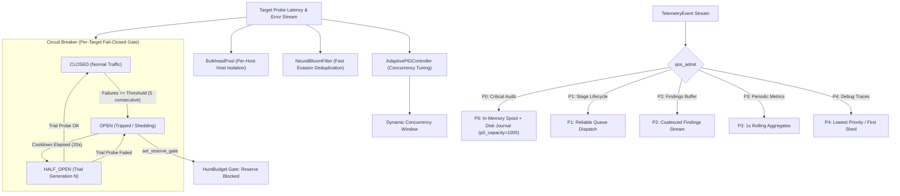

### Telemetry QoS Shedding Decision Matrix (`qos_admit.py`)

| Resource Condition | P0 (Critical Audit) | P1 (Stage Events) | P2 (Findings) | P3 (1s Aggregates) | P4 (Debug Traces) |
|---|---|---|---|---|---|
| **Normal (< 85% Disk, < 80% RAM)** | `Admit` (Durable) | `Admit` | `Admit` | `Admit` | `Admit` |
| **Moderate (>= 85% Disk / CPU > 90%)** | `Admit` (Durable) | `Admit` | `Admit` | `Admit` | **`DROP`** |
| **Severe (>= 92% Disk / RAM > 90%)** | `Admit` (Spool) | `Admit` | **`COALESCE`** | **`DROP`** | **`DROP`** |
| **Spool Saturated (> 1000 P0 items)** | `Backpressure` (Block caller) | `Drop` | `Drop` | `Drop` | `Drop` |

---

## F-018 — Failure decision tree, concurrency & I35 recovery

Source: [FAILURE_MODES.md](FAILURE_MODES.md), `src/core/frontier/failure_model.py` (I34), `src/core/frontier/recovery_protocol.py` (I35), `src/jobs/run_outcome.py`, `src/infrastructure/task_pool/run_lock.py`. Absorbed F-039.

### Total Exit Code Precedence Table (`derive_job_and_exit`)

Strict Priority: $$\text{Cancel (130)} > \text{Infra/Fatal (3)} > \text{Suspend (7)} > \text{Policy Violation (2)} > \text{Partial/Degraded (4)} > \text{Error (1)} > \text{Clean (0)}$$

| Precedence | Observed Pipeline Condition | Exit Code | Terminal JobStatus | Failure Classification (I34) | Operator Action |
|---|---|---|---|---|---|
| **1 (Highest)** | SIGINT / User Cancellation | `130` | `STOPPED` | User Action | Clean shutdown; checkpoint saved |
| **2** | Fatal stage failure / `pipeline_no_output` / Target down | `3` | `FAILED` | `INFRA_FAILURE` | Inspect logs, network, target connectivity |
| **3** | Hot-reload configuration suspend | `7` | `STOPPED` | Policy / Configuration | Worker reloads configuration and resumes |
| **4** | Findings count / CVSS severity exceeds policy rules | `2` | `COMPLETED` | Policy Gate Triggered | Review findings; triage or remediate |
| **5** | Non-fatal stage failure (`DEGRADED` / `SKIPPED_FAILED`) | `4` | `COMPLETED` | `PARTIAL_RUN` | Review partial findings report |
| **6** | Unhandled exception / OOM / Lock collision | `1` | `FAILED` | `RUNTIME_ERROR` | Inspect stack traces; check memory/locks |
| **7 (Lowest)** | All stages completed; findings within policy | `0` | `COMPLETED` | `CLEAN_RUN` | Standard clean pipeline exit |

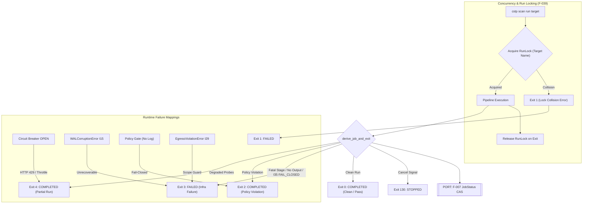

### I34 Formal Failure Recovery Semantics

| Failure Domain | Retry | Rollback | Compensate | Fail-Closed | Authoritative Resolution |
|---|---|---|---|---|---|
| **WAL Corruption** | No | No | No | **Yes** | Restore from last verified FSM snapshot |
| **Authority Loss** | No | No | No | **Yes** | Await leader election or restart in quorum-1 mode |
| **Replication Divergence** | No | No | No | **Yes** | Restore local FSM from leader PartitionWAL |
| **Event Delivery Failure** | **Yes** | No | No | No | Replay outbox dispatch by `DeliveryId` (I32) |
| **Budget Inconsistency** | No | No | **Yes** | **Yes** | Compensate outstanding I28 reservations |
| **FSM Invariant Violation** | No | No | No | **Yes** | Snapshot re-baseline plus sequential WAL replay |
| **Egress Policy Violation** | No | No | **Yes** | **Yes** | Terminate subprocess; release reserved requests |
| **RunLock Collision** | No | No | No | **Yes** | Abort execution (Exit 1: Target under active scan) |

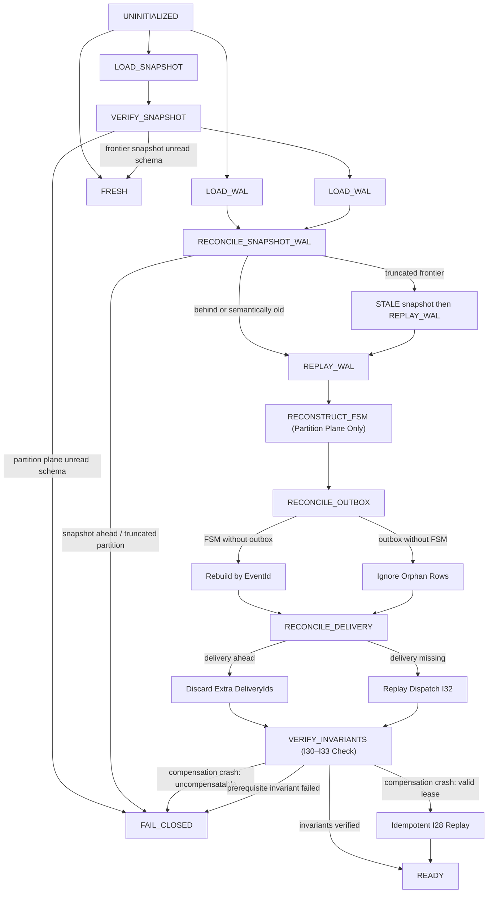

**Recovery & Exit Governance (I34/I35):** PartitionWAL is authoritative and never reconstructed; outbox is rebuilt from WAL on restart. Unreadable partition schemas or I30–I33 invariant failures trigger `FAIL_CLOSED` (Exit 3). Total exit priority order: $130 > 3 > 7 > 2 > 4 > 1 > 0$. Non-fatal stage failures yield partial run (Exit 4); only fatal stages trigger Exit 3.

---

## F-019 — Operator surface, multi-tenancy & telemetry

Source: [frontend.md](frontend.md), [api-reference.md](api-reference.md), [OBSERVABILITY_CATALOG.md](OBSERVABILITY_CATALOG.md), `src/telemetry/normalizer.ts`, `src/dashboard/fastapi/middleware.py`. Absorbed F-023, F-026, F-031, F-043.

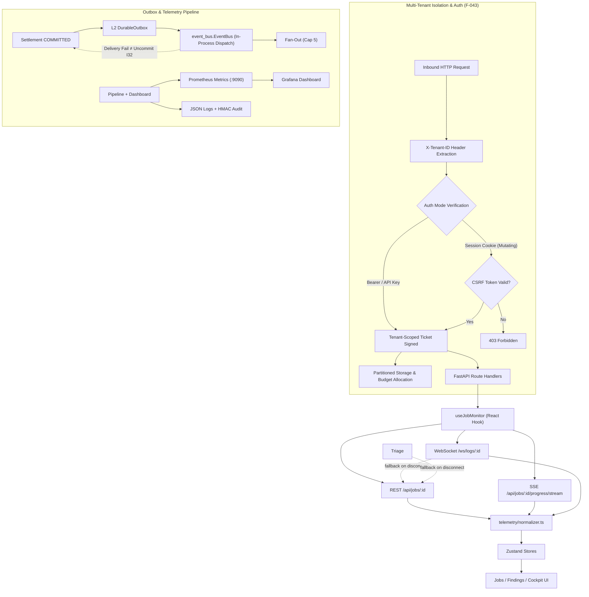

**Telemetry Streaming Paths:** Progress via SSE (`/api/jobs/{id}/progress/stream`); logs via WS (`/ws/logs/{job_id}`); triage via WS (`/ws/triage/{run_id}`) with automatic REST polling fallback. Origin validation precedes admin bypass.

---

## F-020 — Tests, CI shards & quality policy gates

Source: [testing.md](testing.md), [ci-cd-integration.md](ci-cd-integration.md), `.github/workflows/ci.yml`, `src/jobs/run_outcome.py`. Absorbed F-045.

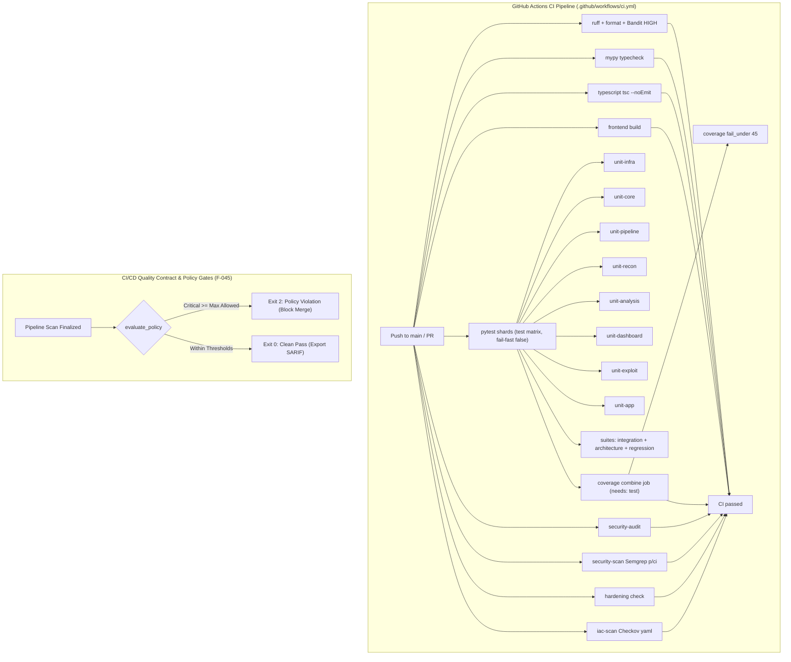

Per-test timeout 20s (`pytest-timeout`). Do not CI-fail on k8s `REPLACE_WITH_*`. Fail-fast recon tests stay skipped.

---

## F-022 — Gap-analysis status

Source: [GAP_ANALYSIS.md](GAP_ANALYSIS.md)

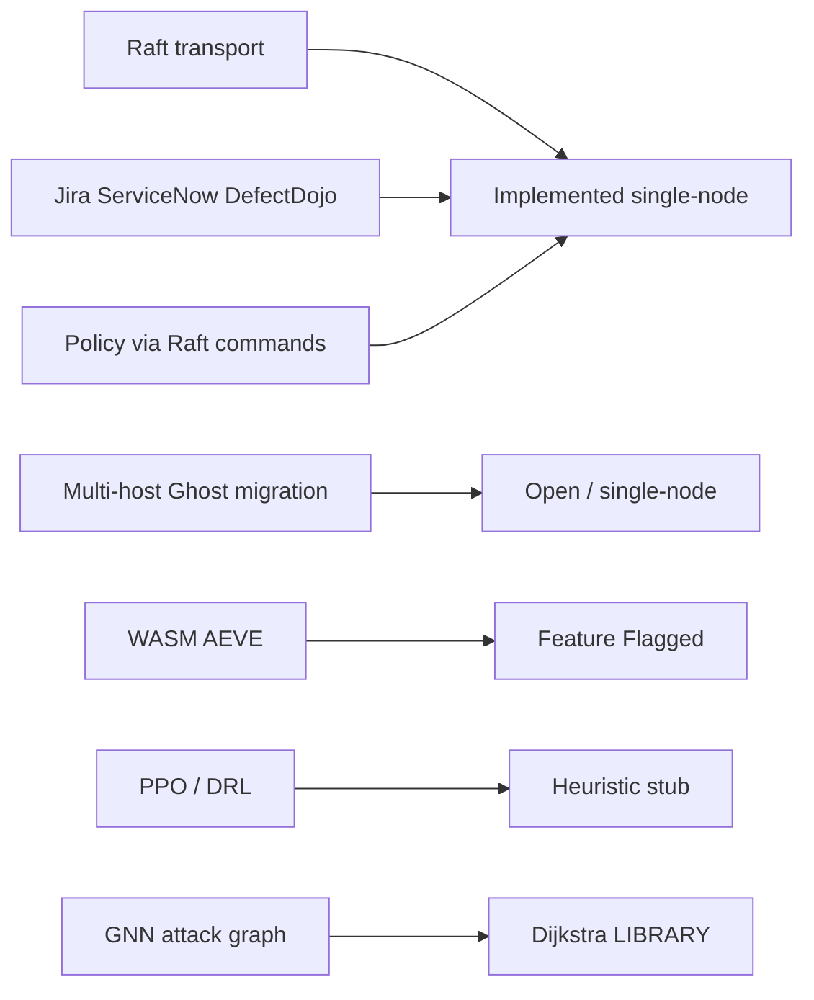

---

## F-025 — Non-authoritative planes, caches & multi-tier storage

Source: [architecture/cache-unification.md](architecture/cache-unification.md), [environment-variables.md](environment-variables.md), [architecture.md](architecture.md) §7.17, `src/infrastructure/cache/`, `src/pipeline/unified_cache/`, `src/pipeline/maintenance.py`, facades `src/cache/`, `src/checkpoint/`. Absorbed F-028, F-032, F-041.

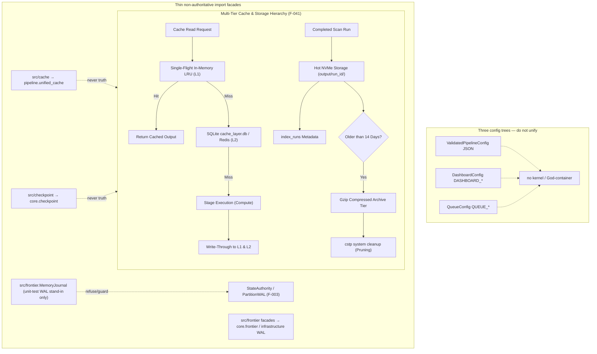

Facade packages re-export live implementations for stable import paths. They must not grow a second settle, budget, or WAL writer. `MemoryJournal` is explicitly test-only and is not attached on the live scan path.

---

## F-033 — Global invariants I1–I37 enforcement & dependency graph

Source: `src/core/frontier/invariant_graph.py`, `src/core/frontier/global_invariants.py`, `src/core/frontier/causal_identity.py`, `src/core/frontier/event_delivery.py`.

### Formal Invariant Dependency & Enforcement Semantics

An edge $I_A \longrightarrow I_B$ establishes that invariant $I_A$ is an **architectural / enforcement prerequisite** for $I_B$. The formal guarantees and cryptographic verifications of $I_B$ cannot be soundly admitted or enforced unless $I_A$ is satisfied.

### Formal System Invariant Registry (I1–I37)

| Invariant | Formal Statement | Owning Chart | Enforcing Module | Primary Test Suite | Status |
|---|---|---|---|---|---|
| **I1** | Hash-Chain Continuity ($H_n = \text{SHA256}(H_{n-1} \mathbin{\Vert} \text{CanonicalEncode}(E_n))$) | F-003 | `replicated_log.py` | `test_formal_invariants.py` | `impl` |
| **I2** | Log Monotonicity (Index $K_n > K_{n-1}$, Term $T_n \ge T_{n-1}$) | F-003 | `replicated_log.py` | `test_formal_invariants.py` | `impl` |
| **I3** | Committed-State Confinement (Transitions on quorum-committed entries only) | F-003 | `replicated_log.py` | `test_formal_invariants.py` | `single-node` |
| **I4** | Aggregate Monotonicity ($\text{version}' = \text{version} + 1$ on `SUCCESS`) | F-003 | `raft_fsm.py` | `test_formal_invariants.py` | `impl` |
| **I5** | Global Budget Conservation ($\text{TotalBudget} \equiv \text{Consumed} + \text{Outstanding} + \text{Available}$) | F-006 | `global_coordination.py`, `hunt_budget.py` | `test_formal_invariants.py` | `impl` |
| **I6** | Scoped Idempotency ($\forall \text{ valid } \text{cmd\_id}: \text{Count}(\text{Mutations}) \le 1$) | F-003 | `raft_fsm.py` | `test_formal_invariants.py` | `impl` |
| **I7** | Singular Partition Ownership (Target aggregate belongs to exactly 1 partition) | F-002 | `global_coordination.py` | `test_region_model.py` | `impl` |
| **I8** | Projection Watermark Bound ($\text{ProjectionOffset}(P_x) \le \text{commitIndex}(P_x)$) | F-003 | `projection_stream.py` | `test_formal_invariants.py` | `impl` |
| **I9** | FSM Pure Determinism (`FSM.Apply` zero external I/O, RNG, or clock reads) | F-003 | `raft_fsm.py` | `test_formal_invariants.py` | `impl` |
| **I10** | Worker Epoch Fencing ($\text{claim.epoch} < \text{active.epoch} \implies \text{REJECT}$) | F-003 | `raft_fsm.py` | `test_formal_invariants.py` | `impl` |
| **I11** | Cryptographic State Commitment ($\text{State}_A \equiv \text{State}_B \iff \text{StateHash}_A == \text{StateHash}_B$) | F-003 | `raft_fsm.py` | `test_formal_invariants.py` | `impl` |
| **I12** | Snapshot Integrity (Certified snapshot payload hash == header hash) | F-018 | `raft_fsm.py`, `recovery/manager.py` | `test_wal.py` | `impl` |
| **I13** | Receipt Cryptographic Binding (Leader receipt HMAC validates state hash) | F-003 | `receipt_crypto.py` | `test_atlas_holes.py` | `impl` |
| **I14** | Deduplicated Outbox Stream (Domain events deduplicated by `event_id`) | F-003 | `outbox.py` | `test_eventbus_guarantees.py` | `impl` |
| **I15** | Fail-Closed Boundary (Corrupt records or unverified leases abort with 0 mutations) | F-003 | `wal.py` | `test_wal.py` | `impl` |
| **I16** | Replay State Invariance ($\text{Replay}(\text{WAL}[0 \dots N]) \equiv \text{State}_N$) | F-018 | `replay_engine.py` | `test_recovery_manager.py` | `impl` |
| **I17** | Authority Uniqueness (No non-authoritative subsystem mutates state) | F-002 | `region_model.py` | `test_region_model.py` | `impl` |
| **I18** | Stale Command Rejection (Outdated lease epoch / stale placement version rejected) | F-002 | `replicated_log.py` | `test_region_model.py` | `impl` |
| **I19** | Lease Terminal Linearization (`RESERVED` $\rightarrow$ `CONSUMED` or `COMPENSATED`; `EXPIRED` non-terminal) | F-006 | `lease_status.py` | `test_lease_status.py` | `impl` |
| **I20** | Policy Version Fencing ($\text{expected\_policy\_version} == \text{current\_policy\_version}$) | F-003 | `raft_fsm.py`, `policy_governance.py` | `test_lease_status.py` | `impl` |
| **I21** | Projection Recovery Invariance (Sequential outbox replay recovers projection) | F-003 | `outbox.py`, `projection_stream.py` | `test_lease_status.py` | `impl` |
| **I22** | Temporal Invariant & Admission Skew Gate ($\pm 10\text{s}$ future, $-5\text{s}$ regression at admission) | F-003 | `replicated_log.py` | `test_formal_invariants.py` | `impl` |
| **I23** | Partition Budget Isolation (Subleases isolated per partition, negative balances rejected) | F-006 | `raft_fsm.py`, `state.py` | `test_state_crdt.py` | `impl` |
| **I24** | Persisted Mesh BootID + Monotonic Nonce Safety | F-002 | `mesh/` | `test_state_crdt.py` | `impl` |
| **I25** | Partition Policy Rollback Revocation & Watermark Upper Bound | F-003 | `raft_fsm.py` | `test_state_crdt.py` | `impl` |
| **I26** | Multi-Raft Quota Slab Conservation ($\text{Total} \equiv \text{Consumed} + \text{Outstanding} + \text{SlabReserved} + \text{Available}$) | F-006 | `global_coordination.py` | `test_formal_invariants.py` | `impl` |
| **I27** | Bounded Execution Claims (64KB) & CAS Merkle Evidence | F-004 | `CASStore`, `request_executor.py` | `test_resilience.py` | `impl` |
| **I28** | Hardened Lease State Transitions (`UNALLOCATED` $\rightarrow$ `RESERVED` $\rightarrow$ `ACTIVE` $\rightarrow$ `CONSUMED`/`EXPIRED`) | F-006 | `lease_status.py`, `hunt_budget.py`, `state_authority.py` | `test_global_invariants.py`, `test_state_authority_durability.py` | `impl` |
| **I29** | Scope-Derived Network Egress Enforcement (Egress strictly from `ScopeToken`; metadata denied) | F-004 | `process_sandbox.py`, `egress_context.py`, `shared_sessions.py`, `runtime_browser.py`, `stage_admit.py` | `test_sandbox.py`, `test_i29_egress_context.py` | `impl` (universal: subprocess + shared + httpx/requests + raw socket/asyncio + browser) |
| **I30** | Cryptographic Quartet Ticket Binding (Binds ScopeToken, BudgetReservation, Revision, CommandId) | F-004 / F-033 | `src/decision/authorization.py`, `stage_admit.py`, `safe_exploiter.py` | `test_global_invariants.py`, `test_formal_invariants.py` | `impl` (universal: stage admission + standalone exploitation) |
| **I31** | Settlement-Gated `FINDING_CREATED` Emission (Finding requires durably committed SettlementIntent) | F-033 | `event_bus.py` | `test_global_invariants.py` | `impl` |
| **I32** | Non-Authoritative EventBus Outbox Decoupling (EventBus delivery failure does not uncommit) | F-033 | `event_bus.py` | `test_eventbus_guarantees.py` | `impl` |
| **I33** | Causal Identity Chain ($\text{CommandId} \rightarrow \dots \rightarrow \text{DeliveryId}$) | F-033 | `causal_identity.py` | `test_causal_identity.py` | `impl` |
| **I34** | Formal Failure Recovery Boundaries (11 failure classes with declared recovery action) | F-018 | `failure_model.py` | `test_failure_model.py` | `impl` |
| **I35** | Dual-Plane Deterministic Recovery State Machine | F-018 | `recovery_protocol.py` | `test_recovery_protocol.py` | `impl` |
| **I36** | Single-Writer Regions & Journal-Only Relay | F-002 | `region_model.py` | `test_region_model.py` | `impl` |
| **I37** | Zero Dual-Writer Fenced Authority Transfer | F-002 | `authority_transfer.py` | `test_authority_transfer.py` | `impl` |

```mermaid
flowchart TD
    subgraph I30_Causality["I30 Authorization Causality Quartet"]
        Scope["ScopeToken Hash"]:::impl
        Res["BudgetReservation ID"]:::impl
        Rev["AuthorityRevision"]:::impl
        Cmd["CommandID"]:::impl
        Scope & Res & Rev & Cmd --> Ticket["AuthorizedExecutionTicket"]:::impl
        Ticket -->|"missing binding"| Reject["Refuse: Ticket Invalid"]:::forbidden
    end
    
    subgraph I33_Identity["I33 Causal Identity Chain"]
        Cmd --> ExecId["ExecutionId"]:::impl
        ExecId --> AttId["AttemptId (retry n)"]:::impl
        AttId --> StlId["SettlementId"]:::impl
        StlId --> WalId["WalId"]:::impl
        WalId --> EvtId["EventId"]:::impl
        EvtId --> DlvId["DeliveryId"]:::impl
    end
    
    subgraph I31_Settlement["I31 Settlement & Outbox Causality"]
        Intent["SettlementIntent"]:::impl --> Durable["WAL wal_id COMMITTED"]:::impl
        Durable -->|"yes"| Finding["FINDING_CREATED Allowed"]:::impl
        Durable -->|"no"| NoEmit["EventBus Refuses Finding"]:::forbidden
        Finding --> Outbox["DurableOutboxLedger"]:::impl
        Outbox --> Bus["EventBus (In-Process Dispatch)"]:::impl
        Bus --> Consumers["Observers / UI"]:::impl
        Outbox -->|Append Fail| NoBus["No Bus Notification; Replay Later"]:::vacuous
    end
    
    subgraph ProofGraph["Unified Formal Invariant Proof & Causality Graph (I1–I37)"]
        subgraph Tier1["Tier 1: Placement, Consensus & Multi-Raft (I1–I4, I7, I17, I18, I36, I37)"]
            I1g["I1: Partition Placement (H mod 1024)"]:::impl --> I2g["I2: Single Leader (Lp <= 1)"]:::impl
            I2g --> I3g["I3: Monotonic Lease Terms (Tk+1 > Tk)"]:::impl
            I3g --> I7g["I7: Single Global Authority (P-0000)"]:::impl
            I7g --> I17g["I17: Leader-Home Placement"]:::impl
            I17g --> I36g["I36: Single-Writer Region & Journal Relay"]:::impl
            I36g --> I37g["I37: Zero Dual-Writer Transfer Fence"]:::impl
            I2g --> I4g["I4: Raft Quorum Commitment (N/2 + 1)"]:::impl
            I18g["I18: Journal Filter"]:::impl --> I36g
        end

        subgraph Tier2["Tier 2: Durability, Clock Admission & Zero-I/O FSM (I8–I16, I22)"]
            I22g["I22: Clock Skew Gate (< 1000ms)"]:::impl --> I4g
            I4g --> I11g["I11: PartitionWAL Total Order"]:::impl
            I11g --> I12g["I12: CRC-64 Verification on Read"]:::impl
            I12g --> I15g["I15: Crash-Safe Disk Flush (fsync)"]:::impl
            I15g --> I8g["I8: FSM Determinism on Replay"]:::impl
            I8g --> I9g["I9: Zero I/O Inside FSM.Apply"]:::impl
            I9g --> I10g["I10: Monotonic Applied Index"]:::impl
            I9g --> I13g["I13: HMAC Command Receipt Signing"]:::impl
            I9g --> I14g["I14: Durable Outbox Append"]:::impl
            I8g --> I16g["I16: FSM Snapshot Consistency"]:::impl
        end

        subgraph Tier3["Tier 3: Quota Slabs, Budget Conservation & Leases (I5, I6, I19–I21, I26, I28)"]
            I26g["I26: Quota Slab Conservation"]:::impl --> I5g["I5: Universal Budget Conservation"]:::impl
            I5g --> I6g["I6: Integer Non-Negative Allocation"]:::impl
            I6g --> I19g["I19: Strict Lease Lifecycle"]:::impl
            I19g --> I21g["I21: Forbidden Direct Compensation"]:::impl
            I19g --> I20g["I20: Idempotent Compensation"]:::impl
            I19g --> I28g["I28: Settle-Only Budget Commit"]:::impl
        end

        subgraph Tier4["Tier 4: CRDT State, Bulkheads, Sandboxing & Causality (I23–I25, I27, I29, I30, I33)"]
            I23g["I23: Monotonic HLC Ordering"]:::impl --> I25g["I25: CRDT Convergence"]:::impl
            I25g --> I24g["I24: Bounded Tombstones (1h TTL)"]:::impl
            I27g["I27: Bulkhead Concurrency"]:::impl --> I29g["I29: Continuous Egress Scope Guard"]:::impl
            I29g --> I30g["I30: Cryptographic Quartet Ticket"]:::impl
            I22g --> I30g
            I30g --> I33g["I33: Causal Identity Chain"]:::impl
        end

        subgraph Tier5["Tier 5: Settlement, Outbox Decoupling & Recovery (I31, I32, I34, I35)"]
            I30g & I28g & I33g --> I31g["I31: Settlement-Gated Finding Emission"]:::impl
            I31g --> I32g["I32: Durable Outbox Decoupling"]:::impl
            I28g & I32g --> I34g["I34: Failure Recovery Boundaries (11 Domains)"]:::impl
            I34g & I16g --> I35g["I35: Dual-Plane Recovery Protocol"]:::impl
            I35g --> I36g
        end
    end
```

---

## Retired Chart Registry

In accordance with §0 (Maintenance Contract), retired IDs are preserved as stable pointers below:

| Retired ID | Original Scope | Survivor Section |
|---|---|---|
| `F-005` | Live Scan Stage Path | → [F-004](#f-004--live-scan-path-execution-dag--egress-sandbox) |
| `F-008` | Finding Lifecycle States | → [F-007](#f-007--application-state-machines--lifecycle-coupling) |
| `F-010` | Tool Execution Subprocess | → [F-004](#f-004--live-scan-path-execution-dag--egress-sandbox) |
| `F-011` | Budget State Machine | → [F-006](#f-006--leases-time--global-budget) |
| `F-012` | Network Raft Transport | → [F-003](#f-003--authority-plane-raft-l0l5--security-keys) |
| `F-013` | Checkpoint & FSM Rebuild | → [F-004](#f-004--live-scan-path-execution-dag--egress-sandbox) |
| `F-014` | Zero I/O FSM Determinism | → [F-003](#f-003--authority-plane-raft-l0l5--security-keys) |
| `F-015` | Process Sandbox Enforcement | → [F-004](#f-004--live-scan-path-execution-dag--egress-sandbox) |
| `F-016` | Durable Outbox Delivery | → [F-003](#f-003--authority-plane-raft-l0l5--security-keys) |
| `F-017` | Event Delivery Semantics | → [F-004](#f-004--live-scan-path-execution-dag--egress-sandbox) |
| `F-021` | Multi-Region Gossip Protocol | → [F-002](#f-002--system-topology-regions--deployment) |
| `F-023` | Frontend WebSocket Feeds | → [F-019](#f-019--operator-surface-multi-tenancy--telemetry) |
| `F-024` | Circuit Breaker Shedding | → [F-009](#f-009--resilience-breaker-qos-pid--bulkhead) |
| `F-026` | Telemetry Event Normalizer | → [F-019](#f-019--operator-surface-multi-tenancy--telemetry) |
| `F-027` | Job Status CAS Machine | → [F-007](#f-007--application-state-machines--lifecycle-coupling) |
| `F-028` | Multi-Tier Cache Layer | → [F-025](#f-025--non-authoritative-planes-caches--multi-tier-storage) |
| `F-029` | Recon Validation Stage | → [F-004](#f-004--live-scan-path-execution-dag--egress-sandbox) |
| `F-030` | Priority QoS Admission | → [F-009](#f-009--resilience-breaker-qos-pid--bulkhead) |
| `F-031` | Telemetry Dispatch Normalizer | → [F-019](#f-019--operator-surface-multi-tenancy--telemetry) |
| `F-032` | Storage Tiering & Archival | → [F-025](#f-025--non-authoritative-planes-caches--multi-tier-storage) |
| `F-034` | Plane Boundary & Ownership | → [F-003](#f-003--authority-plane-raft-l0l5--security-keys) |
| `F-035` | Plugin Load & Runtime DAG | → [F-004](#f-004--live-scan-path-execution-dag--egress-sandbox) |
| `F-036` | Scope & Continuous Egress | → [F-004](#f-004--live-scan-path-execution-dag--egress-sandbox) |
| `F-037` | Cryptographic Key Hierarchy | → [F-003](#f-003--authority-plane-raft-l0l5--security-keys) |
| `F-038` | Monotonic Clocks & Leases | → [F-006](#f-006--leases-time--global-budget) |
| `F-039` | Concurrency & Run Locking | → [F-018](#f-018--failure-decision-tree-concurrency--i35-recovery) |
| `F-040` | Deployment Topology Model | → [F-002](#f-002--system-topology-regions--deployment) |
| `F-041` | Persistence Tiering & Retention | → [F-025](#f-025--non-authoritative-planes-caches--multi-tier-storage) |
| `F-042` | Finding Deduplication CRDT | → [F-004](#f-004--live-scan-path-execution-dag--egress-sandbox) |
| `F-043` | Multi-Tenant Partitioning | → [F-019](#f-019--operator-surface-multi-tenancy--telemetry) |
| `F-044` | Schema Upcasting Evolution | → [F-003](#f-003--authority-plane-raft-l0l5--security-keys) |
| `F-045` | CI/CD Quality Policy Gates | → [F-020](#f-020--tests-ci-shards--quality-policy-gates) |

---

## System Tunables & Environment Configuration

| Variable | Default Value | Owning Subsystem | Description |
|---|---|---|---|
| `DASHBOARD_HOST` | `127.0.0.1` | FastAPI Dashboard | Binding network interface for REST API |
| `DASHBOARD_PORT` | `8000` | FastAPI Dashboard | Listening HTTP port |
| `DASHBOARD_WORKERS` | `1` | FastAPI Dashboard | Uvicorn worker process count |
| `MESH_LEADER_ELECTION_TIMEOUT_SEC` | `10.0` | Mesh Consensus | Raft-lite Redis lease consensus timeout |
| `MESH_PEER_RATE_LIMIT_PPS` | `200` | Mesh Gossip | Maximum gossip packets per second per peer |
| `OBSERVABILITY_METRICS_PORT` | `9090` | Observability | Prometheus metrics scraping port |
| `OTEL_EXPORTER_OTLP_ENDPOINT` | `http://localhost:4317` | Observability | OpenTelemetry OTLP collector gRPC endpoint |
| `AUTHORITY_SIGNING_KEY_ID` | `authority-hmac-v1` | Frontier Crypto | Key identifier for HMAC receipt verification |

---

## Changelog

| Date | Milestone / Change Description | Kind |
|---|---|---|
| 2026-08-26 | Unified Architecture Specification (consolidated 13 core survivor charts F-001–F-033, merged F-034–F-045, grounded formal I1–I37 invariant registry) | active |

| 2026-08-26 | F-004 I29: egress_context + shared_sessions hooks; SafeExploiter gate; COMPLETED+zero findings RELEASE (settle table) | edit |
| 2026-08-26 | F-004 sandbox mermaid + residual honesty (raw httpx bypass, exploit I28/I30 gap); F-025 facade/MemoryJournal non-authority; F-033 I28/I29/I30 code citations; atlas index `c989d3be` | edit |
| 2026-08-26 | Streamline prose into rich Mermaid subgraphs (Readiness FSM in F-004, Tri-Axial Finding subgraphs in F-007) and high-density invariant tables | edit |
| 2026-08-26 | Convert Legend edge semantics and node classes into structured tables; compress narrative in F-002, F-006, F-019 | edit |
| 2026-08-26 | Add F-001 node and architectural cross-reference for docs/architecture/code-consolidation.md | edit |
| 2026-08-26 | Audit vs code: fix F-004 Readiness FSM (scheduler-local vs StageStatus); replace invented PROVEN_EMPTY reasons with actor_scheduler skip reasons; restore exploit I28/I30 + raw-httpx residual counts; F-025 index facades | edit |
| 2026-08-27 | Invariant audit reconciliation: verified I28/I30 budget reservation & ticket consume paths, I29 process-wide HTTP egress hooks vs raw transport boundaries, I37 zero-dual-writer fence (library/tests-only caller), and single-node quorum-1 Raft live operation | edit |
| 2026-08-27 | Invariant namespace synchronization: aligned F-033 Formal Invariant Registry with architecture.md canonical I1–I37 definitions; fixed F-006 budget matrix compensation sequence | edit |
| 2026-08-27 | I29 Universal Network Egress Authority: eliminated transport bypass residuals by patching raw socket.connect/create_connection, asyncio.open_connection, Playwright page.goto, and establishing transport primitive registration | edit |
| 2026-08-27 | I30/I28 Unified Execution Authority: closed standalone exploitation authorization gap by routing SafeExploiter through ExecutionAuthorizer ticket mint/consume, HuntBudget reservation, and authoritative settlement | edit |

Append a row for every later edit. Do not delete this table.
