# Flowchart Atlas

Visual graphs of the living docs under `docs/`. Charts are the map; the linked markdown files remain the specification.

**One file. Merged when overlapping.** Similar, nested, or part-of-each-other flows share a single survivor chart. Retired ids stay as headings that point at the survivor — they are not rewritten away and their ids are never reused.

---

## 0. Maintenance Contract — HARD RULE

> **Complete rewrite of this file is forbidden.**
>
> This atlas is an append-only-by-default living document.
>
> | Action | Allowed? | When |
> |---|---|---|
> | Add a new `F-NNN` chart | Yes | A new doc, subsystem, or lifecycle appears |
> | Merge overlapping charts into one survivor | Yes | Charts are similar, nested, or part of each other |
> | Retire a chart heading after merge | Yes | Leave `RETIRED → F-XXX`; do not reuse the id |
> | Edit / improve an existing chart | Yes | The source doc or code changed |
> | Rename a node or edge | Yes | The name in code/docs changed |
> | Delete a chart or a portion of a chart | **Only if** that portion's subject was actually deleted from the repo/docs |
> | Replace the whole file | **Never** |
> | Wipe sections to "start over" | **Never** |
> | Reuse a retired `F-NNN` id | **Never** — mark the section `RETIRED` and leave the heading |
>
> How to change this file:
>
> 1. Locate the stable chart id (`F-001` …).
> 2. Patch only that section (or append a new id).
> 3. Update the Atlas Index row for that id.
> 4. Record the change in the Changelog at the bottom.
>
> Agents and humans must treat a full-file overwrite as a defect.

---

## Atlas Index

Live charts only. Retired ids are one-line headings after the last live chart (never reuse).

| Id | Chart | Source |
|---|---|---|
| F-001 | Documentation portal map | [index.md](index.md) |
| F-002 | System topology and regions | [architecture-overview.md](architecture-overview.md), [multi-region.md](multi-region.md), `region_model.py` (I36), `authority_transfer.py` (I37) |
| F-003 | Authority plane | [architecture.md](architecture.md), [FORMAL_COMMAND_SPECIFICATION.md](FORMAL_COMMAND_SPECIFICATION.md) |
| F-004 | Live scan path | [architecture.md](architecture.md), [codebase.md](codebase.md), [commands.md](commands.md) |
| F-006 | Leases and global budget | [FORMAL_COMMAND_SPECIFICATION.md](FORMAL_COMMAND_SPECIFICATION.md) |
| F-007 | Application state machines | `src/jobs/status.py`, `stage_status.py`, `finding_lifecycle.py` |
| F-009 | Resilience: breaker, QoS, PID | [architecture.md](architecture.md), [performance.md](performance.md) |
| F-018 | Failure-mode decision tree and recovery model | [FAILURE_MODES.md](FAILURE_MODES.md), `failure_model.py` (I34), `recovery_protocol.py` (I35) |
| F-019 | Operator surface | [frontend.md](frontend.md), [api-reference.md](api-reference.md), [OBSERVABILITY_CATALOG.md](OBSERVABILITY_CATALOG.md) |
| F-020 | Tests and CI shards | [testing.md](testing.md) |
| F-022 | Gap-analysis status | [GAP_ANALYSIS.md](GAP_ANALYSIS.md) |
| F-025 | Non-authoritative planes | [architecture/cache-unification.md](architecture/cache-unification.md), [environment-variables.md](environment-variables.md) |
| F-033 | Global invariants I30–I37 proof graph | `invariant_graph.py`, `global_invariants.py`, `causal_identity.py`, `event_delivery.py` (I34–I35 → F-018, I36–I37 → F-002) |

---

## F-001 — Documentation portal map

Source: [index.md](index.md)

```mermaid
flowchart TD
    Index["docs/index.md"] --> Arch["architecture.md"]
    Index --> Overview["architecture-overview.md"]
    Index --> Formal["FORMAL_COMMAND_SPECIFICATION.md"]
    Index --> Gaps["GAP_ANALYSIS.md"]
    Index --> Atlas["flowchart.md THIS FILE"]
    Index --> Code["codebase.md"]
    Index --> Cmds["commands.md"]
    Index --> Env["environment-variables.md"]
    Index --> Fail["FAILURE_MODES.md"]
    Index --> Obs["OBSERVABILITY_CATALOG.md"]
    Index --> Test["testing.md"]
    Index --> Front["frontend.md"]
    Index --> Multi["multi-region.md"]
    Index --> Perf["performance.md"]
    Index --> Gloss["glossary.md"]
    Index --> ApiDoc["api-reference.md"]
    Index --> Start["getting-started.md"]
    Index --> Deploy["deployment.md"]
    Index --> CICD["ci-cd-integration.md"]
    Index --> Plugins["dynamic-plugins.md"]
    Index --> Trouble["troubleshooting.md"]
    Index --> PagesOver["frontend_pages_overview.md"]
    Index --> Sec["../SECURITY.md"]
    Arch --> ExecReq["architecture/execution-request-contract.md"]
    Arch --> CacheDoc["architecture/cache-unification.md"]
```

Portal lists only files that exist. `CONTRIBUTING.md` / `BENCHMARK.md` / `CHANGES.md` are not in the repo.

---

## F-002 — System topology and regions

Source: [architecture-overview.md](architecture-overview.md), [multi-region.md](multi-region.md), `src/core/frontier/region_model.py` (I36), `src/core/frontier/authority_transfer.py` (I37). Absorbed F-021.

A region is a placement/replica boundary, not a second authority. Only the current leader home admits commands. Home moves only as I37 `OWNED → FENCED → OWNED` (nobody writes in the gap; fenced placement also refuses `settle_stage_output`). The relay is journal-only (`reconcile_with_peer` drops settlement/command rows). Live CLI is single-home `local` — the two-region mermaid is the I36/I37 spec, not a running mesh.

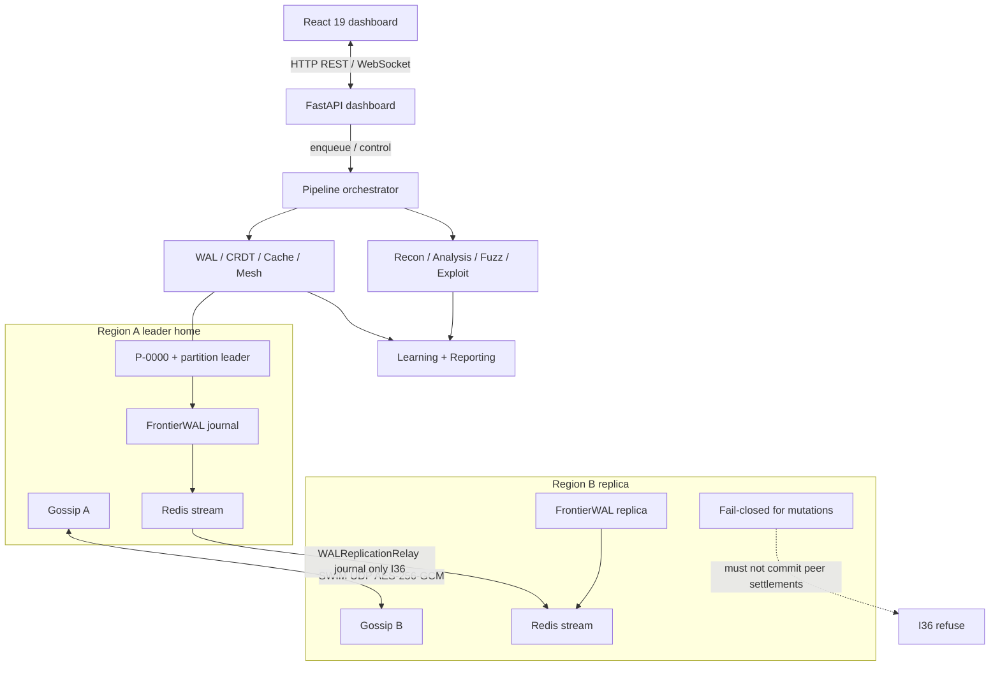

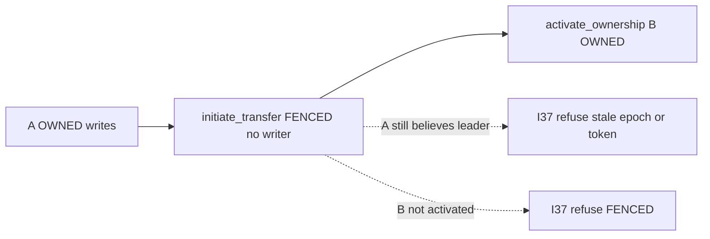

## F-003 — Authority plane

Source: [architecture.md](architecture.md), [FORMAL_COMMAND_SPECIFICATION.md](FORMAL_COMMAND_SPECIFICATION.md). Absorbed F-012, F-014, F-016.

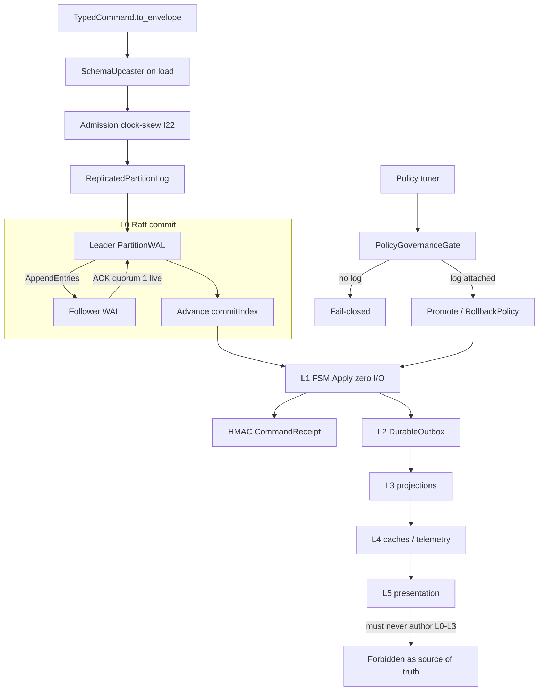

Live CLI is single-node quorum-1. `NetworkRaftTransport` stays LIBRARY. `attach_pipeline_authority` is `src/pipeline/authority_bootstrap.py`.

## F-004 — Live scan path

Source: [architecture.md](architecture.md), [codebase.md](codebase.md), [commands.md](commands.md), [architecture/execution-request-contract.md](architecture/execution-request-contract.md). Absorbed F-005, F-010, F-013, F-015, F-017, F-029.

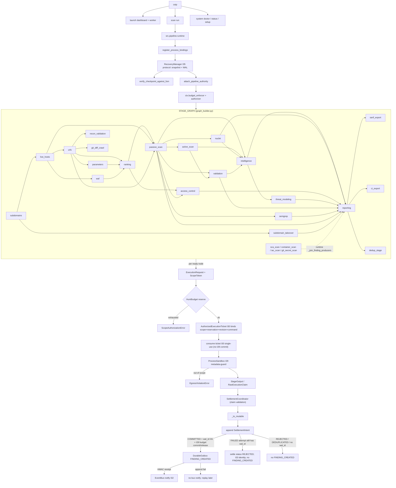

Per-stage admit is `stage_admit.admit_stage`: authorize (I28 **reserve**) → **consume ticket (I30 single-use only)** → `ProcessSandbox.check_egress` (metadata-guard) → run. `ProcessSandbox.run` is unused. I28 **commit/release** is only at `SettlementCoordinator` / `BudgetProjection` (stage settle COMMIT on COMPLETED, RELEASE on FAILED/SKIPPED; execution settle same). Tickets use partition `P-0000`. Attach failure is fail-closed exit 3; `apply_authority_recovery` runs after attach. FAILED stages still `settle_stage_output`; the settle **status** name is `REJECTED` (wal_id present). `reporting.needs` includes every finding producer (`_join_finding_producers`, including `sca_scan` / `git_secret_scan`). Report sinks alone do not pin low-value optional producers in the planner. Canonical `findings` CRDT bag is REPORTABLE surface (unstamped rows promote); evidence bags cannot bypass. `attach_pipeline_authority` is the only writer.

Import-time `STAGE_GRAPH` in `_constants.py` ≠ runtime `build_pipeline_graph` after plugins. Planner prefers the runtime Graph; some resume filters still walk import-time `STAGE_ORDER`. `STAGE_TIMEOUTS` omits `recon_validation`, `threat_modeling`, `subdomain_takeover`, sca/container/iac/git_secret, `ci_export`, `dedup_stage`. Nuclei/validation/active_scan/`_tool_runner` may still `authorize()` again (double reserve). HMAC has **no** published fallback string; missing env key → process-local random (verify dies across restart).

## F-005 — RETIRED → F-004

## F-006 — Leases and global budget

Source: [architecture.md](architecture.md) I19/I28, [FORMAL_COMMAND_SPECIFICATION.md](FORMAL_COMMAND_SPECIFICATION.md). Absorbed F-011.

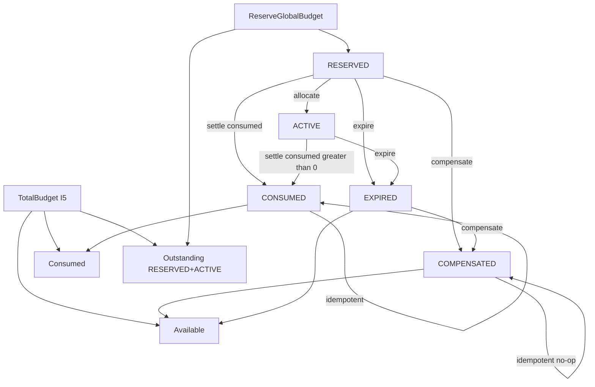

`Total = Consumed + Outstanding + Available`. Slabs add `SlabReserved` (I26). COMPENSATED only from RESERVED or EXPIRED. EXPIRED is **not** in `TERMINAL` (it can still compensate). `SETTLEMENT_PENDING` is a legacy alias of ACTIVE, not a written state.

## F-007 — Application state machines

Source: `src/jobs/status.py`, `src/core/models/stage_status.py`, `src/core/contracts/finding_lifecycle.py`. Absorbed F-008, F-027.

```mermaid
flowchart TD
    subgraph Job["JobStatus (src/jobs/status.py)"]
        JP["PENDING"] --> JS["STARTING"]
        JP --> JR["RUNNING"]
        JP --> JF["FAILED"]
        JP --> JD["STOPPED"]
        JS --> JR
        JS --> JX["STOPPING"]
        JS --> JF
        JS --> JD
        JR --> JX
        JR --> JC["COMPLETED"]
        JR --> JF
        JR --> JD
        JX --> JD
        JX --> JF
        JC --> JTerm["terminal"]
        JF --> JTerm
        JD --> JTerm
    end
    subgraph Stage["Stage CAS (src/core/models/stage_status.py)"]
        SP["PENDING"] --> SR["RUNNING"]
        SP --> SSD["SKIPPED_DISABLED"]
        SP --> SDG["DEGRADED"]
        SP --> SC["COMPLETED"]
        SP --> SF["FAILED"]
        SP --> SSF["SKIPPED_FAILED"]
        SR --> SC
        SR --> SDG
        SR --> SF
        SR --> SSD
        SR --> SSF
        SF --> SR
        SF --> SC
        SF --> SDG
        SF --> SSF
        SC --> STerm["terminal"]
        SDG --> STerm
        SSD --> STerm
        SSF --> STerm
    end
    subgraph Finding["Finding lifecycle (src/core/contracts/finding_lifecycle.py)"]
        FC["CANDIDATE"] --> FR["REPORTABLE"]
        FC --> FF["FALSE_POSITIVE"]
        FC -.-> FV["VALIDATED / EXPLOITABLE<br/>(refine CANDIDATE)"]
        FV --> FR
        FV --> FF
        FR -->|"triage"| FF
        FF --> FPTerm["FALSE_POSITIVE terminal sticky"]
    end
```

Illegal stage CAS **raises** (`IllegalStageTransitionError`): COMPLETED→FAILED, COMPLETED→SKIPPED*, SKIPPED*→COMPLETED. FAILED→COMPLETED and FAILED→SKIPPED_FAILED are legal (I33 retry). PENDING↛STOPPING (cancel-before-start is PENDING→STOPPED).

Finding surface is CANDIDATE | REPORTABLE | FALSE_POSITIVE. `detected` aliases CANDIDATE on **normalize**; `apply_lifecycle` stamps unstamped defaults as **`candidate`** (not the legacy `detected` wire token). `"open"` is **not** a lifecycle alias — dashboard `open/closed` is `ticket_status`. PDF filters `surface == REPORTABLE` (`filter_report_surface`); unstamped rows in the reportable bag stay in. NeuralState `findings` is the REPORTABLE CRDT; `candidates` holds non-reportable. Empty stage lattice + exit 0 + no stdout/stderr → JobStatus.FAILED (`pipeline_no_output`) even when `derive_job_and_exit` would say COMPLETED. `derive_job_and_exit` maps stages × findings × policy → (JobStatus, exit).

## F-008 — RETIRED → F-007

## F-009 — Resilience: breaker, QoS, PID

Source: [architecture.md](architecture.md), [performance.md](performance.md). Absorbed F-024, F-030.

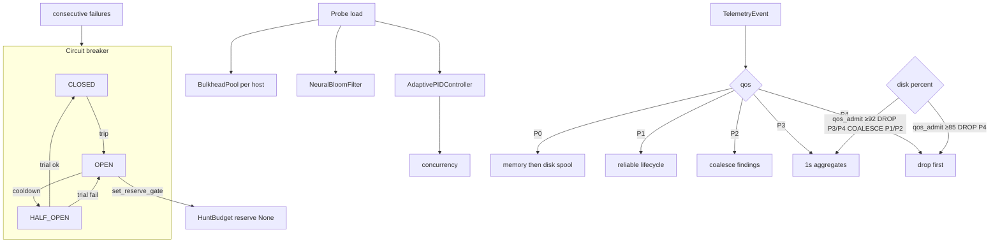

`qos_admit(event, disk_pct) -> admit|coalesce|drop` is the named function. Breaker OPEN stops **new** HuntBudget reserves (F-009 → F-006). One async HALF_OPEN probe; `_trial_generation` increments on enter HALF_OPEN.

## F-010 — RETIRED → F-004

## F-011 — RETIRED → F-006

## F-012 — RETIRED → F-003

## F-013 — RETIRED → F-004

## F-014 — RETIRED → F-003

## F-015 — RETIRED → F-004

## F-016 — RETIRED → F-003

## F-017 — RETIRED → F-004

## F-018 — Failure-mode decision tree and recovery model

Source: [FAILURE_MODES.md](FAILURE_MODES.md), `src/core/frontier/failure_model.py` (I34), `src/core/frontier/recovery_protocol.py` (I35).

Exit codes answer "what result did this scan produce?". The I34 table answers "what is the system allowed to do?" for each failure class. I35 is the recovery *protocol*: every durable boundary has an authoritative source, and every crash window has one resolution. Exotic multi-node repair is not implemented; the outcome is still named.

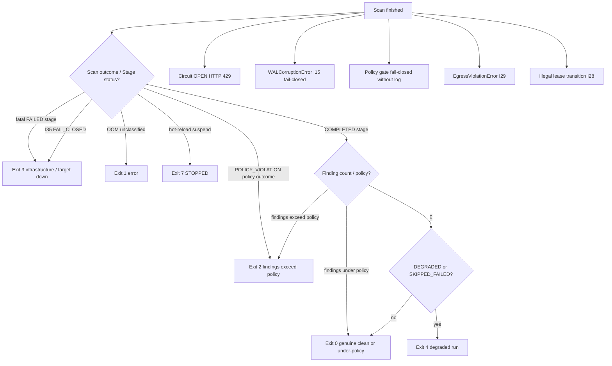

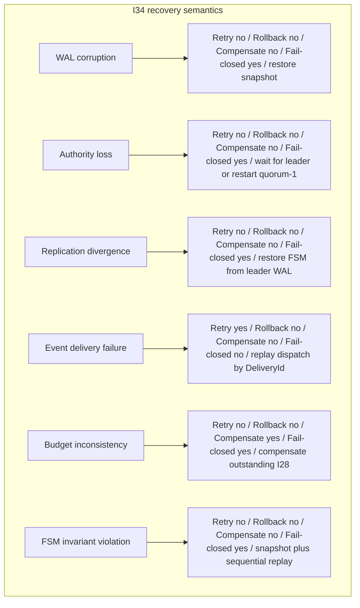

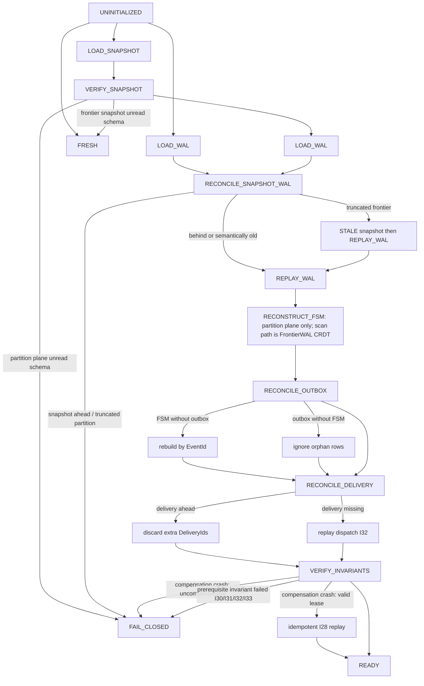

PartitionWAL is never reconstructed. VERIFY_INVARIANTS fail-closes if recovered tickets/settlements violate I30–I33 (`invariant_graph.py`). Checkpoint and DeliveryLedger are caches. Crash between WAL commit and outbox append is the rebuild path; crash during compensation is I28 idempotent.

`RecoveryManager._execute_verdict` runs rebuild_outbox. Checkpoint/WAL tickets and settlements are collected into I35 `VERIFY_INVARIANTS` (empty sets are a no-op — live checkpoints usually have no `tickets`/`settlements` keys). `delivered_event_ids` on the scan observation are empty by design; `replay_delivery` is a log line. FAIL_CLOSED sets `execute_stages=False` and CLI returns exit 3 (not a dry-run 0). After attach, `apply_authority_recovery` walks the PARTITION plane. `derive_job_and_exit` is the named lattice for CLI exit and dashboard reap; it is **not total** — scheduler 1/7/130, lock collision 1, and fatal recon 3 still bypass it. A non-fatal FAILED producer unblocks reporting; only `fatal_stages` are exit 3.

---

## F-019 — Operator surface

Source: [frontend.md](frontend.md), [api-reference.md](api-reference.md), [OBSERVABILITY_CATALOG.md](OBSERVABILITY_CATALOG.md). Absorbed F-023, F-026, F-031.

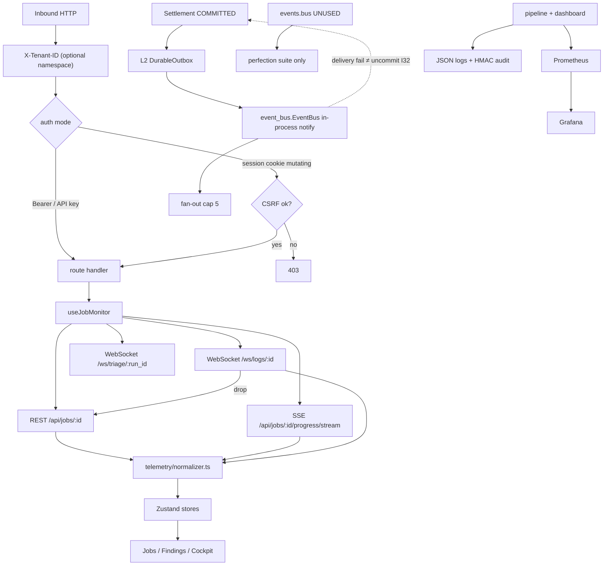

SSE is `GET /api/jobs/{id}/progress/stream` (not `/progress/stream`). Logs WS is `/ws/logs/{job_id}`. Triage WS `/ws/triage/{run_id}` is live and uncharted before this row. Origin validation runs before the `DASHBOARD_AUTH_DISABLED` admin bypass.

## F-020 — Tests and CI shards

Source: [testing.md](testing.md)

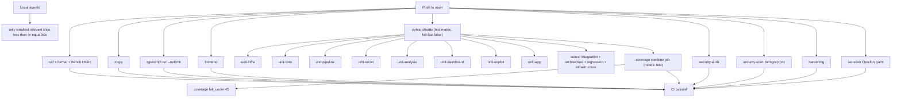

Per-test timeout 20s (`pytest-timeout`). Do not CI-fail on k8s `REPLACE_WITH_*`. Fail-fast recon tests stay skipped.

---

## F-021 — RETIRED → F-002

## F-022 — Gap-analysis status

Source: [GAP_ANALYSIS.md](GAP_ANALYSIS.md)

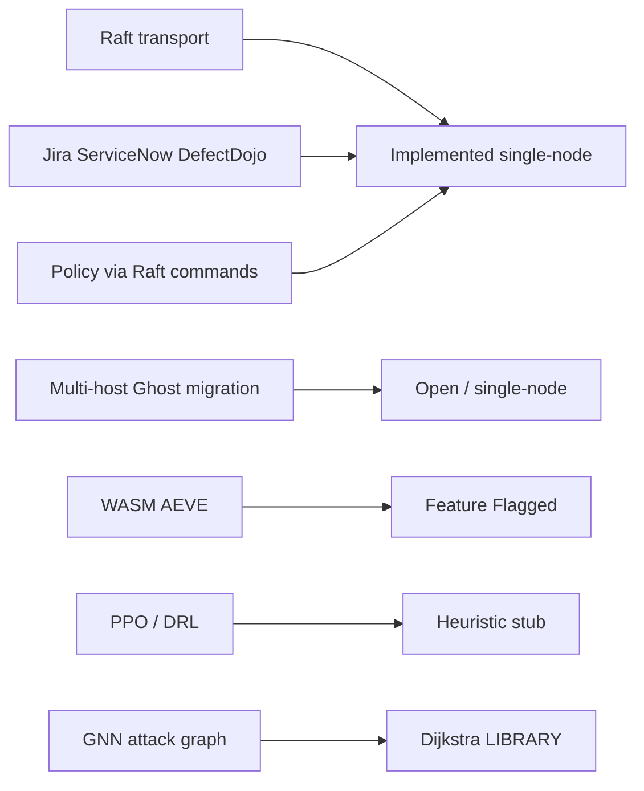

---

## F-023 — RETIRED → F-019

## F-024 — RETIRED → F-009

## F-025 — Non-authoritative planes

Source: [architecture/cache-unification.md](architecture/cache-unification.md), [environment-variables.md](environment-variables.md), [architecture.md](architecture.md) §7.17. Absorbed F-028, F-032.

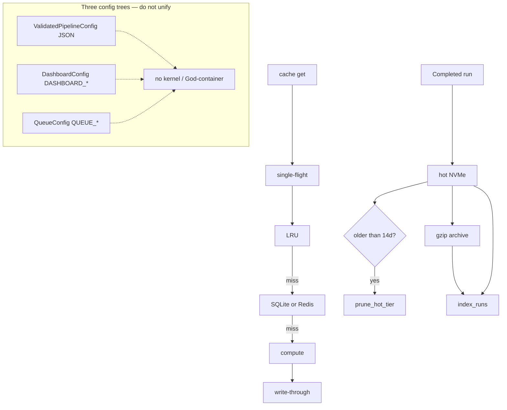

## F-026 — RETIRED → F-019

## F-027 — RETIRED → F-007

## F-028 — RETIRED → F-025

## F-029 — RETIRED → F-004

## F-030 — RETIRED → F-009

## F-031 — RETIRED → F-019

## F-032 — RETIRED → F-025

## F-033 — Global invariants I30–I37 proof graph

Source: `src/core/frontier/invariant_graph.py`, `src/core/frontier/global_invariants.py`, `src/core/frontier/causal_identity.py`, `src/core/frontier/event_delivery.py`. I34–I35 live on F-018. I36–I37 live on F-002.

EventBus is an **in-process notification dispatcher**, not a durable log and not a source of truth. Authoritative Event → Durable Outbox → Delivery Dispatcher → EventBus → consumers. `EventBus.emit(FINDING_CREATED)` without `wal_id` + HMAC settlement receipt is refused.

I33 makes replay/retry/dedup proveable: child ids are derived from parents; a FAILED attempt does not close the execution; EventBus DeliveryId is skipped on crash-replay.

I35 VERIFY_INVARIANTS consults the proof graph: recovered tickets must satisfy I30, recovered settlements I31, identities I33, and bus-without-outbox fails I32. I37 activate refuses to resurrect an I30-invalid ticket.

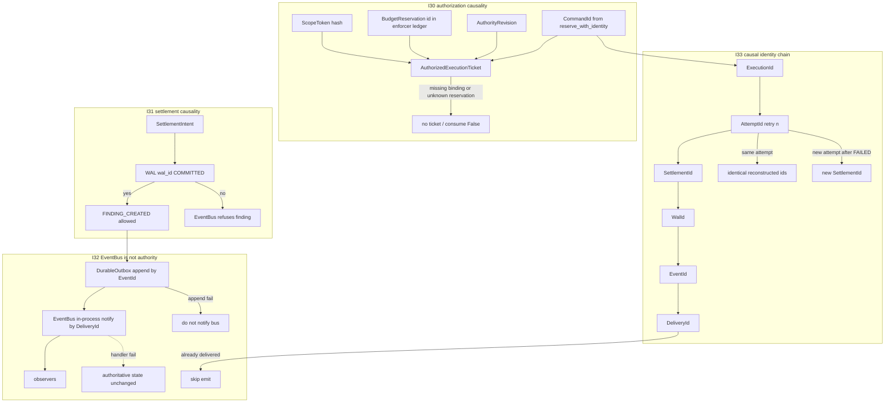

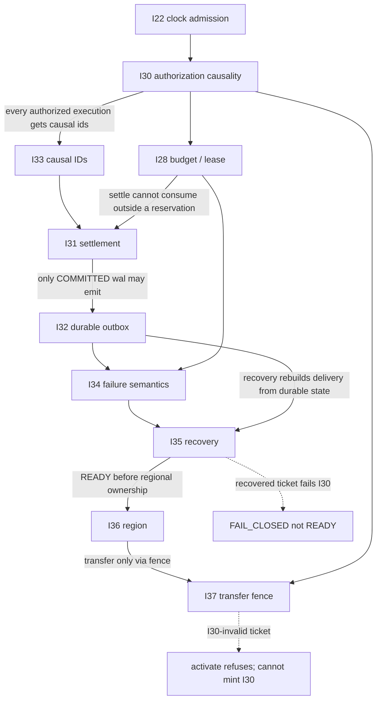

Each edge is bidirectional in `invariant_graph.py`: a forward statement and the reverse assumption (what the downstream invariant assumes about the upstream). I31 COMMITTED with an unknown `budget_reservation_id` fails I28 even if wal_id is set.

## Changelog

| Date | Change | Kind |
|---|---|---|
| 2026-08-25 | F-001–F-030 created | add |
| 2026-08-25 | F-001/F-008 edit; F-031 F-032 added | edit |
| 2026-08-25 | Merged into 11 survivors; retired absorbed ids | edit |
| 2026-08-25 | Compacted retired headings and changelog (live charts unchanged) | edit |
| 2026-08-25 | F-033: fail-closed I30 ledger + EventBus refuse unauthoritative FINDING_CREATED | edit |
| 2026-08-25 | F-033: I33 CommandId→DeliveryId chain after code landed | edit |
| 2026-08-25 | F-018: I34 recovery model next to the exit-code tree | edit |
| 2026-08-26 | F-007: CANDIDATE is the finding surface start state | edit |
| 2026-08-26 | F-019: Norm is frontend/src/telemetry/normalizer.ts | edit |
| 2026-08-26 | F-003: attach_pipeline_authority lives in authority_bootstrap | edit |
| 2026-08-26 | F-006: SETTLEMENT_PENDING is alias of ACTIVE | edit |
| 2026-08-26 | F-018: I35 recovery protocol state machine | edit |
| 2026-08-26 | F-002: I36 single-writer regions; relay is journal-only | edit |
| 2026-08-26 | Align F-001 portal, F-004 DAG with graph_builder, F-007 SMs, F-018 recovery branches, F-020 CI combine job | edit |
| 2026-08-26 | F-002/F-018/F-033: honest live path for I35 observation and I36 relay refuse | edit |
| 2026-08-26 | F-002: I37 OWNED→FENCED→OWNED transfer fence | edit |
| 2026-08-26 | F-004 per-stage ticket+FAILED settle+report join; F-007 CAS fail-closed + ticket axis; F-009 qos_admit; F-018 I35 execute + lattice; F-033 HMAC receipt | edit |
| 2026-08-26 | F-033 proof graph I22→I37; F-018 VERIFY_INVARIANTS fail-closes on I30/I31 | edit |
| 2026-08-26 | F-018: RecoveryManager collects recovered tickets/settlements for I35 | edit |
| 2026-08-26 | F-004 consume-before-run + recon_validation; F-007 FAILED retry; F-018 exit 1/7 and Frontier reconstruct; F-002 live single-home | edit |
| 2026-08-26 | F-007 JX is STOPPING; reporting join not large-debt starved | edit |
| 2026-08-26 | F-004 consume commits I28 budget, P-0000, attach fail-closed + I35 PARTITION recovery | edit |
| 2026-08-26 | F-033 bidirectional edges + reverse assumptions | edit |
| 2026-08-26 | Sync atlas with live code: F-001 existing portal files only; F-004 runtime join producers + FAILED settle named REJECTED + HMAC/process-local key + double-reserve honesty; F-007 FAILED→SKIPPED_FAILED; F-018 lattice not total + empty I35 recovered sets; F-019 real SSE/WS paths; F-020 security-audit/scan/hardening/iac-scan/CI passed; F-022 Ghost in-process/gossip | edit |

| 2026-08-26 | F-004/F-007: I30 consume is single-use only; I28 commit/release at settle; findings CRDT reportable bag; planner report-sink skip; no_pipeline_output FAIL | edit |

Append a row for every later edit. Do not delete this table.
