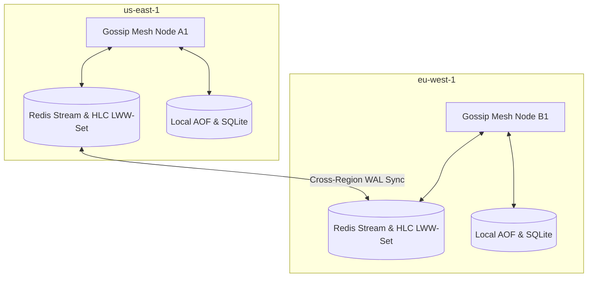

# Multi-Region Active-Active Sharding & Zero-Trust Networks

This guide outlines the production deployment topology, sharding models, cross-region replication schemas, and Zero-Trust network policies for scaling **Singularity-Zero** across multi-region active-active clusters.

---

## 🏗️ 1. Multi-Region Active-Active Topology

Singularity-Zero achieves horizontal scalability across multiple geographical regions (e.g., `us-east-1`, `eu-west-1`, `ap-southeast-1`) without relying on a single centralized coordinator. 



### Region-Aware Sharding
- **Deterministic Consistent Hashing**: Target scopes (URLs, subdomains, API hosts) are distributed across regions using consistent hashing. Each region is assigned a specific hash ring segment, ensuring that a target is fuzzed/scanned strictly within its designated latency boundary.
- **HLC Causal Convergence**: Multi-region state updates are merged asynchronously using **Hybrid Logical Clocks (HLC)**. Because HLCs maintain monotonic physical/logical sequencing in $O(1)$ constant footprint, regional actors can merge set states (`LWW-Sets`) without ordering conflicts or clock drift hazards.

---

## 🔁 2. Cross-Region WAL Replication & Conflict Resolution

State durability is guaranteed across boundaries by mirroring Write-Ahead Logs (WAL) and local Append-Only Files (AOF):

1. **Redis Stream Fan-Out**: When a regional node commits a state mutation, it writes the delta to the local Redis Stream. A background orchestrator replicates this stream to peer regions asynchronously.
2. **Differential Reconciliation**: In the event of a cross-region link drop, nodes accumulate mutations locally in AOF logs. Once the link heals, nodes exchange HLC vectors to perform a fast-forward reconciliation.
3. **Conflict Resolution UI**: The dashboard Cockpit includes a GRC Conflict Resolution Panel where out-of-sync or contested HLC merges (e.g. concurrent edits on different nodes under logical tie-breaks) can be inspected, manually resolved, or auto-converged based on Last-Write-Wins (LWW) rules.

---

## 🛡️ 3. Zero-Trust Network Policies & mTLS

Because inter-node P2P Gossip traffic is high-velocity (UDP Port 9008), securing transport is a top-priority hardening requirement:

### Gossip Wire Security Gaps
- **Gossip signatures** are signed using `MESH_SECRET` (HMAC-SHA256), but the payload is not encrypted. Traffic analysis or sniffing inside a compromised VPC would expose target addresses and findings.

### Hardening Recommendations:
1. **WireGuard Overlay Tunnel (Recommended)**:
   - Encapsulate all P2P UDP port 9008 traffic within a WireGuard overlay network.
   - Restrict Gossip listeners to bind strictly to the WireGuard private interface:
     ```bash
     export MESH_BIND_INTERFACE=10.8.0.1
     ```
2. **Istio Service Mesh Integration**:
   - For Kubernetes mesh orchestrations, deploy Istio sidecar proxies (`envoy`).
   - Enforce strict mutual TLS (mTLS) for all TCP mesh communications:
     ```yaml
     apiVersion: security.istio.io/v1beta1
     kind: PeerAuthentication
     metadata:
       name: default
       namespace: singularity-mesh
     spec:
       mtls:
         mode: STRICT
     ```

---

## 🔍 4. SIEM & Audit Trail Integration (Splunk / ELK)

All cryptographic audit logs generated by `AuditLoggingMiddleware` are outputted in CEF (Common Event Format) and LEEF (Log Event Extended Format) for seamless ingestion into enterprise SIEMs:

```
CEF:0|SingularityZero|Pipeline|1.0|COMPLIANCE_VIOLATION|SLA Breach Alert|10|src=10.0.0.5 dst=192.168.1.100 msg=Vulnerability has breached its remediation SLA.
```
- **Blockchain Proof-of-Existence**: At the end of every compliance run, the final signed SHA-256 hash of the `report.json` and `compliance_maturity.json` artifacts is written as a hash commitment to an immutable, decentralized ledger (or a local cryptographic hash tree log) to prove existence and prevent retroactive tampering by unauthorized administrators.
