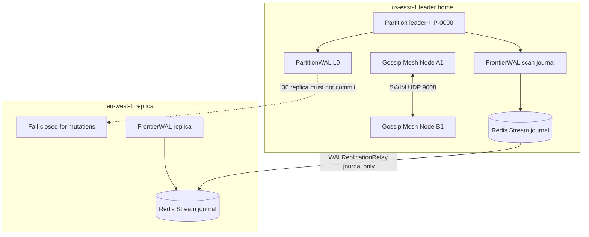

# Multi-Region Deployment & Replication Blueprint

> [!NOTE]
> **I36 — regions are not authority domains.** The topology still has a Region A and a Region B box. Only one of them is the leader home for a given partition. Live CLI is single-node quorum-1; this document names the consistency model so a second region cannot silently become a second writer. Machine-readable contract: `src/core/frontier/region_model.py`.

---

## 🏗️ 1. Multi-Region Topology (single writer per partition)

A region is a **placement / replica / latency boundary**. It is not an independent authority. `P-0000` is the only global writer for budget, placement, and policy watermark. Each data partition has exactly one leader (I7 / I17). WAL order is **per partition**, not a global total order.


```mermaid
graph TD
    subgraph Region-A [us-east-1 leader home]
        A_Gossip[Gossip Mesh Node A1] <-->|SWIM UDP 9008| B_Gossip
        A_Orch[Partition leader + P-0000]
        A_WAL[PartitionWAL L0]
        A_Journal[FrontierWAL scan journal]
        A_Orch --> A_WAL
        A_Orch --> A_Journal
        A_Journal --> A_Redis[(Redis Stream journal)]
    end
    subgraph Region-B [eu-west-1 replica]
        B_Gossip[Gossip Mesh Node B1]
        B_Orch[Fail-closed for mutations]
        B_Journal[FrontierWAL replica]
        B_Journal --> B_Redis[(Redis Stream journal)]
    end
    A_Redis -->|WALReplicationRelay journal only| B_Redis
    A_WAL -.->|I36 replica must not commit| B_Orch
```

| Question | Answer |
|---|---|
| Is each region an authority domain? | **No.** |
| Is there one global authority? | **Yes — `P-0000`. ** |
| Can two regions independently accept commands? | **No.** Only the current leader home. |
| WAL ordering? | **Partition-ordered.** |
| Consistency model? | **Single-writer linearizability per partition.** HLC/LWW is scan-journal only. |
| Network partition? | Non-leader / minority is **fail-closed** (I34 AUTHORITY_LOSS). |
| Both regions writable? | **Not for the same partition.** |
| After healing, who wins? | Higher `placement_version` / ownership epoch. Equal version + divergent hash → fail-closed. **Not LWW.** |
| Budget reservations span regions? | **No.** Only `P-0000` mutates Available/Outstanding. |
| Lease acquired in A, settled in B? | **No**, unless B became the same leader via fenced transfer. |
| Can an execution migrate? | **Yes**, only through `P-0000` 5-stage fence. |
| After an attempt starts? | **No.** In-flight `AttemptId` stays (I33). |
| How does home move? | **I37 fence.** `OWNED → FENCED → OWNED`. Nobody writes in the gap. |
| Can A and B both think they are leader? | **No.** FENCED seals A before B is activated. Stale epoch/token/revision fail. |

### I37 Authority Transfer Fence

`src/core/frontier/authority_transfer.py` is the contract. Bindings on every mutation:

| Field | Role |
|---|---|
| `AuthorityEpoch` | Monotonic per partition. Stale epoch cannot mutate. |
| `AuthorityRevision` | Bound into I30 tickets. Dies on activate. |
| `HomeRegion` | Current writer. Unchanged until activate. |
| `FenceToken` | Minted at fence. Required to activate. Old token dies. |
| `LeaderTerm` | Adopted by the new home on `install_authority`. |

```
A OWNED  --initiate_transfer-->  FENCED (no writer)  --activate_ownership-->  B OWNED
```

### Region-Aware Sharding
- **Deterministic placement**: Target hashes map to one of 1024 virtual partitions (`PlacementAuthority.get_partition_for_target`). The partition's **home region** is recorded on `PlacementAuthority.partition_home`.
- **HLC / LWW**: Allowed only for the FrontierWAL CRDT **scan journal** (discovered URLs, subdomains). It must not merge PartitionWAL, budget, leases, or settlement intents.

---

## 🔁 2. Cross-Region Journal Relay (non-authority)

`WALReplicationRelay` (`src/infrastructure/frontier/replication.py`) mirrors the **scan journal** Redis stream. It is not active-active authority.

1. **Journal fan-out**: Leader-home FrontierWAL deltas may be `XADD`'d to peer streams.
2. **Reconcile**: `reconcile_with_peer` **refuses** rows that look like `SettlementIntent` / commands. It never calls `StateAuthority.append_settlement_intent`.
3. **Healing**: Restore the follower from the leader PartitionWAL (I16 / I35). Do not LWW-merge two leaders. Equal `placement_version` with disagreeing state hashes is fail-closed (I11/I36).

---

## 🛡️ 3. Network Policies & Transport Encryption

Because inter-node P2P Gossip traffic is high-velocity (UDP base port + 1000 offset, default 9000–9008), securing transport is a core architectural requirement:

### Native Wire Encryption & Authentication
- **Authenticated Encryption**: In-flight gossip payloads are encrypted natively using **AES-256-GCM** with 96-bit random nonces derived from `MESH_SECRET` (`src/infrastructure/mesh/gossip/serializer.py`). Discovered targets, internal IP addresses, and vulnerability findings are never broadcast in plaintext.
- **HMAC-SHA256 Signatures**: Every envelope includes a cryptographic HMAC-SHA256 signature to guarantee message authenticity and reject tampered packets before decryption.

### Additional Infrastructure Hardening (Defense-in-Depth):
1. **WireGuard Overlay Tunnel (Recommended)**:
   - Encapsulate all P2P UDP gossip traffic within a WireGuard overlay network.
   - Restrict Gossip listeners to bind strictly to the WireGuard private interface:
     ```bash
     export MESH_BIND_INTERFACE=10.8.0.1
     ```
2. **Istio Service Mesh Integration**:
   - For Kubernetes mesh orchestrations, deploy Istio sidecar proxies (`envoy`).
   - Enforce strict mutual TLS (mTLS) for all TCP mesh communications:
     ```yaml
     apiVersion: security.istio.io/v1beta1
     kind: PeerAuthentication
     metadata:
       name: default
       namespace: singularity-mesh
     spec:
       mtls:
         mode: STRICT
     ```

---

## 🔍 4. SIEM & Cryptographic Audit Trail Integration

All cryptographic audit logs generated by `AuditLoggingMiddleware` (`src/dashboard/fastapi/middleware.py`) are structured JSON records with HMAC authentication chains and correlation IDs for enterprise SIEM ingestion (Splunk, Elastic, Datadog):

```json
{
  "timestamp": "2026-08-26T02:30:00.000Z",
  "event_type": "AUDIT_MUTATION",
  "client_ip": "10.0.0.5",
  "actor": "admin",
  "endpoint": "/api/jobs/R-101/cancel",
  "method": "POST",
  "status_code": 200,
  "correlation_id": "corr-99a1f4",
  "hmac_signature": "a6f8b2..."
}
```
- **Cryptographic Hash Chaining**: At the end of every scan run, the SHA-256 hash of the generated report artifacts is committed into an HMAC-SHA256 chained audit ledger (`src/auth/audit.py`) to guarantee non-repudiation and prevent retroactive tampering.
